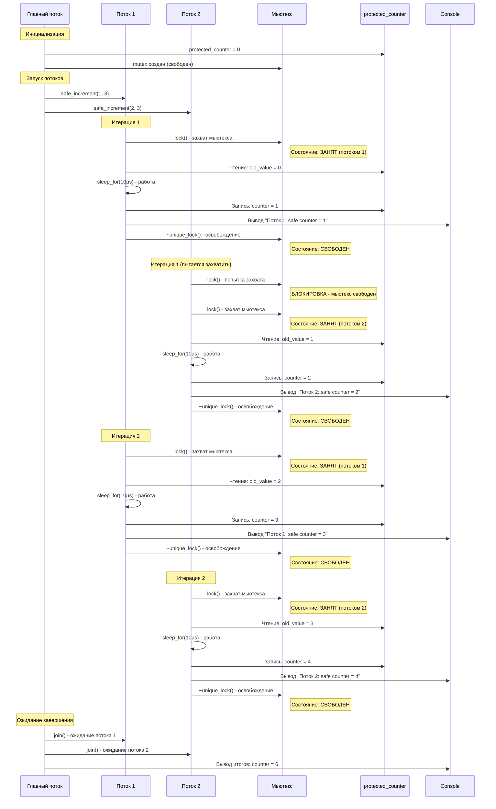
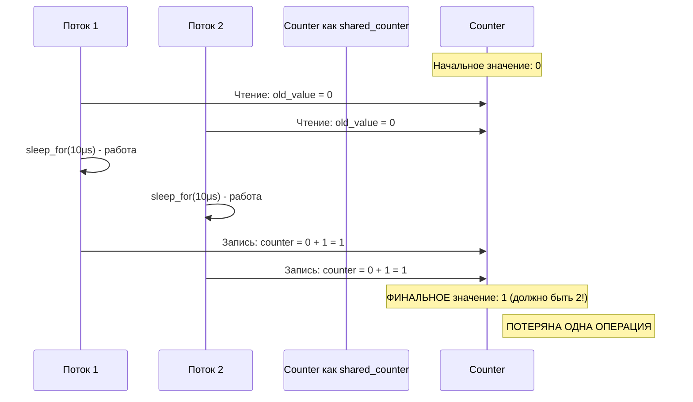
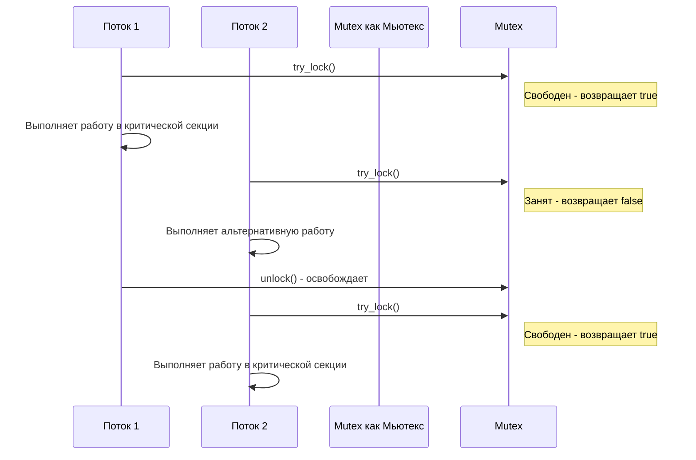
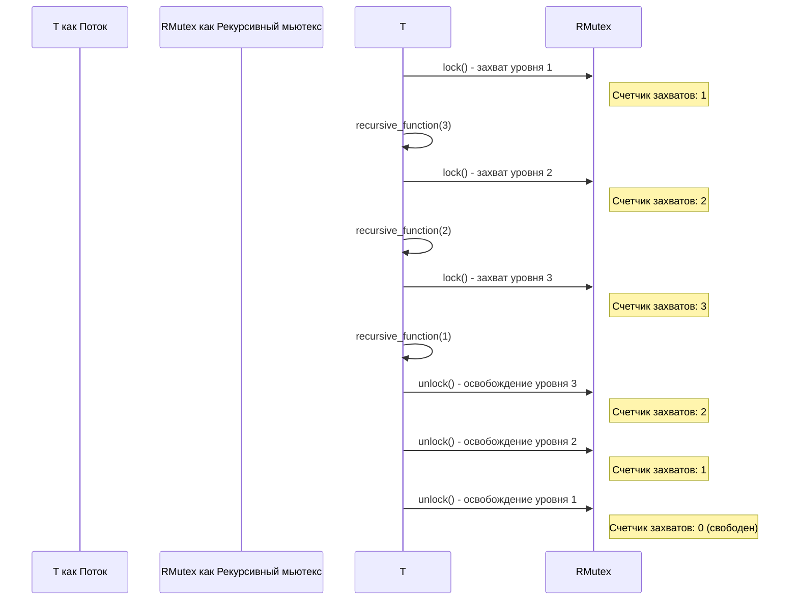

# Практическое руководство: Примитивы синхронизации - мьютексы в C++ под Ubuntu 24.04

# Диаграмма последовательностей работы с мьютексами



## Диаграмма проблемы гонки данных (без мьютекса)



## Диаграмма работы try_lock()



## Диаграмма рекурсивного мьютекса




## Ключевые моменты из диаграмм:

1. **Мьютекс гарантирует**, что только один поток может выполнять критическую секцию
2. **Без мьютекса** происходит гонка данных и потеря операций
3. **Try_lock** позволяет потоку не блокироваться если мьютекс занят
4. **Рекурсивный мьютекс** позволяет многократный захват из одного потока
5. **std::lock()** предотвращает deadlock при захвате нескольких мьютексов

# Практическое руководство: Примитивы синхронизации - мьютексы в C++ под Ubuntu 24.04

## 1. Установка необходимых инструментов

```bash
sudo apt update
sudo apt install g++ build-essential cmake make
```

## 2. Полностью прокомментированный пример с мьютексами

### Файл `mutex_example.cpp`:

```cpp
// Подключаем необходимые заголовочные файлы
#include <iostream>      // Для ввода-вывода в консоль
#include <thread>        // Для работы с потоками
#include <vector>        // Для использования динамического массива
#include <mutex>         // Для мьютексов (основной примитив синхронизации)
#include <chrono>        // Для работы со временем (задержки)
#include <random>        // Для генерации случайных чисел
#include <atomic>        // Для атомарных операций
#include <string>        // Для работы со строками

// Используем стандартное пространство имен для упрощения кода
using namespace std;

// Глобальные переменные для демонстрации синхронизации
int shared_counter = 0;                    // Разделяемый счетчик без защиты
int protected_counter = 0;                 // Защищенный счетчик
atomic<int> atomic_counter(0);             // Атомарный счетчик (не требует мьютекса)

// Создаем мьютекс для защиты критической секции
mutex counter_mutex;

// Создаем рекурсивный мьютекс для вложенных вызовов
recursive_mutex recursive_mutex;

// Функция для работы с разделяемым счетчиком БЕЗ синхронизации
void unsafe_increment(int thread_id, int iterations) {
    // Цикл на указанное количество итераций
    for (int i = 0; i < iterations; ++i) {
        // Сохраняем текущее значение до инкремента
        int old_value = shared_counter;
        
        // Имитируем работу (вычисление)
        this_thread::sleep_for(chrono::microseconds(10));
        
        // Увеличиваем счетчик (НЕЗАЩИЩЕННАЯ операция)
        shared_counter = old_value + 1;
        
        // Выводим информацию о выполнении
        cout << "Поток " << thread_id << ": unsafe counter = " << shared_counter << endl;
    }
}

// Функция для работы с разделяемым счетчиком с использованием мьютекса
void safe_increment(int thread_id, int iterations) {
    // Цикл на указанное количество итераций
    for (int i = 0; i < iterations; ++i) {
        // ЗАХВАТЫВАЕМ мьютекс перед доступом к разделяемым данным
        // Конструкция unique_lock автоматически освобождает мьютекс при выходе из области видимости
        unique_lock<mutex> lock(counter_mutex);
        
        // КРИТИЧЕСКАЯ СЕКЦИЯ - код, работающий с разделяемыми данными
        int old_value = protected_counter;        // Читаем текущее значение
        this_thread::sleep_for(chrono::microseconds(10));  // Имитируем работу
        protected_counter = old_value + 1;        // Записываем новое значение
        
        // Выводим информацию (все еще внутри критической секции)
        cout << "Поток " << thread_id << ": safe counter = " << protected_counter << endl;
        
        // Мьютекс автоматически освобождается при разрушении unique_lock
    }
}

// Функция для демонстрации атомарных операций
void atomic_increment(int thread_id, int iterations) {
    // Цикл на указанное количество итераций
    for (int i = 0; i < iterations; ++i) {
        // Атомарно увеличиваем счетчик (не требует мьютекса)
        int new_value = ++atomic_counter;
        
        // Выводим результат
        cout << "Поток " << thread_id << ": atomic counter = " << new_value << endl;
        
        // Короткая задержка
        this_thread::sleep_for(chrono::microseconds(10));
    }
}

// Функция для демонстрации try_lock (попытка захвата без блокировки)
void try_lock_example(int thread_id, int attempts) {
    // Счетчик успешных захватов
    int successful_locks = 0;
    
    // Выполняем указанное количество попыток
    for (int i = 0; i < attempts; ++i) {
        // Пытаемся захватить мьютекс без блокировки
        // try_lock возвращает true если захват удался, false если мьютекс занят
        if (counter_mutex.try_lock()) {
            // Если захват удался - работаем в критической секции
            protected_counter++;
            cout << "Поток " << thread_id << ": успешный захват, counter = " << protected_counter << endl;
            
            // Освобождаем мьютекс вручную (т.к. использовали try_lock)
            counter_mutex.unlock();
            
            // Увеличиваем счетчик успешных захватов
            successful_locks++;
        } else {
            // Если мьютекс занят - выполняем альтернативную работу
            cout << "Поток " << thread_id << ": мьютекс занят, выполняю альтернативную работу" << endl;
        }
        
        // Задержка между попытками
        this_thread::sleep_for(chrono::milliseconds(50));
    }
    
    // Выводим статистику по успешным захватам
    cout << "Поток " << thread_id << ": успешных захватов: " << successful_locks << "/" << attempts << endl;
}

// Рекурсивная функция для демонстрации recursive_mutex
void recursive_function(int thread_id, int depth) {
    // Захватываем рекурсивный мьютекс
    // Может быть захвачен несколько раз одним потоком
    lock_guard<recursive_mutex> lock(recursive_mutex);
    
    // Выводим информацию о текущем уровне рекурсии
    cout << "Поток " << thread_id << ": рекурсия уровень " << depth << endl;
    
    // Имитируем работу
    this_thread::sleep_for(chrono::milliseconds(20));
    
    // Рекурсивный вызов если не достигли максимальной глубины
    if (depth > 0) {
        // Рекурсивно вызываем эту же функцию
        // С обычным мьютексом это привело бы к дедлоку
        recursive_function(thread_id, depth - 1);
    }
    
    // Мьютекс автоматически освобождается при выходе из функции
}

// Класс для демонстрации использования мьютексов в классах
class ThreadSafeBankAccount {
private:
    double balance;                    // Баланс счета
    mutex balance_mutex;               // Мьютекс для защиты баланса
    string account_name;               // Имя счета
    
public:
    // Конструктор класса
    ThreadSafeBankAccount(const string& name, double initial_balance) 
        : account_name(name), balance(initial_balance) {}  // Инициализация полей
    
    // Метод для безопасного пополнения счета
    void deposit(double amount) {
        // Захватываем мьютекс для защиты операции
        lock_guard<mutex> lock(balance_mutex);
        
        // Проверяем корректность суммы
        if (amount > 0) {
            balance += amount;  // Увеличиваем баланс
            cout << "Счет '" << account_name << "': пополнение на " << amount 
                 << ", новый баланс: " << balance << endl;
        } else {
            cout << "Счет '" << account_name << "': ошибка - неверная сумма для пополнения" << endl;
        }
    }
    
    // Метод для безопасного снятия средств
    bool withdraw(double amount) {
        // Захватываем мьютекс для защиты операции
        lock_guard<mutex> lock(balance_mutex);
        
        // Проверяем достаточно ли средств
        if (amount > 0 && balance >= amount) {
            balance -= amount;  // Уменьшаем баланс
            cout << "Счет '" << account_name << "': снятие " << amount 
                 << ", новый баланс: " << balance << endl;
            return true;  // Успешное снятие
        } else {
            cout << "Счет '" << account_name << "': ошибка снятия - недостаточно средств" << endl;
            return false;  // Неудачное снятие
        }
    }
    
    // Метод для получения текущего баланса
    double get_balance() {
        // Захватываем мьютекс для защиты чтения
        lock_guard<mutex> lock(balance_mutex);
        return balance;  // Возвращаем текущий баланс
    }
    
    // Метод для перевода средств между счетами
    static bool transfer(ThreadSafeBankAccount& from, ThreadSafeBankAccount& to, double amount) {
        // Чтобы избежать дедлока, захватываем мьютексы в определенном порядке
        // Используем std::lock для одновременного захвата нескольких мьютексов
        unique_lock<mutex> lock1(from.balance_mutex, defer_lock);  // defer_lock - не захватывать сразу
        unique_lock<mutex> lock2(to.balance_mutex, defer_lock);
        
        // Захватываем оба мьютекса атомарно (избегаем дедлока)
        lock(lock1, lock2);
        
        // Проверяем возможность перевода
        if (amount > 0 && from.balance >= amount) {
            // Выполняем перевод
            from.balance -= amount;
            to.balance += amount;
            
            cout << "Перевод " << amount << " с '" << from.account_name 
                 << "' на '" << to.account_name << "' выполнен" << endl;
            return true;
        } else {
            cout << "Перевод " << amount << " с '" << from.account_name 
                 << "' на '" << to.account_name << "' не удался" << endl;
            return false;
        }
        
        // Мьютексы автоматически освобождаются при разрушении unique_lock
    }
};

// Функция для демонстрации работы с банковским счетом
void bank_account_worker(ThreadSafeBankAccount& account, int thread_id, int operations) {
    // Генератор случайных чисел
    random_device rd;
    mt19937 gen(rd());
    uniform_real_distribution<> dis(10.0, 100.0);  // Случайные суммы от 10 до 100
    uniform_int_distribution<> op_dis(0, 1);       // 0 - снятие, 1 - пополнение
    
    // Выполняем указанное количество операций
    for (int i = 0; i < operations; ++i) {
        // Генерируем случайную операцию
        if (op_dis(gen) == 1) {
            // Операция пополнения
            account.deposit(dis(gen));
        } else {
            // Операция снятия
            account.withdraw(dis(gen));
        }
        
        // Задержка между операциями
        this_thread::sleep_for(chrono::milliseconds(50));
    }
}

// Главная функция программы
int main() {
    // Устанавливаем локаль для корректного вывода русских символов
    setlocale(LC_ALL, "ru_RU.UTF-8");
    
    cout << "=== ДЕМОНСТРАЦИЯ МЬЮТЕКСОВ В C++ ===" << endl;
    cout << "Запуск на Ubuntu 24.04" << endl << endl;
    
    // Количество потоков и итераций для тестов
    const int num_threads = 4;
    const int iterations = 5;
    
    // 1. Демонстрация проблемы гонки данных (race condition)
    cout << "1. ДЕМОНСТРАЦИЯ ПРОБЛЕМЫ ГОНКИ ДАННЫХ:" << endl;
    cout << "Запускаем " << num_threads << " потоков без синхронизации..." << endl;
    
    // Вектор для хранения потоков
    vector<thread> unsafe_threads;
    
    // Сбрасываем счетчики
    shared_counter = 0;
    
    // Создаем и запускаем потоки без синхронизации
    for (int i = 0; i < num_threads; ++i) {
        // Создаем поток и добавляем его в вектор
        unsafe_threads.emplace_back(unsafe_increment, i + 1, iterations);
    }
    
    // Ожидаем завершения всех потоков
    for (auto& t : unsafe_threads) {
        t.join();  // Блокируем текущий поток до завершения t
    }
    
    cout << "Ожидаемое значение unsafe counter: " << num_threads * iterations << endl;
    cout << "Реальное значение unsafe counter: " << shared_counter << endl;
    cout << "Потеряно операций: " << num_threads * iterations - shared_counter << endl << endl;
    
    // 2. Демонстрация работы с мьютексом
    cout << "2. ДЕМОНСТРАЦИЯ РАБОТЫ С МЬЮТЕКСОМ:" << endl;
    cout << "Запускаем " << num_threads << " потоков с синхронизацией..." << endl;
    
    vector<thread> safe_threads;
    protected_counter = 0;
    
    // Создаем и запускаем потоки с синхронизацией
    for (int i = 0; i < num_threads; ++i) {
        safe_threads.emplace_back(safe_increment, i + 1, iterations);
    }
    
    // Ожидаем завершения всех потоков
    for (auto& t : safe_threads) {
        t.join();
    }
    
    cout << "Ожидаемое значение safe counter: " << num_threads * iterations << endl;
    cout << "Реальное значение safe counter: " << protected_counter << endl << endl;
    
    // 3. Демонстрация атомарных операций
    cout << "3. ДЕМОНСТРАЦИЯ АТОМАРНЫХ ОПЕРАЦИЙ:" << endl;
    
    vector<thread> atomic_threads;
    atomic_counter = 0;
    
    // Создаем и запускаем потоки с атомарными операциями
    for (int i = 0; i < num_threads; ++i) {
        atomic_threads.emplace_back(atomic_increment, i + 1, iterations);
    }
    
    // Ожидаем завершения всех потоков
    for (auto& t : atomic_threads) {
        t.join();
    }
    
    cout << "Атомарный счетчик: " << atomic_counter << endl << endl;
    
    // 4. Демонстрация try_lock
    cout << "4. ДЕМОНСТРАЦИЯ TRY_LOCK:" << endl;
    
    vector<thread> trylock_threads;
    
    // Создаем потоки для демонстрации try_lock
    for (int i = 0; i < 2; ++i) {
        trylock_threads.emplace_back(try_lock_example, i + 1, 5);
    }
    
    // Ожидаем завершения потоков
    for (auto& t : trylock_threads) {
        t.join();
    }
    
    cout << endl;
    
    // 5. Демонстрация рекурсивного мьютекса
    cout << "5. ДЕМОНСТРАЦИЯ РЕКУРСИВНОГО МЬЮТЕКСА:" << endl;
    
    vector<thread> recursive_threads;
    
    // Создаем потоки для рекурсивных вызовов
    for (int i = 0; i < 2; ++i) {
        recursive_threads.emplace_back(recursive_function, i + 1, 3);
    }
    
    // Ожидаем завершения потоков
    for (auto& t : recursive_threads) {
        t.join();
    }
    
    cout << endl;
    
    // 6. Демонстрация практического использования - банковский счет
    cout << "6. ПРАКТИЧЕСКИЙ ПРИМЕР - БАНКОВСКИЙ СЧЕТ:" << endl;
    
    // Создаем банковские счета
    ThreadSafeBankAccount account1("Основной счет", 1000.0);
    ThreadSafeBankAccount account2("Сберегательный счет", 500.0);
    
    // Создаем потоки для работы со счетами
    vector<thread> bank_threads;
    
    // Запускаем потоки для операций с первым счетом
    for (int i = 0; i < 2; ++i) {
        bank_threads.emplace_back(bank_account_worker, ref(account1), i + 1, 3);
    }
    
    // Запускаем потоки для операций со вторым счетом
    for (int i = 0; i < 2; ++i) {
        bank_threads.emplace_back(bank_account_worker, ref(account2), i + 3, 3);
    }
    
    // Запускаем потоки для переводов между счетами
    bank_threads.emplace_back([&account1, &account2]() {
        for (int i = 0; i < 3; ++i) {
            ThreadSafeBankAccount::transfer(account1, account2, 50.0);
            this_thread::sleep_for(chrono::milliseconds(100));
        }
    });
    
    // Ожидаем завершения всех банковских потоков
    for (auto& t : bank_threads) {
        t.join();
    }
    
    // Выводим итоговые балансы
    cout << endl << "ИТОГОВЫЕ БАЛАНСЫ:" << endl;
    cout << "Счет '" << "Основной счет" << "': " << account1.get_balance() << endl;
    cout << "Счет '" << "Сберегательный счет" << "': " << account2.get_balance() << endl;
    
    cout << endl << "Демонстрация завершена успешно!" << endl;
    
    return 0;  // Успешное завершение программы
}
```

## 3. Создание Makefile для компиляции

### Файл `Makefile`:

```makefile
# Компилятор C++
CXX = g++

# Флаги компиляции
CXXFLAGS = -std=c++17 -Wall -Wextra -O2 -pthread

# Имя исполняемого файла
TARGET = mutex_demo

# Исходные файлы
SOURCES = mutex_example.cpp

# Правило по умолчанию
all: $(TARGET)

# Правило компиляции
$(TARGET): $(SOURCES)
    $(CXX) $(CXXFLAGS) -o $(TARGET) $(SOURCES)

# Запуск программы
run: $(TARGET)
    ./$(TARGET)

# Отладочная сборка
debug: CXXFLAGS += -g -DDEBUG
debug: clean $(TARGET)

# Очистка
clean:
    rm -f $(TARGET)

# Статический анализ кода
check:
    cppcheck --enable=all $(SOURCES)

.PHONY: all run debug clean check
```

## 4. Инструкция по использованию

### Компиляция и запуск:

```bash
# Делаем Makefile исполняемым
chmod +x Makefile

# Компилируем программу
make

# Запускаем программу
./mutex_demo

# Или одной командой
make run
```

### Анализ работы программы:

```bash
# Запуск с выводом в файл для анализа
./mutex_demo > output.log 2>&1

# Просмотр результатов
cat output.log | grep "unsafe counter"
cat output.log | grep "safe counter"
```

## 5. Ключевые концепции мьютексов

### Типы мьютексов в C++:

1. **`std::mutex`** - базовый мьютекс
2. **`std::recursive_mutex`** - рекурсивный мьютекс
3. **`std::timed_mutex`** - мьютекс с таймаутом
4. **`std::recursive_timed_mutex`** - рекурсивный с таймаутом

### Способы захвата:

1. **`lock_guard`** - автоматическое управление
2. **`unique_lock`** - более гибкое управление
3. **`try_lock`** - попытка без блокировки
4. **`std::lock`** - множественный захват

Давайте разберем этот код подробно.

## 1. Подключение заголовочных файлов

```cpp
#include <iostream>      // Для cout, cin - ввод/вывод в консоль
#include <thread>        // Для std::thread - создание и управление потоками
#include <vector>        // Для std::vector - динамический массив
#include <mutex>         // Для std::mutex, std::lock_guard и др. - мьютексы
#include <chrono>        // Для std::chrono - работа со временем (задержки)
#include <random>        // Для генерации случайных чисел
#include <atomic>        // Для std::atomic - атомарные операции
#include <string>        // Для std::string - работа со строками
```

**Что здесь происходит:** Мы подключаем библиотеки, которые будем использовать. Каждый `#include` добавляет функциональность:
- `iostream` - позволяет выводить текст в консоль
- `thread` - позволяет создавать многопоточные программы
- `mutex` - предоставляет мьютексы для синхронизации потоков

## 2. Глобальные переменные и мьютексы

```cpp
using namespace std;  // Чтобы не писать std:: перед каждой функцией из стандартной библиотеки

// Глобальные переменные для демонстрации синхронизации
int shared_counter = 0;                    // Обычный счетчик - НЕ защищен
int protected_counter = 0;                 // Счетчик, который будем защищать мьютексом
atomic<int> atomic_counter(0);             // Атомарный счетчик - защищен на аппаратном уровне

// Создаем мьютекс для защиты критической секции
mutex counter_mutex;

// Создаем рекурсивный мьютекс для вложенных вызовов
recursive_mutex recursive_mutex;
```

**Объяснение:**
- `shared_counter` - обычная переменная, при одновременном доступе из нескольких потоков будет "гонка данных"
- `protected_counter` - переменная, которую мы будем защищать мьютексом
- `atomic_counter` - атомарная переменная, операции с ней не требуют мьютексов
- `counter_mutex` - обычный мьютекс (взаимное исключение)
- `recursive_mutex` - рекурсивный мьютекс, который можно захватывать несколько раз из одного потока

## 3. Функция без синхронизации (опасная)

```cpp
void unsafe_increment(int thread_id, int iterations) {
    for (int i = 0; i < iterations; ++i) {
        int old_value = shared_counter;           // ЧИТАЕМ значение
        this_thread::sleep_for(chrono::microseconds(10));  // ИМИТИРУЕМ работу
        shared_counter = old_value + 1;           // ЗАПИСЫВАЕМ новое значение
        
        cout << "Поток " << thread_id << ": unsafe counter = " << shared_counter << endl;
    }
}
```

**Проблема:** Между чтением (`old_value = shared_counter`) и записью (`shared_counter = old_value + 1`) другой поток может изменить значение `shared_counter`. Это называется **состояние гонки** (race condition).

**Пример проблемы:**
- Поток 1 читает: `old_value = 5`
- Поток 2 читает: `old_value = 5`  
- Поток 1 записывает: `6`
- Поток 2 записывает: `6` (должно быть 7!)
- Результат: 6 вместо 7

## 4. Функция с мьютексом (безопасная)

```cpp
void safe_increment(int thread_id, int iterations) {
    for (int i = 0; i < iterations; ++i) {
        unique_lock<mutex> lock(counter_mutex);  // ЗАХВАТЫВАЕМ мьютекс
        
        // КРИТИЧЕСКАЯ СЕКЦИЯ - только один поток может выполнять этот код
        int old_value = protected_counter;
        this_thread::sleep_for(chrono::microseconds(10));
        protected_counter = old_value + 1;
        
        cout << "Поток " << thread_id << ": safe counter = " << protected_counter << endl;
        
        // Мьютекс автоматически освобождается когда lock выходит из области видимости
    }
}
```

**Как это работает:**
- `unique_lock<mutex> lock(counter_mutex)` - захватывает мьютекс
- Если мьютекс свободен - поток захватывает его и продолжает выполнение
- Если мьютекс занят - поток БЛОКИРУЕТСЯ и ждет пока мьютекс освободится
- При выходе из области видимости (в конце блока `{}`) мьютекс автоматически освобождается

## 5. Атомарные операции

```cpp
void atomic_increment(int thread_id, int iterations) {
    for (int i = 0; i < iterations; ++i) {
        int new_value = ++atomic_counter;  // Атомарная операция - чтение и инкремент в одной инструкции
        
        cout << "Поток " << thread_id << ": atomic counter = " << new_value << endl;
        
        this_thread::sleep_for(chrono::microseconds(10));
    }
}
```

**Особенности атомарных операций:**
- Операция выполняется как одна неделимая инструкция
- Не требует мьютексов
- Быстрее чем мьютексы для простых операций
- Поддерживает: `++`, `--`, `+=`, `-=`, `load()`, `store()` и др.

## 6. Try-Lock (попытка захвата без блокировки)

```cpp
void try_lock_example(int thread_id, int attempts) {
    int successful_locks = 0;
    
    for (int i = 0; i < attempts; ++i) {
        if (counter_mutex.try_lock()) {  // Пытаемся захватить мьютекс НЕ блокируясь
            // УСПЕХ: мьютекс захвачен
            protected_counter++;
            cout << "Поток " << thread_id << ": успешный захват, counter = " << protected_counter << endl;
            
            counter_mutex.unlock();  // ОСВОБОЖДАЕМ вручную
            successful_locks++;
        } else {
            // НЕУДАЧА: мьютекс занят - выполняем другую работу
            cout << "Поток " << thread_id << ": мьютекс занят, выполняю альтернативную работу" << endl;
        }
        
        this_thread::sleep_for(chrono::milliseconds(50));
    }
}
```

**Отличие от обычного lock():**
- `try_lock()` - возвращает `true` если захватил мьютекс, `false` если мьютекс занят
- Не блокирует поток если мьютекс занят
- Полезно когда нужно выполнить альтернативную работу вместо ожидания

## 7. Рекурсивный мьютекс

```cpp
void recursive_function(int thread_id, int depth) {
    lock_guard<recursive_mutex> lock(recursive_mutex);  // Захватываем рекурсивный мьютекс
    
    cout << "Поток " << thread_id << ": рекурсия уровень " << depth << endl;
    this_thread::sleep_for(chrono::milliseconds(20));
    
    if (depth > 0) {
        recursive_function(thread_id, depth - 1);  // Рекурсивный вызов
    }
    
    // Мьютекс автоматически освобождается
}
```

**Проблема с обычным мьютексом:**
Если функция вызывает сама себя и пытается захватить тот же мьютекс - произойдет **взаимная блокировка** (deadlock).

**Решение:** Рекурсивный мьютекс позволяет одному потоку захватывать его multiple раз.

## 8. Класс ThreadSafeBankAccount

```cpp
class ThreadSafeBankAccount {
private:
    double balance;
    mutex balance_mutex;  // Собственный мьютекс для каждого счета
    string account_name;
```

**Конструктор:**
```cpp
ThreadSafeBankAccount(const string& name, double initial_balance) 
    : account_name(name), balance(initial_balance) {}
```
- `: account_name(name), balance(initial_balance)` - список инициализации, устанавливает начальные значения

**Методы:**
```cpp
void deposit(double amount) {
    lock_guard<mutex> lock(balance_mutex);  // Захватываем мьютекс
    if (amount > 0) {
        balance += amount;
        // ... вывод информации
    }
}
```
Каждый метод захватывает мьютекс перед работой с `balance`.

## 9. Важная часть: перевод между счетами

```cpp
static bool transfer(ThreadSafeBankAccount& from, ThreadSafeBankAccount& to, double amount) {
    unique_lock<mutex> lock1(from.balance_mutex, defer_lock);  // Не захватываем сразу
    unique_lock<mutex> lock2(to.balance_mutex, defer_lock);
    
    lock(lock1, lock2);  // Атомарно захватываем ОБА мьютекса
    
    // Проверяем и выполняем перевод
    if (amount > 0 && from.balance >= amount) {
        from.balance -= amount;
        to.balance += amount;
        return true;
    }
    return false;
}
```

**Проблема которую решаем:**
Если делать так:
```cpp
lock_guard<mutex> lock1(from.balance_mutex);
lock_guard<mutex> lock2(to.balance_mutex);
```
Может возникнуть **deadlock**:
- Поток 1: захватил счет A, пытается захватить счет B
- Поток 2: захватил счет B, пытается захватить счет A
- Оба потока ждут друг друга вечно!

**Решение:** `std::lock(lock1, lock2)` атомарно захватывает оба мьютекса, избегая deadlock.

## 10. Главная функция main()

```cpp
int main() {
    const int num_threads = 4;
    const int iterations = 5;
    
    // 1. Демонстрация проблемы гонки данных
    vector<thread> unsafe_threads;
    shared_counter = 0;
    
    for (int i = 0; i < num_threads; ++i) {
        unsafe_threads.emplace_back(unsafe_increment, i + 1, iterations);
    }
    
    for (auto& t : unsafe_threads) {
        t.join();  // Ждем завершения всех потоков
    }
```

**Что происходит:**
1. Создаем вектор потоков `unsafe_threads`
2. `emplace_back` создает и запускает поток сразу в векторе
3. Параметры: `unsafe_increment` - функция для выполнения, `i + 1` - ID потока, `iterations` - количество повторов
4. `t.join()` - главный поток ждет завершения всех созданных потоков

## Ключевые концепции которые демонстрирует код:

1. **Race Condition** - когда несколько потоков одновременно изменяют общие данные
2. **Мьютекс** - механизм взаимного исключения, позволяет только одному потоку выполнять критическую секцию
3. **Атомарные операции** - операции которые выполняются как одна инструкция
4. **Deadlock** - взаимная блокировка потоков
5. **Рекурсивный мьютекс** - для вложенных вызовов
6. **Try-lock** - неблокирующая попытка захвата
7. **Безопасность потоков** - проектирование классов для работы в многопоточной среде

