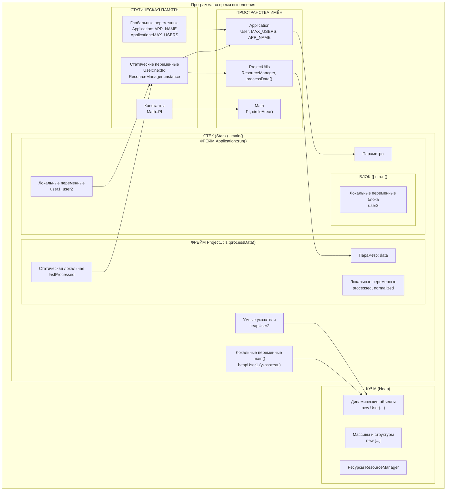
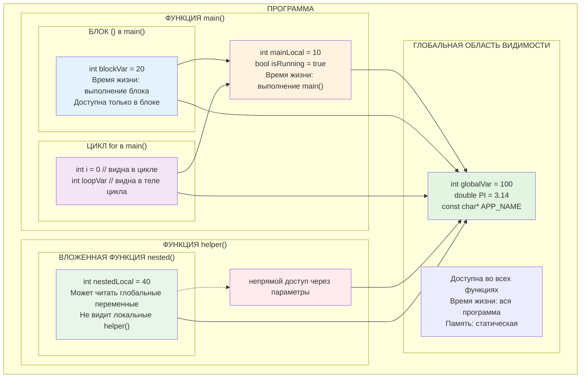
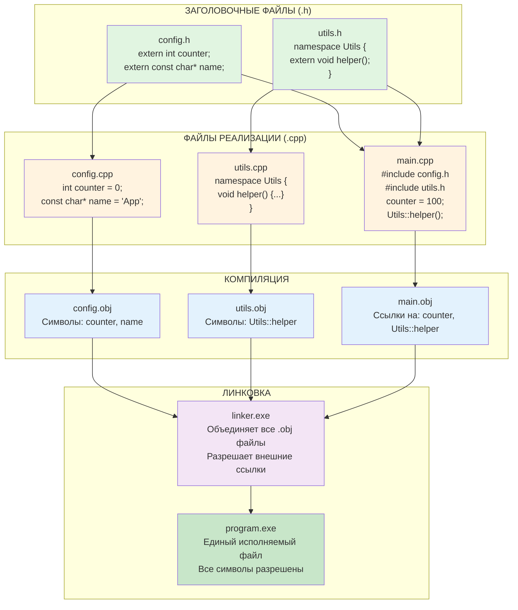

# Область видимости переменных, типы памяти и пространства имён в C++

## Теория для новичков

## 1. Область видимости переменных

**Область видимости (scope)** — это часть программы, в которой переменная доступна для использования. В C++ существует несколько уровней области видимости.

### 1.1. Локальная область видимости

```cpp
void function() {
    int x = 10;  // Локальная переменная
    // x доступна только внутри этой функции
}

{
    int y = 20;  // Локальная переменная блока
    // y доступна только внутри этого блока {}
}
```

### 1.2. Глобальная область видимости

```cpp
#include <iostream>

int globalVar = 100;  // Глобальная переменная

void printGlobal() {
    std::cout << globalVar;  // Доступна во всех функциях
}

int main() {
    std::cout << globalVar;  // Доступна в main()
    return 0;
}
```

### 1.3. Область видимости класса

```cpp
class MyClass {
private:
    int memberVar;  // Переменная-член класса
    
public:
    void setValue(int value) {
        memberVar = value;  // Доступна в методах класса
    }
};
```

### 1.4. Область видимости пространства имён

```cpp
namespace MyNamespace {
    int nsVar = 42;  // Переменная в пространстве имён
    
    void function() {
        std::cout << nsVar;  // Доступна внутри пространства имён
    }
}
```

## 2. Типы памяти в C++

### 2.1. Стек (Stack Memory)

**Стек** — область памяти для автоматических (локальных) переменных.

**Характеристики:**
- Быстрое выделение/освобождение
- Автоматическое управление
- Ограниченный размер (обычно 1-8 МБ)
- LIFO (Last In, First Out) структура

```cpp
void stackExample() {
    int x = 10;           // В стеке
    double y = 3.14;      // В стеке
    int arr[100];         // Массив в стеке
    
    {
        int blockVar = 5; // В стеке, только в блоке
    }
    // blockVar уничтожена
} // x и y уничтожены
```

### 2.2. Куча (Heap/Dynamic Memory)

**Куча** — область для динамического выделения памяти.

**Характеристики:**
- Большой размер (доступная ОЗУ)
- Ручное управление (new/delete)
- Медленнее стека
- Возможна фрагментация

```cpp
void heapExample() {
    int* ptr = new int(42);      // Выделение в куче
    int* arr = new int[100];     // Массив в куче
    
    // Использование...
    
    delete ptr;                  // Освобождение
    delete[] arr;                // Освобождение массива
}
```

### 2.3. Статическая память

**Статическая память** — для глобальных и статических переменных.

**Характеристики:**
- Существует всю жизнь программы
- Инициализируется до main()
- Автоматическое управление

```cpp
int globalVar = 100;            // Статическая память

void function() {
    static int counter = 0;     // Статическая локальная
    counter++;
}
```

### 2.4. Сегмент кода (Text Segment)

**Сегмент кода** — содержит исполняемые инструкции.

**Характеристики:**
- Только для чтения
- Хранит код программы
- Константные строки

```cpp
const char* message = "Hello";  // Строка в сегменте кода/rodata
```

## 3. Пространства имён (Namespaces)

### 3.1. Основные понятия

**Пространство имён (namespace)** — механизм для организации кода и предотвращения конфликтов имён.

```cpp
namespace CompanyA {
    void print() {
        std::cout << "Company A";
    }
    
    class Product {
        // ...
    };
}

namespace CompanyB {
    void print() {  // Такое же имя, но другой namespace
        std::cout << "Company B";
    }
}
```

### 3.2. Использование пространств имён

```cpp
// Полное квалифицированное имя
CompanyA::print();
CompanyB::print();

// Using declaration
using CompanyA::print;
print();  // Теперь print() из CompanyA

// Using directive (не рекомендуется в заголовочных файлах)
using namespace CompanyA;
print();  // Из CompanyA
```

### 3.3. Вложенные пространства имён

```cpp
namespace Graphics {
    namespace Shapes {
        class Circle { /* ... */ };
        class Rectangle { /* ... */ };
    }
    
    namespace Colors {
        const char* RED = "#FF0000";
    }
}

// C++17: вложенные пространства имён
namespace Graphics::Shapes::ThreeD {
    class Sphere { /* ... */ };
}
```

### 3.4. Анонимное пространство имён

```cpp
namespace {  // Анонимное пространство имён
    int helperVariable = 42;
    
    void helperFunction() {
        // Доступна только в этом файле
    }
}
// Эквивалентно static, но для классов и функций
```

### 3.5. Пространство имён std

```cpp
#include <iostream>
#include <vector>

// Плохая практика в заголовочных файлах
using namespace std;

// Лучше так:
int main() {
    std::cout << "Hello";        // Явное указание
    std::vector<int> numbers;
    
    // Или using declaration для часто используемых
    using std::cout;
    using std::endl;
    cout << "World" << endl;
    
    return 0;
}
```

## 4. Время жизни переменных

### 4.1. Автоматическое время жизни

```cpp
void automaticExample() {
    int x = 10;      // Создаётся при входе в функцию
    auto y = 3.14;   // Создаётся при входе в функцию
    
} // x и y уничтожаются при выходе
```

### 4.2. Статическое время жизни

```cpp
int globalVar;       // Создаётся при запуске программы

void function() {
    static int counter = 0;  // Создаётся при первом вызове
    counter++;
} // counter сохраняет значение между вызовами
```

### 4.3. Динамическое время жизни

```cpp
void dynamicExample() {
    int* ptr = new int(42);  // Создаётся явно
    
    // Использование...
    
    delete ptr;              // Уничтожается явно
}
```

### 4.4. Время жизни членов класса

```cpp
class MyClass {
    int value;  // Создаётся при создании объекта
    static int count;  // Статический - при запуске программы
    
public:
    MyClass() : value(0) {
        // Конструктор
    }
    
    ~MyClass() {
        // Деструктор
    }
};
```

## 5. Связывание (Linkage)

### 5.1. Внешнее связывание (External Linkage)

```cpp
// file1.cpp
extern int sharedVar = 100;  // Доступна из других файлов

// file2.cpp
extern int sharedVar;  // Объявление, определение в другом файле
```

### 5.2. Внутреннее связывание (Internal Linkage)

```cpp
static int fileLocal = 42;  // Только в этом файле

namespace {
    int anonymousVar = 10;  // Также только в этом файле
}
```

### 5.3. Без связывания (No Linkage)

```cpp
void function() {
    int local = 10;       // Без связывания
    static int counter;   // Внутреннее связывание
}
```

## 6. Практические примеры

### Пример 1: Полная программа с разными типами памяти

```cpp
#include <iostream>
#include <memory>

// Глобальная переменная (статическая память)
int globalCounter = 0;

namespace Math {
    // Пространство имён для математических функций
    const double PI = 3.1415926535;
    
    double circleArea(double radius) {
        return PI * radius * radius;
    }
}

class Calculator {
private:
    // Переменная-член (часть объекта)
    double lastResult;
    
    // Статическая переменная-член
    static int instanceCount;
    
public:
    Calculator() : lastResult(0) {
        instanceCount++;
        std::cout << "Создан калькулятор #" << instanceCount << std::endl;
    }
    
    ~Calculator() {
        instanceCount--;
    }
    
    // Метод, использующий стек
    double add(double a, double b) {
        double result = a + b;  // Локальная переменная (стек)
        lastResult = result;    // Сохраняем в член класса
        return result;
    }
    
    // Метод, использующий кучу
    double* createResultsArray(int size) {
        return new double[size];  // Выделение в куче
    }
    
    // Статический метод
    static int getInstanceCount() {
        return instanceCount;
    }
};

// Определение статической переменной-члена
int Calculator::instanceCount = 0;

void demonstrateScopes() {
    // Локальная переменная функции
    int functionLocal = 100;
    
    // Статическая локальная переменная
    static int callCount = 0;
    callCount++;
    
    std::cout << "\nФункция вызвана " << callCount << " раз" << std::endl;
    
    // Блок с локальной переменной
    {
        int blockLocal = 50;
        std::cout << "В блоке: blockLocal = " << blockLocal 
                  << ", functionLocal = " << functionLocal << std::endl;
    }
    // blockLocal здесь не существует
    
    // Изменение глобальной переменной
    globalCounter++;
    std::cout << "Глобальный счётчик: " << globalCounter << std::endl;
    
    // Использование пространства имён
    std::cout << "Площадь круга радиусом 5: " 
              << Math::circleArea(5.0) << std::endl;
}

int main() {
    std::cout << "=== ДЕМОНСТРАЦИЯ ОБЛАСТЕЙ ВИДИМОСТИ И ПАМЯТИ ===\n" << std::endl;
    
    // 1. Демонстрация областей видимости
    std::cout << "1. Области видимости:" << std::endl;
    demonstrateScopes();
    demonstrateScopes();
    
    // 2. Работа с классами и статическими членами
    std::cout << "\n2. Статические члены класса:" << std::endl;
    
    Calculator calc1;
    {
        Calculator calc2;
        std::cout << "Калькуляторов создано: " 
                  << Calculator::getInstanceCount() << std::endl;
    } // calc2 уничтожен
    
    std::cout << "После блока калькуляторов: " 
              << Calculator::getInstanceCount() << std::endl;
    
    // 3. Работа с разными типами памяти
    std::cout << "\n3. Типы памяти:" << std::endl;
    
    // Стек
    int stackVar = 42;
    double stackArray[5] = {1.1, 2.2, 3.3, 4.4, 5.5};
    
    // Куча (сырые указатели)
    int* heapVar = new int(100);
    double* heapArray = new double[10];
    
    // Куча (умные указатели)
    auto smartPtr = std::make_unique<int>(200);
    
    std::cout << "Стековая переменная: " << stackVar << std::endl;
    std::cout << "Кучная переменная: " << *heapVar << std::endl;
    std::cout << "Умный указатель: " << *smartPtr << std::endl;
    
    // Освобождение памяти
    delete heapVar;
    delete[] heapArray;
    
    // 4. Конфликт имён и пространства имён
    std::cout << "\n4. Пространства имён:" << std::endl;
    
    // Создаём своё пространство имён
    namespace MyApp {
        void print() {
            std::cout << "MyApp::print()" << std::endl;
        }
        
        namespace Utils {
            void print() {
                std::cout << "MyApp::Utils::print()" << std::endl;
            }
        }
    }
    
    // Использование с разными уровнями квалификации
    MyApp::print();
    MyApp::Utils::print();
    
    // Using declaration
    using MyApp::Utils::print;
    print();  // Теперь это MyApp::Utils::print()
    
    std::cout << "\n=== ПРОГРАММА ЗАВЕРШЕНА ===" << std::endl;
    
    return 0;
}
```

### Пример 2: Управление памятью в реальном проекте

```cpp
#include <iostream>
#include <vector>
#include <memory>
#include <string>

// Пространство имён для утилит проекта
namespace ProjectUtils {
    
    // Класс для работы с ресурсами
    class ResourceManager {
    private:
        // Статический указатель на единственный экземпляр (синглтон)
        static ResourceManager* instance;
        
        // Данные в куче
        std::unique_ptr<std::string[]> resources;
        int resourceCount;
        
        // Приватный конструктор
        ResourceManager() : resourceCount(0) {
            std::cout << "ResourceManager инициализирован" << std::endl;
        }
        
    public:
        // Удаляем копирование
        ResourceManager(const ResourceManager&) = delete;
        ResourceManager& operator=(const ResourceManager&) = delete;
        
        // Статический метод для получения экземпляра
        static ResourceManager& getInstance() {
            if (!instance) {
                instance = new ResourceManager();
            }
            return *instance;
        }
        
        // Метод для добавления ресурса
        void addResource(const std::string& resource) {
            // Создаём новый массив в куче
            std::unique_ptr<std::string[]> newResources(
                new std::string[resourceCount + 1]);
            
            // Копируем старые ресурсы
            for (int i = 0; i < resourceCount; i++) {
                newResources[i] = resources[i];
            }
            
            // Добавляем новый ресурс
            newResources[resourceCount] = resource;
            resourceCount++;
            
            // Перемещаем владение
            resources = std::move(newResources);
        }
        
        // Метод для вывода ресурсов
        void printResources() const {
            std::cout << "Ресурсы (" << resourceCount << "):" << std::endl;
            for (int i = 0; i < resourceCount; i++) {
                std::cout << "  " << i + 1 << ". " << resources[i] << std::endl;
            }
        }
        
        ~ResourceManager() {
            std::cout << "ResourceManager уничтожен" << std::endl;
        }
    };
    
    // Определение статической переменной
    ResourceManager* ResourceManager::instance = nullptr;
    
    // Функция для работы со стеком
    void processData(int data) {
        // Локальные переменные в стеке
        int processed = data * 2;
        double normalized = processed / 100.0;
        
        // Статическая локальная переменная для кэширования
        static int lastProcessed = 0;
        
        if (data == lastProcessed) {
            std::cout << "Данные уже обрабатывались" << std::endl;
            return;
        }
        
        lastProcessed = data;
        std::cout << "Обработаны данные: " << processed 
                  << ", нормализовано: " << normalized << std::endl;
    }
}

// Главный модуль приложения
namespace Application {
    
    // Глобальные константы (статическая память, только для чтения)
    const int MAX_USERS = 100;
    const std::string APP_NAME = "My Application";
    
    class User {
    private:
        // Данные в стеке (для объекта)
        std::string name;
        int id;
        
        // Статический счётчик
        static int nextId;
        
    public:
        User(const std::string& userName) : name(userName) {
            id = ++nextId;
            std::cout << "Создан пользователь: " << name 
                      << " (ID: " << id << ")" << std::endl;
        }
        
        void display() const {
            std::cout << "Пользователь " << id << ": " << name << std::endl;
        }
        
        ~User() {
            std::cout << "Удалён пользователь: " << name << std::endl;
        }
    };
    
    // Инициализация статической переменной
    int User::nextId = 0;
    
    void run() {
        std::cout << "Запуск: " << APP_NAME << std::endl;
        std::cout << "Максимум пользователей: " << MAX_USERS << "\n" << std::endl;
        
        // 1. Работа с пользователями (стек)
        std::cout << "1. Создание пользователей:" << std::endl;
        
        User user1("Анна");     // В стеке main()
        User user2("Борис");    // В стеке main()
        
        {
            User user3("Виктор");  // В стеке блока
            user3.display();
        } // user3 уничтожен
        
        user1.display();
        user2.display();
        
        // 2. Использование менеджера ресурсов (синглтон)
        std::cout << "\n2. Управление ресурсами:" << std::endl;
        
        auto& rm = ProjectUtils::ResourceManager::getInstance();
        rm.addResource("Ресурс 1");
        rm.addResource("Ресурс 2");
        rm.addResource("Ресурс 3");
        rm.printResources();
        
        // 3. Обработка данных
        std::cout << "\n3. Обработка данных:" << std::endl;
        
        ProjectUtils::processData(50);
        ProjectUtils::processData(75);
        ProjectUtils::processData(50);  // Уже обрабатывалось
        
        // 4. Динамическое создание объектов
        std::cout << "\n4. Динамические объекты:" << std::endl;
        
        // В куче с сырыми указателями (осторожно!)
        User* heapUser1 = new User("Дина (куча)");
        heapUser1->display();
        
        // В куче с умными указателями (рекомендуется)
        auto heapUser2 = std::make_unique<User>("Елена (умный указатель)");
        heapUser2->display();
        
        // Освобождение памяти
        delete heapUser1;  // Явное удаление
        // heapUser2 автоматически удалится
        
        std::cout << "\nЗавершение работы приложения" << std::endl;
    }
}

int main() {
    // Запуск приложения
    Application::run();
    
    return 0;
}
```

## 7. Диаграмма областей видимости и памяти



## 8. Итоговая таблица сравнения

| Характеристика | Стек | Куча | Статическая память |
|----------------|------|------|-------------------|
| **Скорость** | ⚡ Очень быстро | 🐢 Медленно | ⚡ Быстро |
| **Управление** | Автоматическое | Ручное (new/delete) | Автоматическое |
| **Размер** | 🔸 Ограничен | 🔹 Большой | 🔸 Фиксированный |
| **Время жизни** | Область видимости | До delete | Вся программа |
| **Использование** | Локальные переменные | Динамические данные | Глобальные/статические переменные |
| **Безопасность** | ✅ Автоматическая | ❌ Требует осторожности | ✅ Автоматическая |

## 9. Ключевые правила для новичков

1. **Используйте стек** для небольших, короткоживущих данных
2. **Используйте умные указатели** для управления кучей
3. **Избегайте глобальных переменных** - используйте пространства имён и статические локальные
4. **Освобождайте память**, выделенную через `new`
5. **Используйте пространства имён** для организации кода
6. **Помните об области видимости** при проектировании архитектуры

Эти концепции являются фундаментальными для понимания C++ и помогут вам писать более безопасный, эффективный и организованный код.
# Локальные и глобальные переменные в C++: полная теория

## Введение

**Переменные** в C++ — это именованные ячейки памяти для хранения данных. В зависимости от места объявления и времени жизни, переменные делятся на **локальные** и **глобальные**. Понимание этой разницы критически важно для написания корректного и эффективного кода.

## 1. Локальные переменные

### 1.1. Что такое локальные переменные?

**Локальные переменные** — это переменные, объявленные внутри функции, метода или блока кода. Они существуют только в своей области видимости.

### 1.2. Характеристики локальных переменных

```cpp
#include <iostream>

void exampleFunction() {
    // 1. Объявление локальной переменной
    int localVar = 10;           // Локальная переменная функции
    
    // 2. Локальные переменные блока
    {
        int blockVar = 20;       // Локальная переменная блока
        std::cout << "В блоке: " << blockVar << std::endl;
        // blockVar видна только здесь
    }
    // blockVar больше не существует!
    
    // 3. Параметры функции - тоже локальные переменные
    // void exampleFunction(int param) {
    //     param - локальная переменная
    // }
    
    std::cout << "В функции: " << localVar << std::endl;
} // localVar уничтожается здесь

int main() {
    // 4. Разные функции - разные локальные переменные
    int mainVar = 30;            // Локальная переменная main()
    
    // Несмотря на одинаковые имена - это разные переменные
    int localVar = 40;           // Не связана с localVar из exampleFunction()
    
    return 0;
}
```

### 1.3. Ключевые особенности локальных переменных

1. **Область видимости**: от точки объявления до конца блока `{}`
2. **Время жизни**: создаются при входе в блок, уничтожаются при выходе
3. **Место хранения**: стек (stack memory)
4. **Инициализация**: не автоматическая (содержат "мусор", если не инициализированы явно)

### 1.4. Примеры с разными типами локальных переменных

```cpp
#include <iostream>
#include <string>

void demonstrateLocalVariables() {
    // 1. Разные типы данных
    int integerVar = 42;                 // Целое число
    double doubleVar = 3.14159;          // Число с плавающей точкой
    char charVar = 'A';                  // Символ
    bool boolVar = true;                 // Логическое значение
    std::string stringVar = "Hello";     // Строка (объект)
    
    // 2. Массивы как локальные переменные
    int intArray[5] = {1, 2, 3, 4, 5};   // Статический массив в стеке
    
    // 3. Указатели как локальные переменные
    int* ptr = &integerVar;              // Указатель на локальную переменную
    
    // 4. Ссылки как локальные переменные
    int& ref = integerVar;               // Ссылка на локальную переменную
    ref = 100;                           // Изменяет integerVar
    
    // 5. Константные локальные переменные
    const int MAX_SIZE = 100;            // Константа (неизменяемая)
    // MAX_SIZE = 200; // Ошибка: константу нельзя изменить
    
    // 6. Автоматический вывод типа (C++11)
    auto autoVar = 3.14f;                // float
    auto anotherVar = "Text";            // const char*
    
    std::cout << "integerVar: " << integerVar << std::endl;
    std::cout << "doubleVar: " << doubleVar << std::endl;
}

// 7. Параметры функции - особый вид локальных переменных
void processData(int param1, double param2) {
    // param1 и param2 - локальные переменные этой функции
    // Они инициализируются значениями аргументов при вызове
    
    int result = param1 * param2;        // Локальная переменная
    std::cout << "Результат: " << result << std::endl;
    
    // Изменение параметров не влияет на оригинальные переменные
    param1 = 0;                          // Изменяется только локальная копия
}

// 8. Рекурсивные функции и локальные переменные
int factorial(int n) {
    // Каждый рекурсивный вызов создаёт свои локальные переменные
    
    if (n <= 1) {
        return 1;                        // Базовый случай
    }
    
    int current = n;                     // Локальная переменная этого вызова
    int recursiveResult = factorial(n - 1); // Рекурсивный вызов
    
    return current * recursiveResult;
}
```

### 1.5. Области видимости локальных переменных

```cpp
#include <iostream>

void scopeDemonstration() {
    int outerVar = 10;                   // Видна во всей функции
    
    {
        // Внутренний блок
        int innerVar = 20;               // Видна только в этом блоке
        
        // Можно обращаться к переменным внешней области
        std::cout << "inner: " << innerVar 
                  << ", outer: " << outerVar << std::endl;
        
        // Можно создавать переменные с тем же именем
        int outerVar = 30;               // Затеняет внешнюю outerVar
        std::cout << "Затенённая outerVar: " << outerVar << std::endl;
        
        // Чтобы получить доступ к затенённой переменной:
        // (обычно лучше избегать таких ситуаций)
    }
    
    // innerVar здесь не существует
    // outerVar здесь равна 10 (не 30)
    
    // Пример с вложенными блоками
    for (int i = 0; i < 3; i++) {       // i видна только в цикле
        int loopVar = i * 10;            // loopVar видна только в теле цикла
        
        if (i == 1) {
            int conditionVar = 100;      // Видна только в if
            std::cout << "conditionVar: " << conditionVar << std::endl;
        }
        // conditionVar здесь не существует
        
        std::cout << "i: " << i << ", loopVar: " << loopVar << std::endl;
    }
    // i и loopVar здесь не существуют
}

// 9. Затенение имён (name shadowing)
void nameShadowingExample() {
    int x = 5;                           // Переменная x уровня функции
    
    {
        int x = 10;                      // Затеняет внешнюю x
        std::cout << "Внутренний блок: x = " << x << std::endl; // 10
    }
    
    std::cout << "Внешний блок: x = " << x << std::endl;       // 5
    
    for (int x = 0; x < 3; x++) {       // Ещё одно затенение
        std::cout << "Цикл: x = " << x << std::endl;          // 0, 1, 2
    }
    
    std::cout << "После цикла: x = " << x << std::endl;       // 5
}
```

### 1.6. Статические локальные переменные

```cpp
#include <iostream>

void counter() {
    // Статическая локальная переменная
    // Сохраняет значение между вызовами функции
    static int callCount = 0;           // Инициализируется один раз
    
    callCount++;
    std::cout << "Функция вызвана " << callCount << " раз" << std::endl;
}

void staticVariableDemo() {
    counter();  // Вывод: "Функция вызвана 1 раз"
    counter();  // Вывод: "Функция вызвана 2 раз"
    counter();  // Вывод: "Функция вызвана 3 раз"
}

// Пример: кэширование результатов
double expensiveCalculation(int x) {
    static std::map<int, double> cache; // Статический кэш
    
    // Проверяем, есть ли результат в кэше
    auto it = cache.find(x);
    if (it != cache.end()) {
        std::cout << "Результат из кэша" << std::endl;
        return it->second;
    }
    
    // Дорогое вычисление
    double result = 0;
    for (int i = 0; i < 1000000; i++) {
        result += std::sin(x * i * 0.000001);
    }
    
    // Сохраняем в кэш
    cache[x] = result;
    std::cout << "Результат вычислен" << std::endl;
    
    return result;
}
```

## 2. Глобальные переменные

### 2.1. Что такое глобальные переменные?

**Глобальные переменные** — это переменные, объявленные вне всех функций, обычно в начале файла. Они видны во всех функциях программы (в пределах своей единицы трансляции).

### 2.2. Характеристики глобальных переменных

```cpp
#include <iostream>

// 1. Объявление глобальной переменной
int globalCounter = 0;                  // Глобальная переменная

// 2. Глобальная константа
const double PI = 3.141592653589793;

// 3. Глобальный массив
int globalArray[5] = {1, 2, 3, 4, 5};

// 4. Глобальная строка
const char* APPLICATION_NAME = "My Program";

void function1() {
    // Можем читать и изменять глобальную переменную
    globalCounter++;
    std::cout << "function1: counter = " << globalCounter << std::endl;
}

void function2() {
    // Та же самая глобальная переменная
    globalCounter *= 2;
    std::cout << "function2: counter = " << globalCounter << std::endl;
}

int main() {
    std::cout << APPLICATION_NAME << std::endl;
    std::cout << "Начальное значение PI: " << PI << std::endl;
    
    function1();  // counter = 1
    function2();  // counter = 2
    function1();  // counter = 3
    
    std::cout << "globalArray[2] = " << globalArray[2] << std::endl;
    
    return 0;
}
```

### 2.3. Ключевые особенности глобальных переменных

1. **Область видимости**: от точки объявления до конца файла
2. **Время жизни**: вся программа (от начала до завершения)
3. **Место хранения**: статическая память (data или bss сегмент)
4. **Инициализация**: нулями, если не инициализирована явно
5. **Связывание**: внешнее (external linkage) по умолчанию

### 2.4. Типы глобальных переменных

```cpp
#include <iostream>
#include <string>

// 1. Инициализированные глобальные переменные (в .data сегменте)
int initializedGlobal = 100;             // Явная инициализация
double price = 99.99;                    // Число с плавающей точкой
char defaultChar = 'X';                  // Символ
bool isEnabled = true;                   // Булево значение
std::string appName = "Global App";      // Объект string

// 2. Неинициализированные глобальные переменные (в .bss сегменте)
int uninitializedGlobal;                 // Автоматически = 0
double uninitializedDouble;              // Автоматически = 0.0
bool uninitializedBool;                  // Автоматически = false

// 3. Глобальные константы
const int MAX_USERS = 1000;              // Константа времени компиляции
const float GRAVITY = 9.81f;             // Константа с плавающей точкой

// 4. Глобальные массивы
int matrix[3][3] = {                     // Двумерный массив
    {1, 2, 3},
    {4, 5, 6},
    {7, 8, 9}
};

// 5. Глобальные указатели
int* globalPtr = nullptr;                // Инициализирован нулевым указателем

// 6. Глобальные структуры
struct Point {
    int x;
    int y;
};

Point origin = {0, 0};                   // Глобальный объект структуры

void demonstrateGlobalTypes() {
    std::cout << "Инициализированные:" << std::endl;
    std::cout << "  initializedGlobal = " << initializedGlobal << std::endl;
    std::cout << "  price = " << price << std::endl;
    std::cout << "  appName = " << appName << std::endl;
    
    std::cout << "\nНеинициализированные (автоматически нули):" << std::endl;
    std::cout << "  uninitializedGlobal = " << uninitializedGlobal << std::endl;
    std::cout << "  uninitializedDouble = " << uninitializedDouble << std::endl;
    std::cout << "  uninitializedBool = " << uninitializedBool << std::endl;
    
    std::cout << "\nКонстанты:" << std::endl;
    std::cout << "  MAX_USERS = " << MAX_USERS << std::endl;
    std::cout << "  GRAVITY = " << GRAVITY << std::endl;
    
    std::cout << "\nГлобальная структура:" << std::endl;
    std::cout << "  origin = (" << origin.x << ", " << origin.y << ")" << std::endl;
}
```

### 2.5. Статические глобальные переменные

```cpp
#include <iostream>

// Обычная глобальная переменная (внешнее связывание)
int externalGlobal = 100;                // Доступна из других файлов

// Статическая глобальная переменная (внутреннее связывание)
static int internalGlobal = 200;         // Только в этом файле

// Константы имеют внутреннее связывание по умолчанию
const int LOCAL_CONST = 300;             // Только в этом файле

// Но можно сделать внешнее связывание для констант
extern const int EXTERNAL_CONST = 400;   // Доступна из других файлов

void demonstrateStaticGlobal() {
    std::cout << "externalGlobal = " << externalGlobal << std::endl;
    std::cout << "internalGlobal = " << internalGlobal << std::endl;
    std::cout << "LOCAL_CONST = " << LOCAL_CONST << std::endl;
    std::cout << "EXTERNAL_CONST = " << EXTERNAL_CONST << std::endl;
    
    // Можно изменять non-const глобальные переменные
    externalGlobal = 150;
    internalGlobal = 250;
    
    // Константы изменить нельзя
    // LOCAL_CONST = 350; // Ошибка!
    // EXTERNAL_CONST = 450; // Ошибка!
}

// Анонимное пространство имён - альтернатива static
namespace {
    int anonymousVar = 500;              // Только в этом файле
    const char* secret = "Секретное значение";
}
```

### 2.6. Многофайловые проекты и глобальные переменные

**Файл: config.h**
```cpp
// config.h - заголовочный файл
#ifndef CONFIG_H
#define CONFIG_H

// Объявления (без определения)
extern int globalSettings;               // Объявление внешней переменной
extern const double VERSION;             // Объявление внешней константы

// Встроенные определения (будут в каждом .cpp файле)
const int DEFAULT_SIZE = 1024;           // Внутреннее связывание
static int fileLocalConfig = 42;         // Внутреннее связывание

#endif // CONFIG_H
```

**Файл: config.cpp**
```cpp
// config.cpp - файл реализации
#include "config.h"

// Определения
int globalSettings = 100;                // Определение глобальной переменной
const double VERSION = 2.5;              // Определение глобальной константы
```

**Файл: main.cpp**
```cpp
// main.cpp - главный файл
#include <iostream>
#include "config.h"

// Использование глобальных переменных
void useGlobals() {
    std::cout << "globalSettings = " << globalSettings << std::endl;
    std::cout << "VERSION = " << VERSION << std::endl;
    std::cout << "DEFAULT_SIZE = " << DEFAULT_SIZE << std::endl;
    
    // Можно изменять
    globalSettings = 200;
}

int main() {
    useGlobals();
    return 0;
}
```

## 3. Сравнение локальных и глобальных переменных

### 3.1. Сводная таблица

| Характеристика | Локальные переменные | Глобальные переменные |
|----------------|---------------------|----------------------|
| **Объявление** | Внутри функции/блока | Вне всех функций |
| **Область видимости** | Только внутри блока | Весь файл (или проект) |
| **Время жизни** | От создания до выхода из блока | Вся программа |
| **Память** | Стек (stack) | Статическая память (data/bss) |
| **Инициализация** | Не автоматическая (мусор) | Автоматическая (нули) |
| **Доступность** | Ограниченная | Широкая |
| **Безопасность** | Высокая | Низкая (возможны конфликты) |
| **Производительность** | Быстрый доступ | Медленнее локальных |
| **Рекомендации** | Использовать по возможности | Избегать, когда возможно |

### 3.2. Наглядный пример сравнения

```cpp
#include <iostream>
#include <string>

// Глобальные переменные
std::string globalUserName = "Гость";
int globalLoginCount = 0;

void login() {
    // Локальные переменные функции
    std::string localUserName;
    int localAttempts = 0;
    
    // Использование глобальной переменной
    globalLoginCount++;
    
    std::cout << "\n=== Попытка входа #" << globalLoginCount << " ===" << std::endl;
    
    // Симуляция входа
    localUserName = "Пользователь" + std::to_string(globalLoginCount);
    localAttempts = 1;
    
    std::cout << "Локальные переменные внутри login():" << std::endl;
    std::cout << "  localUserName = " << localUserName << std::endl;
    std::cout << "  localAttempts = " << localAttempts << std::endl;
    
    // Изменение глобальной переменной
    globalUserName = localUserName;
    
    std::cout << "\nГлобальные переменные после login():" << std::endl;
    std::cout << "  globalUserName = " << globalUserName << std::endl;
    std::cout << "  globalLoginCount = " << globalLoginCount << std::endl;
}

void displaySessionInfo() {
    // Локальная переменная
    std::string displayMessage;
    
    // Использование глобальных переменных
    displayMessage = "Текущий пользователь: " + globalUserName + 
                    " (входов: " + std::to_string(globalLoginCount) + ")";
    
    std::cout << "\n" << displayMessage << std::endl;
    
    // Нельзя использовать локальные переменные из других функций!
    // std::cout << localUserName; // ОШИБКА: localUserName не видна здесь
}

int main() {
    std::cout << "=== ПРОГРАММА С ИСПОЛЬЗОВАНИЕМ ЛОКАЛЬНЫХ И ГЛОБАЛЬНЫХ ПЕРЕМЕННЫХ ===\n" << std::endl;
    
    // Локальные переменные main()
    int sessionId = 1001;
    bool isActive = true;
    
    std::cout << "Начальное состояние:" << std::endl;
    std::cout << "  sessionId = " << sessionId << " (локальная)" << std::endl;
    std::cout << "  isActive = " << isActive << " (локальная)" << std::endl;
    std::cout << "  globalUserName = " << globalUserName << " (глобальная)" << std::endl;
    std::cout << "  globalLoginCount = " << globalLoginCount << " (глобальная)" << std::endl;
    
    // Вызовы функций
    login();
    displaySessionInfo();
    
    login();
    displaySessionInfo();
    
    // Показываем, что локальные переменные main() всё ещё доступны
    std::cout << "\nЛокальные переменные main() сохранились:" << std::endl;
    std::cout << "  sessionId = " << sessionId << std::endl;
    std::cout << "  isActive = " << isActive << std::endl;
    
    // Демонстрация проблемы с глобальными переменными
    demonstrateGlobalVariableIssues();
    
    return 0;
}

void demonstrateGlobalVariableIssues() {
    std::cout << "\n=== ПРОБЛЕМЫ С ГЛОБАЛЬНЫМИ ПЕРЕМЕННЫМИ ===\n" << std::endl;
    
    // Проблема 1: Неожиданные изменения
    std::cout << "1. Неожиданные изменения:" << std::endl;
    
    void maliciousFunction();  // Объявление
    std::cout << "До maliciousFunction: globalUserName = " << globalUserName << std::endl;
    maliciousFunction();
    std::cout << "После maliciousFunction: globalUserName = " << globalUserName << std::endl;
    
    // Проблема 2: Конфликты имён
    std::cout << "\n2. Конфликты имён:" << std::endl;
    
    // int globalLoginCount = 5; // ОШИБКА: переопределение
    int localLoginCount = 5;    // OK: локальная переменная
    std::cout << "Локальная переменная скрывает глобальную в своей области" << std::endl;
    
    // Доступ к глобальной через оператор разрешения области ::
    std::cout << "Глобальная: " << ::globalLoginCount << std::endl;
    std::cout << "Локальная: " << localLoginCount << std::endl;
}

void maliciousFunction() {
    // Любая функция может изменить глобальную переменную
    globalUserName = "ЗЛОЙ ХАКЕР";
    globalLoginCount = -999;
}
```

## 4. Практические рекомендации

### 4.1. Когда использовать локальные переменные

```cpp
// ХОРОШИЕ ПРИМЕРЫ использования локальных переменных:

// 1. Временные вычисления
double calculateArea(double radius) {
    double pi = 3.14159;          // Локальная константа
    double area = pi * radius * radius; // Локальная переменная
    return area;
}

// 2. Счётчики циклов
void processArray(int arr[], int size) {
    for (int i = 0; i < size; i++) { // i - локальная переменная цикла
        arr[i] *= 2;
    }
}

// 3. Промежуточные результаты
int complexCalculation(int x, int y) {
    int temp1 = x * x;            // Локальная временная переменная
    int temp2 = y * y;            // Локальная временная переменная
    int result = temp1 + temp2;   // Локальная переменная результата
    return result;
}

// 4. Безопасная работа с ресурсами
void safeFileOperation() {
    std::ifstream file("data.txt"); // Локальный объект
    if (file.is_open()) {
        // Работа с файлом...
    }
    // Файл автоматически закрывается при выходе из функции
}
```

### 4.2. Когда (осторожно) использовать глобальные переменные

```cpp
// ОГРАНИЧЕННЫЕ СЛУЧАИ для глобальных переменных:

// 1. Константы конфигурации (лучше в namespace)
namespace Config {
    const int MAX_CONNECTIONS = 100;
    const std::string DB_PATH = "database.db";
    const double TIMEOUT = 30.0;
}

// 2. Логирование (синглтон лучше)
class Logger {
    static Logger& instance();
    void log(const std::string& message);
    // ...
};

// 3. Глобальное состояние приложения (осторожно!)
namespace AppState {
    extern bool isRunning;        // Определить в одном .cpp файле
    extern int activeUsers;       // Определить в одном .cpp файле
    
    void initialize() {
        isRunning = true;
        activeUsers = 0;
    }
}

// 4. Реестр или кэш (синглтон или статическая локальная переменная)
class ResourceCache {
    static ResourceCache& getInstance() {
        static ResourceCache instance; // Статическая локальная переменная
        return instance;
    }
    // ...
};
```

### 4.3. Антипаттерны и частые ошибки

```cpp
// ПЛОХИЕ ПРИМЕРЫ - как НЕ нужно делать:

// 1. Чрезмерное использование глобальных переменных
int counter;          // ПЛОХО
int maxValue;         // ПЛОХО
int minValue;         // ПЛОХО
std::string userName; // ПЛОХО

void process() {
    // Какая функция что меняет? Непонятно!
    counter++;
    if (userName.empty()) {
        userName = "Unknown";
    }
}

// 2. Возврат указателя/ссылки на локальную переменную
int* dangerousFunction() {
    int localVar = 42;           // Локальная переменная
    return &localVar;            // ОПАСНО! Указатель на несуществующую память
}

// 3. Неинициализированные локальные переменные
void unsafeCalculation() {
    int uninitialized;          // Содержит "мусор"
    double notSet;              // Содержит "мусор"
    
    int result = uninitialized * 10; // Неопределённое поведение!
}

// 4. Глобальные переменные с короткими именами
int x;      // ПЛОХО: Что такое x?
int tmp;    // ПЛОХО: Временная, но глобальная?
double d;   // ПЛОХО: Непонятное назначение

// Лучше так:
int userScore;                  // ХОРОШО: понятное имя
double temperatureCelsius;      // ХОРОШО: понятное имя
std::string configurationPath;  // ХОРОШО: понятное имя
```

### 4.4. Лучшие практики

```cpp
// ХОРОШИЕ ПРАКТИКИ:

// 1. Инициализируйте переменные при объявлении
void goodPractice1() {
    int count = 0;                      // ХОРОШО: инициализирована
    std::string name = "";              // ХОРОШО: инициализирована
    double total = 0.0;                 // ХОРОШО: инициализирована
    
    // Для указателей:
    int* ptr = nullptr;                 // ХОРОШО: явный nullptr
    int* anotherPtr = new int(42);      // ХОРОШО: инициализирован значением
}

// 2. Ограничивайте область видимости
void goodPractice2() {
    // Вместо:
    int i, j, k;                        // ПЛОХО: слишком рано объявлены
    
    // Лучше:
    {
        int i = calculateSomething();   // ХОРОШО: ограниченная область
        // ... используем i ...
    }
    
    {
        int j = processData();          // ХОРОШО: отдельная область
        // ... используем j ...
    }
}

// 3. Используйте const везде, где возможно
void goodPractice3() {
    const int MAX_RETRIES = 3;          // ХОРОШО: константа
    const double PI = 3.14159;          // ХОРОШО: константа
    
    int value = 42;
    const int& ref = value;             // ХОРОШО: константная ссылка
    
    // const для параметров функций
    void printMessage(const std::string& message); // ХОРОШО
}

// 4. Избегайте глобальных переменных, используйте альтернативы
namespace GoodPractice {
    // Вместо глобальных переменных:
    
    // 1. Локальные статические переменные в функциях
    int& getGlobalCounter() {
        static int counter = 0;         // ХОРОШО: скрытая глобальная
        return counter;
    }
    
    // 2. Классы-синглтоны
    class ApplicationSettings {
    private:
        ApplicationSettings() = default;
        
        std::string configPath;
        int maxUsers;
        
    public:
        static ApplicationSettings& getInstance() {
            static ApplicationSettings instance; // ХОРОШО
            return instance;
        }
        
        // Геттеры и сеттеры
        std::string getConfigPath() const { return configPath; }
        void setConfigPath(const std::string& path) { configPath = path; }
    };
    
    // 3. Dependency Injection (передача зависимостей)
    class DataProcessor {
    private:
        const Logger& logger;           // ХОРОШО: передана как зависимость
        const Config& config;           // ХОРОШО: передана как зависимость
        
    public:
        DataProcessor(const Logger& log, const Config& cfg)
            : logger(log), config(cfg) {} // ХОРОШО: внедрение зависимостей
    };
}
```

## 5. Диаграмма областей видимости



## 6. Пример комплексной программы

```cpp
#include <iostream>
#include <string>
#include <vector>
#include <ctime>

// ========== ГЛОБАЛЬНЫЕ КОНСТАНТЫ (приемлемо) ==========
namespace GlobalConstants {
    const int MAX_ATTEMPTS = 3;
    const std::string DEFAULT_USER = "Guest";
    const double TAX_RATE = 0.20;
}

// ========== ГЛОБАЛЬНОЕ СОСТОЯНИЕ (осторожно!) ==========
namespace AppState {
    bool isApplicationRunning = true;
    int totalOperations = 0;
    
    // Геттер вместо прямого доступа
    bool isRunning() { return isApplicationRunning; }
    void stopApplication() { isApplicationRunning = false; }
    void incrementOperations() { totalOperations++; }
    int getTotalOperations() { return totalOperations; }
}

// ========== КЛАСС ДЛЯ УПРАВЛЕНИЯ ДАННЫМИ ==========
class UserSession {
private:
    // Поля класса (похожи на локальные для объекта)
    std::string userName;
    int sessionId;
    time_t startTime;
    
    // Статическое поле класса (общее для всех объектов)
    static int totalSessions;
    
public:
    // Конструктор с локальными параметрами
    UserSession(const std::string& name) 
        : userName(name), sessionId(++totalSessions) {
        startTime = time(nullptr);
        std::cout << "Создана сессия #" << sessionId 
                  << " для пользователя: " << userName << std::endl;
    }
    
    // Деструктор
    ~UserSession() {
        std::cout << "Завершена сессия #" << sessionId << std::endl;
        totalSessions--;
    }
    
    // Методы с локальными переменными
    void displaySessionInfo() const {
        // Локальные переменные метода
        std::string info = "Сессия #" + std::to_string(sessionId);
        info += ", Пользователь: " + userName;
        
        // Локальная переменная для времени
        time_t currentTime = time(nullptr);
        double duration = difftime(currentTime, startTime);
        
        std::cout << info << std::endl;
        std::cout << "Длительность: " << duration << " секунд" << std::endl;
    }
    
    // Статический метод
    static int getActiveSessions() {
        return totalSessions;
    }
};

// Инициализация статического поля
int UserSession::totalSessions = 0;

// ========== ФУНКЦИИ С РАЗНЫМИ ТИПАМИ ПЕРЕМЕННЫХ ==========

// Функция с локальными переменными
double calculatePrice(int quantity, double unitPrice) {
    // Локальные переменные функции
    double subtotal = quantity * unitPrice;
    const double discountRate = 0.10;  // Локальная константа
    
    // Статическая локальная переменная для учёта вызовов
    static int callCount = 0;
    callCount++;
    
    // Локальная переменная для скидки
    double discount = 0;
    
    if (quantity > 10) {
        discount = subtotal * discountRate;
    }
    
    double tax = subtotal * GlobalConstants::TAX_RATE;
    double total = subtotal - discount + tax;
    
    std::cout << "\nВызов calculatePrice #" << callCount << ":" << std::endl;
    std::cout << "  Количество: " << quantity << std::endl;
    std::cout << "  Цена за единицу: " << unitPrice << std::endl;
    std::cout << "  Подытог: " << subtotal << std::endl;
    std::cout << "  Скидка: " << discount << std::endl;
    std::cout << "  Налог: " << tax << std::endl;
    std::cout << "  ИТОГО: " << total << std::endl;
    
    // Увеличиваем глобальный счётчик операций
    AppState::incrementOperations();
    
    return total;
}

// Функция, демонстрирующая области видимости
void demonstrateScopes() {
    std::cout << "\n=== ДЕМОНСТРАЦИЯ ОБЛАСТЕЙ ВИДИМОСТИ ===" << std::endl;
    
    // Локальная переменная функции
    int functionVar = 100;
    
    {
        // Локальная переменная блока
        int blockVar = 200;
        std::cout << "В блоке:" << std::endl;
        std::cout << "  functionVar = " << functionVar << " (из внешней области)" << std::endl;
        std::cout << "  blockVar = " << blockVar << " (только в блоке)" << std::endl;
        
        // Затенение имени
        int functionVar = 300;  // НОВАЯ переменная, скрывает внешнюю
        std::cout << "  functionVar (затенённая) = " << functionVar << std::endl;
        
        // Доступ к затенённой переменной
        std::cout << "  Внешняя functionVar = " << ::functionVar << " (ошибка - не глобальная)" << std::endl;
        // Для не-глобальных переменных нет прямого доступа к затенённым
    }
    
    // blockVar здесь не существует
    std::cout << "\nВне блока:" << std::endl;
    std::cout << "  functionVar = " << functionVar << " (оригинальная, не изменена)" << std::endl;
}

// ========== ГЛАВНАЯ ФУНКЦИЯ ==========
int main() {
    std::cout << "=== ПРОГРАММА УПРАВЛЕНИЯ СЕССИЯМИ ПОЛЬЗОВАТЕЛЕЙ ===\n" << std::endl;
    
    // Локальные переменные main()
    std::string adminName = "Administrator";
    int sessionCount = 0;
    
    // Использование глобальных констант
    std::cout << "Глобальные константы:" << std::endl;
    std::cout << "  MAX_ATTEMPTS: " << GlobalConstants::MAX_ATTEMPTS << std::endl;
    std::cout << "  DEFAULT_USER: " << GlobalConstants::DEFAULT_USER << std::endl;
    std::cout << "  TAX_RATE: " << GlobalConstants::TAX_RATE << "\n" << std::endl;
    
    // Создание объектов (локальные переменные main())
    UserSession session1("Анна");
    sessionCount++;
    
    {
        // Объекты в блоке
        UserSession session2("Борис");
        sessionCount++;
        
        UserSession session3("Виктор");
        sessionCount++;
        
        std::cout << "\nВнутри блока:" << std::endl;
        std::cout << "  Активных сессий: " << UserSession::getActiveSessions() << std::endl;
        std::cout << "  sessionCount (локальная): " << sessionCount << std::endl;
        
        session2.displaySessionInfo();
    } // session2 и session3 уничтожаются здесь
    
    std::cout << "\nПосле блока:" << std::endl;
    std::cout << "  Активных сессий: " << UserSession::getActiveSessions() << std::endl;
    std::cout << "  sessionCount (локальная): " << sessionCount << std::endl;
    
    // Демонстрация работы с ценами
    std::cout << "\n=== РАСЧЁТ СТОИМОСТИ ===" << std::endl;
    
    calculatePrice(5, 10.0);    // Без скидки
    calculatePrice(15, 10.0);   // Со скидкой
    calculatePrice(8, 10.0);    // Без скидки
    
    // Демонстрация областей видимости
    demonstrateScopes();
    
    // Использование глобального состояния
    std::cout << "\n=== ГЛОБАЛЬНОЕ СОСТОЯНИЕ ===" << std::endl;
    std::cout << "Всего операций: " << AppState::getTotalOperations() << std::endl;
    std::cout << "Приложение работает: " << (AppState::isRunning() ? "Да" : "Нет") << std::endl;
    
    // Остановка приложения
    AppState::stopApplication();
    std::cout << "После остановки: " << (AppState::isRunning() ? "Да" : "Нет") << std::endl;
    
    // Ещё одна сессия
    std::cout << "\n=== ФИНАЛЬНАЯ СЕССИЯ ===" << std::endl;
    {
        UserSession finalSession("Зоя");
        finalSession.displaySessionInfo();
    }
    
    std::cout << "\n=== ПРОГРАММА ЗАВЕРШЕНА ===" << std::endl;
    std::cout << "Итоговая статистика:" << std::endl;
    std::cout << "  Всего операций: " << AppState::getTotalOperations() << std::endl;
    std::cout << "  Активных сессий: " << UserSession::getActiveSessions() << std::endl;
    
    return 0;
}
```

## 7. Итоговые правила и советы

### Правила для локальных переменных:
1. **Объявляйте переменные как можно ближе к месту их первого использования**
2. **Инициализируйте переменные при объявлении**
3. **Используйте `const` для переменных, которые не должны изменяться**
4. **Ограничивайте область видимости с помощью блоков `{}`**
5. **Избегайте затенения имён (используйте разные имена)**

### Правила для глобальных переменных:
1. **Избегайте глобальных переменных, когда это возможно**
2. **Используйте пространства имён для организации глобальных переменных**
3. **Делайте глобальные переменные `const`, когда это возможно**
4. **Используйте `static` или анонимные пространства имён для ограничения видимости**
5. **Предпочитайте геттеры/сеттеры или синглтоны прямым глобальным переменным**

### Общие рекомендации:
1. **Ясно называйте переменные** (избегайте `x`, `temp`, `var1`)
2. **Комментируйте неочевидное использование глобальных переменных**
3. **Тестируйте многопоточный доступ** при работе с глобальными переменными
4. **Рассмотрите альтернативы** (параметры функций, возвращаемые значения, объекты)

Помните: **чем меньше область видимости переменной, тем проще понять, анализировать и тестировать код**. Локальные переменные почти всегда предпочтительнее глобальных.

# static, extern, namespace в C++: полная теория

## Введение

Ключевые слова `static`, `extern` и концепция `namespace` — это мощные инструменты управления видимостью, временем жизни и организацией кода в C++. Понимание этих концепций критически важно для написания качественного, поддерживаемого кода.

## 1. Ключевое слово `static`

Ключевое слово `static` в C++ имеет несколько различных значений в зависимости от контекста использования.

### 1.1. `static` для локальных переменных функций

**Статическая локальная переменная** сохраняет своё значение между вызовами функции и инициализируется только один раз.

```cpp
#include <iostream>

void counter() {
    // Обычная локальная переменная
    int localVar = 0;           // Инициализируется при каждом вызове
    
    // Статическая локальная переменная
    static int staticVar = 0;   // Инициализируется только при первом вызове
    
    localVar++;                 // Всегда будет 1
    staticVar++;               // Увеличивается с каждым вызовом
    
    std::cout << "localVar: " << localVar 
              << ", staticVar: " << staticVar << std::endl;
}

int main() {
    counter();  // localVar: 1, staticVar: 1
    counter();  // localVar: 1, staticVar: 2
    counter();  // localVar: 1, staticVar: 3
    return 0;
}
```

**Особенности:**
- Инициализируется при первом вызове функции
- Сохраняет значение между вызовами
- Разрушается при завершении программы
- Хранится в статической памяти (не в стеке)

### 1.2. `static` для глобальных переменных и функций

При использовании с глобальными переменными или функциями, `static` ограничивает их видимость текущим файлом (internal linkage).

```cpp
// file1.cpp
#include <iostream>

// Глобальная переменная с внешним связыванием
int globalVar = 100;            // Видна в других файлах

// Статическая глобальная переменная
static int fileLocalVar = 200;  // Только в этом файле

// Обычная функция с внешним связыванием
void globalFunction() {
    std::cout << "globalFunction()" << std::endl;
}

// Статическая функция
static void fileLocalFunction() {
    std::cout << "fileLocalFunction()" << std::endl;
}

int main() {
    std::cout << "globalVar: " << globalVar << std::endl;
    std::cout << "fileLocalVar: " << fileLocalVar << std::endl;
    
    globalFunction();
    fileLocalFunction();
    
    return 0;
}

// file2.cpp
// extern int globalVar;        // OK - можно объявить
// extern int fileLocalVar;     // ОШИБКА - не видна в других файлах

// void globalFunction();       // OK - можно объявить
// void fileLocalFunction();    // ОШИБКА - не видна в других файлах
```

### 1.3. `static` для членов класса

Статические члены класса принадлежат классу в целом, а не отдельным объектам.

```cpp
#include <iostream>
#include <string>

class BankAccount {
private:
    std::string owner;
    double balance;
    
    // Статический член класса (общий для всех объектов)
    static double interestRate;        // Объявление
    
    // Статический константный член
    static const int MAX_ACCOUNTS = 1000;
    
    // Статическая переменная для подсчёта объектов
    static int accountCount;
    
public:
    BankAccount(const std::string& name, double initialBalance)
        : owner(name), balance(initialBalance) {
        accountCount++;
        std::cout << "Создан счёт #" << accountCount 
                  << " для " << owner << std::endl;
    }
    
    ~BankAccount() {
        accountCount--;
        std::cout << "Закрыт счёт " << owner 
                  << " (осталось: " << accountCount << ")" << std::endl;
    }
    
    // Обычный метод (работает с конкретным объектом)
    void deposit(double amount) {
        balance += amount;
    }
    
    // Статический метод (работает без создания объекта)
    static void setInterestRate(double newRate) {
        interestRate = newRate;
        std::cout << "Процентная ставка изменена на: " 
                  << interestRate << "%" << std::endl;
    }
    
    static double getInterestRate() {
        return interestRate;
    }
    
    static int getAccountCount() {
        return accountCount;
    }
    
    // Метод, использующий статический член
    void calculateInterest() {
        double interest = balance * interestRate / 100;
        std::cout << owner << ": проценты = " << interest << std::endl;
    }
    
    void display() const {
        std::cout << owner << ": баланс = " << balance 
                  << ", ставка = " << interestRate << "%" << std::endl;
    }
};

// Определение статических членов (обязательно вне класса)
double BankAccount::interestRate = 5.0;    // Инициализация
int BankAccount::accountCount = 0;         // Инициализация

// Определение статической константы (если используется как l-value)
// const int BankAccount::MAX_ACCOUNTS = 1000;

int main() {
    // Использование статических методов без создания объектов
    std::cout << "Текущая процентная ставка: " 
              << BankAccount::getInterestRate() << "%" << std::endl;
    
    BankAccount::setInterestRate(7.5);
    
    // Создание объектов
    BankAccount account1("Анна", 1000);
    BankAccount account2("Борис", 2000);
    
    std::cout << "\nВсего счетов: " 
              << BankAccount::getAccountCount() << std::endl;
    
    account1.display();
    account2.display();
    
    // Изменение процентной ставки влияет на все объекты
    BankAccount::setInterestRate(6.0);
    
    std::cout << "\nПосле изменения ставки:" << std::endl;
    account1.display();
    account2.display();
    
    account1.calculateInterest();
    account2.calculateInterest();
    
    // Создание ещё одного счёта
    {
        BankAccount account3("Виктор", 3000);
        std::cout << "\nВсего счетов в блоке: " 
                  << BankAccount::getAccountCount() << std::endl;
    }
    
    std::cout << "\nПосле блока счетов: " 
              << BankAccount::getAccountCount() << std::endl;
    
    return 0;
}
```

**Особенности статических членов класса:**
- Существуют в единственном экземпляре для всего класса
- Не привязаны к конкретным объектам
- Доступны через имя класса `ClassName::member`
- Могут быть публичными, приватными или защищёнными
- Требуют определения вне класса (кроме констант целых типов)

### 1.4. `static` внутри функций-членов класса

```cpp
#include <iostream>

class Logger {
private:
    std::string name;
    
public:
    Logger(const std::string& n) : name(n) {
        std::cout << "Создан логгер: " << name << std::endl;
    }
    
    void log(const std::string& message) {
        // Статическая локальная переменная внутри метода
        static int callCount = 0;
        callCount++;
        
        std::cout << "[" << name << "] Вызов #" << callCount 
                  << ": " << message << std::endl;
        
        // Другая статическая переменная
        static time_t firstCallTime = time(nullptr);
        time_t currentTime = time(nullptr);
        
        if (callCount == 1) {
            std::cout << "  Первый вызов в: " << ctime(&firstCallTime);
        } else {
            double seconds = difftime(currentTime, firstCallTime);
            std::cout << "  Прошло секунд с первого вызова: " 
                      << seconds << std::endl;
        }
    }
};

int main() {
    Logger logger1("System");
    Logger logger2("User");
    
    logger1.log("Запуск системы");
    logger2.log("Пользователь вошёл");
    logger1.log("Обработка данных");
    logger2.log("Пользователь вышел");
    
    return 0;
}
```

## 2. Ключевое слово `extern`

Ключевое слово `extern` используется для объявления переменных и функций без их определения, указывая, что они определены в другом месте.

### 2.1. `extern` для переменных

```cpp
// config.h - заголовочный файл (объявления)
#ifndef CONFIG_H
#define CONFIG_H

// Объявление глобальной переменной (без выделения памяти)
extern int globalCounter;        // Объявление: "эта переменная где-то определена"

// Объявление глобальной константы
extern const double PI;          // Для констант тоже нужно extern

// Объявление функции
extern void initializeApp();     // extern для функций необязателен, но допустим

#endif // CONFIG_H

// config.cpp - файл реализации (определения)
#include "config.h"

// Определение глобальной переменной (выделение памяти)
int globalCounter = 0;           // Определение: здесь выделяется память

// Определение глобальной константы
const double PI = 3.141592653589793;

// Определение функции
void initializeApp() {
    globalCounter = 100;
    std::cout << "Приложение инициализировано" << std::endl;
}

// main.cpp - главный файл
#include <iostream>
#include "config.h"

int main() {
    // Использование объявленных переменных
    std::cout << "Начальное значение счетчика: " << globalCounter << std::endl;
    
    initializeApp();
    
    std::cout << "Значение PI: " << PI << std::endl;
    std::cout << "Счетчик после инициализации: " << globalCounter << std::endl;
    
    // Можно изменить non-const переменную
    globalCounter = 200;
    std::cout << "Новое значение счетчика: " << globalCounter << std::endl;
    
    return 0;
}
```

### 2.2. `extern "C"` для совместимости с C

```cpp
// C++ файл
#include <iostream>

// Объявление функции, написанной на C
extern "C" {
    void c_function();           // Функция из C-кода
    int c_variable;              // Переменная из C-кода
}

// C++ функция
void cpp_function() {
    std::cout << "C++ функция" << std::endl;
}

int main() {
    c_function();                // Вызов C-функции
    cpp_function();              // Вызов C++ функции
    
    c_variable = 42;             // Доступ к C-переменной
    
    return 0;
}

// C файл (compiled.c)
#include <stdio.h>

int c_variable = 0;              // Определение C-переменной

void c_function() {              // Определение C-функции
    printf("C функция\n");
    c_variable++;
}
```

### 2.3. `extern` с инициализацией

```cpp
// Обычное использование extern (без инициализации)
extern int declaredVar;         // Объявление без определения

// С инициализацией - это уже определение!
extern int definedVar = 100;    // Это определение с инициализацией

// Для констант
extern const int constVar = 200; // Определение константы

void example() {
    // Локальные переменные не могут быть extern
    // extern int localVar;     // ОШИБКА!
    
    // Но можно объявить extern внутри блока
    {
        extern int declaredVar; // Объявление глобальной переменной в блоке
        declaredVar = 50;       // Теперь можно использовать
    }
}
```

### 2.4. Многофайловый проект с `extern`

**Проект структура:**
```
project/
├── common.h          // Общие объявления
├── module1.cpp       // Модуль 1
├── module2.cpp       // Модуль 2
└── main.cpp          // Главный файл
```

**common.h:**
```cpp
#ifndef COMMON_H
#define COMMON_H

#include <string>

// Объявления общих переменных
extern int sharedCounter;
extern std::string applicationName;
extern const int MAX_USERS;

// Объявления функций
void incrementCounter();
void displayStatus();

#endif // COMMON_H
```

**module1.cpp:**
```cpp
#include "common.h"
#include <iostream>

// Определение глобальных переменных
int sharedCounter = 0;
const int MAX_USERS = 100;

void incrementCounter() {
    sharedCounter++;
    std::cout << "Счетчик увеличен: " << sharedCounter << std::endl;
}
```

**module2.cpp:**
```cpp
#include "common.h"
#include <iostream>

// Определение другой глобальной переменной
std::string applicationName = "My Application";

void displayStatus() {
    std::cout << "=== Статус приложения ===" << std::endl;
    std::cout << "Имя: " << applicationName << std::endl;
    std::cout << "Счетчик: " << sharedCounter << std::endl;
    std::cout << "Макс. пользователей: " << MAX_USERS << std::endl;
}
```

**main.cpp:**
```cpp
#include "common.h"
#include <iostream>

int main() {
    std::cout << "Запуск: " << applicationName << std::endl;
    
    for (int i = 0; i < 5; i++) {
        incrementCounter();
    }
    
    displayStatus();
    
    // Можно напрямую работать с переменными
    sharedCounter = 100;
    applicationName = "Updated Application";
    
    displayStatus();
    
    return 0;
}
```

## 3. Пространства имён (Namespaces)

Пространства имён используются для организации кода и предотвращения конфликтов имён.

### 3.1. Базовое использование

```cpp
#include <iostream>

// Пространство имён для математических функций
namespace Math {
    const double PI = 3.141592653589793;
    
    double square(double x) {
        return x * x;
    }
    
    double circleArea(double radius) {
        return PI * radius * radius;
    }
}

// Пространство имён для утилит
namespace Utils {
    void printHeader(const std::string& title) {
        std::cout << "\n=== " << title << " ===" << std::endl;
    }
    
    template<typename T>
    void printValue(const std::string& name, T value) {
        std::cout << name << " = " << value << std::endl;
    }
}

// Глобальное пространство имён (неявное)
int globalVar = 100;  // В глобальном namespace

int main() {
    // Использование с полной квалификацией
    std::cout << "PI: " << Math::PI << std::endl;
    std::cout << "Квадрат 5: " << Math::square(5) << std::endl;
    std::cout << "Площадь круга радиусом 3: " 
              << Math::circleArea(3) << std::endl;
    
    Utils::printHeader("Результаты вычислений");
    Utils::printValue("Глобальная переменная", globalVar);
    Utils::printValue("Площадь", Math::circleArea(2.5));
    
    return 0;
}
```

### 3.2. Вложенные пространства имён

```cpp
#include <iostream>
#include <string>

namespace Company {
    namespace Department {
        namespace Engineering {
            class Engineer {
            private:
                std::string name;
                int level;
                
            public:
                Engineer(const std::string& n, int lvl) 
                    : name(n), level(lvl) {}
                
                void display() const {
                    std::cout << "Инженер: " << name 
                              << ", уровень: " << level << std::endl;
                }
            };
        }
        
        namespace Sales {
            class SalesPerson {
            private:
                std::string name;
                double quota;
                
            public:
                SalesPerson(const std::string& n, double q) 
                    : name(n), quota(q) {}
                
                void display() const {
                    std::cout << "Продавец: " << name 
                              << ", квота: " << quota << std::endl;
                }
            };
        }
    }
    
    // C++17: упрощённый синтаксис для вложенных пространств имён
    namespace HR::Payroll {
        class Employee {
        private:
            std::string id;
            double salary;
            
        public:
            Employee(const std::string& empId, double sal) 
                : id(empId), salary(sal) {}
            
            void display() const {
                std::cout << "Сотрудник: " << id 
                          << ", зарплата: " << salary << std::endl;
            }
        };
    }
}

int main() {
    // Использование вложенных пространств имён
    Company::Department::Engineering::Engineer eng("Анна", 3);
    eng.display();
    
    Company::Department::Sales::SalesPerson sales("Борис", 100000);
    sales.display();
    
    Company::HR::Payroll::Employee emp("EMP001", 50000);
    emp.display();
    
    return 0;
}
```

### 3.3. `using` директива и декларация

```cpp
#include <iostream>

namespace Math {
    double add(double a, double b) { return a + b; }
    double multiply(double a, double b) { return a * b; }
    const double E = 2.71828;
}

namespace Physics {
    const double G = 9.81;
    double force(double mass) { return mass * G; }
}

int main() {
    // 1. Полная квалификация (рекомендуется)
    std::cout << "Math::add(2, 3) = " << Math::add(2, 3) << std::endl;
    
    // 2. using declaration (объявление using)
    using Math::multiply;      // Только multiply из Math
    using Physics::G;          // Только G из Physics
    
    std::cout << "multiply(4, 5) = " << multiply(4, 5) << std::endl;
    std::cout << "G = " << G << std::endl;
    
    // multiply теперь доступна без квалификации
    // но add всё ещё требует Math::add
    
    // 3. using directive (директива using) - ОСТОРОЖНО!
    {
        using namespace Math;  // Все имена из Math доступны без квалификации
        
        std::cout << "В блоке с using namespace Math:" << std::endl;
        std::cout << "add(10, 20) = " << add(10, 20) << std::endl;
        std::cout << "E = " << E << std::endl;
        
        // Конфликт имён
        // double G = 5.0; // ОШИБКА: G уже определена в Physics
    } // using directive действует только в этом блоке
    
    // Здесь add снова требует квалификации
    // std::cout << add(1, 2); // ОШИБКА!
    std::cout << "Math::add(1, 2) = " << Math::add(1, 2) << std::endl;
    
    // 4. Псевдонимы пространств имён (namespace alias)
    namespace M = Math;        // Создаём короткий псевдоним
    namespace P = Physics;
    
    std::cout << "M::multiply(3, 7) = " << M::multiply(3, 7) << std::endl;
    std::cout << "P::force(10) = " << P::force(10) << std::endl;
    
    return 0;
}
```

### 3.4. Анонимные пространства имён

```cpp
#include <iostream>

// Глобальное пространство имён
int globalVar = 100;

// Анонимное пространство имён (только в этом файле)
namespace {
    int fileLocalVar = 200;     // Эквивалентно static int fileLocalVar
    void helperFunction() {     // Только в этом файле
        std::cout << "Вспомогательная функция" << std::endl;
    }
    
    class InternalClass {       // Только в этом файле
    public:
        void display() {
            std::cout << "Внутренний класс" << std::endl;
        }
    };
}

// Другое анонимное пространство имён в том же файле
namespace {
    // Это то же самое анонимное пространство!
    int anotherVar = 300;       // Добавляется в то же пространство
}

int main() {
    std::cout << "globalVar: " << globalVar << std::endl;
    std::cout << "fileLocalVar: " << fileLocalVar << std::endl;
    std::cout << "anotherVar: " << anotherVar << std::endl;
    
    helperFunction();
    
    InternalClass obj;
    obj.display();
    
    // Можно добавлять в анонимное пространство из любого места в файле
    namespace {
        int moreVar = 400;      // Также добавляется в анонимное пространство
    }
    
    std::cout << "moreVar: " << moreVar << std::endl;
    
    return 0;
}
```

### 3.5. `inline` пространства имён (C++11)

```cpp
#include <iostream>
#include <string>

namespace Library {
    // Базовое пространство имён
    namespace v1 {
        class Printer {
        public:
            void print(const std::string& text) {
                std::cout << "[v1] Печать: " << text << std::endl;
            }
        };
    }
    
    // Новая версия с обратной совместимостью
    inline namespace v2 {      // inline - имена доступны в родительском namespace
        class Printer {
        public:
            void print(const std::string& text) {
                std::cout << "[v2] Печать: " << text << std::endl;
            }
            
            void printColored(const std::string& text, const std::string& color) {
                std::cout << "[v2] Печать " << color << ": " << text << std::endl;
            }
        };
    }
    
    // Можно использовать и так
    namespace v3 {
        class Printer {
        public:
            virtual void print(const std::string& text) = 0;
        };
    }
}

int main() {
    // Использование inline namespace
    Library::Printer printer1;  // Используется v2::Printer (inline)
    printer1.print("Привет, мир!");
    printer1.printColored("Цветной текст", "красный");
    
    // Явное использование конкретной версии
    Library::v1::Printer printer2;
    printer2.print("Старая версия");
    
    // Можно смешивать
    using Library::v3::Printer;
    // Printer printer3;  // Абстрактный класс
    
    std::cout << "\nИспользование using:" << std::endl;
    
    using namespace Library;
    Printer printer4;          // Всё ещё v2::Printer
    printer4.print("Через using namespace");
    
    return 0;
}
```

## 4. Комбинирование `static`, `extern` и `namespace`

### 4.1. Статические переменные в пространствах имён

```cpp
#include <iostream>
#include <string>

namespace AppConfig {
    // Глобальные переменные в namespace
    extern int instanceCount;      // Объявление
    extern const char* appName;    // Объявление
    
    // Статические переменные (только в этом файле)
    static int internalCounter = 0;
    
    namespace Internal {
        // Ещё одна статическая переменная
        static std::string secretKey = "ABC123";
        
        void initialize() {
            internalCounter = 100;
            std::cout << "Инициализация: " << secretKey << std::endl;
        }
    }
    
    void setup() {
        Internal::initialize();
        std::cout << "Конфигурация установлена" << std::endl;
    }
}

// Определения переменных
int AppConfig::instanceCount = 0;
const char* AppConfig::appName = "MyApplication";

int main() {
    std::cout << "Имя приложения: " << AppConfig::appName << std::endl;
    
    AppConfig::instanceCount = 1;
    std::cout << "Количество экземпляров: " << AppConfig::instanceCount << std::endl;
    
    AppConfig::setup();
    
    // Нельзя получить доступ к статическим переменным извне
    // std::cout << AppConfig::internalCounter; // ОШИБКА!
    // std::cout << AppConfig::Internal::secretKey; // ОШИБКА!
    
    return 0;
}
```

### 4.2. Пример проекта с использованием всех концепций

```cpp
// === project.h (заголовочный файл) ===
#ifndef PROJECT_H
#define PROJECT_H

#include <string>

// Основное пространство имён проекта
namespace Project {
    
    // Внешние объявления
    extern int globalCounter;
    extern const std::string VERSION;
    
    // Класс с статическими членами
    class Manager {
    private:
        std::string name;
        static int instanceCount;      // Объявление статического члена
        
    public:
        Manager(const std::string& n);
        ~Manager();
        
        void display() const;
        static int getInstanceCount();
    };
    
    // Функции
    void initialize();
    void shutdown();
    
    // Внутреннее пространство имён (детали реализации)
    namespace Internal {
        // Статическая функция (только в этом файле)
        static void helper() {
            // Внутренняя логика
        }
    }
}

#endif // PROJECT_H

// === project.cpp (реализация) ===
#include "project.h"
#include <iostream>

// Определения внешних переменных
int Project::globalCounter = 0;
const std::string Project::VERSION = "1.0.0";

// Определение статического члена класса
int Project::Manager::instanceCount = 0;

// Реализация методов класса
Project::Manager::Manager(const std::string& n) : name(n) {
    instanceCount++;
    globalCounter++;
    std::cout << "Создан менеджер: " << name 
              << " (всего: " << instanceCount << ")" << std::endl;
}

Project::Manager::~Manager() {
    instanceCount--;
    std::cout << "Удалён менеджер: " << name 
              << " (осталось: " << instanceCount << ")" << std::endl;
}

void Project::Manager::display() const {
    std::cout << "Менеджер: " << name << std::endl;
}

int Project::Manager::getInstanceCount() {
    return instanceCount;
}

// Реализация функций
void Project::initialize() {
    std::cout << "Инициализация проекта " << VERSION << std::endl;
    globalCounter = 100;
}

void Project::shutdown() {
    std::cout << "Завершение проекта. Глобальный счетчик: " 
              << globalCounter << std::endl;
}

// === main.cpp (использование) ===
#include "project.h"
#include <iostream>

// Глобальная переменная в основном файле
static int localStatic = 42;  // Только в main.cpp

// Функция со статической локальной переменной
void process() {
    static int callCount = 0;  // Сохраняет значение между вызовами
    callCount++;
    
    std::cout << "Обработка #" << callCount 
              << ", localStatic = " << localStatic << std::endl;
    
    // Использование extern переменной из пространства имён
    Project::globalCounter += 10;
}

int main() {
    std::cout << "=== ЗАПУСК ПРОГРАММЫ ===\n" << std::endl;
    
    // Инициализация проекта
    Project::initialize();
    
    // Использование глобальной переменной
    std::cout << "Версия: " << Project::VERSION << std::endl;
    std::cout << "Глобальный счетчик: " << Project::globalCounter << "\n" << std::endl;
    
    // Создание объектов
    Project::Manager mgr1("Анна");
    {
        Project::Manager mgr2("Борис");
        mgr2.display();
        
        std::cout << "\nВнутри блока:" << std::endl;
        std::cout << "Экземпляров Manager: " 
                  << Project::Manager::getInstanceCount() << std::endl;
    }
    
    std::cout << "\nПосле блока:" << std::endl;
    std::cout << "Экземпляров Manager: " 
              << Project::Manager::getInstanceCount() << std::endl;
    
    // Вызов функции со статической переменной
    std::cout << "\nОбработка данных:" << std::endl;
    for (int i = 0; i < 3; i++) {
        process();
    }
    
    // Изменение локальной статической переменной
    localStatic = 100;
    process();
    
    // Завершение
    Project::shutdown();
    
    std::cout << "\n=== ПРОГРАММА ЗАВЕРШЕНА ===" << std::endl;
    
    return 0;
}
```

## 5. Практические рекомендации и антипаттерны

### 5.1. Рекомендации по использованию `static`

```cpp
// ХОРОШИЕ ПРИМЕРЫ:

// 1. Статические локальные переменные для кэширования
const std::map<std::string, int>& getConfiguration() {
    static const std::map<std::string, int> config = {
        {"timeout", 30},
        {"max_users", 100},
        {"port", 8080}
    };
    return config;  // Создаётся один раз, возвращается по ссылке
}

// 2. Синглтон через статическую локальную переменную
class Database {
private:
    Database() = default;
    
public:
    static Database& getInstance() {
        static Database instance;  // Потокобезопасно в C++11
        return instance;
    }
    
    // Удаляем копирование
    Database(const Database&) = delete;
    Database& operator=(const Database&) = delete;
};

// 3. Статические члены класса для общих данных
class Game {
private:
    static int highScore;          // Общий рекорд для всех игр
    
public:
    static void setHighScore(int score) {
        if (score > highScore) {
            highScore = score;
        }
    }
};

// ПЛОХИЕ ПРИМЕРЫ:

// 1. Излишнее использование статических локальных переменных
void badExample() {
    static int counter = 0;        // ПЛОХО: если не нужно сохранять состояние
    counter++;
    // ... код, не использующий counter ...
}

// 2. Глобальные статические переменные со сложной инициализацией
static std::vector<int> globalData = createData(); // ПЛОХО: порядок инициализации

std::vector<int> createData() {
    // Может зависеть от других глобальных переменных
    return {1, 2, 3};
}
```

### 5.2. Рекомендации по использованию `extern`

```cpp
// ХОРОШИЕ ПРИМЕРЫ:

// 1. Чёткое разделение объявлений и определений
// config.h
namespace Config {
    extern const std::string APP_NAME;  // Объявление
    extern int maxConnections;          // Объявление
}

// config.cpp
namespace Config {
    const std::string APP_NAME = "MyApp";  // Определение
    int maxConnections = 100;              // Определение
}

// 2. Использование extern "C" для C-библиотек
extern "C" {
    #include <sqlite3.h>  // C-библиотека
}

// ПЛОХИЕ ПРИМЕРЫ:

// 1. Определение с extern (обычно не нужно)
extern int var = 10;  // ПЛОХО: extern с инициализацией - это определение

// 2. Множественные определения
// file1.cpp
int shared = 100;     // Определение

// file2.cpp
extern int shared = 200;  // ПЛОХО: повторное определение!
```

### 5.3. Рекомендации по использованию пространств имён

```cpp
// ХОРОШИЕ ПРИМЕРЫ:

// 1. Логическая организация кода
namespace Geometry {
    namespace TwoD {
        class Point { /* ... */ };
        class Circle { /* ... */ };
    }
    
    namespace ThreeD {
        class Point { /* ... */ };  // Нет конфликта с TwoD::Point
        class Sphere { /* ... */ };
    }
}

// 2. Использование вложенных пространств имён для деталей реализации
namespace MyLibrary {
    // Публичный API
    class PublicClass { /* ... */ };
    
    namespace detail {  // Детали реализации
        class InternalClass { /* ... */ };
        void helperFunction() { /* ... */ }
    }
}

// 3. Короткие псевдонимы для длинных имён
namespace fs = std::filesystem;
namespace chr = std::chrono;

// ПЛОХИЕ ПРИМЕРЫ:

// 1. using namespace в заголовочных файлах
// myheader.h
using namespace std;  // ПЛОХО: загрязняет глобальное пространство имён

// 2. Слишком глубокие вложенности
namespace Company::Department::Team::Project::Module::Utility {
    // ПЛОХО: слишком длинные квалифицированные имена
}

// 3. Конфликтующие using директивы
using namespace Geometry::TwoD;
using namespace Geometry::ThreeD;
// Point p; // ОШИБКА: какой Point?
```

## 6. Диаграмма связей между файлами с использованием extern



## 7. Пример комплексного приложения

```cpp
// === application.h ===
#ifndef APPLICATION_H
#define APPLICATION_H

#include <string>
#include <vector>

// Основное пространство имён приложения
namespace Application {
    
    // Внешние переменные конфигурации
    extern int maxUsers;
    extern const std::string appName;
    extern const double VERSION;
    
    // Класс с статическими членами
    class UserManager {
    private:
        static int totalUsers;           // Общее количество пользователей
        static std::vector<std::string> userNames; // Список имён
        
        std::string name;
        int id;
        
    public:
        UserManager(const std::string& userName);
        ~UserManager();
        
        // Статические методы
        static int getUserCount();
        static void listAllUsers();
        static void clearAllUsers();
        
        // Обычные методы
        void display() const;
        void changeName(const std::string& newName);
    };
    
    // Функции управления приложением
    void initialize();
    void shutdown();
    
    // Внутренний namespace для деталей реализации
    namespace Internal {
        // Статическая функция (только в этом файле реализации)
        static void validateConfig() {
            // Внутренняя проверка конфигурации
        }
        
        // Класс только для внутреннего использования
        class ConfigValidator {
        public:
            static bool isValid();
        };
    }
}

#endif // APPLICATION_H

// === application.cpp ===
#include "application.h"
#include <iostream>
#include <algorithm>

// Определения внешних переменных
int Application::maxUsers = 1000;
const std::string Application::appName = "User Management System";
const double Application::VERSION = 2.5;

// Определения статических членов класса
int Application::UserManager::totalUsers = 0;
std::vector<std::string> Application::UserManager::userNames;

// Реализация методов UserManager
Application::UserManager::UserManager(const std::string& userName) 
    : name(userName), id(++totalUsers) {
    
    userNames.push_back(name);
    std::cout << "Создан пользователь #" << id << ": " << name << std::endl;
}

Application::UserManager::~UserManager() {
    // Удаляем имя из списка
    auto it = std::find(userNames.begin(), userNames.end(), name);
    if (it != userNames.end()) {
        userNames.erase(it);
    }
    
    totalUsers--;
    std::cout << "Удалён пользователь #" << id << ": " << name 
              << " (осталось: " << totalUsers << ")" << std::endl;
}

int Application::UserManager::getUserCount() {
    return totalUsers;
}

void Application::UserManager::listAllUsers() {
    std::cout << "\n=== СПИСОК ПОЛЬЗОВАТЕЛЕЙ (" << totalUsers << ") ===" << std::endl;
    for (size_t i = 0; i < userNames.size(); i++) {
        std::cout << i + 1 << ". " << userNames[i] << std::endl;
    }
}

void Application::UserManager::clearAllUsers() {
    userNames.clear();
    totalUsers = 0;
    std::cout << "Все пользователи удалены" << std::endl;
}

void Application::UserManager::display() const {
    std::cout << "Пользователь #" << id << ": " << name << std::endl;
}

void Application::UserManager::changeName(const std::string& newName) {
    // Обновляем в списке
    for (auto& n : userNames) {
        if (n == name) {
            n = newName;
            break;
        }
    }
    
    std::cout << name << " переименован в " << newName << std::endl;
    name = newName;
}

// Реализация функций приложения
void Application::initialize() {
    std::cout << "=== ИНИЦИАЛИЗАЦИЯ ПРИЛОЖЕНИЯ ===" << std::endl;
    std::cout << appName << " v" << VERSION << std::endl;
    std::cout << "Максимум пользователей: " << maxUsers << "\n" << std::endl;
    
    // Внутренняя проверка конфигурации
    Internal::validateConfig();
}

void Application::shutdown() {
    std::cout << "\n=== ЗАВЕРШЕНИЕ ПРИЛОЖЕНИЯ ===" << std::endl;
    std::cout << "Всего обработано пользователей: " 
              << Application::UserManager::getUserCount() << std::endl;
}

// === main.cpp ===
#include "application.h"
#include <iostream>

// Статическая глобальная переменная (только в main.cpp)
static int programRuns = 0;

// Функция со статической локальной переменной
void runSession() {
    static int sessionId = 0;      // Сохраняется между вызовами
    sessionId++;
    
    std::cout << "\n=== СЕССИЯ #" << sessionId << " ===" << std::endl;
    
    // Использование extern переменных
    std::cout << "Приложение: " << Application::appName << std::endl;
    std::cout << "Лимит пользователей: " << Application::maxUsers << std::endl;
    
    // Создание пользователей
    Application::UserManager user1("Анна");
    Application::UserManager user2("Борис");
    
    user1.display();
    user2.display();
    
    // Использование статических методов
    std::cout << "\nВсего пользователей: " 
              << Application::UserManager::getUserCount() << std::endl;
    
    Application::UserManager::listAllUsers();
    
    // Изменение имени пользователя
    user1.changeName("Анна Иванова");
    Application::UserManager::listAllUsers();
    
    // Создание пользователя в блоке
    {
        Application::UserManager tempUser("Временный");
        std::cout << "\nВнутри блока:" << std::endl;
        Application::UserManager::listAllUsers();
    }
    
    std::cout << "\nПосле блока:" << std::endl;
    Application::UserManager::listAllUsers();
}

int main() {
    // Увеличиваем счётчик запусков
    programRuns++;
    std::cout << "Запуск программы #" << programRuns << "\n" << std::endl;
    
    // Инициализация приложения
    Application::initialize();
    
    // Запуск нескольких сессий
    for (int i = 0; i < 2; i++) {
        runSession();
    }
    
    // Изменение глобальной переменной
    Application::maxUsers = 500;
    std::cout << "\nНовый лимит пользователей: " << Application::maxUsers << std::endl;
    
    // Очистка всех пользователей
    Application::UserManager::clearAllUsers();
    std::cout << "Пользователей после очистки: " 
              << Application::UserManager::getUserCount() << std::endl;
    
    // Завершение приложения
    Application::shutdown();
    
    std::cout << "\n=== ПРОГРАММА ЗАВЕРШЕНА ===" << std::endl;
    std::cout << "Всего запусков программы: " << programRuns << std::endl;
    
    return 0;
}
```

## 8. Итоговая таблица сравнения

| Концепция | Назначение | Время жизни | Область видимости | Пример |
|-----------|------------|-------------|-------------------|---------|
| **static (локальная)** | Сохранять состояние между вызовами | Вся программа | Только внутри функции | `static int counter = 0;` |
| **static (глобальная)** | Ограничить видимость файлом | Вся программа | Только текущий файл | `static int fileVar = 10;` |
| **static (член класса)** | Общие данные для всех объектов | Вся программа | Класс и его методы | `static int count;` |
| **extern (объявление)** | Объявить переменную без определения | Зависит от определения | Зависит от определения | `extern int globalVar;` |
| **extern "C"** | Совместимость с C кодом | Зависит от определения | Зависит от определения | `extern "C" void func();` |
| **namespace** | Организация кода, избегание конфликтов | N/A | Зависит от using/квалификации | `namespace Math { ... }` |

## 9. Ключевые выводы

1. **`static`** имеет три основных значения в зависимости от контекста
2. **`extern`** используется для разделения объявлений и определений между файлами
3. **Пространства имён** — лучший способ организовать код и избежать конфликтов имён
4. **Анонимные пространства имён** заменяют `static` для глобальных переменных в C++
5. **`inline` пространства имён** позволяют управлять версионированием API
6. **Статические локальные переменные** в функциях — потокобезопасны в C++11 и новее
7. **Избегайте `using namespace` в заголовочных файлах**
8. **Используйте `extern` для объявлений в заголовочных файлах, определения — в .cpp файлах**

Эти концепции являются фундаментальными для создания масштабируемых, поддерживаемых и эффективных программ на C++.