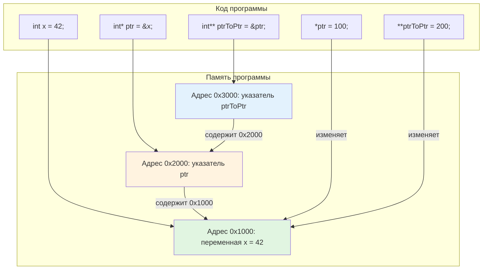
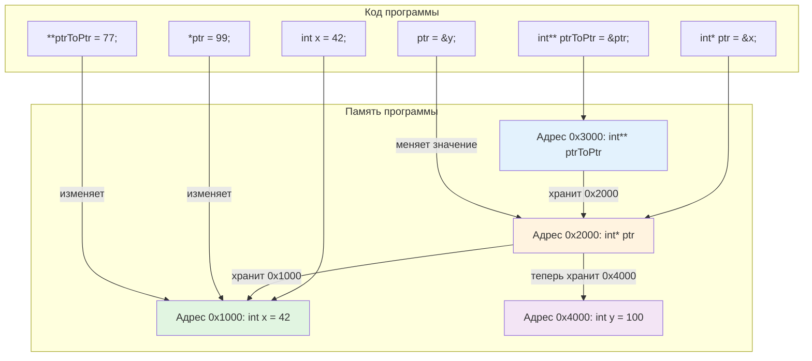

# Указатели, массивы и параметры функций в C++: полная теория 

## Введение

Указатели, массивы и параметры функций — это фундаментальные концепции C++, которые тесно связаны между собой. Понимание этих концепций критически важно для написания эффективного и безопасного кода.

## Часть 1: Указатели

### 1.1. Что такое указатель?

**Указатель** — это переменная, которая хранит адрес памяти другой переменной.

```cpp
#include <iostream>

int main() {
    int number = 42;           // Обычная переменная
    int* pointer = &number;    // Указатель, хранящий адрес number
    
    std::cout << "Значение number: " << number << std::endl;        // 42
    std::cout << "Адрес number: " << &number << std::endl;          // 0x7ff...
    std::cout << "Значение pointer: " << pointer << std::endl;      // 0x7ff... (тот же адрес)
    std::cout << "Разыменование pointer: " << *pointer << std::endl; // 42
    
    return 0;
}
```

### 1.2. Объявление и инициализация указателей

```cpp
#include <iostream>

int main() {
    // Разные способы объявления указателей
    int* ptr1;          // Указатель на int (не инициализирован - ОПАСНО!)
    int *ptr2;          // То же самое (пробел не имеет значения)
    int * ptr3;         // И так тоже работает
    
    // Всегда инициализируйте указатели!
    int value = 100;
    int* safePtr = &value;     // Инициализирован адресом value
    int* nullPtr = nullptr;    // Инициализирован нулевым указателем (C++11)
    int* zeroPtr = 0;          // Старый стиль (лучше использовать nullptr)
    
    // Константные указатели
    const int constValue = 200;
    const int* ptrToConst = &constValue;    // Указатель на константу
    // *ptrToConst = 300; // ОШИБКА: нельзя изменить константу через указатель
    
    int anotherValue = 300;
    int* const constPtr = &anotherValue;    // Константный указатель
    *constPtr = 400;                         // OK: можно изменить значение
    // constPtr = &value;                    // ОШИБКА: нельзя изменить сам указатель
    
    // Двойной const
    const int* const constPtrToConst = &constValue;
    // *constPtrToConst = 500;               // ОШИБКА
    // constPtrToConst = &anotherValue;      // ОШИБКА
    
    return 0;
}
```

### 1.3. Работа с указателями

```cpp
#include <iostream>

void pointerOperations() {
    int a = 10, b = 20;
    
    // 1. Присваивание адресов
    int* ptr = &a;
    std::cout << "ptr указывает на a: " << *ptr << std::endl;  // 10
    
    // 2. Изменение значения через указатель
    *ptr = 15;
    std::cout << "a после изменения через ptr: " << a << std::endl;  // 15
    
    // 3. Перенаправление указателя
    ptr = &b;
    std::cout << "ptr теперь указывает на b: " << *ptr << std::endl;  // 20
    
    // 4. Арифметика указателей (только для массивов!)
    int arr[5] = {1, 2, 3, 4, 5};
    int* arrPtr = arr;  // arrPtr указывает на arr[0]
    
    std::cout << "\nАрифметика указателей:" << std::endl;
    std::cout << "arrPtr: " << *arrPtr << std::endl;            // 1
    std::cout << "arrPtr + 1: " << *(arrPtr + 1) << std::endl;  // 2
    std::cout << "arrPtr + 2: " << *(arrPtr + 2) << std::endl;  // 3
    
    // 5. Инкремент/декремент указателей
    arrPtr++;  // Теперь указывает на arr[1]
    std::cout << "После arrPtr++: " << *arrPtr << std::endl;    // 2
    
    arrPtr--;  // Вернулись к arr[0]
    std::cout << "После arrPtr--: " << *arrPtr << std::endl;    // 1
    
    // 6. Сравнение указателей
    int* ptr1 = &arr[0];
    int* ptr2 = &arr[2];
    
    std::cout << "\nСравнение указателей:" << std::endl;
    std::cout << "ptr1 < ptr2: " << (ptr1 < ptr2) << std::endl;  // true
    std::cout << "ptr1 == ptr2: " << (ptr1 == ptr2) << std::endl; // false
}

int main() {
    pointerOperations();
    return 0;
}
```

### 1.4. Указатели на указатели

```cpp
#include <iostream>

void pointerToPointer() {
    int value = 42;
    int* ptr = &value;      // Указатель на int
    int** ptrToPtr = &ptr;  // Указатель на указатель на int
    
    std::cout << "value: " << value << std::endl;              // 42
    std::cout << "&value: " << &value << std::endl;            // Адрес value
    std::cout << "ptr: " << ptr << std::endl;                  // Адрес value
    std::cout << "*ptr: " << *ptr << std::endl;                // 42
    std::cout << "&ptr: " << &ptr << std::endl;                // Адрес ptr
    std::cout << "ptrToPtr: " << ptrToPtr << std::endl;        // Адрес ptr
    std::cout << "*ptrToPtr: " << *ptrToPtr << std::endl;      // Адрес value
    std::cout << "**ptrToPtr: " << **ptrToPtr << std::endl;    // 42
    
    // Изменение значения через двойной указатель
    **ptrToPtr = 100;
    std::cout << "\nПосле **ptrToPtr = 100:" << std::endl;
    std::cout << "value: " << value << std::endl;              // 100
}

// Практическое применение: динамическое выделение двумерного массива
void create2DArray() {
    int rows = 3, cols = 4;
    
    // Выделяем память для массива указателей
    int** matrix = new int*[rows];
    
    // Для каждой строки выделяем память для столбцов
    for (int i = 0; i < rows; i++) {
        matrix[i] = new int[cols];
    }
    
    // Заполняем массив
    for (int i = 0; i < rows; i++) {
        for (int j = 0; j < cols; j++) {
            matrix[i][j] = i * cols + j + 1;
        }
    }
    
    // Выводим массив
    std::cout << "\nДвумерный массив:" << std::endl;
    for (int i = 0; i < rows; i++) {
        for (int j = 0; j < cols; j++) {
            std::cout << matrix[i][j] << "\t";
        }
        std::cout << std::endl;
    }
    
    // Освобождаем память
    for (int i = 0; i < rows; i++) {
        delete[] matrix[i];
    }
    delete[] matrix;
}

int main() {
    pointerToPointer();
    create2DArray();
    return 0;
}
```

## Часть 2: Массивы

### 2.1. Статические массивы

```cpp
#include <iostream>

void staticArrays() {
    // 1. Объявление и инициализация массивов
    int arr1[5];                    // Массив из 5 int (не инициализирован)
    int arr2[5] = {1, 2, 3, 4, 5}; // Полная инициализация
    int arr3[] = {1, 2, 3};         // Компилятор сам определит размер = 3
    int arr4[5] = {1, 2};           // Первые два элемента = 1,2, остальные = 0
    
    // 2. Доступ к элементам массива
    std::cout << "arr2[0]: " << arr2[0] << std::endl;  // 1
    std::cout << "arr2[4]: " << arr2[4] << std::endl;  // 5
    
    // 3. Изменение элементов
    arr2[0] = 10;
    std::cout << "После arr2[0] = 10: " << arr2[0] << std::endl;  // 10
    
    // 4. Многомерные массивы
    int matrix[2][3] = {
        {1, 2, 3},
        {4, 5, 6}
    };
    
    std::cout << "\nДвумерный массив:" << std::endl;
    for (int i = 0; i < 2; i++) {
        for (int j = 0; j < 3; j++) {
            std::cout << matrix[i][j] << " ";
        }
        std::cout << std::endl;
    }
    
    // 5. Размер массива
    int size = sizeof(arr2) / sizeof(arr2[0]);
    std::cout << "\nРазмер arr2: " << size << " элементов" << std::endl;
}

// Массивы и указатели тесно связаны
void arraysAndPointers() {
    int arr[5] = {10, 20, 30, 40, 50};
    
    // Имя массива - это указатель на его первый элемент
    std::cout << "arr: " << arr << std::endl;            // Адрес arr[0]
    std::cout << "&arr[0]: " << &arr[0] << std::endl;    // Тот же адрес
    std::cout << "*arr: " << *arr << std::endl;          // 10
    
    // Разные способы доступа к элементам
    std::cout << "\nДоступ к элементам:" << std::endl;
    std::cout << "arr[2]: " << arr[2] << std::endl;      // 30
    std::cout << "*(arr + 2): " << *(arr + 2) << std::endl; // 30
    std::cout << "2[arr]: " << 2[arr] << std::endl;      // 30 (редко используется)
}

int main() {
    staticArrays();
    arraysAndPointers();
    return 0;
}
```

### 2.2. Динамические массивы

```cpp
#include <iostream>

void dynamicArrays() {
    // 1. Динамическое выделение памяти для одиночной переменной
    int* singleValue = new int(42);  // Выделение и инициализация
    std::cout << "*singleValue: " << *singleValue << std::endl;  // 42
    delete singleValue;  // Освобождение памяти
    
    // 2. Динамическое выделение массива
    int size = 5;
    int* dynamicArray = new int[size];  // Выделение массива из 5 int
    
    // Заполнение массива
    for (int i = 0; i < size; i++) {
        dynamicArray[i] = (i + 1) * 10;
    }
    
    // Вывод массива
    std::cout << "\nДинамический массив:" << std::endl;
    for (int i = 0; i < size; i++) {
        std::cout << "dynamicArray[" << i << "] = " << dynamicArray[i] << std::endl;
    }
    
    // 3. Изменение размера массива (имитация realloc)
    int newSize = 8;
    int* resizedArray = new int[newSize];
    
    // Копируем старые данные
    for (int i = 0; i < size; i++) {
        resizedArray[i] = dynamicArray[i];
    }
    
    // Заполняем новые элементы
    for (int i = size; i < newSize; i++) {
        resizedArray[i] = 0;
    }
    
    // Удаляем старый массив
    delete[] dynamicArray;
    
    // Используем новый массив
    dynamicArray = resizedArray;
    size = newSize;
    
    std::cout << "\nМассив после увеличения размера:" << std::endl;
    for (int i = 0; i < size; i++) {
        std::cout << dynamicArray[i] << " ";
    }
    std::cout << std::endl;
    
    // 4. Освобождение памяти
    delete[] dynamicArray;
    dynamicArray = nullptr;  // Хорошая практика: обнулить указатель после удаления
}

// Проблемы с динамическими массивами
void dynamicArrayProblems() {
    // 1. Утечка памяти (memory leak)
    int* leak = new int[100];
    // Забыли delete[] leak - ПАМЯТЬ НИКОГДА НЕ ОСВОБОДИТСЯ!
    
    // 2. Двойное освобождение (double free)
    int* ptr = new int[10];
    delete[] ptr;
    // delete[] ptr; // ОШИБКА: повторное освобождение
    
    // 3. Выход за границы массива (buffer overflow)
    int* small = new int[5];
    // small[10] = 100; // Неопределённое поведение!
    
    // 4. Использование после освобождения (use after free)
    int* dangerous = new int(42);
    delete dangerous;
    // *dangerous = 100; // ОПАСНО: память уже освобождена!
}

int main() {
    dynamicArrays();
    return 0;
}
```

### 2.3. Массивы символов (строки C-style)

```cpp
#include <iostream>
#include <cstring>  // Для C-строковых функций

void cStyleStrings() {
    // 1. Строки как массивы символов
    char str1[] = "Hello";           // Автоматически добавляет '\0'
    char str2[6] = {'H', 'e', 'l', 'l', 'o', '\0'};  // То же самое
    
    std::cout << "str1: " << str1 << std::endl;
    std::cout << "str2: " << str2 << std::endl;
    
    // 2. Размер строки
    std::cout << "sizeof(str1): " << sizeof(str1) << std::endl;  // 6 (5 символов + '\0')
    
    // 3. Длина строки (без терминатора)
    std::cout << "strlen(str1): " << strlen(str1) << std::endl;  // 5
    
    // 4. Копирование строк
    char copy[20];
    strcpy(copy, str1);  // Копировать str1 в copy
    std::cout << "copy: " << copy << std::endl;
    
    // 5. Конкатенация строк
    strcat(copy, " World!");
    std::cout << "После конкатенации: " << copy << std::endl;
    
    // 6. Сравнение строк
    char str3[] = "Hello";
    char str4[] = "World";
    
    int result = strcmp(str3, str4);
    std::cout << "\nСравнение строк:" << std::endl;
    std::cout << "strcmp(\"Hello\", \"World\"): " << result << std::endl;
    
    // 7. Поиск символа в строке
    char* found = strchr(str1, 'e');
    if (found) {
        std::cout << "Найден символ 'e' в позиции: " << (found - str1) << std::endl;
    }
    
    // 8. Динамические строки
    char* dynamicStr = new char[50];
    strcpy(dynamicStr, "Динамическая строка");
    std::cout << "\ndynamicStr: " << dynamicStr << std::endl;
    
    // Не забываем освободить память!
    delete[] dynamicStr;
}

int main() {
    cStyleStrings();
    return 0;
}
```

## Часть 3: Параметры функций

### 3.1. Передача параметров по значению

```cpp
#include <iostream>

// Передача по значению (копирование)
void byValue(int x) {
    x = 100;  // Изменяется только локальная копия
    std::cout << "Внутри byValue: x = " << x << std::endl;
}

void demonstrateByValue() {
    int original = 42;
    std::cout << "До вызова: original = " << original << std::endl;  // 42
    
    byValue(original);
    
    std::cout << "После вызова: original = " << original << std::endl;  // 42 (не изменился)
}

// Возврат значения из функции
int square(int x) {
    return x * x;  // Возвращает копию результата
}

// Плюсы и минусы передачи по значению
void valueParametersProsCons() {
    // ПЛЮСЫ:
    // 1. Безопасность: оригинальные данные защищены
    // 2. Простота: не нужно думать о времени жизни объектов
    
    // МИНУСЫ:
    // 1. Накладные расходы на копирование (для больших объектов)
    // 2. Нельзя изменить оригинальные данные
}

int main() {
    demonstrateByValue();
    
    int result = square(5);
    std::cout << "square(5) = " << result << std::endl;
    
    return 0;
}
```

### 3.2. Передача параметров по указателю

```cpp
#include <iostream>

// Передача по указателю
void byPointer(int* ptr) {
    if (ptr) {  // Всегда проверяйте указатель на nullptr!
        *ptr = 100;  // Изменяем значение по адресу
        std::cout << "Внутри byPointer: *ptr = " << *ptr << std::endl;
    }
}

// Функция с несколькими выходными параметрами
void calculate(int a, int b, int* sum, int* product) {
    if (sum) *sum = a + b;
    if (product) *product = a * b;
}

// Работа с массивами через указатели
void processArray(int* arr, int size) {
    for (int i = 0; i < size; i++) {
        arr[i] *= 2;  // Изменяем оригинальный массив
    }
}

// Опасности передачи по указателю
void pointerParameterDangers() {
    // 1. Непроверенный nullptr
    void unsafe(int* ptr) {
        *ptr = 42;  // ОПАСНО: если ptr == nullptr
    }
    
    // 2. Указатель на локальную переменную
    int* dangerous() {
        int local = 42;
        return &local;  // ОПАСНО: local уничтожится после выхода из функции
    }
}

int main() {
    int value = 42;
    std::cout << "До вызова: value = " << value << std::endl;  // 42
    
    byPointer(&value);
    
    std::cout << "После вызова: value = " << value << std::endl;  // 100
    
    // Использование функции с несколькими выходными параметрами
    int x = 10, y = 20;
    int sum, product;
    
    calculate(x, y, &sum, &product);
    
    std::cout << "\ncalculate(10, 20):" << std::endl;
    std::cout << "Сумма: " << sum << std::endl;      // 30
    std::cout << "Произведение: " << product << std::endl;  // 200
    
    // Работа с массивом
    int arr[] = {1, 2, 3, 4, 5};
    int size = sizeof(arr) / sizeof(arr[0]);
    
    std::cout << "\nМассив до обработки: ";
    for (int i = 0; i < size; i++) {
        std::cout << arr[i] << " ";
    }
    std::cout << std::endl;
    
    processArray(arr, size);
    
    std::cout << "Массив после обработки: ";
    for (int i = 0; i < size; i++) {
        std::cout << arr[i] << " ";
    }
    std::cout << std::endl;
    
    return 0;
}
```

### 3.3. Передача параметров по ссылке

```cpp
#include <iostream>

// Передача по ссылке
void byReference(int& ref) {
    ref = 100;  // Изменяем оригинальную переменную
    std::cout << "Внутри byReference: ref = " << ref << std::endl;
}

// Константная ссылка (только для чтения)
void printValue(const int& ref) {
    // ref = 200;  // ОШИБКА: нельзя изменить константную ссылку
    std::cout << "Значение: " << ref << std::endl;
}

// Возврат ссылки (осторожно!)
int& dangerousReturn() {
    int local = 42;
    return local;  // ОПАСНО: возврат ссылки на локальную переменную
}

// Правильное использование возврата ссылки
int globalValue = 100;

int& getGlobalValue() {
    return globalValue;  // OK: глобальная переменная живёт всегда
}

// Ссылки на массивы
void processArrayByRef(int (&arr)[5]) {  // Ссылка на массив фиксированного размера
    for (int i = 0; i < 5; i++) {
        arr[i] *= 2;
    }
}

// Сравнение указателей и ссылок
void comparePointersAndReferences() {
    int value = 42;
    
    // Указатель
    int* ptr = &value;
    *ptr = 100;  // Изменение через указатель
    
    // Ссылка
    int& ref = value;
    ref = 200;  // Изменение через ссылку
    
    // Различия:
    // 1. Ссылка должна быть инициализирована при объявлении
    // 2. Ссылку нельзя перенаправить на другой объект
    // 3. Синтаксис проще (не нужно разыменовывать)
    // 4. Ссылка не может быть nullptr
}

int main() {
    int value = 42;
    std::cout << "До вызова: value = " << value << std::endl;  // 42
    
    byReference(value);
    
    std::cout << "После вызова: value = " << value << std::endl;  // 100
    
    // Использование константной ссылки
    printValue(value);
    
    // Работа с массивом по ссылке
    int arr[] = {1, 2, 3, 4, 5};
    
    std::cout << "\nМассив до обработки: ";
    for (int i = 0; i < 5; i++) {
        std::cout << arr[i] << " ";
    }
    std::cout << std::endl;
    
    processArrayByRef(arr);
    
    std::cout << "Массив после обработки: ";
    for (int i = 0; i < 5; i++) {
        std::cout << arr[i] << " ";
    }
    std::cout << std::endl;
    
    // Работа с возвращаемой ссылкой
    int& ref = getGlobalValue();
    ref = 500;
    
    std::cout << "\nglobalValue после изменения: " << globalValue << std::endl;  // 500
    
    return 0;
}
```

### 3.4. Массивы как параметры функций

```cpp
#include <iostream>

// 1. Массив как указатель (самый распространённый способ)
void processArray1(int* arr, int size) {
    for (int i = 0; i < size; i++) {
        arr[i] *= 2;
    }
}

// 2. Массив как массив с указанием размера
void processArray2(int arr[], int size) {
    for (int i = 0; i < size; i++) {
        arr[i] += 10;
    }
}

// 3. Массив фиксированного размера (редко используется)
void processArray3(int arr[5]) {
    for (int i = 0; i < 5; i++) {
        arr[i] -= 5;
    }
}

// 4. Ссылка на массив фиксированного размера
void processArray4(int (&arr)[5]) {
    for (int i = 0; i < 5; i++) {
        arr[i] *= 3;
    }
}

// 5. Двумерный массив как параметр
void process2DArray(int matrix[][3], int rows) {
    for (int i = 0; i < rows; i++) {
        for (int j = 0; j < 3; j++) {
            matrix[i][j] += i + j;
        }
    }
}

// 6. Динамический массив как параметр
void processDynamicArray(int* arr, int rows, int cols) {
    for (int i = 0; i < rows; i++) {
        for (int j = 0; j < cols; j++) {
            // Доступ: arr[i * cols + j]
            arr[i * cols + j] = i * cols + j;
        }
    }
}

// 7. Шаблонная функция для массивов любого размера (C++11)
template<typename T, size_t N>
void processTemplateArray(T (&arr)[N]) {
    for (size_t i = 0; i < N; i++) {
        arr[i] *= 2;
    }
}

int main() {
    // Тестирование разных способов передачи массива
    
    // 1. Одномерный массив
    int arr1[] = {1, 2, 3, 4, 5};
    int size1 = sizeof(arr1) / sizeof(arr1[0]);
    
    std::cout << "Исходный массив: ";
    for (int i = 0; i < size1; i++) {
        std::cout << arr1[i] << " ";
    }
    std::cout << std::endl;
    
    processArray1(arr1, size1);
    
    std::cout << "После processArray1: ";
    for (int i = 0; i < size1; i++) {
        std::cout << arr1[i] << " ";
    }
    std::cout << std::endl;
    
    // 2. Массив фиксированного размера
    int arr2[5] = {10, 20, 30, 40, 50};
    
    processArray4(arr2);
    
    std::cout << "После processArray4: ";
    for (int i = 0; i < 5; i++) {
        std::cout << arr2[i] << " ";
    }
    std::cout << std::endl;
    
    // 3. Двумерный массив
    int matrix[2][3] = {
        {1, 2, 3},
        {4, 5, 6}
    };
    
    process2DArray(matrix, 2);
    
    std::cout << "\nДвумерный массив после обработки:" << std::endl;
    for (int i = 0; i < 2; i++) {
        for (int j = 0; j < 3; j++) {
            std::cout << matrix[i][j] << " ";
        }
        std::cout << std::endl;
    }
    
    // 4. Шаблонная функция
    double arr3[] = {1.1, 2.2, 3.3, 4.4};
    
    processTemplateArray(arr3);
    
    std::cout << "\nШаблонный массив после обработки: ";
    for (double val : arr3) {
        std::cout << val << " ";
    }
    std::cout << std::endl;
    
    return 0;
}
```

### 3.5. Умные указатели как параметры

```cpp
#include <iostream>
#include <memory>  // Для умных указателей

// 1. unique_ptr как параметр (только для чтения)
void processUniquePtr(const std::unique_ptr<int>& ptr) {
    if (ptr) {
        std::cout << "Значение: " << *ptr << std::endl;
    }
}

// 2. Передача владения unique_ptr
void takeOwnership(std::unique_ptr<int> ptr) {
    // Теперь эта функция владеет указателем
    std::cout << "Владение получено, значение: " << *ptr << std::endl;
    // Память автоматически освободится при выходе из функции
}

// 3. shared_ptr как параметр
void processSharedPtr(const std::shared_ptr<int>& ptr) {
    if (ptr) {
        std::cout << "Значение: " << *ptr << std::endl;
        std::cout << "Количество ссылок: " << ptr.use_count() << std::endl;
    }
}

// 4. weak_ptr как параметр
void processWeakPtr(const std::weak_ptr<int>& weak) {
    // Преобразуем weak_ptr в shared_ptr для доступа
    if (auto shared = weak.lock()) {
        std::cout << "Значение через weak_ptr: " << *shared << std::endl;
    } else {
        std::cout << "Объект уже удалён" << std::endl;
    }
}

// 5. Возврат умного указателя из функции
std::unique_ptr<int> createUniquePtr(int value) {
    return std::make_unique<int>(value);
}

std::shared_ptr<int> createSharedPtr(int value) {
    return std::make_shared<int>(value);
}

int main() {
    // 1. Работа с unique_ptr
    auto unique = std::make_unique<int>(42);
    processUniquePtr(unique);  // Передаём без передачи владения
    
    // takeOwnership(std::move(unique));  // Передача владения
    
    // 2. Работа с shared_ptr
    auto shared = std::make_shared<int>(100);
    processSharedPtr(shared);
    
    // 3. Работа с weak_ptr
    std::weak_ptr<int> weak = shared;
    processWeakPtr(weak);
    
    // 4. Создание умных указателей в функциях
    auto newUnique = createUniquePtr(500);
    auto newShared = createSharedPtr(600);
    
    std::cout << "\nСоздано unique_ptr: " << *newUnique << std::endl;
    std::cout << "Создано shared_ptr: " << *newShared << std::endl;
    
    return 0;
}
```

## Часть 4: Комплексные примеры

### 4.1. Пример 1: Калькулятор с использованием указателей

```cpp
#include <iostream>
#include <cmath>

// Структура для комплексных чисел
struct Complex {
    double real;
    double imag;
};

// Функции для работы с комплексными числами через указатели

// Сложение
Complex* addComplex(const Complex* a, const Complex* b) {
    Complex* result = new Complex;
    result->real = a->real + b->real;
    result->imag = a->imag + b->imag;
    return result;
}

// Умножение
Complex* multiplyComplex(const Complex* a, const Complex* b) {
    Complex* result = new Complex;
    result->real = a->real * b->real - a->imag * b->imag;
    result->imag = a->real * b->imag + a->imag * b->real;
    return result;
}

// Модуль
double magnitude(const Complex* c) {
    return sqrt(c->real * c->real + c->imag * c->imag);
}

// Вывод комплексного числа
void printComplex(const Complex* c) {
    std::cout << c->real;
    if (c->imag >= 0) {
        std::cout << " + " << c->imag << "i";
    } else {
        std::cout << " - " << -c->imag << "i";
    }
}

int main() {
    // Создание комплексных чисел
    Complex c1 = {3.0, 4.0};  // 3 + 4i
    Complex c2 = {1.0, -2.0}; // 1 - 2i
    
    std::cout << "c1 = ";
    printComplex(&c1);
    std::cout << ", модуль = " << magnitude(&c1) << std::endl;
    
    std::cout << "c2 = ";
    printComplex(&c2);
    std::cout << ", модуль = " << magnitude(&c2) << std::endl;
    
    // Сложение
    Complex* sum = addComplex(&c1, &c2);
    std::cout << "\nc1 + c2 = ";
    printComplex(sum);
    std::cout << std::endl;
    
    // Умножение
    Complex* product = multiplyComplex(&c1, &c2);
    std::cout << "c1 * c2 = ";
    printComplex(product);
    std::cout << std::endl;
    
    // Освобождение памяти
    delete sum;
    delete product;
    
    return 0;
}
```

### 4.2. Пример 2: Динамическая матрица с функциями

```cpp
#include <iostream>
#include <iomanip>

// Создание динамической матрицы
int** createMatrix(int rows, int cols) {
    int** matrix = new int*[rows];
    for (int i = 0; i < rows; i++) {
        matrix[i] = new int[cols];
    }
    return matrix;
}

// Инициализация матрицы
void initMatrix(int** matrix, int rows, int cols) {
    for (int i = 0; i < rows; i++) {
        for (int j = 0; j < cols; j++) {
            matrix[i][j] = i * cols + j + 1;
        }
    }
}

// Вывод матрицы
void printMatrix(int** matrix, int rows, int cols) {
    for (int i = 0; i < rows; i++) {
        for (int j = 0; j < cols; j++) {
            std::cout << std::setw(4) << matrix[i][j] << " ";
        }
        std::cout << std::endl;
    }
}

// Транспонирование матрицы
int** transposeMatrix(int** matrix, int rows, int cols) {
    int** transposed = createMatrix(cols, rows);
    
    for (int i = 0; i < rows; i++) {
        for (int j = 0; j < cols; j++) {
            transposed[j][i] = matrix[i][j];
        }
    }
    
    return transposed;
}

// Умножение матриц
int** multiplyMatrices(int** a, int aRows, int aCols, 
                      int** b, int bRows, int bCols) {
    if (aCols != bRows) {
        return nullptr;
    }
    
    int** result = createMatrix(aRows, bCols);
    
    for (int i = 0; i < aRows; i++) {
        for (int j = 0; j < bCols; j++) {
            result[i][j] = 0;
            for (int k = 0; k < aCols; k++) {
                result[i][j] += a[i][k] * b[k][j];
            }
        }
    }
    
    return result;
}

// Освобождение памяти матрицы
void deleteMatrix(int** matrix, int rows) {
    for (int i = 0; i < rows; i++) {
        delete[] matrix[i];
    }
    delete[] matrix;
}

int main() {
    const int rows1 = 2, cols1 = 3;
    const int rows2 = 3, cols2 = 2;
    
    // Создание и инициализация первой матрицы
    int** matrix1 = createMatrix(rows1, cols1);
    initMatrix(matrix1, rows1, cols1);
    
    std::cout << "Матрица 1 (" << rows1 << "x" << cols1 << "):" << std::endl;
    printMatrix(matrix1, rows1, cols1);
    
    // Создание и инициализация второй матрицы
    int** matrix2 = createMatrix(rows2, cols2);
    initMatrix(matrix2, rows2, cols2);
    
    std::cout << "\nМатрица 2 (" << rows2 << "x" << cols2 << "):" << std::endl;
    printMatrix(matrix2, rows2, cols2);
    
    // Транспонирование первой матрицы
    int** transposed = transposeMatrix(matrix1, rows1, cols1);
    
    std::cout << "\nТранспонированная матрица 1 (" << cols1 << "x" << rows1 << "):" << std::endl;
    printMatrix(transposed, cols1, rows1);
    
    // Умножение матриц
    int** product = multiplyMatrices(matrix1, rows1, cols1, 
                                    matrix2, rows2, cols2);
    
    if (product) {
        std::cout << "\nРезультат умножения (" << rows1 << "x" << cols2 << "):" << std::endl;
        printMatrix(product, rows1, cols2);
    } else {
        std::cout << "\nУмножение невозможно: несовместимые размеры" << std::endl;
    }
    
    // Освобождение памяти
    deleteMatrix(matrix1, rows1);
    deleteMatrix(matrix2, rows2);
    deleteMatrix(transposed, cols1);
    if (product) deleteMatrix(product, rows1);
    
    return 0;
}
```

### 4.3. Пример 3: Система управления студентами

```cpp
#include <iostream>
#include <cstring>
#include <algorithm>

struct Student {
    char name[50];
    int id;
    double gpa;
};

// Сортировка студентов по имени
void sortStudentsByName(Student* students, int count) {
    std::sort(students, students + count, 
        [](const Student& a, const Student& b) {
            return strcmp(a.name, b.name) < 0;
        });
}

// Сортировка студентов по GPA
void sortStudentsByGPA(Student* students, int count) {
    std::sort(students, students + count,
        [](const Student& a, const Student& b) {
            return a.gpa > b.gpa;  // По убыванию
        });
}

// Поиск студента по ID
Student* findStudentById(Student* students, int count, int id) {
    for (int i = 0; i < count; i++) {
        if (students[i].id == id) {
            return &students[i];
        }
    }
    return nullptr;
}

// Вычисление среднего GPA
double calculateAverageGPA(Student* students, int count) {
    if (count == 0) return 0.0;
    
    double total = 0.0;
    for (int i = 0; i < count; i++) {
        total += students[i].gpa;
    }
    return total / count;
}

// Вывод списка студентов
void printStudents(Student* students, int count) {
    std::cout << "\nСписок студентов:" << std::endl;
    std::cout << "----------------------------------------" << std::endl;
    for (int i = 0; i < count; i++) {
        std::cout << "ID: " << students[i].id 
                  << ", Имя: " << students[i].name 
                  << ", GPA: " << students[i].gpa << std::endl;
    }
}

int main() {
    const int MAX_STUDENTS = 5;
    Student students[MAX_STUDENTS];
    int studentCount = 0;
    
    // Добавление студентов
    strcpy(students[0].name, "Иван Петров");
    students[0].id = 1001;
    students[0].gpa = 3.8;
    studentCount++;
    
    strcpy(students[1].name, "Анна Сидорова");
    students[1].id = 1002;
    students[1].gpa = 4.0;
    studentCount++;
    
    strcpy(students[2].name, "Борис Иванов");
    students[2].id = 1003;
    students[2].gpa = 3.5;
    studentCount++;
    
    strcpy(students[3].name, "Мария Кузнецова");
    students[3].id = 1004;
    students[3].gpa = 3.9;
    studentCount++;
    
    // Вывод исходного списка
    printStudents(students, studentCount);
    
    // Сортировка по имени
    sortStudentsByName(students, studentCount);
    std::cout << "\nПосле сортировки по имени:" << std::endl;
    printStudents(students, studentCount);
    
    // Сортировка по GPA
    sortStudentsByGPA(students, studentCount);
    std::cout << "\nПосле сортировки по GPA:" << std::endl;
    printStudents(students, studentCount);
    
    // Поиск студента
    int searchId = 1003;
    Student* found = findStudentById(students, studentCount, searchId);
    
    if (found) {
        std::cout << "\nНайден студент: " << found->name 
                  << ", GPA: " << found->gpa << std::endl;
    } else {
        std::cout << "\nСтудент с ID " << searchId << " не найден" << std::endl;
    }
    
    // Средний GPA
    double avgGPA = calculateAverageGPA(students, studentCount);
    std::cout << "\nСредний GPA: " << avgGPA << std::endl;
    
    return 0;
}
```

## Часть 5: Лучшие практики и антипаттерны

### 5.1. Лучшие практики работы с указателями

```cpp
#include <iostream>
#include <memory>

void bestPractices() {
    // 1. Всегда инициализируйте указатели
    int* goodPtr1 = nullptr;      // ХОРОШО
    int value = 42;
    int* goodPtr2 = &value;       // ХОРОШО
    
    // int* badPtr;                // ПЛОХО: не инициализирован
    
    // 2. Проверяйте указатели перед использованием
    void process(int* ptr) {
        if (ptr != nullptr) {     // ХОРОШО
            *ptr = 100;
        }
    }
    
    // 3. Используйте умные указатели
    auto smartPtr = std::make_unique<int>(42);  // ХОРОШО
    // Память освободится автоматически
    
    // 4. Освобождайте память и обнуляйте указатели
    int* dynamic = new int(100);
    delete dynamic;               // Освободили память
    dynamic = nullptr;            // Обнулили указатель (ХОРОШО)
    
    // 5. Используйте const с указателями когда возможно
    const int* ptrToConst = &value;      // ХОРОШО: защита от изменений
    int* const constPtr = &value;        // ХОРОШО: указатель нельзя изменить
    
    // 6. Избегайте сырых указателей, когда можно использовать ссылки
    void byReference(int& ref) {         // ХОРОШО для модификации параметров
        ref = 100;
    }
    
    void byConstReference(const int& ref) {  // ХОРОШО для чтения
        // Можно читать, но не изменять
    }
}

// Антипаттерны
void antiPatterns() {
    // 1. Возврат указателя на локальную переменную
    int* dangerous1() {
        int local = 42;
        return &local;  // ОПАСНО: local уничтожится!
    }
    
    // 2. Использование после освобождения
    int* ptr = new int(100);
    delete ptr;
    // *ptr = 200;  // НЕ ОПРЕДЕЛЁННОЕ ПОВЕДЕНИЕ!
    
    // 3. Утечка памяти
    void leak() {
        int* ptr = new int[1000];
        // Забыли delete[] ptr - УТЕЧКА!
    }
    
    // 4. Неправильное освобождение памяти
    int* single = new int(42);
    // delete[] single;  // ОШИБКА: нужно delete, а не delete[]
    
    int* array = new int[10];
    // delete array;     // ОШИБКА: нужно delete[], а не delete
    
    // 5. Выход за границы массива
    int arr[5] = {1, 2, 3, 4, 5};
    // arr[10] = 100;   // ОПАСНО: выход за границы
}
```

### 5.2. Правила передачи параметров

```cpp
#include <iostream>
#include <string>
#include <vector>

class LargeObject {
    std::vector<int> data;
public:
    LargeObject() : data(1000000, 0) {}  // Большой объект
};

// Правила выбора способа передачи параметров:
void parameterPassingRules() {
    // 1. Для ВХОДНЫХ параметров (только чтение):
    //    - Простые типы (int, double, char): по значению
    //    - Сложные типы: по константной ссылке
    
    void processInput(int x, const LargeObject& obj) {  // ХОРОШО
        // x передаётся по значению (копируется)
        // obj передаётся по константной ссылке (без копирования)
    }
    
    // 2. Для ВЫХОДНЫХ параметров (только запись):
    //    - По ссылке (без const)
    //    - По указателю (если параметр может быть nullptr)
    
    void getResults(int& outValue, std::string& outString) {  // ХОРОШО
        outValue = 42;
        outString = "Результат";
    }
    
    // 3. Для ВХОДНО-ВЫХОДНЫХ параметров (чтение и запись):
    //    - По ссылке (без const)
    //    - По указателю (если параметр может быть nullptr)
    
    void modifyInPlace(int& value) {  // ХОРОШО
        value *= 2;
    }
    
    // 4. Для ВОЗВРАЩАЕМЫХ значений:
    //    - По значению (обычно)
    //    - По ссылке/указателю (если возвращается существующий объект)
    
    std::string createString() {  // ХОРОШО
        return "Новая строка";    // Возврат по значению
    }
    
    const std::string& getExistingString() {  // ХОРОШО
        static std::string str = "Существующая";
        return str;  // Возврат константной ссылки
    }
}

// Пример правильного использования
class DataProcessor {
private:
    std::vector<int> data;
    
public:
    // Конструктор: параметры по константной ссылке
    DataProcessor(const std::vector<int>& inputData) 
        : data(inputData) {  // Копирование происходит здесь
    }
    
    // Метод для обработки: входные параметры по константной ссылке
    void process(const std::vector<int>& additionalData) {
        // Только чтение additionalData
    }
    
    // Метод для получения результата: выходной параметр по ссылке
    void getResult(std::vector<int>& result) const {
        result = data;  // Копируем данные в result
    }
    
    // Метод для модификации: входно-выходной параметр по ссылке
    void updateData(std::vector<int>& newData) {
        data.swap(newData);  // Обмен содержимым
    }
    
    // Метод, возвращающий значение
    int calculateSum() const {
        int sum = 0;
        for (int val : data) {
            sum += val;
        }
        return sum;  // Возврат по значению
    }
    
    // Метод, возвращающий константную ссылку
    const std::vector<int>& getData() const {
        return data;  // Возврат константной ссылки
    }
};
```

## Часть 6: Диаграммы и визуализация

### Диаграмма работы с указателями



### Диаграмма передачи параметров

```mermaid
graph TD
    subgraph "Передача по значению"
        A1["int a = 10;"]
        A2["void func(int x)"]
        A3["func(a);"]
        A4["Создаётся копия x = 10"]
        A5["Изменения в x не влияют на a"]
        
        A1 --> A3
        A3 --> A4
        A4 --> A2
    end
    
    subgraph "Передача по указателю"
        B1["int b = 20;"]
        B2["void func(int* ptr)"]
        B3["func(&b);"]
        B4["ptr содержит адрес b"]
        B5["*ptr = 30 изменяет b"]
        
        B1 --> B3
        B3 --> B4
        B4 --> B2
        B5 --> B1
    end
    
    subgraph "Передача по ссылке"
        C1["int c = 40;"]
        C2["void func(int& ref)"]
        C3["func(c);"]
        C4["ref - псевдоним для c"]
        C5["ref = 50 изменяет c"]
        
        C1 --> C3
        C3 --> C4
        C4 --> C2
        C5 --> C1
    end
    
    style A1 fill:#e1f5e1
    style B1 fill:#fff3e0
    style C1 fill:#e3f2fd
```



## Заключение

### Ключевые выводы:

1. **Указатели** — мощный инструмент, требующий осторожного обращения
2. **Массивы и указатели** тесно связаны: имя массива — указатель на первый элемент
3. **Передача параметров**:
   - По значению: безопасно, но может быть неэффективно для больших объектов
   - По указателю: гибко, но требует проверки на `nullptr`
   - По ссылке: удобный синтаксис, всегда указывает на существующий объект
4. **Константность** — ваш лучший друг для написания безопасного кода
5. **Умные указатели** — современная замена сырым указателям для управления памятью
6. **Всегда инициализируйте указатели** и проверяйте их перед использованием

### Правила безопасности:

1. Никогда не используйте неинициализированные указатели
2. Всегда проверяйте указатели на `nullptr` перед разыменованием
3. Используйте `delete` для одиночных объектов и `delete[]` для массивов
4. Обнуляйте указатели после освобождения памяти
5. Предпочитайте ссылки указателям, когда возможно
6. Используйте умные указатели вместо сырых для управления памятью

Понимание этих концепций — фундамент для написания эффективного, безопасного и поддерживаемого кода на C++.

# Указатели в C++: полная теория 

## Введение

Указатели — одна из самых мощных и одновременно сложных концепций в C++. Они дают программисту прямой доступ к памяти, что позволяет писать эффективный код, но также требует большой осторожности.

## Глава 1: Основы указателей

### 1.1. Что такое указатель?

**Указатель** — это переменная, которая хранит адрес памяти другой переменной. Вместо хранения значения, указатель хранит "адрес", по которому это значение находится.

```cpp
#include <iostream>

int main() {
    // Обычная переменная
    int number = 42;
    
    // Указатель на int
    // & - оператор взятия адреса
    int* pointer = &number;
    
    // Вывод значений
    std::cout << "Значение number: " << number << std::endl;        // 42
    std::cout << "Адрес number: " << &number << std::endl;          // 0x7ff... (адрес в памяти)
    std::cout << "Значение pointer: " << pointer << std::endl;      // тот же адрес
    std::cout << "Разыменование pointer: " << *pointer << std::endl; // 42
    
    return 0;
}
```

### 1.2. Анатомия указателя

```cpp
int value = 100;        // Переменная типа int
int* ptr = &value;     // Указатель на int

// ptr состоит из:
// 1. Тип: int* (указатель на int)
// 2. Имя: ptr
// 3. Значение: адрес переменной value
// 4. Собственный адрес: &ptr

std::cout << "value: " << value << std::endl;       // 100
std::cout << "&value: " << &value << std::endl;     // Адрес value
std::cout << "ptr: " << ptr << std::endl;           // Адрес value
std::cout << "*ptr: " << *ptr << std::endl;         // 100 (значение по адресу)
std::cout << "&ptr: " << &ptr << std::endl;         // Адрес самого указателя ptr
```

### 1.3. Объявление и инициализация указателей

```cpp
#include <iostream>

int main() {
    // Правильные способы объявления указателей
    
    // 1. Объявление с инициализацией nullptr (C++11)
    int* ptr1 = nullptr;  // Рекомендуемый способ
    
    // 2. Объявление с инициализацией адресом существующей переменной
    int value = 42;
    int* ptr2 = &value;
    
    // 3. Объявление без инициализации (не рекомендуется!)
    int* ptr3;  // ОПАСНО: содержит случайный адрес (мусор)
    
    // 4. Старый стиль инициализации нулём
    int* ptr4 = 0;      // Работает, но лучше nullptr
    int* ptr5 = NULL;   // Макрос из C (лучше использовать nullptr)
    
    // 5. Разные стили расстановки *
    int *ptr6;          // * рядом с именем
    int* ptr7;          // * рядом с типом (более читаемо)
    int * ptr8;         // * посередине
    
    // Все три объявления идентичны!
    // Стиль int* ptr считается более читаемым
    
    // 6. Объявление нескольких указателей
    int* ptr9, ptr10;   // ВНИМАНИЕ: ptr9 - указатель, ptr10 - int!
    int *ptr11, *ptr12; // Оба - указатели
    
    // Правильнее объявлять каждый указатель отдельно
    int* ptr13;
    int* ptr14;
    
    return 0;
}
```

## Глава 2: Операции с указателями

### 2.1. Основные операции

```cpp
#include <iostream>

void basicPointerOperations() {
    int a = 10, b = 20;
    int* ptr = &a;  // ptr указывает на a
    
    // 1. Разыменование (dereferencing)
    std::cout << "1. Разыменование:" << std::endl;
    std::cout << "   *ptr = " << *ptr << std::endl;  // 10
    
    // 2. Изменение значения через указатель
    *ptr = 15;
    std::cout << "2. После *ptr = 15:" << std::endl;
    std::cout << "   a = " << a << std::endl;        // 15
    std::cout << "   *ptr = " << *ptr << std::endl;  // 15
    
    // 3. Перенаправление указателя
    ptr = &b;
    std::cout << "3. После ptr = &b:" << std::endl;
    std::cout << "   *ptr = " << *ptr << std::endl;  // 20
    
    // 4. Сравнение указателей
    int* ptr1 = &a;
    int* ptr2 = &b;
    int* ptr3 = &a;
    
    std::cout << "4. Сравнение указателей:" << std::endl;
    std::cout << "   ptr1 == ptr2: " << (ptr1 == ptr2) << std::endl;  // false (0)
    std::cout << "   ptr1 == ptr3: " << (ptr1 == ptr3) << std::endl;  // true (1)
    std::cout << "   ptr1 != nullptr: " << (ptr1 != nullptr) << std::endl;  // true
    
    // 5. Присваивание nullptr
    ptr = nullptr;
    std::cout << "5. После ptr = nullptr:" << std::endl;
    std::cout << "   ptr == nullptr: " << (ptr == nullptr) << std::endl;  // true
    
    // 6. Проверка на nullptr перед разыменованием
    if (ptr != nullptr) {
        std::cout << *ptr << std::endl;  // Эта строка не выполнится
    } else {
        std::cout << "   ptr равен nullptr, разыменовывать нельзя!" << std::endl;
    }
}
```

### 2.2. Арифметика указателей

```cpp
#include <iostream>

void pointerArithmetic() {
    int arr[5] = {10, 20, 30, 40, 50};
    int* ptr = arr;  // ptr указывает на arr[0]
    
    std::cout << "Массив: ";
    for (int i = 0; i < 5; i++) {
        std::cout << arr[i] << " ";
    }
    std::cout << std::endl;
    
    std::cout << "\nАрифметика указателей:" << std::endl;
    
    // 1. Инкремент указателя
    std::cout << "1. Инкремент:" << std::endl;
    std::cout << "   ptr = " << ptr << ", *ptr = " << *ptr << std::endl;  // arr[0]
    
    ptr++;  // Перемещаемся к следующему элементу
    std::cout << "   После ptr++: " << std::endl;
    std::cout << "   ptr = " << ptr << ", *ptr = " << *ptr << std::endl;  // arr[1]
    
    // 2. Декремент указателя
    ptr--;  // Возвращаемся к предыдущему элементу
    std::cout << "\n2. Декремент:" << std::endl;
    std::cout << "   После ptr--: *ptr = " << *ptr << std::endl;  // arr[0]
    
    // 3. Сложение с целым числом
    std::cout << "\n3. Сложение:" << std::endl;
    std::cout << "   *(ptr + 2) = " << *(ptr + 2) << std::endl;  // arr[2] = 30
    std::cout << "   *(ptr + 4) = " << *(ptr + 4) << std::endl;  // arr[4] = 50
    
    // 4. Вычитание целого числа
    std::cout << "\n4. Вычитание:" << std::endl;
    ptr = &arr[4];  // Указываем на последний элемент
    std::cout << "   ptr указывает на arr[4]: *ptr = " << *ptr << std::endl;
    std::cout << "   *(ptr - 2) = " << *(ptr - 2) << std::endl;  // arr[2] = 30
    
    // 5. Разность указателей (расстояние между ними)
    std::cout << "\n5. Разность указателей:" << std::endl;
    int* ptr1 = &arr[0];
    int* ptr2 = &arr[3];
    
    std::ptrdiff_t diff = ptr2 - ptr1;  // ptrdiff_t - специальный тип для разности указателей
    std::cout << "   ptr2 - ptr1 = " << diff << std::endl;  // 3 элемента
    
    // 6. Индексная нотация с указателями
    std::cout << "\n6. Индексная нотация:" << std::endl;
    std::cout << "   ptr[0] = " << ptr[0] << std::endl;    // arr[4] = 50
    std::cout << "   ptr[-2] = " << ptr[-2] << std::endl;  // arr[2] = 30
    std::cout << "   ptr[-4] = " << ptr[-4] << std::endl;  // arr[0] = 10
    
    // Важно: арифметика указателей работает ТОЛЬКО в пределах одного массива!
    // Указатели на разные объекты нельзя сравнивать или вычитать!
}
```

### 2.3. Указатели и константность

```cpp
#include <iostream>

void pointersAndConst() {
    int value = 42;
    const int constValue = 100;
    
    // 1. Указатель на константу (pointer to const)
    // Нельзя изменить значение через указатель
    const int* ptrToConst = &value;  // OK: указатель на константу может указывать на не-константу
    
    std::cout << "1. Указатель на константу:" << std::endl;
    std::cout << "   *ptrToConst = " << *ptrToConst << std::endl;  // 42
    
    // *ptrToConst = 50;  // ОШИБКА: нельзя изменить значение через указатель на константу
    
    // Но можно изменить сам указатель
    ptrToConst = &constValue;  // OK
    std::cout << "   После ptrToConst = &constValue: " << *ptrToConst << std::endl;  // 100
    
    // 2. Константный указатель (constant pointer)
    // Нельзя изменить адрес, но можно изменить значение
    int* const constPtr = &value;  // Должен быть инициализирован при объявлении
    
    std::cout << "\n2. Константный указатель:" << std::endl;
    std::cout << "   *constPtr = " << *constPtr << std::endl;  // 42
    
    *constPtr = 60;  // OK: можно изменить значение
    std::cout << "   После *constPtr = 60: value = " << value << std::endl;  // 60
    
    // constPtr = &constValue;  // ОШИБКА: нельзя изменить сам указатель
    
    // 3. Константный указатель на константу (constant pointer to constant)
    // Нельзя изменить ни адрес, ни значение
    const int* const constPtrToConst = &constValue;
    
    std::cout << "\n3. Константный указатель на константу:" << std::endl;
    std::cout << "   *constPtrToConst = " << *constPtrToConst << std::endl;  // 100
    
    // *constPtrToConst = 200;  // ОШИБКА
    // constPtrToConst = &value; // ОШИБКА
    
    // 4. Правило чтения справа налево
    const int* p1;        // p1 is a pointer to const int
    int const* p2;        // p2 is a pointer to const int (то же самое)
    int* const p3 = &value; // p3 is a const pointer to int
    const int* const p4 = &constValue; // p4 is a const pointer to const int
    
    // Простой способ: читать справа налево
    // const int* p1: p1 is a pointer to int const
    // int* const p3: p3 is a const pointer to int
}
```

## Глава 3: Указатели и массивы

### 3.1. Связь указателей и массивов

```cpp
#include <iostream>

void pointersAndArrays() {
    int arr[5] = {10, 20, 30, 40, 50};
    
    // Имя массива - это указатель на его первый элемент
    std::cout << "1. Имя массива как указатель:" << std::endl;
    std::cout << "   arr = " << arr << std::endl;            // Адрес arr[0]
    std::cout << "   &arr[0] = " << &arr[0] << std::endl;    // Тот же адрес
    std::cout << "   *arr = " << *arr << std::endl;          // 10 (arr[0])
    
    // Но есть важное отличие: sizeof
    std::cout << "\n2. Различие sizeof:" << std::endl;
    std::cout << "   sizeof(arr) = " << sizeof(arr) << std::endl;      // 20 (5 * 4 байта)
    
    int* ptr = arr;
    std::cout << "   sizeof(ptr) = " << sizeof(ptr) << std::endl;      // 8 байт (размер указателя)
    
    // 3. Эквивалентные способы доступа к элементам
    std::cout << "\n3. Эквивалентные формы доступа:" << std::endl;
    std::cout << "   arr[2] = " << arr[2] << std::endl;                // 30
    std::cout << "   *(arr + 2) = " << *(arr + 2) << std::endl;        // 30
    std::cout << "   2[arr] = " << 2[arr] << std::endl;                // 30 (редко используется)
    
    // 4. Указатель на весь массив (редко используется)
    std::cout << "\n4. Указатель на весь массив:" << std::endl;
    int (*ptrToArray)[5] = &arr;  // Указатель на массив из 5 int
    
    std::cout << "   *ptrToArray = " << *ptrToArray << std::endl;      // Адрес arr[0]
    std::cout << "   (*ptrToArray)[2] = " << (*ptrToArray)[2] << std::endl; // 30
    
    // 5. Разница между arr и &arr
    std::cout << "\n5. Разница arr и &arr:" << std::endl;
    std::cout << "   arr = " << arr << std::endl;
    std::cout << "   arr + 1 = " << arr + 1 << std::endl;        // Увеличился на sizeof(int)
    
    std::cout << "   &arr = " << &arr << std::endl;
    std::cout << "   &arr + 1 = " << &arr + 1 << std::endl;      // Увеличился на sizeof(весь массив)
    
    // arr + 1 перемещается на следующий элемент
    // &arr + 1 перемещается "за" весь массив
}
```

### 3.2. Указатели и строки C-style

```cpp
#include <iostream>
#include <cstring>  // Для функций работы со строками

void pointersAndStrings() {
    // Строка C-style - это массив символов, заканчивающийся '\0'
    char str1[] = "Hello";  // Автоматически добавляется '\0'
    const char* str2 = "World";  // Указатель на строковый литерал
    
    std::cout << "1. Строки C-style:" << std::endl;
    std::cout << "   str1 = " << str1 << std::endl;  // Hello
    std::cout << "   str2 = " << str2 << std::endl;  // World
    
    // 2. Итерация по строке через указатель
    std::cout << "\n2. Итерация по строке:" << std::endl;
    const char* ptr = str1;
    
    std::cout << "   Символы строки: ";
    while (*ptr != '\0') {
        std::cout << *ptr << " ";
        ptr++;
    }
    std::cout << std::endl;
    
    // 3. Функции работы со строками
    std::cout << "\n3. Функции работы со строками:" << std::endl;
    
    char buffer[50];
    
    // Копирование
    strcpy(buffer, str1);  // Копирует str1 в buffer
    std::cout << "   После strcpy: buffer = " << buffer << std::endl;
    
    // Конкатенация
    strcat(buffer, " ");
    strcat(buffer, str2);
    std::cout << "   После strcat: buffer = " << buffer << std::endl;
    
    // Длина строки
    size_t len = strlen(buffer);
    std::cout << "   strlen(buffer) = " << len << std::endl;
    
    // Сравнение
    int cmp = strcmp(str1, str2);
    std::cout << "   strcmp(\"Hello\", \"World\") = " << cmp << std::endl;
    
    // 4. Динамические строки
    std::cout << "\n4. Динамические строки:" << std::endl;
    
    char* dynamicStr = new char[20];
    strcpy(dynamicStr, "Dynamic string");
    std::cout << "   dynamicStr = " << dynamicStr << std::endl;
    
    // Не забываем освободить память!
    delete[] dynamicStr;
    dynamicStr = nullptr;
    
    // 5. Массив строк (массив указателей на char)
    std::cout << "\n5. Массив строк:" << std::endl;
    
    const char* names[] = {"Alice", "Bob", "Charlie", nullptr};
    
    for (int i = 0; names[i] != nullptr; i++) {
        std::cout << "   names[" << i << "] = " << names[i] << std::endl;
    }
}
```

## Глава 4: Многоуровневые указатели

### 4.1. Указатели на указатели

```cpp
#include <iostream>

void pointerToPointer() {
    int value = 42;
    int* ptr = &value;      // Указатель на int
    int** ptrToPtr = &ptr;  // Указатель на указатель на int
    
    std::cout << "1. Указатель на указатель:" << std::endl;
    std::cout << "   value = " << value << std::endl;              // 42
    std::cout << "   &value = " << &value << std::endl;            // Адрес value
    
    std::cout << "   ptr = " << ptr << std::endl;                  // Адрес value
    std::cout << "   *ptr = " << *ptr << std::endl;                // 42
    std::cout << "   &ptr = " << &ptr << std::endl;                // Адрес ptr
    
    std::cout << "   ptrToPtr = " << ptrToPtr << std::endl;        // Адрес ptr
    std::cout << "   *ptrToPtr = " << *ptrToPtr << std::endl;      // Адрес value
    std::cout << "   **ptrToPtr = " << **ptrToPtr << std::endl;    // 42
    
    // 2. Изменение значения через двойной указатель
    std::cout << "\n2. Изменение через двойной указатель:" << std::endl;
    **ptrToPtr = 100;
    std::cout << "   После **ptrToPtr = 100: value = " << value << std::endl;  // 100
    
    // 3. Изменение указателя через двойной указатель
    std::cout << "\n3. Изменение указателя:" << std::endl;
    int anotherValue = 200;
    *ptrToPtr = &anotherValue;  // Теперь ptr указывает на anotherValue
    
    std::cout << "   После *ptrToPtr = &anotherValue:" << std::endl;
    std::cout << "   *ptr = " << *ptr << std::endl;                // 200
    std::cout << "   **ptrToPtr = " << **ptrToPtr << std::endl;    // 200
    
    // 4. Тройной указатель
    std::cout << "\n4. Тройной указатель:" << std::endl;
    int*** ptrToPtrToPtr = &ptrToPtr;
    
    std::cout << "   ptrToPtrToPtr = " << ptrToPtrToPtr << std::endl;    // Адрес ptrToPtr
    std::cout << "   *ptrToPtrToPtr = " << *ptrToPtrToPtr << std::endl;  // Адрес ptr
    std::cout << "   **ptrToPtrToPtr = " << **ptrToPtrToPtr << std::endl; // Адрес value
    std::cout << "   ***ptrToPtrToPtr = " << ***ptrToPtrToPtr << std::endl; // 200
    
    // 5. Практическое применение: динамический двумерный массив
    std::cout << "\n5. Динамический двумерный массив:" << std::endl;
    
    int rows = 3, cols = 4;
    
    // Выделяем память для массива указателей (строк)
    int** matrix = new int*[rows];
    
    // Для каждой строки выделяем память для столбцов
    for (int i = 0; i < rows; i++) {
        matrix[i] = new int[cols];
    }
    
    // Заполняем и выводим
    for (int i = 0; i < rows; i++) {
        for (int j = 0; j < cols; j++) {
            matrix[i][j] = i * cols + j + 1;
            std::cout << matrix[i][j] << "\t";
        }
        std::cout << std::endl;
    }
    
    // Освобождаем память в обратном порядке
    for (int i = 0; i < rows; i++) {
        delete[] matrix[i];
    }
    delete[] matrix;
}
```

### 4.2. Указатели на функции

```cpp
#include <iostream>
#include <cmath>

void functionPointers() {
    // 1. Указатель на функцию
    std::cout << "1. Указатель на функцию:" << std::endl;
    
    // Тип указателя: возвращаемый тип (*имя_указателя)(параметры)
    double (*funcPtr)(double) = nullptr;
    
    // Присваивание адреса функции
    funcPtr = &std::sin;  // Можно и без &
    // funcPtr = std::sin;  // Также работает
    
    std::cout << "   sin(1.0) = " << funcPtr(1.0) << std::endl;
    std::cout << "   (*funcPtr)(1.0) = " << (*funcPtr)(1.0) << std::endl;
    
    // 2. Массив указателей на функции
    std::cout << "\n2. Массив указателей на функции:" << std::endl;
    
    double (*mathFuncs[])(double) = {
        std::sin,
        std::cos,
        std::tan,
        std::sqrt
    };
    
    const char* funcNames[] = {"sin", "cos", "tan", "sqrt"};
    
    for (int i = 0; i < 4; i++) {
        std::cout << "   " << funcNames[i] << "(1.0) = " 
                  << mathFuncs[i](1.0) << std::endl;
    }
    
    // 3. Указатель на функцию как параметр
    std::cout << "\n3. Функция как параметр:" << std::endl;
    
    auto applyFunction = [](double x, double (*func)(double)) -> double {
        return func(x);
    };
    
    std::cout << "   applyFunction(1.0, sin) = " 
              << applyFunction(1.0, std::sin) << std::endl;
    std::cout << "   applyFunction(4.0, sqrt) = " 
              << applyFunction(4.0, std::sqrt) << std::endl;
    
    // 4. using для упрощения
    std::cout << "\n4. Использование using/typedef:" << std::endl;
    
    using MathFunction = double(*)(double);  // Псевдоним типа
    // Или старый стиль: typedef double(*MathFunction)(double);
    
    MathFunction funcPtr2 = std::exp;
    std::cout << "   exp(1.0) = " << funcPtr2(1.0) << std::endl;
}
```

## Глава 5: Динамическая память

### 5.1. Операторы new и delete

```cpp
#include <iostream>

void dynamicMemory() {
    // 1. Динамическое выделение памяти для одиночной переменной
    std::cout << "1. Динамическая переменная:" << std::endl;
    
    int* single = new int(42);  // Выделение и инициализация
    std::cout << "   *single = " << *single << std::endl;  // 42
    
    *single = 100;
    std::cout << "   После *single = 100: " << *single << std::endl;  // 100
    
    delete single;  // Освобождение памяти
    single = nullptr;  // Хорошая практика
    
    // 2. Динамическое выделение массива
    std::cout << "\n2. Динамический массив:" << std::endl;
    
    int size = 5;
    int* array = new int[size];  // Выделение массива
    
    // Заполнение массива
    for (int i = 0; i < size; i++) {
        array[i] = (i + 1) * 10;
    }
    
    // Вывод массива
    std::cout << "   Массив: ";
    for (int i = 0; i < size; i++) {
        std::cout << array[i] << " ";
    }
    std::cout << std::endl;
    
    delete[] array;  // Важно: delete[] для массивов!
    array = nullptr;
    
    // 3. Динамические структуры
    std::cout << "\n3. Динамические структуры:" << std::endl;
    
    struct Point {
        double x, y;
    };
    
    Point* point = new Point{3.5, 4.2};
    std::cout << "   point->x = " << point->x << std::endl;
    std::cout << "   point->y = " << point->y << std::endl;
    
    // Изменение через стрелочку
    point->x = 10.0;
    point->y = 20.0;
    
    std::cout << "   После изменения: (" << point->x << ", " << point->y << ")" << std::endl;
    
    delete point;
    point = nullptr;
    
    // 4. Двумерный динамический массив
    std::cout << "\n4. Двумерный динамический массив:" << std::endl;
    
    int rows = 3, cols = 4;
    
    // Способ 1: массив указателей
    int** matrix1 = new int*[rows];
    for (int i = 0; i < rows; i++) {
        matrix1[i] = new int[cols];
    }
    
    // Заполнение
    for (int i = 0; i < rows; i++) {
        for (int j = 0; j < cols; j++) {
            matrix1[i][j] = i * cols + j + 1;
        }
    }
    
    // Освобождение
    for (int i = 0; i < rows; i++) {
        delete[] matrix1[i];
    }
    delete[] matrix1;
    
    // Способ 2: одномерный массив, эмулирующий двумерный
    int* matrix2 = new int[rows * cols];
    
    // Доступ: matrix2[i * cols + j]
    for (int i = 0; i < rows; i++) {
        for (int j = 0; j < cols; j++) {
            matrix2[i * cols + j] = i * cols + j + 1;
        }
    }
    
    delete[] matrix2;
}
```

### 5.2. Распространённые ошибки с динамической памятью

```cpp
#include <iostream>

void commonMemoryMistakes() {
    std::cout << "=== РАСПРОСТРАНЁННЫЕ ОШИБКИ ===\n" << std::endl;
    
    // 1. Утечка памяти (memory leak)
    std::cout << "1. Утечка памяти:" << std::endl;
    {
        int* leak = new int[100];
        // Забыли delete[] leak - ПАМЯТЬ НИКОГДА НЕ ОСВОБОДИТСЯ!
        std::cout << "   Создан массив, но не удалён" << std::endl;
        
        // Правильно: delete[] leak;
    }
    
    // 2. Двойное освобождение (double free)
    std::cout << "\n2. Двойное освобождение:" << std::endl;
    int* ptr = new int(42);
    delete ptr;  // OK
    // delete ptr;  // ОШИБКА: повторное освобождение - неопределённое поведение
    std::cout << "   Первый delete: OK" << std::endl;
    std::cout << "   Второй delete: ОШИБКА (закомментировано)" << std::endl;
    
    // 3. Освобождение нединамической памяти
    std::cout << "\n3. Освобождение стека:" << std::endl;
    int stackVar = 100;
    // delete &stackVar;  // ОШИБКА: попытка удалить стековую переменную
    std::cout << "   delete &stackVar: ОШИБКА (закомментировано)" << std::endl;
    
    // 4. Использование после освобождения (use after free)
    std::cout << "\n4. Использование после освобождения:" << std::endl;
    int* dangerous = new int(200);
    delete dangerous;
    dangerous = nullptr;  // Хорошая практика
    
    // *dangerous = 300;  // ОПАСНО: разыменование нулевого указателя
    // dangerous[0] = 300; // ОПАСНО: доступ к освобождённой памяти
    std::cout << "   После delete: указатель обнулён, использование невозможно" << std::endl;
    
    // 5. Выход за границы массива
    std::cout << "\n5. Выход за границы массива:" << std::endl;
    int* small = new int[5];
    
    // small[10] = 100;  // ОПАСНО: неопределённое поведение
    // small[-1] = 50;   // ОПАСНО: неопределённое поведение
    std::cout << "   Выход за границы массива: ОПАСНО (закомментировано)" << std::endl;
    
    delete[] small;
    
    // 6. Неправильное соответствие new/delete и new[]/delete[]
    std::cout << "\n6. Несоответствие new/delete:" << std::endl;
    int* single = new int(42);
    // delete[] single;  // ОШИБКА: для одиночного объекта нужно delete
    
    int* array = new int[10];
    // delete array;     // ОШИБКА: для массива нужно delete[]
    
    delete single;
    delete[] array;
    std::cout << "   Правильное соответствие: delete для одиночных, delete[] для массивов" << std::endl;
    
    // 7. Исключения и утечки памяти
    std::cout << "\n7. Исключения и утечки:" << std::endl;
    try {
        int* resource = new int[100];
        // Может возникнуть исключение...
        throw std::runtime_error("Ошибка!");
        
        delete[] resource;  // Эта строка никогда не выполнится
    } catch (...) {
        std::cout << "   Исключение перехвачено, но память утекла!" << std::endl;
    }
}
```

## Глава 6: Умные указатели (C++11 и выше)

### 6.1. unique_ptr

```cpp
#include <iostream>
#include <memory>  // Для умных указателей

void uniquePointerDemo() {
    std::cout << "=== unique_ptr ===\n" << std::endl;
    
    // 1. Создание unique_ptr
    std::cout << "1. Создание unique_ptr:" << std::endl;
    
    // Способ 1: make_unique (рекомендуется, C++14)
    auto ptr1 = std::make_unique<int>(42);
    std::cout << "   *ptr1 = " << *ptr1 << std::endl;  // 42
    
    // Способ 2: конструктор с new
    std::unique_ptr<int> ptr2(new int(100));
    std::cout << "   *ptr2 = " << *ptr2 << std::endl;  // 100
    
    // 2. Доступ к данным
    std::cout << "\n2. Доступ к данным:" << std::endl;
    std::cout << "   *ptr1 = " << *ptr1 << std::endl;
    std::cout << "   ptr1.get() = " << ptr1.get() << std::endl;  // Сырой указатель
    
    // 3. Проверка на nullptr
    std::cout << "\n3. Проверка на nullptr:" << std::endl;
    if (ptr1) {
        std::cout << "   ptr1 указывает на данные" << std::endl;
    }
    
    // 4. Сброс указателя
    std::cout << "\n4. Сброс указателя:" << std::endl;
    ptr1.reset();  // Освобождает память и обнуляет указатель
    if (!ptr1) {
        std::cout << "   ptr1 теперь nullptr" << std::endl;
    }
    
    // 5. Передача владения (move semantics)
    std::cout << "\n5. Передача владения:" << std::endl;
    auto ptr3 = std::make_unique<int>(500);
    std::cout << "   Создан ptr3, *ptr3 = " << *ptr3 << std::endl;
    
    // std::unique_ptr<int> ptr4 = ptr3;  // ОШИБКА: нельзя копировать
    std::unique_ptr<int> ptr4 = std::move(ptr3);  // Перемещение
    
    if (!ptr3) {
        std::cout << "   После перемещения ptr3 = nullptr" << std::endl;
    }
    if (ptr4) {
        std::cout << "   ptr4 теперь владеет данными, *ptr4 = " << *ptr4 << std::endl;
    }
    
    // 6. unique_ptr с массивами
    std::cout << "\n6. unique_ptr с массивами:" << std::endl;
    auto arrayPtr = std::make_unique<int[]>(5);  // Массив из 5 int
    
    for (int i = 0; i < 5; i++) {
        arrayPtr[i] = (i + 1) * 10;
    }
    
    std::cout << "   Массив: ";
    for (int i = 0; i < 5; i++) {
        std::cout << arrayPtr[i] << " ";
    }
    std::cout << std::endl;
    
    // 7. Пользовательский deleter
    std::cout << "\n7. Пользовательский deleter:" << std::endl;
    
    auto customDeleter = [](int* p) {
        std::cout << "   Вызывается пользовательский deleter" << std::endl;
        delete p;
    };
    
    std::unique_ptr<int, decltype(customDeleter)> ptr5(new int(999), customDeleter);
    std::cout << "   *ptr5 = " << *ptr5 << std::endl;
    // При выходе из области видимости вызовется customDeleter
}
```

### 6.2. shared_ptr и weak_ptr

```cpp
#include <iostream>
#include <memory>
#include <vector>

class Resource {
public:
    int id;
    
    Resource(int resourceId) : id(resourceId) {
        std::cout << "   Ресурс " << id << " создан" << std::endl;
    }
    
    ~Resource() {
        std::cout << "   Ресурс " << id << " уничтожен" << std::endl;
    }
    
    void use() const {
        std::cout << "   Используется ресурс " << id << std::endl;
    }
};

void sharedPointerDemo() {
    std::cout << "\n=== shared_ptr ===\n" << std::endl;
    
    // 1. Создание shared_ptr
    std::cout << "1. Создание shared_ptr:" << std::endl;
    
    // Рекомендуется использовать make_shared
    auto ptr1 = std::make_shared<Resource>(1);
    ptr1->use();
    
    std::cout << "   use_count: " << ptr1.use_count() << std::endl;  // 1
    
    // 2. Разделение владения
    std::cout << "\n2. Разделение владения:" << std::endl;
    
    std::shared_ptr<Resource> ptr2 = ptr1;  // Копирование разрешено
    
    std::cout << "   После копирования:" << std::endl;
    std::cout << "   ptr1.use_count(): " << ptr1.use_count() << std::endl;  // 2
    std::cout << "   ptr2.use_count(): " << ptr2.use_count() << std::endl;  // 2
    
    // 3. Вектор shared_ptr
    std::cout << "\n3. Вектор shared_ptr:" << std::endl;
    
    std::vector<std::shared_ptr<Resource>> resources;
    
    for (int i = 2; i <= 5; i++) {
        resources.push_back(std::make_shared<Resource>(i));
    }
    
    std::cout << "   Вектор содержит " << resources.size() << " ресурсов" << std::endl;
    
    // 4. weak_ptr для разрыва циклических ссылок
    std::cout << "\n4. weak_ptr:" << std::endl;
    
    struct Node {
        int value;
        std::shared_ptr<Node> next;
        std::weak_ptr<Node> prev;  // weak_ptr для предотвращения цикла
        
        Node(int val) : value(val) {
            std::cout << "   Узел " << value << " создан" << std::endl;
        }
        
        ~Node() {
            std::cout << "   Узел " << value << " уничтожен" << std::endl;
        }
    };
    
    auto node1 = std::make_shared<Node>(100);
    auto node2 = std::make_shared<Node>(200);
    
    // Создаём двунаправленный список
    node1->next = node2;
    node2->prev = node1;  // weak_ptr, не увеличивает счётчик ссылок
    
    std::cout << "   node1.use_count(): " << node1.use_count() << std::endl;  // 1
    std::cout << "   node2.use_count(): " << node2.use_count() << std::endl;  // 2
    
    // 5. Использование weak_ptr
    std::cout << "\n5. Использование weak_ptr:" << std::endl;
    
    std::weak_ptr<Node> weakNode = node1;
    
    // Чтобы использовать weak_ptr, нужно преобразовать в shared_ptr
    if (auto sharedNode = weakNode.lock()) {
        std::cout << "   weak_ptr преобразован, значение: " << sharedNode->value << std::endl;
    } else {
        std::cout << "   Объект уже удалён" << std::endl;
    }
    
    // 6. Сброс shared_ptr
    std::cout << "\n6. Сброс shared_ptr:" << std::endl;
    
    node1.reset();
    node2.reset();
    
    std::cout << "   После reset:" << std::endl;
    std::cout << "   node1.use_count(): " << (node1 ? node1.use_count() : 0) << std::endl;
    std::cout << "   node2.use_count(): " << (node2 ? node2.use_count() : 0) << std::endl;
    
    // Ресурсы автоматически удаляются при выходе из области видимости
}
```

## Глава 7: Практические примеры

### 7.1. Пример: Динамический массив с функциями

```cpp
#include <iostream>
#include <stdexcept>

class DynamicArray {
private:
    int* data;
    size_t capacity;
    size_t size;
    
    // Увеличение capacity при необходимости
    void resizeIfNeeded() {
        if (size >= capacity) {
            capacity = (capacity == 0) ? 1 : capacity * 2;
            int* newData = new int[capacity];
            
            for (size_t i = 0; i < size; i++) {
                newData[i] = data[i];
            }
            
            delete[] data;
            data = newData;
        }
    }
    
public:
    // Конструкторы
    DynamicArray() : data(nullptr), capacity(0), size(0) {}
    
    DynamicArray(size_t initialCapacity) 
        : data(new int[initialCapacity]), capacity(initialCapacity), size(0) {}
    
    // Деструктор
    ~DynamicArray() {
        delete[] data;
    }
    
    // Запрет копирования (пока)
    DynamicArray(const DynamicArray&) = delete;
    DynamicArray& operator=(const DynamicArray&) = delete;
    
    // Методы
    void pushBack(int value) {
        resizeIfNeeded();
        data[size++] = value;
    }
    
    int popBack() {
        if (size == 0) {
            throw std::out_of_range("Массив пуст");
        }
        return data[--size];
    }
    
    int& operator[](size_t index) {
        if (index >= size) {
            throw std::out_of_range("Индекс вне границ");
        }
        return data[index];
    }
    
    const int& operator[](size_t index) const {
        if (index >= size) {
            throw std::out_of_range("Индекс вне границ");
        }
        return data[index];
    }
    
    size_t getSize() const { return size; }
    size_t getCapacity() const { return capacity; }
    
    void clear() {
        size = 0;
    }
    
    void print() const {
        std::cout << "Массив [размер: " << size << ", ёмкость: " << capacity << "]: ";
        for (size_t i = 0; i < size; i++) {
            std::cout << data[i] << " ";
        }
        std::cout << std::endl;
    }
};

int main() {
    std::cout << "=== ДИНАМИЧЕСКИЙ МАССИВ ===\n" << std::endl;
    
    DynamicArray arr;
    
    // Добавление элементов
    std::cout << "1. Добавление элементов:" << std::endl;
    for (int i = 1; i <= 10; i++) {
        arr.pushBack(i * 10);
        std::cout << "   Добавлен " << i * 10;
        std::cout << " (размер: " << arr.getSize() 
                  << ", ёмкость: " << arr.getCapacity() << ")" << std::endl;
    }
    arr.print();
    
    // Доступ к элементам
    std::cout << "\n2. Доступ к элементам:" << std::endl;
    std::cout << "   arr[0] = " << arr[0] << std::endl;
    std::cout << "   arr[5] = " << arr[5] << std::endl;
    
    // Изменение элемента
    std::cout << "\n3. Изменение элемента:" << std::endl;
    arr[2] = 999;
    std::cout << "   После arr[2] = 999:" << std::endl;
    arr.print();
    
    // Удаление элементов
    std::cout << "\n4. Удаление элементов:" << std::endl;
    while (arr.getSize() > 0) {
        int value = arr.popBack();
        std::cout << "   Удалён " << value 
                  << " (осталось: " << arr.getSize() << ")" << std::endl;
    }
    
    // Обработка исключений
    std::cout << "\n5. Обработка исключений:" << std::endl;
    try {
        std::cout << "   Попытка доступа к arr[0] пустого массива..." << std::endl;
        int value = arr[0];
    } catch (const std::out_of_range& e) {
        std::cout << "   Исключение: " << e.what() << std::endl;
    }
    
    return 0;
}
```

### 7.2. Пример: Связный список

```cpp
#include <iostream>
#include <memory>

template<typename T>
class LinkedList {
private:
    struct Node {
        T data;
        std::unique_ptr<Node> next;
        
        Node(const T& value) : data(value), next(nullptr) {}
    };
    
    std::unique_ptr<Node> head;
    size_t size;
    
public:
    LinkedList() : head(nullptr), size(0) {}
    
    // Добавление в начало
    void pushFront(const T& value) {
        auto newNode = std::make_unique<Node>(value);
        newNode->next = std::move(head);
        head = std::move(newNode);
        size++;
    }
    
    // Удаление из начала
    void popFront() {
        if (!head) return;
        
        head = std::move(head->next);
        size--;
    }
    
    // Добавление в конец
    void pushBack(const T& value) {
        auto newNode = std::make_unique<Node>(value);
        
        if (!head) {
            head = std::move(newNode);
        } else {
            Node* current = head.get();
            while (current->next) {
                current = current->next.get();
            }
            current->next = std::move(newNode);
        }
        size++;
    }
    
    // Поиск элемента
    Node* find(const T& value) const {
        Node* current = head.get();
        while (current) {
            if (current->data == value) {
                return current;
            }
            current = current->next.get();
        }
        return nullptr;
    }
    
    // Удаление элемента
    bool remove(const T& value) {
        if (!head) return false;
        
        // Удаление из начала
        if (head->data == value) {
            head = std::move(head->next);
            size--;
            return true;
        }
        
        // Удаление из середины или конца
        Node* current = head.get();
        while (current->next) {
            if (current->next->data == value) {
                current->next = std::move(current->next->next);
                size--;
                return true;
            }
            current = current->next.get();
        }
        
        return false;
    }
    
    // Вывод списка
    void print() const {
        std::cout << "Список [размер: " << size << "]: ";
        
        Node* current = head.get();
        while (current) {
            std::cout << current->data;
            if (current->next) {
                std::cout << " -> ";
            }
            current = current->next.get();
        }
        std::cout << std::endl;
    }
    
    size_t getSize() const { return size; }
    bool isEmpty() const { return size == 0; }
    
    // Итерация с callback
    void forEach(void (*callback)(const T&)) const {
        Node* current = head.get();
        while (current) {
            callback(current->data);
            current = current->next.get();
        }
    }
};

int main() {
    std::cout << "=== СВЯЗНЫЙ СПИСОК ===\n" << std::endl;
    
    LinkedList<int> list;
    
    // Добавление элементов
    std::cout << "1. Добавление элементов:" << std::endl;
    for (int i = 1; i <= 5; i++) {
        list.pushFront(i * 10);
        std::cout << "   pushFront(" << i * 10 << ")" << std::endl;
        list.print();
    }
    
    // Добавление в конец
    std::cout << "\n2. Добавление в конец:" << std::endl;
    list.pushBack(99);
    list.print();
    
    // Поиск элемента
    std::cout << "\n3. Поиск элемента:" << std::endl;
    int searchValue = 30;
    auto found = list.find(searchValue);
    if (found) {
        std::cout << "   Элемент " << searchValue << " найден" << std::endl;
    } else {
        std::cout << "   Элемент " << searchValue << " не найден" << std::endl;
    }
    
    // Удаление элемента
    std::cout << "\n4. Удаление элемента:" << std::endl;
    int removeValue = 30;
    if (list.remove(removeValue)) {
        std::cout << "   Элемент " << removeValue << " удалён" << std::endl;
    } else {
        std::cout << "   Элемент " << removeValue << " не найден" << std::endl;
    }
    list.print();
    
    // Удаление из начала
    std::cout << "\n5. Удаление из начала:" << std::endl;
    list.popFront();
    list.print();
    
    // Итерация с callback
    std::cout << "\n6. Итерация с callback:" << std::endl;
    std::cout << "   Элементы: ";
    list.forEach([](const int& value) {
        std::cout << value << " ";
    });
    std::cout << std::endl;
    
    return 0;
}
```

## Глава 8: Диаграммы и визуализация

### 8.1. Диаграмма работы указателей



### 8.2. Диаграмма динамической памяти

```mermaid
graph TB
    subgraph "Куча (Heap)"
        H1[Блок 1: 0x5000-0x5003<br/>int* a = new int(42)]
        H2[Блок 2: 0x6000-0x6013<br/>int* arr = new int[5]]
        H3[Блок 3: 0x7000-0x701F<br/>int** matrix<br/>+ строки]
    end
    
    subgraph "Стек (Stack)"
        S1["int* a = 0x5000"]
        S2["int* arr = 0x6000"]
        S3["int** matrix = 0x7000"]
        S4["matrix[0] = 0x7100"]
        S5["matrix[1] = 0x7200"]
    end
    
    subgraph "Матрица в куче"
        M1[0x7100: строка 0]
        M2[0x7200: строка 1]
    end
    
    S1 --> H1
    S2 --> H2
    S3 --> H3
    S4 --> M1
    S5 --> M2
    
    style H1 fill:#e1f5e1
    style H2 fill:#fff3e0
    style H3 fill:#e3f2fd
    style M1 fill:#f3e5f5
    style M2 fill:#c8e6c9
```

## Заключение

### Ключевые выводы:

1. **Указатели — это адреса памяти**:
   - Хранят адреса других переменных
   - Позволяют напрямую работать с памятью

2. **Типы указателей**:
   - Простые указатели: `int* ptr`
   - Указатели на указатели: `int** ptr`
   - Указатели на функции: `int(*func)(int)`
   - Указатели на константы: `const int* ptr`
   - Константные указатели: `int* const ptr`

3. **Основные операции**:
   - Разыменование: `*ptr`
   - Взятие адреса: `&var`
   - Арифметика указателей: `ptr++, ptr + n`
   - Сравнение: `ptr1 == ptr2`

4. **Динамическая память**:
   - Выделение: `new`, `new[]`
   - Освобождение: `delete`, `delete[]`
   - Всегда проверяйте указатели перед использованием

5. **Умные указатели (современный C++)**:
   - `unique_ptr`: единоличное владение
   - `shared_ptr`: разделяемое владение
   - `weak_ptr`: безопасные ссылки без владения

6. **Лучшие практики**:
   - Всегда инициализируйте указатели
   - Используйте `nullptr` вместо `NULL` или `0`
   - Проверяйте указатели на `nullptr` перед разыменованием
   - Освобождайте динамическую память и обнуляйте указатели
   - Предпочитайте умные указатели сырым
   - Используйте `const` для защиты от случайных изменений

### Правила безопасности:

1. **Никогда не используйте неинициализированные указатели**
2. **Всегда проверяйте указатели перед разыменованием**
3. **Не используйте память после освобождения**
4. **Не освобождайте память дважды**
5. **Используйте правильную форму delete (delete/delete[])**
6. **Избегайте указательной арифметики вне массивов**

Указатели — мощный инструмент, который требует понимания и осторожности. Освоив их, вы получите полный контроль над памятью и сможете писать эффективные, низкоуровневые программы на C++.

# Передача массивов в функции в C++: полная теория для новичков

## Введение

Передача массивов в функции — одна из самых важных и часто неправильно понимаемых тем в C++. В отличие от простых типов данных, массивы имеют особенности при передаче в функции, связанные с тем, как они хранятся в памяти.

## Глава 1: Основы передачи массивов

### 1.1. Почему массивы передаются особым образом?

```cpp
#include <iostream>

void demonstrateProblem() {
    int arr[5] = {1, 2, 3, 4, 5};
    
    std::cout << "В функции demonstrateProblem():" << std::endl;
    std::cout << "sizeof(arr) = " << sizeof(arr) << std::endl;  // 20 байт (5 * 4)
    std::cout << "Количество элементов: " << sizeof(arr)/sizeof(arr[0]) << std::endl;
    
    // Проблема: при передаче массива в функцию теряется информация о его размере
    // Массив "превращается" в указатель
}

// Массив передаётся как указатель на первый элемент
void processArray(int arr[]) {  // Эквивалентно int* arr
    std::cout << "\nВ функции processArray():" << std::endl;
    std::cout << "sizeof(arr) = " << sizeof(arr) << std::endl;  // 8 байт (размер указателя)
    // Невозможно узнать размер массива внутри функции!
}

int main() {
    demonstrateProblem();
    
    int arr[5] = {1, 2, 3, 4, 5};
    processArray(arr);
    
    return 0;
}
```

### 1.2. Основные способы передачи массивов

```cpp
#include <iostream>

// Способ 1: Как указатель (самый распространённый)
void method1(int* arr, int size) {
    std::cout << "Способ 1 (указатель):" << std::endl;
    for (int i = 0; i < size; i++) {
        std::cout << arr[i] << " ";
    }
    std::cout << std::endl;
}

// Способ 2: Как массив с указанием размера
void method2(int arr[], int size) {
    std::cout << "Способ 2 (массив с размером):" << std::endl;
    for (int i = 0; i < size; i++) {
        std::cout << arr[i] << " ";
    }
    std::cout << std::endl;
}

// Способ 3: Как массив фиксированного размера
void method3(int arr[5]) {  // Размер 5 жёстко закодирован
    std::cout << "Способ 3 (фиксированный размер):" << std::endl;
    for (int i = 0; i < 5; i++) {  // Должны использовать 5
        std::cout << arr[i] << " ";
    }
    std::cout << std::endl;
}

// Способ 4: Ссылка на массив фиксированного размера
void method4(int (&arr)[5]) {  // Ссылка на массив из 5 элементов
    std::cout << "Способ 4 (ссылка на массив):" << std::endl;
    std::cout << "sizeof(arr) внутри функции: " << sizeof(arr) << std::endl; // 20
    for (int i = 0; i < sizeof(arr)/sizeof(arr[0]); i++) {
        std::cout << arr[i] << " ";
    }
    std::cout << std::endl;
}

int main() {
    int arr[5] = {10, 20, 30, 40, 50};
    
    method1(arr, 5);
    method2(arr, 5);
    method3(arr);
    method4(arr);
    
    return 0;
}
```

## Глава 2: Детальное рассмотрение каждого способа

### 2.1. Передача как указателя (int* arr)

```cpp
#include <iostream>

// Наиболее гибкий и распространённый способ
void processAsPointer(int* arr, int size) {
    std::cout << "=== Передача как указателя ===\n" << std::endl;
    
    // 1. Проверка на nullptr
    if (arr == nullptr) {
        std::cout << "Ошибка: массив не инициализирован!" << std::endl;
        return;
    }
    
    // 2. Разные способы доступа к элементам
    std::cout << "1. Разные способы доступа:" << std::endl;
    std::cout << "   arr[0] = " << arr[0] << std::endl;        // Индексная нотация
    std::cout << "   *arr = " << *arr << std::endl;            // Разыменование
    std::cout << "   *(arr + 2) = " << *(arr + 2) << std::endl; // Арифметика указателей
    
    // 3. Изменение элементов массива
    std::cout << "\n2. Изменение элементов:" << std::endl;
    arr[1] = 999;  // Изменяет оригинальный массив!
    std::cout << "   После arr[1] = 999: второй элемент изменён" << std::endl;
    
    // 4. Арифметика указателей
    std::cout << "\n3. Арифметика указателей:" << std::endl;
    int* ptr = arr;
    std::cout << "   *ptr = " << *ptr << std::endl;      // Первый элемент
    ptr++;
    std::cout << "   После ptr++: *ptr = " << *ptr << std::endl; // Второй элемент
    
    // 5. Передача подмассива
    std::cout << "\n4. Работа с частью массива:" << std::endl;
    processSubArray(arr + 2, size - 2);  // Передаём массив, начиная с 3-го элемента
}

void processSubArray(int* subarr, int size) {
    std::cout << "   Подмассив (размер " << size << "): ";
    for (int i = 0; i < size; i++) {
        std::cout << subarr[i] << " ";
    }
    std::cout << std::endl;
}

// Пример с динамическим массивом
void processDynamicArray(int* arr, int size) {
    std::cout << "\n5. Динамический массив:" << std::endl;
    
    // Создание динамического массива внутри функции
    int* dynamic = new int[size];
    
    // Копирование данных
    for (int i = 0; i < size; i++) {
        dynamic[i] = arr[i] * 2;
    }
    
    // Работа с копией
    std::cout << "   Удвоенные значения: ";
    for (int i = 0; i < size; i++) {
        std::cout << dynamic[i] << " ";
    }
    std::cout << std::endl;
    
    // Не забываем освободить память!
    delete[] dynamic;
}

int main() {
    int arr[] = {1, 2, 3, 4, 5};
    int size = sizeof(arr) / sizeof(arr[0]);
    
    processAsPointer(arr, size);
    
    // Проверяем, что массив изменился
    std::cout << "\nВ main() после вызова функции:" << std::endl;
    std::cout << "arr[1] = " << arr[1] << std::endl;  // 999
    
    processDynamicArray(arr, size);
    
    return 0;
}
```

### 2.2. Передача как массива (int arr[])

```cpp
#include <iostream>

// Синтаксический сахар для int* arr
// Компилятор преобразует это в указатель
void processAsArray(int arr[], int size) {
    std::cout << "=== Передача как массива [] ===\n" << std::endl;
    
    // 1. Внутри функции arr - всё равно указатель
    std::cout << "1. sizeof(arr) = " << sizeof(arr) << std::endl;  // 8 (размер указателя)
    std::cout <<   "   (не размер массива!)" << std::endl;
    
    // 2. Многомерные массивы
    std::cout << "\n2. Многомерные массивы:" << std::endl;
}

// Для многомерных массивов нужно указывать все размеры кроме первого
void process2DArray(int matrix[][3], int rows) {
    std::cout << "   Двумерный массив " << rows << "x3:" << std::endl;
    for (int i = 0; i < rows; i++) {
        std::cout << "   ";
        for (int j = 0; j < 3; j++) {
            std::cout << matrix[i][j] << " ";
        }
        std::cout << std::endl;
    }
}

// Трёхмерный массив
void process3DArray(int cube[][2][3], int depth) {
    std::cout << "\n3. Трёхмерный массив " << depth << "x2x3:" << std::endl;
    for (int i = 0; i < depth; i++) {
        std::cout << "   Слой " << i << ":" << std::endl;
        for (int j = 0; j < 2; j++) {
            std::cout << "   ";
            for (int k = 0; k < 3; k++) {
                std::cout << cube[i][j][k] << " ";
            }
            std::cout << std::endl;
        }
    }
}

// Массивы переменной длины (C99, но некоторые компиляторы C++ поддерживают)
void processVLA(int size, int arr[size]) {  // Нестандартно для C++
    std::cout << "\n4. Массив переменной длины (VLA):" << std::endl;
    std::cout << "   Размер: " << size << std::endl;
    // Работает только с поддержкой VLA
}

int main() {
    // Одномерный массив
    int arr[] = {1, 2, 3, 4, 5};
    int size = sizeof(arr) / sizeof(arr[0]);
    
    processAsArray(arr, size);
    
    // Двумерный массив
    int matrix[2][3] = {
        {1, 2, 3},
        {4, 5, 6}
    };
    
    process2DArray(matrix, 2);
    
    // Трёхмерный массив
    int cube[2][2][3] = {
        {
            {1, 2, 3},
            {4, 5, 6}
        },
        {
            {7, 8, 9},
            {10, 11, 12}
        }
    };
    
    process3DArray(cube, 2);
    
    return 0;
}
```

### 2.3. Передача как массива фиксированного размера (int arr[5])

```cpp
#include <iostream>

// Жёстко закодированный размер - негибко, но иногда полезно
void processFixedSize(int arr[5]) {
    std::cout << "=== Массив фиксированного размера [5] ===\n" << std::endl;
    
    // 1. Размер известен на этапе компиляции
    std::cout << "1. Размер известен компилятору:" << std::endl;
    for (int i = 0; i < 5; i++) {  // Можно использовать литерал 5
        std::cout << "   arr[" << i << "] = " << arr[i] << std::endl;
    }
    
    // 2. Но всё равно передаётся как указатель!
    // Компилятор игнорирует указанный размер
    std::cout << "\n2. sizeof(arr) всё равно = " << sizeof(arr) << std::endl;
    
    // 3. Опасность: можно передать массив другого размера
    std::cout << "\n3. Опасность несоответствия размеров:" << std::endl;
    std::cout << "   Функция ожидает массив из 5 элементов" << std::endl;
    std::cout << "   Но компилятор это не проверяет!" << std::endl;
}

// Несколько размеров
void processMultipleSizes(int arr[3][4]) {
    std::cout << "\n4. Многомерный фиксированный размер [3][4]:" << std::endl;
    
    for (int i = 0; i < 3; i++) {
        std::cout << "   ";
        for (int j = 0; j < 4; j++) {
            std::cout << arr[i][j] << "\t";
        }
        std::cout << std::endl;
    }
}

// Проблема: размер должен совпадать точно
void demonstrateProblem() {
    std::cout << "\n5. Проблемы с фиксированным размером:" << std::endl;
    
    int small[3] = {1, 2, 3};
    int large[10] = {1, 2, 3, 4, 5, 6, 7, 8, 9, 10};
    
    // processFixedSize(small);  // Ошибка компиляции? НЕТ! Просто небезопасно
    // processFixedSize(large);  // Работает, но обрабатывает только первые 5 элементов
    
    std::cout << "   Можно передать массив любого размера >= 5" << std::endl;
    std::cout << "   Компилятор не проверяет соответствие!" << std::endl;
}

int main() {
    int arr[5] = {10, 20, 30, 40, 50};
    
    processFixedSize(arr);
    
    int matrix[3][4] = {
        {1, 2, 3, 4},
        {5, 6, 7, 8},
        {9, 10, 11, 12}
    };
    
    processMultipleSizes(matrix);
    
    demonstrateProblem();
    
    return 0;
}
```

### 2.4. Передача по ссылке на массив (int (&arr)[N])

```cpp
#include <iostream>

// Самый безопасный способ для массивов известного размера
void processByReference(int (&arr)[5]) {
    std::cout << "=== Передача по ссылке на массив (&arr)[5] ===\n" << std::endl;
    
    // 1. Сохраняется информация о размере
    std::cout << "1. Сохранён размер массива:" << std::endl;
    std::cout << "   sizeof(arr) = " << sizeof(arr) << std::endl;  // 20 (5 * 4)
    std::cout << "   Элементов: " << sizeof(arr)/sizeof(arr[0]) << std::endl;
    
    // 2. Безопасная итерация
    std::cout << "\n2. Безопасная итерация:" << std::endl;
    for (int i = 0; i < sizeof(arr)/sizeof(arr[0]); i++) {
        std::cout << "   arr[" << i << "] = " << arr[i] << std::endl;
    }
    
    // 3. Range-based for loop (C++11)
    std::cout << "\n3. Range-based for loop:" << std::endl;
    std::cout << "   Элементы: ";
    for (int val : arr) {
        std::cout << val << " ";
    }
    std::cout << std::endl;
    
    // 4. Изменения влияют на оригинал
    std::cout << "\n4. Изменения влияют на оригинал:" << std::endl;
    arr[0] = 999;
    std::cout << "   arr[0] изменён на 999" << std::endl;
}

// Шаблонная функция для массива любого размера
template <size_t N>
void processByReferenceTemplate(int (&arr)[N]) {
    std::cout << "\n=== Шаблонная функция (любой размер) ===\n" << std::endl;
    
    std::cout << "Размер массива: " << N << " элементов" << std::endl;
    std::cout << "Значения: ";
    
    for (size_t i = 0; i < N; i++) {
        std::cout << arr[i] << " ";
    }
    std::cout << std::endl;
}

// Многомерные массивы по ссылке
void process2DByReference(int (&arr)[2][3]) {
    std::cout << "\n=== Двумерный массив по ссылке ===\n" << std::endl;
    
    std::cout << "Размеры: " << sizeof(arr)/sizeof(arr[0]) 
              << "x" << sizeof(arr[0])/sizeof(arr[0][0]) << std::endl;
    
    for (int i = 0; i < 2; i++) {
        for (int j = 0; j < 3; j++) {
            std::cout << arr[i][j] << "\t";
        }
        std::cout << std::endl;
    }
}

// Ограничения
void demonstrateLimitations() {
    std::cout << "\n=== Ограничения передачи по ссылке ===\n" << std::endl;
    
    // 1. Размер должен точно совпадать
    int correct[5] = {1, 2, 3, 4, 5};
    int wrong[4] = {1, 2, 3, 4};
    
    processByReference(correct);  // OK
    // processByReference(wrong);  // ОШИБКА КОМПИЛЯЦИИ! Размер не совпадает
    
    std::cout << "1. Размер должен совпадать точно" << std::endl;
    
    // 2. Нельзя передать динамический массив
    int* dynamic = new int[5];
    // processByReference(dynamic);  // ОШИБКА: dynamic не массив, а указатель
    
    delete[] dynamic;
    std::cout << "2. Нельзя передать динамический массив" << std::endl;
    
    // 3. Зато можно передать статический массив любого размера через шаблон
    int arr3[3] = {1, 2, 3};
    int arr7[7] = {1, 2, 3, 4, 5, 6, 7};
    
    processByReferenceTemplate(arr3);
    processByReferenceTemplate(arr7);
}

int main() {
    int arr[5] = {10, 20, 30, 40, 50};
    
    processByReference(arr);
    
    // Проверяем изменение
    std::cout << "\nВ main() после вызова:" << std::endl;
    std::cout << "arr[0] = " << arr[0] << std::endl;  // 999
    
    int matrix[2][3] = {
        {1, 2, 3},
        {4, 5, 6}
    };
    
    process2DByReference(matrix);
    
    demonstrateLimitations();
    
    return 0;
}
```

## Глава 3: Константность и массивы

### 3.1. Защита данных от изменений

```cpp
#include <iostream>

// 1. Массив для чтения (нельзя изменить)
void readOnlyArray(const int arr[], int size) {
    std::cout << "=== Массив только для чтения (const) ===\n" << std::endl;
    
    std::cout << "Можно читать, но не изменять:" << std::endl;
    for (int i = 0; i < size; i++) {
        std::cout << arr[i] << " ";
        
        // arr[i] = 0;  // ОШИБКА КОМПИЛЯЦИИ!
        // *(arr + i) = 0;  // ОШИБКА КОМПИЛЯЦИИ!
    }
    std::cout << std::endl;
    
    // Но можно изменять локальные переменные
    int localCopy[5];
    for (int i = 0; i < size && i < 5; i++) {
        localCopy[i] = arr[i] * 2;  // OK
    }
}

// 2. Константный указатель на константу
void fullyProtected(const int* const arr, int size) {
    std::cout << "\n=== Полная защита (const int* const) ===\n" << std::endl;
    
    // arr[0] = 10;     // ОШИБКА: нельзя изменить данные
    // arr = nullptr;   // ОШИБКА: нельзя изменить указатель
    
    std::cout << "Данные и указатель защищены:" << std::endl;
    for (int i = 0; i < size; i++) {
        std::cout << arr[i] << " ";
    }
    std::cout << std::endl;
}

// 3. Ссылка на константный массив
void constArrayReference(const int (&arr)[5]) {
    std::cout << "\n=== Ссылка на константный массив ===\n" << std::endl;
    
    std::cout << "Размер сохранён: " << sizeof(arr)/sizeof(arr[0]) << " элементов" << std::endl;
    std::cout << "Значения (только чтение): ";
    
    for (int val : arr) {
        std::cout << val << " ";
        // val = 0;  // Это изменило бы копию, но мы можем запретить и это
    }
    std::cout << std::endl;
}

// 4. Разные уровни константности для многомерных массивов
void multiDimensionalConst(const int matrix[][3], int rows) {
    std::cout << "\n=== Многомерный массив с const ===\n" << std::endl;
    
    // matrix[0][0] = 10;  // ОШИБКА: нельзя изменить данные
    // matrix = nullptr;   // ОШИБКА: matrix является const указателем
    
    // Но можно изменять локальные переменные
    int local[2][3];
    for (int i = 0; i < rows && i < 2; i++) {
        for (int j = 0; j < 3; j++) {
            local[i][j] = matrix[i][j] * 2;  // OK
        }
    }
}

// 5. Указатель на константный массив фиксированного размера
void pointerToConstArray(const int (*arr)[5]) {
    std::cout << "\n=== Указатель на константный массив ===\n" << std::endl;
    
    std::cout << "Доступ через (*arr)[i]:" << std::endl;
    for (int i = 0; i < 5; i++) {
        std::cout << (*arr)[i] << " ";
    }
    std::cout << std::endl;
}

// 6. Когда const не помогает
void constLimitations() {
    std::cout << "\n=== Ограничения const ===\n" << std::endl;
    
    const int arr[] = {1, 2, 3, 4, 5};
    
    // Передача константного массива
    readOnlyArray(arr, 5);  // OK
    
    // Но что, если обойти const?
    int* evilPtr = const_cast<int*>(arr);  // ОПАСНО!
    evilPtr[0] = 999;  // Неопределённое поведение!
    
    std::cout << "const можно обойти, но это опасно и приводит к UB" << std::endl;
}

int main() {
    int arr[5] = {10, 20, 30, 40, 50};
    const int constArr[5] = {1, 2, 3, 4, 5};
    
    readOnlyArray(arr, 5);
    fullyProtected(arr, 5);
    constArrayReference(arr);
    
    int matrix[2][3] = {
        {1, 2, 3},
        {4, 5, 6}
    };
    
    multiDimensionalConst(matrix, 2);
    
    // Указатель на массив
    int (*ptrToArray)[5] = &arr;
    pointerToConstArray(ptrToArray);
    
    constLimitations();
    
    return 0;
}
```

## Глава 4: Возврат массивов из функций

### 4.1. Проблема возврата локальных массивов

```cpp
#include <iostream>
#include <cstring>

// ОПАСНО: возврат указателя на локальный массив
int* dangerousReturn() {
    int localArray[5] = {1, 2, 3, 4, 5};
    return localArray;  // ОПАСНО! localArray уничтожится после выхода из функции
}

// Решение 1: возврат указателя на статический массив
int* staticArrayReturn() {
    static int staticArray[5] = {10, 20, 30, 40, 50};  // Статический - живёт всегда
    return staticArray;
}

// Проблема статических массивов
void problemWithStatic() {
    int* ptr1 = staticArrayReturn();
    ptr1[0] = 100;  // Изменяем статический массив
    
    int* ptr2 = staticArrayReturn();
    std::cout << "ptr2[0] = " << ptr2[0] << std::endl;  // 100 - изменение сохранилось!
    
    // Если две функции используют static, они мешают друг другу
}

// Решение 2: выделение динамической памяти
int* dynamicArrayReturn(int size) {
    int* dynamic = new int[size];  // Память в куче
    
    for (int i = 0; i < size; i++) {
        dynamic[i] = (i + 1) * 10;
    }
    
    return dynamic;  // OK: память не освободится
}

// Проблема: кто должен освобождать память?
void memoryManagementProblem() {
    int* arr = dynamicArrayReturn(5);
    
    // Использование массива...
    
    delete[] arr;  // НЕ ЗАБЫТЬ!
    arr = nullptr;
}

// Решение 3: передача массива для заполнения (output parameter)
void fillArray(int* arr, int size) {
    for (int i = 0; i < size; i++) {
        arr[i] = (i + 1) * 100;
    }
}

// Решение 4: использование структур или классов
struct ArrayWrapper {
    int data[5];
    int size;
};

ArrayWrapper returnWrapper() {
    ArrayWrapper wrapper;
    wrapper.size = 5;
    
    for (int i = 0; i < wrapper.size; i++) {
        wrapper.data[i] = (i + 1) * 50;
    }
    
    return wrapper;  // OK: копирование структуры
}

// Решение 5: std::array (C++11)
#include <array>

std::array<int, 5> returnStdArray() {
    std::array<int, 5> arr;
    
    for (size_t i = 0; i < arr.size(); i++) {
        arr[i] = static_cast<int>(i + 1) * 25;
    }
    
    return arr;  // OK: std::array поддерживает копирование
}

// Решение 6: std::vector (лучшее решение для динамических массивов)
#include <vector>

std::vector<int> returnVector(int size) {
    std::vector<int> vec(size);
    
    for (int i = 0; i < size; i++) {
        vec[i] = (i + 1) * 15;
    }
    
    return vec;  // OK: move semantics или RVO оптимизируют копирование
}

int main() {
    std::cout << "=== ВОЗВРАТ МАССИВОВ ИЗ ФУНКЦИЙ ===\n" << std::endl;
    
    // 1. Опасный способ
    std::cout << "1. Опасный возврат локального массива:" << std::endl;
    int* dangerous = dangerousReturn();  // Указатель на несуществующую память
    // std::cout << dangerous[0] << std::endl;  // Неопределённое поведение!
    std::cout << "   Неопределённое поведение!" << std::endl;
    
    // 2. Статический массив
    std::cout << "\n2. Статический массив:" << std::endl;
    int* staticArr = staticArrayReturn();
    std::cout << "   staticArr[0] = " << staticArr[0] << std::endl;  // 10
    problemWithStatic();
    
    // 3. Динамическая память
    std::cout << "\n3. Динамическая память:" << std::endl;
    int* dynamicArr = dynamicArrayReturn(5);
    std::cout << "   Динамический массив: ";
    for (int i = 0; i < 5; i++) {
        std::cout << dynamicArr[i] << " ";
    }
    std::cout << std::endl;
    delete[] dynamicArr;  // Важно!
    
    // 4. Output parameter
    std::cout << "\n4. Output parameter:" << std::endl;
    int outputArr[5];
    fillArray(outputArr, 5);
    std::cout << "   Заполненный массив: ";
    for (int i = 0; i < 5; i++) {
        std::cout << outputArr[i] << " ";
    }
    std::cout << std::endl;
    
    // 5. Структура
    std::cout << "\n5. Структура-обёртка:" << std::endl;
    ArrayWrapper wrapper = returnWrapper();
    std::cout << "   Структура: ";
    for (int i = 0; i < wrapper.size; i++) {
        std::cout << wrapper.data[i] << " ";
    }
    std::cout << std::endl;
    
    // 6. std::array
    std::cout << "\n6. std::array:" << std::endl;
    std::array<int, 5> stdArr = returnStdArray();
    std::cout << "   std::array: ";
    for (int val : stdArr) {
        std::cout << val << " ";
    }
    std::cout << std::endl;
    
    // 7. std::vector
    std::cout << "\n7. std::vector:" << std::endl;
    std::vector<int> vec = returnVector(5);
    std::cout << "   std::vector: ";
    for (int val : vec) {
        std::cout << val << " ";
    }
    std::cout << std::endl;
    
    return 0;
}
```

## Глава 5: Многомерные массивы

### 5.1. Передача двумерных массивов

```cpp
#include <iostream>

// Способ 1: Указатель на массив фиксированной ширины (рекомендуется)
void process2DArray1(int (*arr)[4], int rows) {
    std::cout << "=== Способ 1: int (*arr)[4] ===\n" << std::endl;
    std::cout << "Массив " << rows << "x4:" << std::endl;
    
    for (int i = 0; i < rows; i++) {
        std::cout << "   ";
        for (int j = 0; j < 4; j++) {
            std::cout << arr[i][j] << "\t";
        }
        std::cout << std::endl;
    }
}

// Способ 2: Массив массивов фиксированного размера
void process2DArray2(int arr[][4], int rows) {
    std::cout << "\n=== Способ 2: int arr[][4] ===\n" << std::endl;
    // То же самое, что способ 1
}

// Способ 3: Двойной указатель (для динамических массивов)
void process2DArray3(int** arr, int rows, int cols) {
    std::cout << "\n=== Способ 3: int** arr ===\n" << std::endl;
    std::cout << "Динамический массив " << rows << "x" << cols << ":" << std::endl;
    
    for (int i = 0; i < rows; i++) {
        std::cout << "   ";
        for (int j = 0; j < cols; j++) {
            std::cout << arr[i][j] << "\t";
        }
        std::cout << std::endl;
    }
}

// Способ 4: Одномерный массив, эмулирующий двумерный
void process2DArray4(int* arr, int rows, int cols) {
    std::cout << "\n=== Способ 4: int* arr (эмуляция) ===\n" << std::endl;
    std::cout << "Эмуляция " << rows << "x" << cols << ":" << std::endl;
    
    for (int i = 0; i < rows; i++) {
        std::cout << "   ";
        for (int j = 0; j < cols; j++) {
            // Доступ: arr[i * cols + j]
            std::cout << arr[i * cols + j] << "\t";
        }
        std::cout << std::endl;
    }
}

// Способ 5: Ссылка на массив фиксированного размера
void process2DArray5(int (&arr)[3][4]) {
    std::cout << "\n=== Способ 5: int (&arr)[3][4] ===\n" << std::endl;
    
    std::cout << "Размеры известны: " 
              << sizeof(arr)/sizeof(arr[0]) << "x" 
              << sizeof(arr[0])/sizeof(arr[0][0]) << std::endl;
}

// Создание и тестирование динамического массива
void testDynamic2DArray() {
    std::cout << "\n=== ДИНАМИЧЕСКИЙ ДВУМЕРНЫЙ МАССИВ ===\n" << std::endl;
    
    int rows = 3, cols = 4;
    
    // 1. Выделение памяти
    int** dynamic = new int*[rows];
    for (int i = 0; i < rows; i++) {
        dynamic[i] = new int[cols];
    }
    
    // 2. Заполнение
    for (int i = 0; i < rows; i++) {
        for (int j = 0; j < cols; j++) {
            dynamic[i][j] = i * cols + j + 1;
        }
    }
    
    // 3. Передача в функцию
    process2DArray3(dynamic, rows, cols);
    
    // 4. Освобождение памяти
    for (int i = 0; i < rows; i++) {
        delete[] dynamic[i];
    }
    delete[] dynamic;
}

int main() {
    // Статический двумерный массив
    int static2D[3][4] = {
        {1, 2, 3, 4},
        {5, 6, 7, 8},
        {9, 10, 11, 12}
    };
    
    process2DArray1(static2D, 3);
    process2DArray2(static2D, 3);
    process2DArray5(static2D);
    
    // Эмуляция двумерного массива одномерным
    int flatArray[12];
    for (int i = 0; i < 12; i++) {
        flatArray[i] = i + 1;
    }
    
    process2DArray4(flatArray, 3, 4);
    
    // Динамический массив
    testDynamic2DArray();
    
    return 0;
}
```

### 5.2. Трёхмерные и N-мерные массивы

```cpp
#include <iostream>

// Трёхмерный массив
void process3DArray(int arr[][2][3], int depth) {
    std::cout << "=== ТРЁХМЕРНЫЙ МАССИВ ===\n" << std::endl;
    
    for (int i = 0; i < depth; i++) {
        std::cout << "Слой " << i << ":" << std::endl;
        for (int j = 0; j < 2; j++) {
            std::cout << "   ";
            for (int k = 0; k < 3; k++) {
                std::cout << arr[i][j][k] << "\t";
            }
            std::cout << std::endl;
        }
        std::cout << std::endl;
    }
}

// Обобщённая функция для N-мерного массива
template<typename T, size_t N>
void printArrayInfo(T (&arr)[N]) {
    std::cout << "Одномерный массив, размер: " << N << std::endl;
}

template<typename T, size_t N, size_t M>
void printArrayInfo(T (&arr)[N][M]) {
    std::cout << "Двумерный массив, размеры: " << N << "x" << M << std::endl;
}

template<typename T, size_t N, size_t M, size_t K>
void printArrayInfo(T (&arr)[N][M][K]) {
    std::cout << "Трёхмерный массив, размеры: " << N << "x" << M << "x" << K << std::endl;
}

// Динамический N-мерный массив (сложная реализация)
int*** create3DArray(int x, int y, int z) {
    int*** arr = new int**[x];
    
    for (int i = 0; i < x; i++) {
        arr[i] = new int*[y];
        for (int j = 0; j < y; j++) {
            arr[i][j] = new int[z];
        }
    }
    
    // Заполнение
    int counter = 1;
    for (int i = 0; i < x; i++) {
        for (int j = 0; j < y; j++) {
            for (int k = 0; k < z; k++) {
                arr[i][j][k] = counter++;
            }
        }
    }
    
    return arr;
}

void delete3DArray(int*** arr, int x, int y) {
    for (int i = 0; i < x; i++) {
        for (int j = 0; j < y; j++) {
            delete[] arr[i][j];
        }
        delete[] arr[i];
    }
    delete[] arr;
}

int main() {
    // Статический трёхмерный массив
    int static3D[2][2][3] = {
        {
            {1, 2, 3},
            {4, 5, 6}
        },
        {
            {7, 8, 9},
            {10, 11, 12}
        }
    };
    
    process3DArray(static3D, 2);
    
    // Информация о массивах разной размерности
    std::cout << "\n=== АВТОМАТИЧЕСКОЕ ОПРЕДЕЛЕНИЕ РАЗМЕРНОСТИ ===\n" << std::endl;
    
    int arr1[5];
    int arr2[3][4];
    int arr3[2][3][4];
    
    printArrayInfo(arr1);
    printArrayInfo(arr2);
    printArrayInfo(arr3);
    
    // Динамический трёхмерный массив
    std::cout << "\n=== ДИНАМИЧЕСКИЙ ТРЁХМЕРНЫЙ МАССИВ ===\n" << std::endl;
    
    int x = 2, y = 3, z = 4;
    int*** dynamic3D = create3DArray(x, y, z);
    
    std::cout << "Динамический массив " << x << "x" << y << "x" << z << ":" << std::endl;
    
    for (int i = 0; i < x; i++) {
        std::cout << "Блок " << i << ":" << std::endl;
        for (int j = 0; j < y; j++) {
            std::cout << "   ";
            for (int k = 0; k < z; k++) {
                std::cout << dynamic3D[i][j][k] << "\t";
            }
            std::cout << std::endl;
        }
        std::cout << std::endl;
    }
    
    delete3DArray(dynamic3D, x, y);
    
    return 0;
}
```

## Глава 6: Современный C++ (C++11 и выше)

### 6.1. std::array

```cpp
#include <iostream>
#include <array>
#include <algorithm>

void stdArrayBasics() {
    std::cout << "=== std::array ОСНОВЫ ===\n" << std::endl;
    
    // 1. Создание и инициализация
    std::array<int, 5> arr1 = {1, 2, 3, 4, 5};
    std::array<int, 5> arr2{};  // Все нули
    std::array<int, 5> arr3;
    arr3.fill(42);  // Заполнение одним значением
    
    // 2. Передача в функцию по значению (копирование)
    void processStdArrayByValue(std::array<int, 5> arr) {
        std::cout << "   Внутри функции (по значению):" << std::endl;
        arr[0] = 999;  // Изменяет копию
    }
    
    // 3. Передача по ссылке (без копирования)
    void processStdArrayByRef(std::array<int, 5>& arr) {
        std::cout << "   Внутри функции (по ссылке):" << std::endl;
        arr[0] = 999;  // Изменяет оригинал
    }
    
    // 4. Передача по константной ссылке (только чтение)
    void processStdArrayByConstRef(const std::array<int, 5>& arr) {
        std::cout << "   Внутри функции (по константной ссылке):" << std::endl;
        std::cout << "   Размер: " << arr.size() << std::endl;
        // arr[0] = 999;  // Ошибка компиляции
    }
    
    // 5. Возврат из функции
    std::array<int, 5> createArray() {
        std::array<int, 5> result;
        for (size_t i = 0; i < result.size(); i++) {
            result[i] = static_cast<int>(i + 1) * 10;
        }
        return result;  // Возможно RVO (Return Value Optimization)
    }
    
    // Демонстрация
    std::cout << "1. Передача по значению:" << std::endl;
    processStdArrayByValue(arr1);
    std::cout << "   arr1[0] после вызова: " << arr1[0] << std::endl;  // 1 (не изменился)
    
    std::cout << "\n2. Передача по ссылке:" << std::endl;
    processStdArrayByRef(arr1);
    std::cout << "   arr1[0] после вызова: " << arr1[0] << std::endl;  // 999 (изменился)
    
    std::cout << "\n3. Передача по константной ссылке:" << std::endl;
    processStdArrayByConstRef(arr1);
    
    std::cout << "\n4. Возврат из функции:" << std::endl;
    std::array<int, 5> newArray = createArray();
    std::cout << "   Полученный массив: ";
    for (int val : newArray) {
        std::cout << val << " ";
    }
    std::cout << std::endl;
}

// Шаблонные функции с std::array
template<typename T, size_t N>
void processAnyStdArray(std::array<T, N>& arr) {
    std::cout << "\n=== ШАБЛОННАЯ ФУНКЦИЯ ===\n" << std::endl;
    
    std::cout << "Тип: " << typeid(T).name() 
              << ", Размер: " << N << std::endl;
    
    // Использование алгоритмов STL
    std::sort(arr.begin(), arr.end());
    
    std::cout << "Отсортированный массив: ";
    for (const auto& elem : arr) {
        std::cout << elem << " ";
    }
    std::cout << std::endl;
}

// Передача std::array в C-функции
void interfaceWithC() {
    std::cout << "\n=== ИНТЕРФЕЙС С C-ФУНКЦИЯМИ ===\n" << std::endl;
    
    std::array<int, 5> arr = {1, 2, 3, 4, 5};
    
    // Получение указателя на данные
    int* cStylePtr = arr.data();  // Указатель на первый элемент
    
    std::cout << "C-указатель: " << cStylePtr << std::endl;
    std::cout << "Через указатель: ";
    for (int i = 0; i < arr.size(); i++) {
        std::cout << cStylePtr[i] << " ";
    }
    std::cout << std::endl;
}

int main() {
    stdArrayBasics();
    
    // Использование шаблонной функции
    std::array<int, 5> intArray = {5, 3, 1, 4, 2};
    std::array<double, 3> doubleArray = {3.14, 2.71, 1.41};
    
    processAnyStdArray(intArray);
    processAnyStdArray(doubleArray);
    
    interfaceWithC();
    
    return 0;
}
```

### 6.2. std::vector

```cpp
#include <iostream>
#include <vector>
#include <algorithm>

void stdVectorBasics() {
    std::cout << "=== std::vector ОСНОВЫ ===\n" << std::endl;
    
    // 1. Создание векторов
    std::vector<int> vec1 = {1, 2, 3, 4, 5};
    std::vector<int> vec2(10, 42);  // 10 элементов со значением 42
    std::vector<int> vec3;
    
    // 2. Передача в функцию по значению (дорого - копирование)
    void processVectorByValue(std::vector<int> vec) {
        std::cout << "   Внутри функции (по значению):" << std::endl;
        std::cout << "   Размер: " << vec.size() << std::endl;
        vec.push_back(999);  // Изменяет копию
    }
    
    // 3. Передача по ссылке (рекомендуется для модификации)
    void processVectorByRef(std::vector<int>& vec) {
        std::cout << "   Внутри функции (по ссылке):" << std::endl;
        vec.push_back(999);  // Изменяет оригинал
    }
    
    // 4. Передача по константной ссылке (рекомендуется для чтения)
    void processVectorByConstRef(const std::vector<int>& vec) {
        std::cout << "   Внутри функции (по константной ссылке):" << std::endl;
        std::cout << "   Размер: " << vec.size() << std::endl;
        // vec.push_back(999);  // Ошибка компиляции
    }
    
    // 5. Передача по rvalue ссылке (для перемещения)
    void processVectorByRvalueRef(std::vector<int>&& vec) {
        std::cout << "   Внутри функции (по rvalue ссылке):" << std::endl;
        std::cout << "   Владение получено, размер: " << vec.size() << std::endl;
    }
    
    // 6. Возврат из функции (эффективно благодаря move semantics)
    std::vector<int> createVector(int size) {
        std::vector<int> result;
        result.reserve(size);  // Резервируем память
        
        for (int i = 0; i < size; i++) {
            result.push_back(i * 10);
        }
        
        return result;  // Возможно NRVO или move semantics
    }
    
    // Демонстрация
    std::cout << "1. Передача по значению:" << std::endl;
    processVectorByValue(vec1);
    std::cout << "   Исходный размер: " << vec1.size() << std::endl;
    
    std::cout << "\n2. Передача по ссылке:" << std::endl;
    processVectorByRef(vec1);
    std::cout << "   Исходный размер после добавления: " << vec1.size() << std::endl;
    
    std::cout << "\n3. Передача по константной ссылке:" << std::endl;
    processVectorByConstRef(vec1);
    
    std::cout << "\n4. Передача по rvalue ссылке:" << std::endl;
    processVectorByRvalueRef(std::vector<int>{100, 200, 300});
    
    std::cout << "\n5. Возврат из функции:" << std::endl;
    std::vector<int> newVec = createVector(5);
    std::cout << "   Полученный вектор: ";
    for (int val : newVec) {
        std::cout << val << " ";
    }
    std::cout << std::endl;
}

// Вектор как замена C-массивам в параметрах функций
void legacyInterface(const int* arr, int size) {
    std::cout << "C-интерфейс: ";
    for (int i = 0; i < size; i++) {
        std::cout << arr[i] << " ";
    }
    std::cout << std::endl;
}

void modernWithLegacy() {
    std::cout << "\n=== СОВМЕСТИМОСТЬ С C-КОДОМ ===\n" << std::endl;
    
    std::vector<int> vec = {1, 2, 3, 4, 5};
    
    // Передача вектора в C-функцию
    legacyInterface(vec.data(), static_cast<int>(vec.size()));
    
    // Получение данных из C-функции
    const int cArray[] = {10, 20, 30, 40, 50};
    int size = sizeof(cArray) / sizeof(cArray[0]);
    
    // Конструктор вектора из C-массива
    std::vector<int> vecFromC(cArray, cArray + size);
    
    std::cout << "Вектор из C-массива: ";
    for (int val : vecFromC) {
        std::cout << val << " ";
    }
    std::cout << std::endl;
}

// Вектор векторов (двумерный массив)
void vectorOfVectors() {
    std::cout << "\n=== ВЕКТОР ВЕКТОРОВ (2D) ===\n" << std::endl;
    
    // Создание "матрицы" 3x4
    std::vector<std::vector<int>> matrix(3, std::vector<int>(4));
    
    // Заполнение
    int counter = 1;
    for (auto& row : matrix) {
        for (auto& elem : row) {
            elem = counter++;
        }
    }
    
    // Передача в функцию
    void printMatrix(const std::vector<std::vector<int>>& mat) {
        std::cout << "Матрица " << mat.size() << "x" 
                  << (mat.empty() ? 0 : mat[0].size()) << ":" << std::endl;
        
        for (const auto& row : mat) {
            std::cout << "   ";
            for (int val : row) {
                std::cout << val << "\t";
            }
            std::cout << std::endl;
        }
    }
    
    printMatrix(matrix);
}

int main() {
    stdVectorBasics();
    modernWithLegacy();
    vectorOfVectors();
    
    return 0;
}
```

## Глава 7: Лучшие практики и антипаттерны

### 7.1. Рекомендации по передаче массивов

```cpp
#include <iostream>
#include <array>
#include <vector>

class BestPractices {
public:
    // РЕКОМЕНДАЦИЯ 1: Используйте std::array для массивов фиксированного размера
    void recommendation1() {
        std::cout << "=== РЕКОМЕНДАЦИЯ 1: std::array ===\n" << std::endl;
        
        // Плохо: int arr[5];
        // Хорошо:
        std::array<int, 5> arr = {1, 2, 3, 4, 5};
        
        // Преимущества:
        // 1. Знает свой размер (arr.size())
        // 2. Поддерживает копирование
        // 3. Совместим с STL алгоритмами
        // 4. Безопаснее (проверка границ в at())
    }
    
    // РЕКОМЕНДАЦИЯ 2: Используйте std::vector для динамических массивов
    void recommendation2() {
        std::cout << "\n=== РЕКОМЕНДАЦИЯ 2: std::vector ===\n" << std::endl;
        
        // Плохо: int* arr = new int[size];
        // Хорошо:
        std::vector<int> vec = {1, 2, 3, 4, 5};
        
        // Преимущества:
        // 1. Автоматическое управление памятью
        // 2. Может изменять размер
        // 3. STL совместимость
        // 4. Безопасность
    }
    
    // РЕКОМЕНДАЦИЯ 3: Передавайте по константной ссылке для чтения
    void processForReading(const std::vector<int>& data) {
        // data доступна только для чтения
        std::cout << "Чтение данных, размер: " << data.size() << std::endl;
    }
    
    // РЕКОМЕНДАЦИЯ 4: Передавайте по ссылке для модификации
    void processForModification(std::vector<int>& data) {
        // data можно изменять
        data.push_back(42);
    }
    
    // РЕКОМЕНДАЦИЯ 5: Используйте span (C++20) для представления массивов
    #ifdef __cpp_lib_span
    void processWithSpan(std::span<int> data) {
        std::cout << "Обработка через span, размер: " << data.size() << std::endl;
    }
    #endif
    
    // РЕКОМЕНДАЦИЯ 6: Всегда передавайте размер для C-массивов
    void processCArray(const int* arr, size_t size) {
        // Всегда принимайте размер как параметр
        for (size_t i = 0; i < size; i++) {
            // Работа с arr[i]
        }
    }
    
    // РЕКОМЕНДАЦИЯ 7: Используйте const для защиты данных
    void safeFunction(const int* const arr, size_t size) {
        // arr нельзя изменить
        // данные нельзя изменить
        // Максимальная защита
    }
    
    // АНТИПАТТЕРНЫ: чего делать НЕ нужно
    void antiPatterns() {
        std::cout << "\n=== АНТИПАТТЕРНЫ ===\n" << std::endl;
        
        // 1. Возврат указателя на локальный массив
        std::cout << "1. Возврат локального массива:" << std::endl;
        // int* badFunction() {
        //     int local[5] = {1, 2, 3, 4, 5};
        //     return local;  // ОПАСНО!
        // }
        
        // 2. Предположение о размере массива
        std::cout << "2. Предположение о размере:" << std::endl;
        // void dangerous(int arr[]) {
        //     for (int i = 0; i < 10; i++) {  // А если массив меньше?
        //         arr[i] = i;
        //     }
        // }
        
        // 3. Использование магических чисел для размеров
        std::cout << "3. Магические числа:" << std::endl;
        // void bad(int arr[10]) {  // Почему именно 10?
        //     // ...
        // }
        
        // 4. Игнорирование const
        std::cout << "4. Игнорирование const:" << std::endl;
        // void modifiesConst(const int* arr) {
        //     int* evil = const_cast<int*>(arr);
        //     evil[0] = 42;  // Неопределённое поведение!
        // }
        
        // 5. Непроверенные указатели
        std::cout << "5. Непроверенные указатели:" << std::endl;
        // void unsafe(int* arr, int size) {
        //     arr[0] = 10;  // А если arr == nullptr?
        // }
    }
};

// Пример правильного кода
class DataProcessor {
private:
    std::vector<int> data;
    
public:
    // Конструктор принимает константную ссылку на вектор
    DataProcessor(const std::vector<int>& inputData) 
        : data(inputData) {  // Копируем данные
    }
    
    // Метод для обработки: входные данные по константной ссылке
    void process(const std::vector<int>& additionalData) {
        // Только чтение additionalData
        std::cout << "Обработка " << additionalData.size() 
                  << " дополнительных элементов" << std::endl;
    }
    
    // Метод для получения результата: выходной параметр по ссылке
    void getResult(std::vector<int>& result) const {
        result = data;  // Копируем данные в result
    }
    
    // Метод для модификации: входно-выходной параметр по ссылке
    void updateData(std::vector<int>& newData) {
        data.swap(newData);  // Обмен содержимым (эффективно)
    }
    
    // Метод, возвращающий копию данных
    std::vector<int> getDataCopy() const {
        return data;  // Возврат копии (возможно RVO)
    }
};

int main() {
    BestPractices bp;
    bp.recommendation1();
    bp.recommendation2();
    bp.antiPatterns();
    
    // Пример использования правильного подхода
    std::vector<int> sourceData = {1, 2, 3, 4, 5};
    DataProcessor processor(sourceData);
    
    std::vector<int> result;
    processor.getResult(result);
    
    std::cout << "\nРезультат обработки: ";
    for (int val : result) {
        std::cout << val << " ";
    }
    std::cout << std::endl;
    
    return 0;
}
```

## Глава 8: Сводная таблица и выводы

### Сводная таблица способов передачи массивов

| Способ | Синтаксис | Сохраняет размер | Можно изменить | Безопасность | Гибкость |
|--------|-----------|------------------|----------------|--------------|----------|
| Указатель | `int* arr, int size` | ❌ Нет | ✅ Да | ⭐ Средняя | ⭐⭐⭐ Высокая |
| Массив с размером | `int arr[], int size` | ❌ Нет | ✅ Да | ⭐ Средняя | ⭐⭐⭐ Высокая |
| Фиксированный размер | `int arr[5]` | ❌ Нет | ✅ Да | ⭐ Низкая | ⭐ Низкая |
| Ссылка на массив | `int (&arr)[5]` | ✅ Да | ✅ Да | ⭐⭐⭐ Высокая | ⭐ Низкая |
| `std::array` по значению | `std::array<int,5> arr` | ✅ Да | ❌ Нет (копия) | ⭐⭐⭐ Высокая | ⭐⭐ Средняя |
| `std::array` по ссылке | `std::array<int,5>& arr` | ✅ Да | ✅ Да | ⭐⭐⭐ Высокая | ⭐⭐ Средняя |
| `std::vector` по ссылке | `std::vector<int>& arr` | ✅ Да | ✅ Да | ⭐⭐⭐ Высокая | ⭐⭐⭐ Высокая |

### Ключевые выводы:

1. **Всегда передавайте размер для C-массивов**, так как они "превращаются" в указатели
2. **Используйте `std::array`** для массивов фиксированного размера
3. **Используйте `std::vector`** для динамических массивов
4. **Передавайте по константной ссылке** (`const &`) когда данные только читаются
5. **Передавайте по ссылке** (`&`) когда данные нужно изменить
6. **Избегайте передачи по значению** больших массивов (кроме случаев с `std::array` небольшого размера)
7. **Не возвращайте указатели на локальные массивы**
8. **Всегда проверяйте указатели** на `nullptr` перед использованием
9. **Используйте `const`** для защиты данных от случайных изменений
10. **Предпочитайте современные контейнеры STL** сырым C-массивам

### Практическое правило выбора:

```cpp
// Для массивов известного на этапе компиляции размера:
template<size_t N>
void processFixedSize(const std::array<int, N>& arr) {
    // Лучший выбор: std::array
}

// Для динамических массивов:
void processDynamic(const std::vector<int>& vec) {
    // Лучший выбор: std::vector
}

// Для работы с C-библиотеками:
void processLegacy(const int* arr, size_t size) {
    // Приходится использовать сырые указатели
    // Но передавайте размер явно!
}

// Для максимальной производительности (осторожно!):
void processRawArray(int* arr, size_t size) {
    // Сырые указатели - только если действительно нужно
    // И только с тщательной проверкой границ
}
```

Помните: **безопасность и читаемость кода важнее микрооптимизаций**. Современные компиляторы отлично оптимизируют код с `std::array` и `std::vector`, а преимущества безопасности и удобства использования неоспоримы.