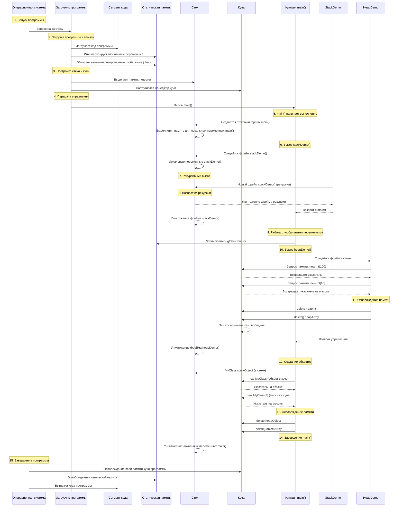
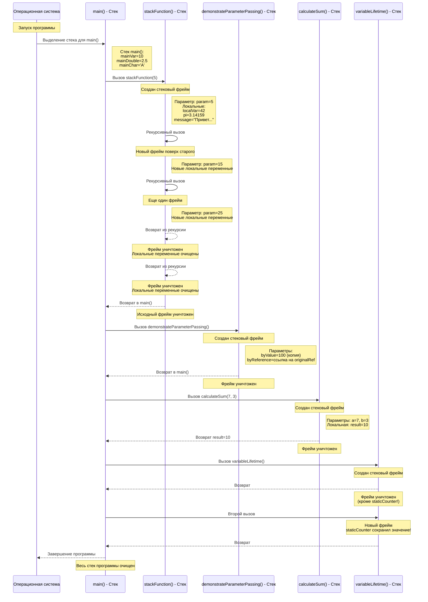
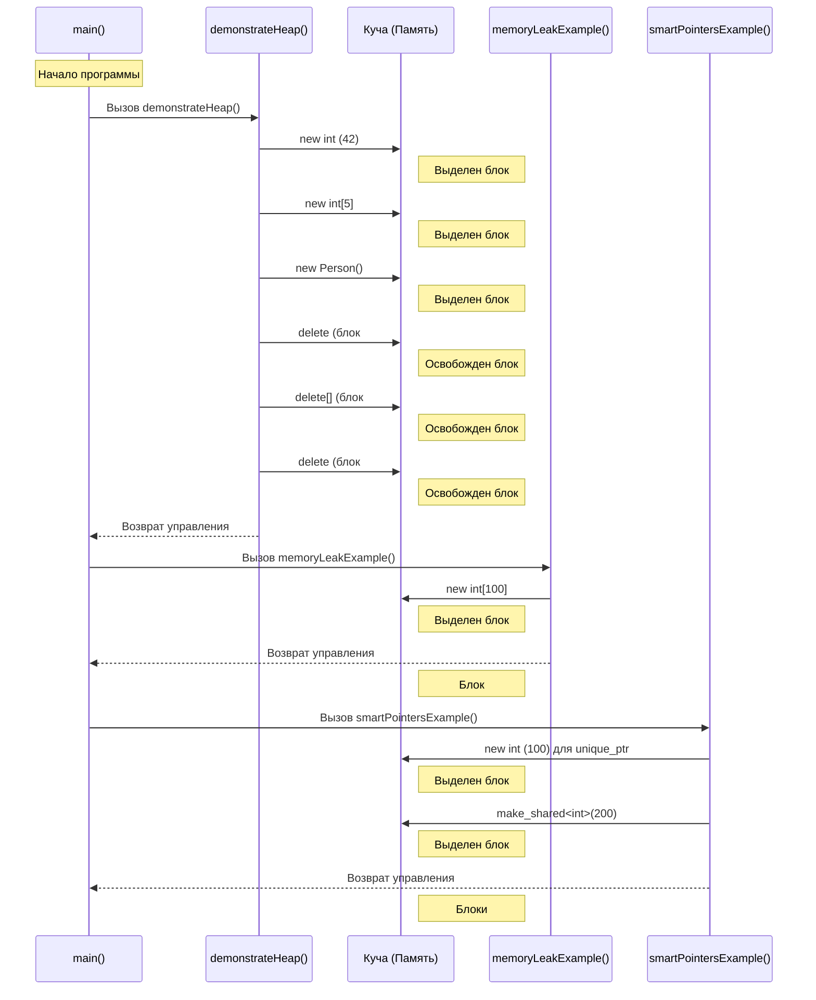
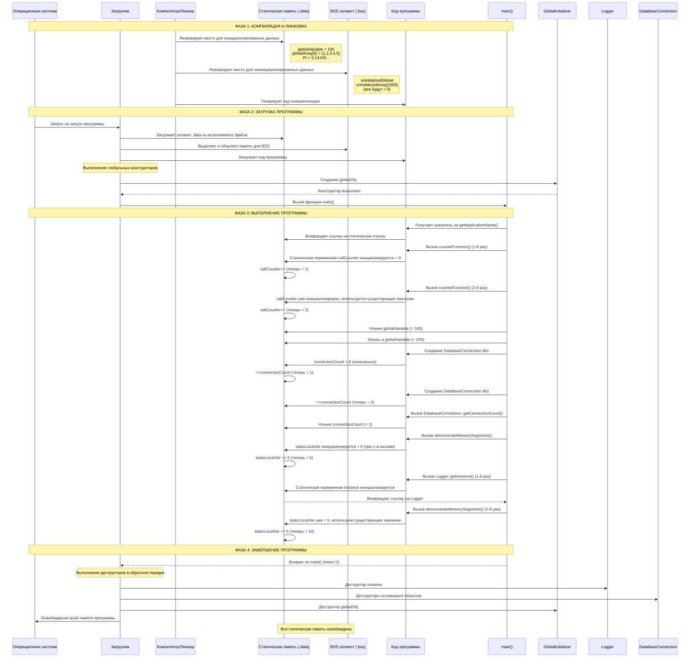

# Модель памяти и хранение данных в C/C++

# Модель памяти в C++: полное объяснение 

## Что такое модель памяти?

**Модель памяти** в C++ — это организация памяти компьютера для хранения данных во время выполнения программы. Память разделена на несколько сегментов, каждый со своей целью и особенностями.

## Основные сегменты памяти в C++:

1. **Куча (Heap)** — динамическая память
2. **Стек (Stack)** — автоматическая память
3. **Статическая память/сегмент данных** — глобальные и статические переменные
4. **Сегмент кода/текста** — исполняемый код программы

---

## Подробный пример кода с комментариями

```cpp
// === СЕГМЕНТ КОДА (TEXT SEGMENT) ===
// Здесь хранится исполняемый код программы

// Директива препроцессора - подключаем библиотеку
#include <iostream>

// === СТАТИЧЕСКАЯ ПАМЯТЬ (DATA SEGMENT) ===

// Глобальная переменная - хранится в статической памяти
// Существует всю жизнь программы
int globalCounter = 0;          // Инициализированная переменная (в .data)

const int MAX_SIZE = 100;       // Константа в статической памяти (часто в .rodata)

// Статическая глобальная переменная - видна только в этом файле
static int fileLocalVar = 42;   // Также в статической памяти

// Неинициализированная глобальная переменная (попадает в .bss)
int uninitializedGlobal;        // Автоматически инициализируется нулём

// === СЕГМЕНТ КОДА ===
// Объявление функций

// Функция, демонстрирующая работу стека
void stackDemo() {
    // === СТЕК (STACK MEMORY) ===
    // Локальные переменные функции создаются в стеке
    
    int localVar = 10;          // Создаётся в стеке при входе в функцию
    const int localConst = 20;  // Константа тоже в стеке
    
    // Массив в стеке - быстрый, но ограниченный размер
    int stackArray[5] = {1, 2, 3, 4, 5};
    
    // Блок кода создаёт свою область видимости в стеке
    {
        int blockVar = 30;      // Существует только внутри этого блока
        localVar += blockVar;   // Можно использовать внешние переменные
    } // blockVar автоматически уничтожается здесь
    
    // blockVar больше не существует - память освобождена
    
    // Рекурсивный вызов - каждый вызов создаёт новый стековый фрейм
    if (localVar < 100) {
        localVar++;
        stackDemo();            // Рекурсия - новый фрейм в стеке
    }
    
} // Все локальные переменные уничтожаются при выходе из функции

// Функция, демонстрирующая работу с кучей
void heapDemo() {
    // === КУЧА (HEAP MEMORY) ===
    // Динамическая память, управляемая вручную
    
    // Выделение памяти в куче с помощью new
    int* heapInt = new int(100);  // new выделяет память в куче
    
    // Выделение массива в куче
    int* heapArray = new int[10]; // Массив из 10 int в куче
    
    // Работа с динамической памятью
    for (int i = 0; i < 10; i++) {
        heapArray[i] = i * 10;    // Заполняем массив
    }
    
    // Важно: память из кучи нужно освобождать ВРУЧНУЮ
    delete heapInt;               // Освобождаем одиночную переменную
    delete[] heapArray;           // Освобождаем массив (важно использовать delete[])
    
    // Если не освободить память - будет утечка памяти (memory leak)
    
    // Умные указатели автоматически управляют памятью
    #include <memory>
    std::unique_ptr<int> smartPtr(new int(200));
    // Память автоматически освободится при выходе из области видимости
}

// Класс для демонстрации размещения объектов
class MyClass {
private:
    int value;                    // Поле класса
    std::string name;             // Ещё одно поле
    
public:
    // Конструктор
    MyClass(int v, const std::string& n) : value(v), name(n) {
        std::cout << "Создан объект: " << name << std::endl;
    }
    
    // Деструктор
    ~MyClass() {
        std::cout << "Уничтожен объект: " << name << std::endl;
    }
    
    void print() const {
        std::cout << name << " = " << value << std::endl;
    }
};

// Статическая переменная внутри функции
void functionWithStatic() {
    static int callCount = 0;     // Статическая локальная переменная
    callCount++;                  // Сохраняет значение между вызовами
    std::cout << "Функция вызвана " << callCount << " раз" << std::endl;
}

// Главная функция программы
int main() {
    // === СТЕК: фрейм функции main() ===
    
    std::cout << "=== ДЕМОНСТРАЦИЯ МОДЕЛИ ПАМЯТИ C++ ===" << std::endl;
    
    // 1. Демонстрация стека
    std::cout << "\n1. Демонстрация стека:" << std::endl;
    stackDemo();
    
    // 2. Демонстрация статической памяти
    std::cout << "\n2. Демонстрация статической памяти:" << std::endl;
    
    globalCounter++;               // Изменяем глобальную переменную
    std::cout << "globalCounter = " << globalCounter << std::endl;
    
    functionWithStatic();          // Статическая переменная внутри функции
    functionWithStatic();          // callCount сохранит значение
    
    // 3. Демонстрация кучи
    std::cout << "\n3. Демонстрация кучи:" << std::endl;
    heapDemo();
    
    // 4. Разные способы создания объектов
    std::cout << "\n4. Создание объектов:" << std::endl;
    
    // Объект в стеке
    MyClass stackObject(1, "Stack Object");
    stackObject.print();
    
    // Объект в куче
    MyClass* heapObject = new MyClass(2, "Heap Object");
    heapObject->print();
    
    // Массив объектов в куче
    MyClass* objectArray = new MyClass[3] {
        MyClass(3, "Array[0]"),
        MyClass(4, "Array[1]"),
        MyClass(5, "Array[2]")
    };
    
    // Освобождение памяти
    delete heapObject;            // Важно: освобождаем одиночный объект
    delete[] objectArray;         // Важно: освобождаем массив объектов
    
    // 5. Демонстрация времени жизни
    std::cout << "\n5. Время жизни переменных:" << std::endl;
    
    int* danglingPtr;             // Указатель без инициализации
    
    {
        int temp = 42;
        danglingPtr = &temp;      // Сохраняем адрес локальной переменной
        std::cout << "В блоке: temp = " << *danglingPtr << std::endl;
    } // temp уничтожается здесь!
    
    // ОПАСНО: danglingPtr теперь указывает на несуществующую переменную
    // std::cout << *danglingPtr; // Неопределённое поведение!
    
    std::cout << "\n=== ПРОГРАММА ЗАВЕРШЕНА ===" << std::endl;
    
    return 0;
    
} // Все локальные переменные main() уничтожаются

// Глобальные и статические переменные уничтожаются при завершении программы
```

---

## Диаграмма последовательностей работы с памятью



---

## Визуальная схема организации памяти

```mermaid
graph TB
    subgraph "Адресное пространство процесса"
        direction TB
        
        subgraph "СЕГМЕНТ КОДА (Code/Text Segment)"
            C1[Исполняемый код функций]
            C2[Константные строки]
            C3[Код библиотек]
        end
        
        subgraph "СТАТИЧЕСКАЯ ПАМЯТЬ (Data Segment)"
            D1[Инициализированные глобальные переменные]
            D2[Статические переменные]
            D3[Глобальные константы]
        end
        
        subgraph "BSS Segment"
            B1[Неинициализированные глобальные<br/>(автоматически обнуляются)]
        end
        
        subgraph "КУЧА (Heap)"
            H1[Динамически выделяемая память]
            H2[Растёт вверх ↓]
            H3[Управляется вручную new/delete]
        end
        
        subgraph "СТЕК (Stack)"
            S1[Локальные переменные]
            S2[Аргументы функций]
            S3[Адреса возврата]
            S4[Растёт вниз ↑]
            S5[Автоматическое управление]
        end
    end
    
    %% Связи
    C1 --> D1
    D1 --> B1
    B1 --> H1
    H1 --> S1
    
    %% Направление роста
    S4 -- "Направление роста стека" --> S1
    H2 -- "Направление роста кучи" --> H1
```

---

## Сравнение сегментов памяти

| Характеристика | Стек (Stack) | Куча (Heap) | Статическая память |
|----------------|--------------|-------------|-------------------|
| **Скорость** | Очень быстрая | Медленная | Быстрая |
| **Управление** | Автоматическое | Вручную (new/delete) | Автоматическое |
| **Время жизни** | Область видимости | До явного освобождения | Вся программа |
| **Размер** | Ограничен (1-8 МБ) | Большой (до ОЗУ) | Фиксированный |
| **Фрагментация** | Нет | Возможна | Нет |
| **Примеры** | Локальные переменные | Динамические массивы | Глобальные переменные |

---

## Практические примеры и частые ошибки

### Пример 1: Правильная работа с памятью
```cpp
#include <iostream>
#include <vector>

void processData() {
    // Небольшие данные - в стек
    int count = 100;
    double temp = 36.6;
    
    // Большие данные - в кучу (через vector)
    std::vector<int> largeData(1000000); // Внутренний буфер в куче
    
    // или явно через new
    int* dynamicArray = new int[1000];
    // ... работа с массивом ...
    delete[] dynamicArray; // Не забываем!
}

// Или используем умные указатели
#include <memory>
void safeMemoryUsage() {
    auto ptr = std::make_unique<int[]>(1000); // Автоматическое управление
    // Память освободится сама
}
```

### Пример 2: Типичные ошибки новичков
```cpp
void commonMistakes() {
    // 1. Возврат указателя на локальную переменную
    int* mistake1() {
        int local = 42;
        return &local; // ОШИБКА: local уничтожится!
    }
    
    // 2. Двойное освобождение
    int* ptr = new int;
    delete ptr;
    // delete ptr; // ОШИБКА: повторное освобождение!
    
    // 3. Утечка памяти
    void leak() {
        int* ptr = new int[100];
        // Забыли delete[] ptr - УТЕЧКА!
    }
    
    // 4. Выход за границы массива
    int stackArr[5];
    // stackArr[10] = 42; // Неопределённое поведение!
}
```

## Ключевые выводы :

1. **Используйте стек** для небольших, короткоживущих данных
2. **Используйте кучу** для больших данных или данных с динамическим размером
3. **Всегда освобождайте память**, выделенную через `new` (или используйте умные указатели)
4. **Глобальные переменные** живут всю программу, но используйте их осторожно
5. **Указатели** — это просто адреса в памяти, не магия!

Эта модель памяти является фундаментальной для понимания C++ и помогает писать эффективные и безопасные программы.

# Стек (stack) в C++: Модель памяти и хранение данных

## Что такое стек?

**Стек (stack)** - это область памяти, которая работает по принципу LIFO (Last In, First Out - последним пришел, первым ушел). Стек используется для хранения локальных переменных, аргументов функций и управления потоком выполнения программы.

## Ключевые особенности:
- **Автоматическое управление**: память выделяется и освобождается автоматически
- **Быстрый доступ**: операции со стеком очень быстрые
- **Ограниченный размер**: стек обычно небольшой (1-8 МБ в зависимости от системы)
- **Локальная область**: переменные в стеке видны только в своей области видимости
- **Последовательное хранение**: данные хранятся непрерывно

## Пример кода с подробными комментариями

```cpp
// Подключаем необходимые библиотеки
#include <iostream>  // для ввода/вывода (cout, endl)
#include <string>    // для работы со строками

using namespace std; // используем пространство имен std

// Глобальная переменная - хранится в другой области памяти (не в стеке!)
int globalVariable = 100;

// Функция для демонстрации работы стека
// При вызове функции в стеке создается "стековый фрейм"
void stackFunction(int param) {  // param помещается в стек при вызове
    cout << "=== Внутри stackFunction ===" << endl;
    
    // Локальные переменные функции хранятся в стеке
    // Они создаются при входе в функцию и уничтожаются при выходе
    
    int localVar = 42;  // Выделяется место в стеке для int
    double pi = 3.14159; // Выделяется место в стеке для double
    string message = "Привет из стека!"; // string использует и стек, и кучу
    
    cout << "1. Параметр функции: " << param << endl;
    cout << "2. Локальная переменная: " << localVar << endl;
    cout << "3. Вещественное число: " << pi << endl;
    cout << "4. Строка: " << message << endl;
    cout << "5. Глобальная переменная: " << globalVariable << endl;
    
    // Вложенные блоки создают вложенные области видимости
    {
        // Переменная только внутри этого блока
        int blockVar = 777;  // Выделяется в стеке
        cout << "6. Переменная внутри блока: " << blockVar << endl;
        
        // blockVar автоматически уничтожится при выходе из блока
    } // Здесь blockVar перестает существовать
    
    // ОШИБКА: нельзя обратиться к blockVar здесь
    // cout << blockVar << endl; // Ошибка компиляции!
    
    // Рекурсивный вызов - каждый вызов создает новый стековый фрейм
    static int callCount = 0;  // Статическая переменная (не в стеке!)
    callCount++;
    
    if(callCount < 3) {
        cout << "\nРекурсивный вызов #" << callCount << ":" << endl;
        stackFunction(param + 10);  // Рекурсия!
    }
    
    // Все локальные переменные будут автоматически уничтожены
    // при возврате из функции
    cout << "\nЗавершение stackFunction..." << endl;
} // Здесь уничтожаются: message, pi, localVar, param

// Функция, демонстрирующая передачу параметров по значению
// Параметры копируются в стек вызываемой функции
void demonstrateParameterPassing(int byValue, int& byReference) {
    cout << "\n=== demonstrateParameterPassing ===" << endl;
    
    // byValue - копия оригинальной переменной в стеке
    byValue = 999;  // Изменяем только локальную копию
    
    // byReference - ссылка на оригинальную переменную
    byReference = 888;  // Изменяем оригинальную переменную
    
    cout << "Внутри функции:" << endl;
    cout << "  byValue (копия) = " << byValue << endl;
    cout << "  byReference (ссылка) = " << byReference << endl;
    
    // Локальная переменная - уничтожится при выходе
    int temp = byValue + byReference;
    cout << "  Сумма = " << temp << endl;
}

// Функция, возвращающая значение через стек
int calculateSum(int a, int b) {
    int result = a + b;  // result создается в стеке
    
    // Значение result копируется в стек вызывающей функции
    return result;  // Возврат значения через стек
}

// Пример с большими данными - может вызвать переполнение стека
void dangerousStackUsage() {
    cout << "\n=== Опасное использование стека ===" << endl;
    
    // Большой массив в стеке - ОПАСНО!
    // int bigArray[1000000]; // 4 МБ - может вызвать переполнение стека!
    
    // Вместо этого лучше использовать:
    // 1. Динамическую память (кучу)
    // 2. Статические массивы меньшего размера
    // 3. Контейнеры STL
    
    int safeArray[1000];  // 4 КБ - безопасно для стека
    cout << "Используем безопасный массив: " << sizeof(safeArray) 
         << " байт" << endl;
}

// Демонстрация времени жизни переменных
void variableLifetime() {
    cout << "\n=== Время жизни переменных ===" << endl;
    
    // Статическая локальная переменная
    // Инициализируется один раз, существует до конца программы
    static int staticCounter = 0;
    staticCounter++;
    
    // Обычная локальная переменная
    // Создается при каждом вызове, уничтожается при выходе
    int localCounter = 0;
    localCounter++;
    
    cout << "staticCounter: " << staticCounter 
         << " (сохраняет значение между вызовами)" << endl;
    cout << "localCounter: " << localCounter 
         << " (обнуляется при каждом вызове)" << endl;
}

int main() {
    // main() - тоже функция, ее переменные хранятся в стеке
    cout << "=== Программа начинается в main() ===" << endl;
    
    // Локальные переменные main() хранятся в стеке
    int mainVar = 10;      // 4 байта в стеке
    double mainDouble = 2.5; // 8 байт в стеке
    char mainChar = 'A';   // 1 байт в стеке (но выравнивание!)
    
    cout << "\nПеременные в main():" << endl;
    cout << "mainVar = " << mainVar << endl;
    cout << "mainDouble = " << mainDouble << endl;
    cout << "mainChar = " << mainChar << endl;
    
    // Вызов функции - создается новый стековый фрейм
    stackFunction(5);
    
    // Демонстрация передачи параметров
    int originalValue = 100;
    int originalRef = 200;
    
    cout << "\nДо вызова demonstrateParameterPassing:" << endl;
    cout << "originalValue = " << originalValue << endl;
    cout << "originalRef = " << originalRef << endl;
    
    demonstrateParameterPassing(originalValue, originalRef);
    
    cout << "\nПосле вызова demonstrateParameterPassing:" << endl;
    cout << "originalValue = " << originalValue << " (не изменился)" << endl;
    cout << "originalRef = " << originalRef << " (изменился!)" << endl;
    
    // Возврат значения через стек
    int sum = calculateSum(7, 3);
    cout << "\nСумма 7 + 3 = " << sum << endl;
    
    // Демонстрация времени жизни
    variableLifetime();
    variableLifetime();  // staticCounter сохранит значение!
    variableLifetime();
    
    // Опасное использование стека
    dangerousStackUsage();
    
    cout << "\n=== Завершение main() ===" << endl;
    
    // Все локальные переменные main() уничтожаются
    // Программа завершается
    
    return 0;  // Возвращаем управление операционной системе
}
```

## Диаграмма последовательностей выполнения кода



## Визуальное представление стека во время выполнения

```mermaid
graph TD
    subgraph "Стек программы (растет вниз)"
        OS["Операционная система<br/>(дно стека)"]
        
        subgraph "Фрейм main()"
            M_Return["Адрес возврата в ОС"]
            M_mainVar["mainVar = 10"]
            M_mainDouble["mainDouble = 2.5"]
            M_mainChar["mainChar = 'A'"]
            M_sum["sum = 10"]
            M_originalValue["originalValue = 100"]
            M_originalRef["originalRef = 888"]
        end
        
        subgraph "Фрейм stackFunction() при рекурсии"
            SF3_Return["Адрес возврата в stackFunction()"]
            SF3_param["param = 25"]
            SF3_localVar["localVar = 42"]
            SF3_pi["pi = 3.14159"]
            SF3_message["message = 'Привет...'"]
        end
        
        subgraph "Предыдущий фрейм stackFunction()"
            SF2_Return["Адрес возврата в stackFunction()"]
            SF2_param["param = 15"]
            SF2_localVar["localVar = 42"]
            SF2_pi["pi = 3.14159"]
            SF2_message["message = 'Привет...'"]
        end
        
        subgraph "Первый фрейм stackFunction()"
            SF1_Return["Адрес возврата в main()"]
            SF1_param["param = 5"]
            SF1_localVar["localVar = 42"]
            SF1_pi["pi = 3.14159"]
            SF1_message["message = 'Привет...'"]
        end
        
        Top["Верх стека (ESP - указатель)"]
        
        OS --> M_Return
        M_Return --> M_mainVar
        M_mainVar --> M_mainDouble
        M_mainDouble --> M_mainChar
        M_mainChar --> M_sum
        M_sum --> M_originalValue
        M_originalValue --> M_originalRef
        M_originalRef --> SF1_Return
        SF1_Return --> SF1_param
        SF1_param --> SF1_localVar
        SF1_localVar --> SF1_pi
        SF1_pi --> SF1_message
        SF1_message --> SF2_Return
        SF2_Return --> SF2_param
        SF2_param --> SF2_localVar
        SF2_localVar --> SF2_pi
        SF2_pi --> SF2_message
        SF2_message --> SF3_Return
        SF3_Return --> SF3_param
        SF3_param --> SF3_localVar
        SF3_localVar --> SF3_pi
        SF3_pi --> SF3_message
        SF3_message --> Top
    end
    
    subgraph "Глобальные/статические переменные (не в стеке!)"
        G_globalVariable["globalVariable = 100"]
        S_staticCounter["staticCounter = 3"]
    end
```



## Как работает стек: пошаговое объяснение

### 1. Вызов функции:
```cpp
int main() {
    int x = 5;
    myFunction(x);  // Вот что происходит:
}
```

**В стеке:**
```
До вызова:           После вызова:
+------------+       +------------+
| main: x=5  |       | myFunction |
+------------+       +------------+
| ...        |       | main: x=5  |
+------------+       +------------+
                     | ...        |
                     +------------+
```

### 2. Стековый фрейм содержит:
- Аргументы функции
- Адрес возврата (куда вернуться после функции)
- Локальные переменные
- Временные значения

### 3. Возврат из функции:
```cpp
int myFunction(int a) {
    int b = a * 2;
    return b;  // b копируется, фрейм уничтожается
}
```

## Важные правила работы со стеком:

1. **Автоматическое управление**: не нужно явно освобождать память
2. **Ограниченный размер**: обычно 1-8 МБ
3. **Локальная видимость**: переменные видны только в своем блоке
4. **Быстрое выделение**: просто перемещение указателя стека
5. **Порядок LIFO**: последняя вызванная функция завершается первой

## Распространенные ошибки со стеком:

```cpp
// 1. Возврат указателя на локальную переменную
int* badFunction() {
    int local = 42;  // В стеке
    return &local;   // ОШИБКА: local уничтожится при выходе!
}

// 2. Переполнение стека
void stackOverflow() {
    int hugeArray[1000000];  // Слишком большой для стека
    stackOverflow();         // Бесконечная рекурсия
}

// 3. Использование после выхода из области видимости
void scopeProblem() {
    int* ptr;
    {
        int value = 10;  // В стеке внутреннего блока
        ptr = &value;    // Сохраняем указатель
    } // value уничтожается здесь!
    cout << *ptr;        // ОШИБКА: обращение к уничтоженной переменной
}
```

## Преимущества и недостатки стека:

**Преимущества:**
- ⚡ Очень быстрое выделение/освобождение памяти
- 🔒 Автоматическое управление памятью
- 🎯 Предсказуемое время жизни переменных
- 📊 Эффективное использование кэша процессора

**Недостатки:**
- 📏 Ограниченный размер
- 🔄 Негибкое время жизни
- ⚠️ Опасность переполнения стека
- 🔗 Нельзя изменять размер во время выполнения

## Практические рекомендации:

1. **Используйте стек для:**
   - Небольших локальных переменных
   - Временных вычислений
   - Аргументов функций
   - Управления потоком выполнения

2. **Избегайте в стеке:**
   - Больших массивов (> 1 КБ)
   - Рекурсии с большой глубиной
   - Долгоживущих данных

3. **Помните:**
   - Стек очищается автоматически
   - Каждый вызов функции создает новый фрейм
   - Переменные уничтожаются в обратном порядке создания
   - Размер стека фиксирован при запуске программы

Стек - фундаментальная концепция в C++, которая обеспечивает эффективное управление памятью для локальных данных и вызовов функций. Понимание работы стека критически важно для написания корректных и эффективных программ.

# Куча (heap) в C++: Модель памяти и хранение данных

## Что такое куча?

**Куча (heap)** - это область динамической памяти, которая управляется вручную программистом. В отличие от стека, где память выделяется и освобождается автоматически, в куче вы сами контролируете время жизни объектов.

## Ключевые особенности:
- **Ручное управление**: вы сами выделяете и освобождаете память
- **Большой размер**: куча обычно значительно больше стека
- **Глобальная область**: память в куче доступна из любой части программы
- **Медленнее**: выделение/освобождение памяти в куче медленнее, чем в стеке

## Пример кода с подробными комментариями

```cpp
// Подключаем необходимые библиотеки
#include <iostream>  // для ввода/вывода (cout, endl)
#include <cstdlib>   // для функций динамического выделения памяти

using namespace std; // используем пространство имен std

// Функция для демонстрации работы с кучей
void demonstrateHeap() {
    cout << "=== Демонстрация работы с кучей ===" << endl;
    
    // 1. Выделение памяти для одного целого числа в куче
    // Ключевое слово 'new' выделяет память в куче
    // Возвращает УКАЗАТЕЛЬ на выделенную память
    // int* - это тип "указатель на целое число"
    int* singleNumber = new int;  // Выделили память для одного int в куче
    
    // Разыменовываем указатель и записываем значение
    *singleNumber = 42;  // * - оператор разыменования, получаем доступ к памяти
    
    cout << "1. Одно число в куче: " << *singleNumber << endl;
    cout << "   Адрес в памяти: " << singleNumber << endl;
    
    // 2. Выделение памяти для массива в куче
    // new int[5] выделяет память для 5 целых чисел подряд
    // Возвращает указатель на первый элемент массива
    int* numberArray = new int[5];  // Массив из 5 int в куче
    
    // Заполняем массив значениями
    for(int i = 0; i < 5; i++) {
        numberArray[i] = i * 10;  // Обращаемся к элементам как к обычному массиву
    }
    
    cout << "2. Массив в куче: ";
    for(int i = 0; i < 5; i++) {
        cout << numberArray[i] << " ";
    }
    cout << endl;
    
    // 3. Выделение памяти для структуры в куче
    // Создаем простую структуру для примера
    struct Person {
        string name;
        int age;
    };
    
    // Выделяем память для структуры Person в куче
    // new Person() не только выделяет память, но и вызывает конструктор
    Person* personPtr = new Person();
    
    // Заполняем поля структуры через указатель
    // Оператор -> используется для доступа к членам через указатель
    personPtr->name = "Анна";
    personPtr->age = 25;
    
    cout << "3. Структура в куче: " << personPtr->name 
         << ", " << personPtr->age << " лет" << endl;
    
    // 4. ВАЖНО: Освобождение памяти
    // Каждому new должен соответствовать delete!
    
    // Для одиночных объектов используем delete
    delete singleNumber;  // Освобождаем память для одного числа
    singleNumber = nullptr;  // Хорошая практика: обнулять указатель после удаления
    
    // Для массивов используем delete[]
    delete[] numberArray;  // Освобождаем память массива
    numberArray = nullptr;
    
    // Для структур также используем delete
    delete personPtr;  // Освобождаем память структуры
    personPtr = nullptr;
    
    cout << "4. Память освобождена!" << endl << endl;
}

// Пример с утечкой памяти (ЧТО НЕЛЬЗЯ ДЕЛАТЬ!)
void memoryLeakExample() {
    cout << "=== Пример утечки памяти ===" << endl;
    
    // Выделяем память, но не освобождаем - это УТЕЧКА ПАМЯТИ!
    int* leakedMemory = new int[100];  // 100 int в куче
    
    // Используем память...
    for(int i = 0; i < 10; i++) {
        leakedMemory[i] = i;
    }
    
    // ЗАБЫЛИ вызвать delete[] leakedMemory;
    // Память останется выделенной до завершения программы
    // В больших программах это приводит к исчерпанию памяти
    
    cout << "Память выделена, но не освобождена - УТЕЧКА!" << endl;
    // Чтобы исправить, нужно добавить: delete[] leakedMemory;
}

// Умные указатели (современный C++ - рекомендуемый подход)
#include <memory>  // для умных указателей

void smartPointersExample() {
    cout << "=== Умные указатели (рекомендуется!) ===" << endl;
    
    // unique_ptr - умный указатель, который автоматически удаляет память
    // когда выходит из области видимости
    unique_ptr<int> smartPtr(new int(100));
    
    // Используем как обычный указатель
    cout << "Значение через unique_ptr: " << *smartPtr << endl;
    
    // НЕ нужно вызывать delete - память освободится автоматически
    // при выходе из функции
    
    // shared_ptr - умный указатель с подсчетом ссылок
    shared_ptr<int> shared1 = make_shared<int>(200);
    {
        shared_ptr<int> shared2 = shared1;  // Оба указывают на один объект
        cout << "shared1: " << *shared1 << ", shared2: " << *shared2 << endl;
        // При выходе из блока shared2 уничтожается, но память не освобождается
        // потому что shared1 все еще ссылается на объект
    }
    // Здесь shared1 уничтожается, счетчик ссылок становится 0
    // и память автоматически освобождается
    
    cout << "Память освобождена автоматически!" << endl << endl;
}

int main() {
    // Демонстрируем различные аспекты работы с кучей
    demonstrateHeap();
    memoryLeakExample();
    smartPointersExample();
    
    return 0;  // Завершаем программу
}
```

## Диаграмма последовательностей выполнения кода



## Визуальное представление памяти

```
Стек (Stack)                    Куча (Heap)
+------------------+          +------------------+
| main()           |          |                  |
| - переменные     |          | Блок #1: 42      | <- singleNumber
+------------------+          +------------------+
| demonstrateHeap()|          | Блок #2: [0,10,  | <- numberArray
| - singleNumber   |---------→|       20,30,40]  |
| - numberArray    |---→      +------------------+
| - personPtr      |------→   | Блок #3: Person  |
+------------------+      |   | name="Анна"      |
| memoryLeakExample|      |   | age=25           |
| - leakedMemory   |---→  |   +------------------+
+------------------+  |   |   | Блок #4: [0..99] | <- leakedMemory (УТЕЧКА!)
                      |   |   +------------------+
                      |   |   | Блок #5: 100     | <- unique_ptr
                      |   |   +------------------+
                      |   |   | Блок #6: 200     | <- shared_ptr
                      |   |   +------------------+
                      |   |
                      |   После demonstrateHeap():
                      |   +------------------+
                      |   | Блок #1: ОСВОБ.  | 
                      |   +------------------+
                      |   | Блок #2: ОСВОБ.  |
                      |   +------------------+
                      |   | Блок #3: ОСВОБ.  |
                      |   +------------------+
                      |   | Блок #4: [0..99] | <- ВСЕ ЕЩЕ ВЫДЕЛЕН!
                      |   +------------------+
                      |
                      После smartPointersExample():
                      +------------------+
                      | Блок #5: ОСВОБ.  |
                      +------------------+
                      | Блок #6: ОСВОБ.  |
                      +------------------+
```

## Важные правила работы с кучей:

1. **Каждому `new` должен соответствовать `delete`**
2. **Для массивов используйте `delete[]`**, для одиночных объектов - `delete`
3. **После `delete` установите указатель в `nullptr`**
4. **Используйте умные указатели (`unique_ptr`, `shared_ptr`)**, когда возможно
5. **Не разыменовывайте нулевые (`nullptr`) или "висячие" указатели**
6. **Проверяйте успешность выделения памяти** (в современном C++ `new` бросает исключение при неудаче)

## Преимущества и недостатки:

**Преимущества кучи:**
- Большой объем доступной памяти
- Гибкое время жизни объектов
- Возможность создания массивов переменного размера

**Недостатки кучи:**
- Медленнее стека
- Ручное управление памятью
- Возможность утечек памяти
- Фрагментация памяти

## Современные рекомендации:

1. **Используйте стек** для небольших объектов с небольшим временем жизни
2. **Используйте умные указатели** вместо сырых указателей
3. **Используйте контейнеры STL** (`vector`, `string`, `map`), которые сами управляют памятью
4. **Избегайте явного `new`/`delete`** в современном C++

# Статическая память в C++: полное объяснение для новичков

## Что такое статическая память?

**Статическая память** (или сегмент данных) — это область памяти, где хранятся глобальные и статические переменные, которые существуют на протяжении всей жизни программы. Эта память выделяется при запуске программы и освобождается при её завершении.

## Ключевые характеристики статической памяти:

1. **Время жизни** — от запуска до завершения программы
2. **Инициализация** — до начала выполнения `main()`
3. **Область видимости** — зависит от места объявления
4. **Потокобезопасность** — требует синхронизации в многопоточных программах

---

## Подробный пример кода

```cpp
// === ПРЕПРОЦЕССОР И ВНЕШНИЕ ЗАВИСИМОСТИ ===

// Директива для препроцессора - включает заголовочный файл
// iostream предоставляет функции ввода/вывода
#include <iostream>

// Подключаем библиотеку для строк
#include <string>

// === СЕГМЕНТ ДАННЫХ (DATA SEGMENT) - ИНИЦИАЛИЗИРОВАННЫЕ ДАННЫЕ ===

// Глобальная переменная - видна во всех файлах программы
// Хранится в секции .data исполняемого файла
int globalVariable = 100;                 // Инициализирована явно

// Глобальная константа - может быть оптимизирована компилятором
// Часто размещается в секции .rodata (read-only data)
const double PI = 3.141592653589793;      // Константа времени компиляции

// Глобальный массив - все элементы инициализированы
int globalArray[5] = {1, 2, 3, 4, 5};     // Статический массив

// Глобальная строка - хранится в статической памяти
const char* welcomeMessage = "Добро пожаловать в программу!";

// === СЕКЦИЯ BSS (Block Started by Symbol) - НЕИНИЦИАЛИЗИРОВАННЫЕ ДАННЫЕ ===

// Неинициализированные глобальные переменные
// Автоматически инициализируются нулями до начала main()
int uninitializedGlobal;                  // Будет равно 0
double uninitializedDouble;               // Будет равно 0.0
bool uninitializedBool;                   // Будет равно false

// Неинициализированный массив
int uninitializedArray[1000];             // Все 1000 элементов = 0

// === СТАТИЧЕСКИЕ ПЕРЕМЕННЫЕ С ОГРАНИЧЕННОЙ ВИДИМОСТЬЮ ===

// Статическая глобальная переменная - видна только в этом файле
static int fileLocalStatic = 42;          // internal linkage

// Статическая константа
static const int MAX_USERS = 1000;        // Видна только в этом файле

// === КЛАСС СО СТАТИЧЕСКИМИ ЧЛЕНАМИ ===

class DatabaseConnection {
private:
    // Статическая переменная-член класса
    // Существует в единственном экземпляре для всех объектов класса
    static int connectionCount;           // Объявление (не определение!)
    
    // Константная статическая переменная может быть инициализирована здесь
    static const int MAX_CONNECTIONS = 100;
    
    std::string name;
    int id;
    
public:
    DatabaseConnection(const std::string& connName) : name(connName) {
        id = ++connectionCount;           // Используем статическую переменную
        std::cout << "Создано соединение " << id << ": " << name << std::endl;
    }
    
    ~DatabaseConnection() {
        --connectionCount;                // Уменьшаем счётчик
        std::cout << "Закрыто соединение " << id << std::endl;
    }
    
    // Статический метод - работает без создания объекта
    static int getConnectionCount() {
        return connectionCount;
    }
    
    void display() const {
        std::cout << "Соединение " << id << " из " << connectionCount 
                  << " (макс: " << MAX_CONNECTIONS << ")" << std::endl;
    }
};

// === ОПРЕДЕЛЕНИЕ СТАТИЧЕСКОЙ ПЕРЕМЕННОЙ-ЧЛЕНА КЛАССА ===
// Должно быть в глобальной области видимости (обычно в .cpp файле)
int DatabaseConnection::connectionCount = 0;  // Инициализация

// === ФУНКЦИИ СО СТАТИЧЕСКИМИ ЛОКАЛЬНЫМИ ПЕРЕМЕННЫМИ ===

// Функция со статической локальной переменной
void counterFunction() {
    // Статическая локальная переменная
    // Инициализируется один раз при первом вызове функции
    // Сохраняет значение между вызовами
    static int callCounter = 0;           // Инициализация при первом вызове
    
    callCounter++;                        // Инкрементируем
    
    // Ещё одна статическая переменная
    static std::string lastCaller = "никто";
    
    std::cout << "Функция вызвана " << callCounter 
              << " раз. Последний вызов от: " << lastCaller << std::endl;
    
    lastCaller = "counterFunction";       // Обновляем значение
}

// Функция, возвращающая ссылку на статическую локальную переменную
const std::string& getApplicationName() {
    // Статическая локальная переменная инициализируется один раз
    static const std::string appName = "MyC++ Application v1.0";
    
    return appName;  // Возвращаем ссылку - безопасно, т.к. переменная статическая
}

// Синглтон-класс (шаблон проектирования)
class Logger {
private:
    // Приватный конструктор
    Logger() {
        std::cout << "Logger инициализирован" << std::endl;
    }
    
    // Запрещаем копирование
    Logger(const Logger&) = delete;
    Logger& operator=(const Logger&) = delete;
    
    std::string logBuffer;
    
public:
    // Статический метод для получения единственного экземпляра
    static Logger& getInstance() {
        // Статическая локальная переменная гарантирует:
        // 1. Создание при первом вызове
        // 2. Потокобезопасность в C++11 и новее
        // 3. Уничтожение при завершении программы
        static Logger instance;           // Единственный экземпляр
        
        return instance;
    }
    
    void log(const std::string& message) {
        logBuffer += message + "\n";
        std::cout << "LOG: " << message << std::endl;
    }
    
    ~Logger() {
        std::cout << "Logger завершает работу. Сообщений: " 
                  << std::count(logBuffer.begin(), logBuffer.end(), '\n') 
                  << std::endl;
    }
};

// === ФУНКЦИЯ ДЛЯ ДЕМОНСТРАЦИИ РАЗНЫХ ТИПОВ ПЕРЕМЕННЫХ ===
void demonstrateMemorySegments() {
    std::cout << "\n=== ДЕМОНСТРАЦИЯ РАЗНЫХ ТИПОВ ПЕРЕМЕННЫХ ===" << std::endl;
    
    // 1. Локальная переменная (в стеке)
    int localVar = 10;                    // Создаётся в стеке
    std::cout << "Локальная переменная (стек): " << localVar << std::endl;
    
    // 2. Статическая локальная переменная
    static int staticLocalVar = 0;        // В статической памяти
    staticLocalVar += 5;
    std::cout << "Статическая локальная переменная: " << staticLocalVar << std::endl;
    
    // 3. Доступ к глобальной переменной
    std::cout << "Глобальная переменная: " << globalVariable << std::endl;
    
    // 4. Доступ к неинициализированной глобальной (будет 0)
    std::cout << "Неинициализированная глобальная: " << uninitializedGlobal 
              << " (автоматически обнулена)" << std::endl;
}

// === ГЛАВНАЯ ФУНКЦИЯ ПРОГРАММЫ ===
int main() {
    // Выводим информацию о программе
    std::cout << getApplicationName() << std::endl;
    std::cout << welcomeMessage << std::endl;
    std::cout << "Значение PI: " << PI << std::endl;
    
    // Демонстрация статических локальных переменных в функциях
    std::cout << "\n=== СТАТИЧЕСКИЕ ЛОКАЛЬНЫЕ ПЕРЕМЕННЫЕ ===" << std::endl;
    counterFunction();  // Первый вызов
    counterFunction();  // Второй вызов - callCounter сохранил значение
    counterFunction();  // Третий вызов
    
    // Демонстрация статических членов класса
    std::cout << "\n=== СТАТИЧЕСКИЕ ЧЛЕНЫ КЛАССА ===" << std::endl;
    
    std::cout << "Текущее количество соединений: " 
              << DatabaseConnection::getConnectionCount() << std::endl;
    
    // Создаём объекты
    DatabaseConnection db1("Основная база");
    DatabaseConnection db2("Резервная база");
    
    db1.display();
    db2.display();
    
    std::cout << "Всего соединений: " 
              << DatabaseConnection::getConnectionCount() << std::endl;
    
    // Блок для демонстрации времени жизни
    {
        DatabaseConnection db3("Временная база");
        db3.display();
    } // db3 уничтожается здесь, connectionCount уменьшается
    
    std::cout << "После блока соединений: " 
              << DatabaseConnection::getConnectionCount() << std::endl;
    
    // Демонстрация синглтона
    std::cout << "\n=== СИНГЛТОН (ШАБЛОН ПРОЕКТИРОВАНИЯ) ===" << std::endl;
    
    Logger::getInstance().log("Программа запущена");
    Logger::getInstance().log("Выполняется главная функция");
    
    // Демонстрация разных сегментов памяти
    demonstrateMemorySegments();
    
    // Работа с глобальным массивом
    std::cout << "\n=== ГЛОБАЛЬНЫЙ МАССИВ ===" << std::endl;
    std::cout << "globalArray[2] = " << globalArray[2] << std::endl;
    
    // Модифицируем глобальную переменную
    globalVariable = 200;
    std::cout << "Изменённая globalVariable = " << globalVariable << std::endl;
    
    // Демонстрация неинициализированных массивов
    std::cout << "\n=== НЕИНИЦИАЛИЗИРОВАННЫЕ ДАННЫЕ ===" << std::endl;
    std::cout << "uninitializedArray[0] = " << uninitializedArray[0] 
              << " (автоматический ноль)" << std::endl;
    
    // Проверяем, что статическая локальная переменная сохранила значение
    demonstrateMemorySegments();
    
    Logger::getInstance().log("Программа завершается");
    
    std::cout << "\n=== ПРОГРАММА ЗАВЕРШЕНА ===" << std::endl;
    
    return 0;
}

// === ГЛОБАЛЬНЫЙ ОБЪЕКТ - конструктор выполняется ДО main() ===
class GlobalInitializer {
public:
    GlobalInitializer() {
        std::cout << "GlobalInitializer создан ДО main()" << std::endl;
    }
    
    ~GlobalInitializer() {
        std::cout << "GlobalInitializer уничтожен ПОСЛЕ main()" << std::endl;
    }
};

// Создаём глобальный объект
GlobalInitializer globalObj;
```

---

## Диаграмма последовательностей работы статической памяти



---

## Визуальная схема организации статической памяти

```mermaid
graph TB
    subgraph "Исполняемый файл (.exe/.elf)"
        direction LR
        
        subgraph "СЕГМЕНТ КОДА (.text)"
            T1[Код функций]
            T2[Код конструкторов<br/>глобальных объектов]
            T3[Код деструкторов]
        end
        
        subgraph "СЕГМЕНТ ДАННЫХ (.data)"
            D1[globalVariable = 100]
            D2[globalArray = {1,2,3,4,5}]
            D3[PI = 3.14159]
            D4[fileLocalStatic = 42]
            D5[welcomeMessage = указатель<br/>на строку]
        end
        
        subgraph "СЕГМЕНТ BSS (.bss)"
            B1[uninitializedGlobal = 0]
            B2[uninitializedArray[1000]<br/>все элементы = 0]
            B3[DatabaseConnection::<br/>connectionCount = 0]
        end
        
        subgraph "СЕГМЕНТ RODATA (.rodata)"
            R1[Строковые константы]
            R2[Константы времени компиляции]
        end
    end
    
    subgraph "Память во время выполнения"
        direction LR
        
        subgraph "СТАТИЧЕСКАЯ ПАМЯТЬ ПРОЦЕССА"
            P1[Инициализированные<br/>глобальные переменные]
            P2[Неинициализированные<br/>(обнулённые) переменные]
            P3[Статические локальные<br/>переменные функций]
            P4[Статические члены<br/>классов]
            P5[Глобальные объекты]
        end
    end
    
    %% Связи между файлом и памятью
    T2 --> P5
    D1 --> P1
    D2 --> P1
    D4 --> P1
    B1 --> P2
    B3 --> P4
    
    %% Пример статических локальных переменных
    subgraph "Пример: counterFunction()"
        F1[callCounter = ?]
        F2[lastCaller = ?]
    end
    
    P3 --> F1
    P3 --> F2
```

---

## Таблица типов статических переменных

| Тип переменной | Место объявления | Время жизни | Инициализация | Область видимости |
|----------------|------------------|-------------|---------------|-------------------|
| **Глобальная** | Вне всех функций | Вся программа | При запуске | Все файлы (с extern) |
| **static глобальная** | Вне всех функций | Вся программа | При запуске | Только текущий файл |
| **static локальная** | Внутри функции | Вся программа | При первом вызове | Только внутри функции |
| **static член класса** | В классе | Вся программа | При запуске | Класс и его методы |
| **const static член** | В классе | Вся программа | При компиляции | Класс и его методы |

---

## Практические примеры использования

### Пример 1: Кэширование вычислений
```cpp
double computeExpensiveValue(int x) {
    // Статический кэш для хранения результатов
    static std::map<int, double> cache;
    
    // Проверяем, есть ли значение в кэше
    auto it = cache.find(x);
    if (it != cache.end()) {
        std::cout << "Значение из кэша: ";
        return it->second;
    }
    
    // Вычисляем (дорогая операция)
    double result = 0;
    for (int i = 0; i < 1000000; i++) {
        result += std::sin(x * i * 0.000001);
    }
    
    // Сохраняем в кэш
    cache[x] = result;
    std::cout << "Вычислено новое значение: ";
    return result;
}
```

### Пример 2: Подсчёт экземпляров класса
```cpp
class InstanceTracker {
private:
    static int totalInstances;    // Всего созданных экземпляров
    static int aliveInstances;    // Сейчас "живых" экземпляров
    int id;
    
public:
    InstanceTracker() {
        id = ++totalInstances;
        ++aliveInstances;
        std::cout << "Создан объект #" << id 
                  << " (всего: " << aliveInstances << ")" << std::endl;
    }
    
    ~InstanceTracker() {
        --aliveInstances;
        std::cout << "Уничтожен объект #" << id 
                  << " (осталось: " << aliveInstances << ")" << std::endl;
    }
    
    static void printStats() {
        std::cout << "Статистика: всего создано " << totalInstances 
                  << ", сейчас активно " << aliveInstances << std::endl;
    }
};

// Инициализация статических членов
int InstanceTracker::totalInstances = 0;
int InstanceTracker::aliveInstances = 0;
```

### Пример 3: Реестр фабрики
```cpp
class BasePlugin {
public:
    virtual void execute() = 0;
    virtual ~BasePlugin() = default;
};

class PluginRegistry {
private:
    // Статический реестр плагинов
    static std::map<std::string, std::function<BasePlugin*()>> registry;
    
public:
    static void registerPlugin(const std::string& name, 
                               std::function<BasePlugin*()> creator) {
        registry[name] = creator;
    }
    
    static BasePlugin* createPlugin(const std::string& name) {
        auto it = registry.find(name);
        if (it != registry.end()) {
            return it->second();
        }
        return nullptr;
    }
    
    static std::vector<std::string> getPluginNames() {
        std::vector<std::string> names;
        for (const auto& pair : registry) {
            names.push_back(pair.first);
        }
        return names;
    }
};

// Инициализация статического реестра
std::map<std::string, std::function<BasePlugin*()>> PluginRegistry::registry;
```

## Важные особенности статической памяти:

1. **Порядок инициализации** глобальных переменных в разных файлах не определён
2. **Проблема статической инициализации** (Static Initialization Order Fiasco) - когда одна глобальная переменная зависит от другой
3. **Потокобезопасность** в C++11: статические локальные переменные инициализируются потокобезопасно
4. **Zero-initialization**: все неинициализированные статические переменные обнуляются

## Рекомендации для новичков:

1. **Используйте статические локальные переменные** вместо глобальных, когда возможно
2. **Избегайте неконстантных глобальных переменных** - они усложняют понимание кода
3. **Для синглтонов используйте статические локальные переменные** внутри функции
4. **Помните о порядке инициализации** при работе с глобальными объектами

Статическая память - мощный инструмент, но требующий аккуратного использования. Понимание её работы поможет писать более эффективные и безопасные программы на C++.

## 1. Стек, куча, статическая память, жизненный цикл переменных

### **Стек (Stack)**
```c
void stackExample() {
    int a = 10;          // Локальная переменная в стеке
    double b = 20.5;     // Ещё одна в стеке
    // Автоматическое освобождение при выходе из функции
}
```
**Характеристики:**
- Автоматическое управление памятью (LIFO)
- Быстрый доступ
- Ограниченный размер (~1-8 МБ)
- Хранит локальные переменные и параметры функций

### **Статическая память**
```c
static int globalVar = 100;    // Статическая глобальная переменная

void function() {
    static int counter = 0;    // Статическая локальная переменная
    counter++;
    // Сохраняет значение между вызовами функции
}
```
**Характеристики:**
- Существует всю программу
- Инициализируется при запуске программы
- Нулевыми значениями по умолчанию

### **Куча (Heap/Динамическая память)**
```c
int* createArray(int size) {
    int* arr = (int*)malloc(size * sizeof(int));  // Выделение в куче
    // Память существует пока не освобождена явно
    return arr;
}
```
**Характеристики:**
- Ручное управление (malloc/free, new/delete)
- Большой размер (ограничен ОЗУ)
- Медленнее стека
- Гибкое распределение

## 2. Указатели

```c
int main() {
    int value = 42;
    int* ptr = &value;     // Указатель на value
    
    *ptr = 100;            // Изменение через указатель
    int** ptr2 = &ptr;     // Указатель на указатель
    
    // Арифметика указателей
    int arr[5] = {1, 2, 3, 4, 5};
    int* arrPtr = arr;
    *(arrPtr + 2) = 10;    // arr[2] = 10
}
```

## 3. Динамическая память

### **C стиль**
```c
#include <stdlib.h>

void dynamicMemoryC() {
    // Выделение памяти
    int* numbers = (int*)malloc(10 * sizeof(int));
    int* initialized = (int*)calloc(10, sizeof(int)); // Инициализация нулями
    
    // Изменение размера
    numbers = (int*)realloc(numbers, 20 * sizeof(int));
    
    // Освобождение памяти
    free(numbers);
    free(initialized);
}
```

### **C++ стиль**
```cpp
#include <memory>

void dynamicMemoryCPP() {
    // Одиночные объекты
    int* single = new int(42);
    delete single;
    
    // Массивы
    int* array = new int[10];
    delete[] array;
    
    // Умные указатели (рекомендуется)
    std::unique_ptr<int> smartPtr = std::make_unique<int>(100);
    std::shared_ptr<int> shared = std::make_shared<int>(200);
}
```

## 4. Строки

### **C строки**
```c
#include <string.h>

void cStrings() {
    char str1[20] = "Hello";
    char* str2 = (char*)malloc(20);
    
    strcpy(str2, "World");      // Копирование
    strcat(str1, " World");     // Конкатенация
    size_t len = strlen(str1);  // Длина строки
    
    free(str2);
}
```

### **C++ строки**
```cpp
#include <string>

void cppStrings() {
    std::string str = "Hello";
    str += " World";           // Конкатенация
    
    // Методы
    str.size();               // Длина
    str.find("World");        // Поиск
    str.substr(6, 5);         // Подстрока
    
    // C совместимость
    const char* cstr = str.c_str();
}
```

## 5. Работа с файлами

### **C стиль**
```c
#include <stdio.h>

void fileOperationsC() {
    FILE* file = fopen("data.txt", "w");
    if (file) {
        fprintf(file, "Hello File!\n");
        fclose(file);
    }
    
    // Чтение
    file = fopen("data.txt", "r");
    if (file) {
        char buffer[100];
        while (fgets(buffer, 100, file)) {
            printf("%s", buffer);
        }
        fclose(file);
    }
}
```

### **C++ стиль**
```cpp
#include <fstream>
#include <iostream>

void fileOperationsCPP() {
    // Запись
    std::ofstream outFile("data.txt");
    if (outFile.is_open()) {
        outFile << "Hello File!" << std::endl;
        outFile.close();
    }
    
    // Чтение
    std::ifstream inFile("data.txt");
    std::string line;
    while (std::getline(inFile, line)) {
        std::cout << line << std::endl;
    }
}
```

## 6. Анализ использования памяти и Valgrind

### **Установка Valgrind**
```bash
# Ubuntu/Debian
sudo apt-get install valgrind

# Fedora/RHEL
sudo dnf install valgrind

# macOS
brew install valgrind
```

### **Основные команды Valgrind**

```bash
# Проверка утечек памяти
valgrind --leak-check=full ./your_program

# Проверка на ошибки памяти
valgrind --tool=memcheck ./your_program

# Детальный анализ
valgrind --tool=memcheck --leak-check=full --show-leak-kinds=all --track-origins=yes ./your_program

# Проверка использования неинициализированной памяти
valgrind --tool=memcheck --track-origins=yes ./your_program
```

### **Пример программы с утечками для тестирования**
```c
#include <stdlib.h>
#include <string.h>

void memoryLeaksExample() {
    // Утечка памяти
    int* leak = (int*)malloc(100 * sizeof(int));
    // Не освобождаем!
    
    // Использование после освобождения
    int* useAfterFree = (int*)malloc(sizeof(int));
    free(useAfterFree);
    *useAfterFree = 42;  // Ошибка!
    
    // Выход за границы массива
    int* buffer = (int*)malloc(10 * sizeof(int));
    buffer[10] = 5;      // Выход за границы
    free(buffer);
    
    // Двойное освобождение
    int* doubleFree = (int*)malloc(sizeof(int));
    free(doubleFree);
    free(doubleFree);    // Двойное освобождение
}

int main() {
    memoryLeaksExample();
    return 0;
}
```

### **Анализ с Valgrind**
```bash
# Компилируем с отладочной информацией
gcc -g -o test_program test.c

# Запускаем Valgrind
valgrind --leak-check=full --show-leak-kinds=all ./test_program
```

### **Интерпретация результатов Valgrind**

Типичный вывод:
```
==12345== ERROR SUMMARY: 3 errors from 3 contexts
==12345== 
==12345== 100 bytes in 1 blocks are definitely lost
==12345==    at 0x483B7F3: malloc (vg_replace_malloc.c:307)
==12345==    by 0x109123: memoryLeaksExample (test.c:6)
```

**Ключевые сообщения:**
- **"definitely lost"** - гарантированная утечка
- **"indirectly lost"** - косвенная утечка
- **"possibly lost"** - возможная утечка
- **"Invalid read/write"** - обращение к невалидной памяти
- **"Use after free"** - использование после освобождения

### **Лучшие практики работы с памятью**

1. **Для C++:**
```cpp
// Используйте умные указатели
auto ptr = std::make_unique<MyClass>();
auto shared = std::make_shared<MyClass>();

// Используйте контейнеры STL
std::vector<int> vec;
std::string str;
```

2. **Для C:**
```c
// Всегда проверяйте результат malloc
int* ptr = malloc(size);
if (ptr == NULL) {
    // Обработка ошибки
}

// Освобождайте в обратном порядке выделению
void cleanup() {
    free(ptr3);
    free(ptr2);
    free(ptr1);
}

// Используйте инструменты статического анализа
// cppcheck, clang-tidy, PVS-Studio
```

3. **Общие рекомендации:**
```cpp
// 1. RAII (Resource Acquisition Is Initialization)
class FileHandler {
    FILE* file;
public:
    FileHandler(const char* name) : file(fopen(name, "r")) {}
    ~FileHandler() { if(file) fclose(file); }
};

// 2. Правило нуля/трех/пяти
class RuleOfFive {
    int* data;
public:
    // Конструктор, деструктор, копирование, перемещение
    RuleOfFive() : data(new int[100]) {}
    ~RuleOfFive() { delete[] data; }
    RuleOfFive(const RuleOfFive& other); // Копирующий
    RuleOfFive& operator=(const RuleOfFive& other);
    RuleOfFive(RuleOfFive&& other) noexcept; // Перемещающий
    RuleOfFive& operator=(RuleOfFive&& other) noexcept;
};

// 3. Используйте автоматический анализ
// Включайте sanitizers при компиляции
// gcc/clang: -fsanitize=address,undefined
```

### **Практическое задание для закрепления**

1. Напишите программу с утечками памяти разных типов
2. Проанализируйте её с Valgrind
3. Исправьте все найденные ошибки
4. Напишите аналогичную программу на C++ с умными указателями
5. Сравните производительность и безопасность подходов

### **Дополнительные инструменты**

```bash
# Massif для анализа использования памяти во времени
valgrind --tool=massif ./your_program
ms_print massif.out.12345

# Cachegrind для анализа кэша
valgrind --tool=cachegrind ./your_program
cg_annotate cachegrind.out.12345

# Helgrind для анализа многопоточности
valgrind --tool=helgrind ./your_program
```

Эта структура охватывает все указанные темы и предоставляет практические примеры для понимания модели памяти и инструментов отладки.