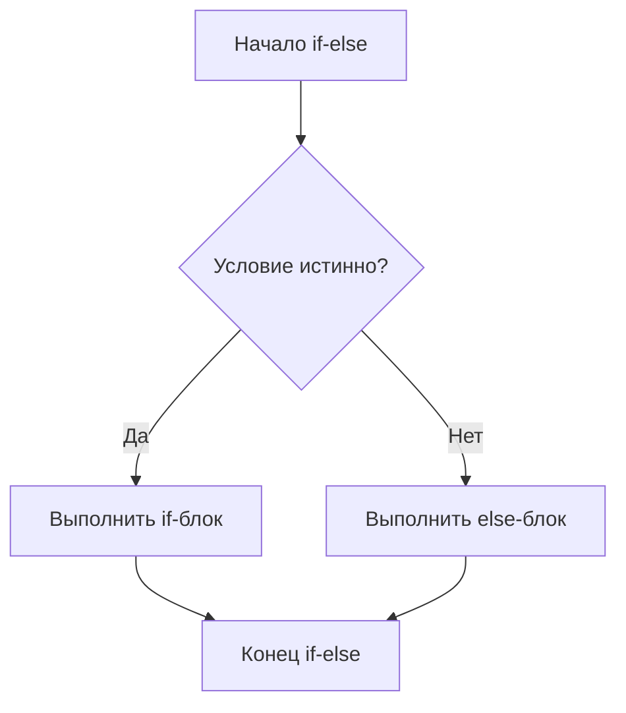
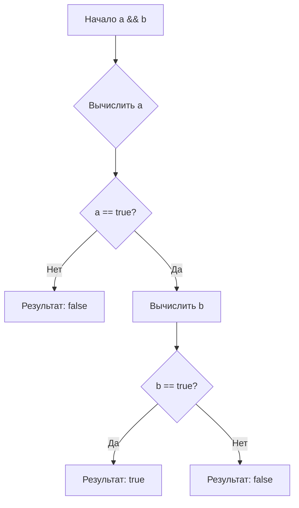
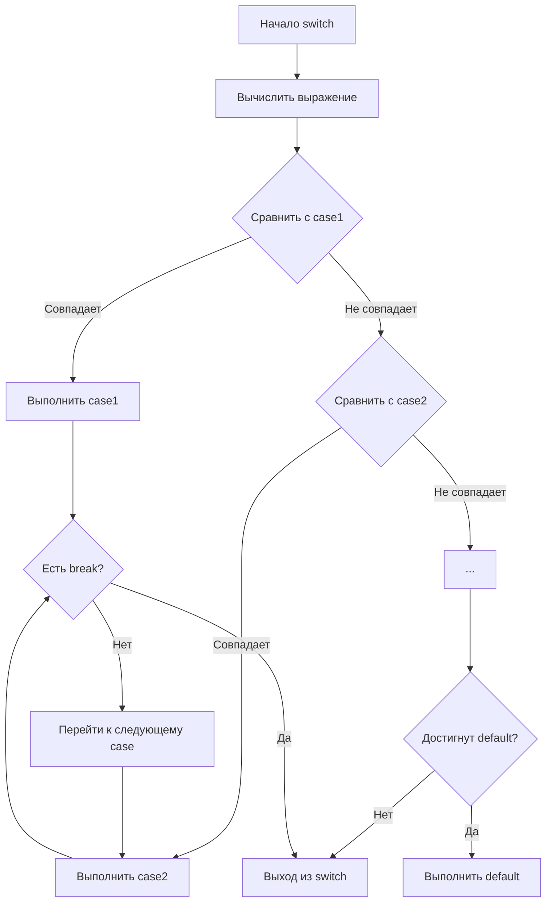
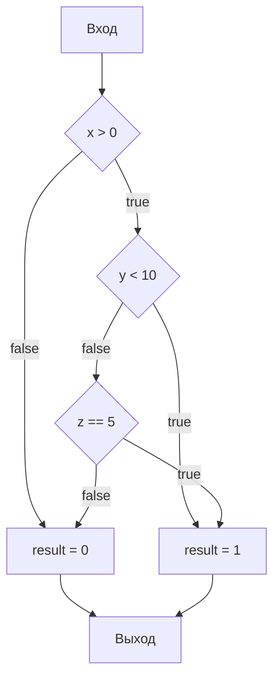

# **Подробное объяснение условных операторов и логических операций в C++**

## **📌 Введение: Зачем нужны условия?**

В реальной жизни мы постоянно принимаем решения:
- **ЕСЛИ** идёт дождь, **ТО** взять зонтик
- **ЕСЛИ** темно, **ТО** включить свет
- **ЕСЛИ** голоден, **ТО** поесть, **ИНАЧЕ** работать

В программировании это называется **условными конструкциями**. Они позволяют программе "принимать решения" на основе данных.

---

## **1. УСЛОВНЫЙ ОПЕРАТОР if/else**

### **Базовый синтаксис:**
```cpp
if (условие) {
    // код выполнится, ЕСЛИ условие истинно (true)
}
```

### **Пример 1: Простой if**
```cpp
#include <iostream>
using namespace std;

int main() {
    int age = 20;
    
    // ЕСЛИ возраст больше или равен 18
    if (age >= 18) {
        // Этот блок кода выполнится ТОЛЬКО если условие истинно
        cout << "Вы совершеннолетний!" << endl;
    }
    
    // Этот код выполнится ВСЕГДА
    cout << "Программа завершена." << endl;
    
    return 0;
}
```

**Пошаговое выполнение:**
1. `age >= 18` → `20 >= 18` → `true` (истина)
2. Условие истинно → выполняется код в фигурных скобках `{}`
3. Вывод: "Вы совершеннолетний!"
4. Вывод: "Программа завершена."

### **Пример 2: if с else**
```cpp
#include <iostream>
using namespace std;

int main() {
    int temperature = -5;
    
    // ЕСЛИ температура выше нуля
    if (temperature > 0) {
        cout << "На улице тепло" << endl;
    }
    // ИНАЧЕ (если условие ложно)
    else {
        cout << "На улице холодно" << endl;
    }
    
    return 0;
}
```
**Результат:** `-5 > 0` → `false` → выполнится блок `else` → "На улице холодно"

### **Пример 3: Цепочка условий (if-else if-else)**
```cpp
#include <iostream>
using namespace std;

int main() {
    int score = 85;
    char grade;
    
    // Проверка условий по очереди сверху вниз
    if (score >= 90) {
        grade = 'A';
        cout << "Отлично!" << endl;
    }
    else if (score >= 80) {  // Проверяется ТОЛЬКО если первое условие ложно
        grade = 'B';
        cout << "Хорошо!" << endl;
    }
    else if (score >= 70) {  // Проверяется ТОЛЬКО если первые два ложны
        grade = 'C';
        cout << "Удовлетворительно" << endl;
    }
    else {  // Выполняется если ВСЕ предыдущие условия ложны
        grade = 'F';
        cout << "Неудовлетворительно" << endl;
    }
    
    cout << "Ваша оценка: " << grade << endl;
    return 0;
}
```

**Важно:** Выполняется **только первый блок**, условие которого истинно!

---

## **2. ЛОГИЧЕСКИЕ ОПЕРАЦИИ**

Логические операции работают с булевыми значениями (`true`/`false`).

### **Таблица истинности:**

| A | B | A && B | A \|\| B | !A |
|---|----|--------|----------|----|
| false | false | false | false | true |
| false | true | false | true | true |
| true | false | false | true | false |
| true | true | true | true | false |

### **Оператор && (И, AND)**
```cpp
#include <iostream>
using namespace std;

int main() {
    bool hasTicket = true;
    bool hasMoney = true;
    
    // ОБА условия должны быть истинны
    if (hasTicket && hasMoney) {
        cout << "Вы можете пойти в кино" << endl;
    } else {
        cout << "Вы не можете пойти в кино" << endl;
    }
    
    // Практический пример
    int age = 25;
    bool hasLicense = true;
    
    // Можно водить машину если возраст >= 18 И есть права
    if (age >= 18 && hasLicense) {
        cout << "Вы можете водить машину" << endl;
    }
    
    return 0;
}
```

**Ленивое вычисление (short-circuit evaluation):**
Если левая часть `&&` ложна → правая часть НЕ вычисляется!
```cpp
int x = 0;
// Второе условие (x > 5) НЕ будет проверяться!
if (false && (x > 5)) {
    // Этот код никогда не выполнится
}
```

### **Оператор || (ИЛИ, OR)**
```cpp
#include <iostream>
using namespace std;

int main() {
    bool isWeekend = true;
    bool isHoliday = false;
    
    // ХОТЯ БЫ ОДНО условие должно быть истинно
    if (isWeekend || isHoliday) {
        cout << "Можно отдохнуть!" << endl;
    }
    
    // Практический пример: скидка
    bool isStudent = true;
    bool isPensioner = false;
    bool hasDiscountCard = true;
    
    // Скидка если студент ИЛИ пенсионер ИЛИ есть дисконтная карта
    if (isStudent || isPensioner || hasDiscountCard) {
        cout << "Вам предоставляется скидка!" << endl;
    }
    
    return 0;
}
```

**Ленивое вычисление для ||:**
Если левая часть `||` истинна → правая часть НЕ вычисляется!
```cpp
int y = 10;
// Второе условие (y < 0) НЕ будет проверяться!
if (true || (y < 0)) {
    // Этот код всегда выполнится
}
```

### **Оператор ! (НЕ, NOT)**
```cpp
#include <iostream>
using namespace std;

int main() {
    bool doorClosed = true;
    
    // ! превращает true в false, а false в true
    if (!doorClosed) {  // если НЕ doorClosed
        cout << "Дверь открыта" << endl;
    } else {
        cout << "Дверь закрыта" << endl;
    }
    
    // Практический пример: проверка на невалидность
    int age = 15;
    
    if (!(age >= 18)) {  // эквивалентно age < 18
        cout << "Вход запрещён!" << endl;
    }
    
    return 0;
}
```

### **Комбинирование операций**
```cpp
#include <iostream>
using namespace std;

int main() {
    int age = 25;
    bool hasTicket = true;
    bool hasMoney = false;
    
    // Сложное условие с приоритетами
    // 1. !hasMoney = true (так как hasMoney = false)
    // 2. age >= 18 && hasTicket = true && true = true
    // 3. true || true = true
    if ((age >= 18 && hasTicket) || !hasMoney) {
        cout << "Можно пройти на мероприятие" << endl;
    }
    
    // Использование скобок для изменения приоритета
    bool a = true, b = false, c = true;
    
    // Без скобок: && имеет приоритет над ||
    // true && false || true = false || true = true
    if (a && b || c) {
        cout << "Условие 1 истинно" << endl;
    }
    
    // Со скобками: меняем порядок
    // true && (false || true) = true && true = true
    if (a && (b || c)) {
        cout << "Условие 2 истинно" << endl;
    }
    
    return 0;
}
```

**Приоритет операций:**
1. `()` — скобки (самый высокий)
2. `!` — НЕ
3. `&&` — И
4. `||` — ИЛИ (самый низкий)

---

## **3. ТЕРНАРНЫЙ ОПЕРАТОР (?:)**

### **Синтаксис:**
```cpp
условие ? выражение_если_истинно : выражение_если_ложно
```

### **Пример 1: Базовое использование**
```cpp
#include <iostream>
using namespace std;

int main() {
    int a = 10;
    int b = 20;
    
    // Традиционный способ с if/else
    int max1;
    if (a > b) {
        max1 = a;
    } else {
        max1 = b;
    }
    
    // Эквивалент с тернарным оператором
    int max2 = (a > b) ? a : b;
    // Читается: ЕСЛИ (a > b) ТО max2 = a ИНАЧЕ max2 = b
    
    cout << "max1 = " << max1 << ", max2 = " << max2 << endl;
    
    return 0;
}
```

### **Пример 2: Вывод разных сообщений**
```cpp
#include <iostream>
using namespace std;

int main() {
    int temperature = 25;
    
    // Использование в выводе
    cout << "На улице " 
         << (temperature > 20 ? "тепло" : "прохладно") 
         << endl;
    
    // Сохранение результата
    string weather = (temperature > 0) ? "Выше нуля" : "Ниже нуля";
    cout << "Температура " << weather << endl;
    
    return 0;
}
```

### **Пример 3: Вложенные тернарные операторы**
```cpp
#include <iostream>
using namespace std;

int main() {
    int score = 85;
    
    // Определение оценки
    char grade = (score >= 90) ? 'A' :
                 (score >= 80) ? 'B' :
                 (score >= 70) ? 'C' :
                 (score >= 60) ? 'D' : 'F';
    
    // Эквивалентный код с if/else if/else:
    /*
    char grade;
    if (score >= 90) {
        grade = 'A';
    } else if (score >= 80) {
        grade = 'B';
    } else if (score >= 70) {
        grade = 'C';
    } else if (score >= 60) {
        grade = 'D';
    } else {
        grade = 'F';
    }
    */
    
    cout << "Оценка: " << grade << endl;
    
    return 0;
}
```

**Важно:** Не злоупотребляйте вложенными тернарными операторами — код становится нечитаемым!

---

## **4. ОПЕРАТОР SWITCH**

Используется для множественного выбора на основе одного значения.

### **Синтаксис:**
```cpp
switch (выражение) {
    case значение1:
        // код для значение1
        break;
    case значение2:
        // код для значение2
        break;
    default:
        // код если ни один case не подошёл
}
```

### **Пример 1: Дни недели**
```cpp
#include <iostream>
using namespace std;

int main() {
    int dayOfWeek = 3;
    
    switch (dayOfWeek) {
        case 1:  // если dayOfWeek == 1
            cout << "Понедельник" << endl;
            break;  // выход из switch
            
        case 2:  // если dayOfWeek == 2
            cout << "Вторник" << endl;
            break;
            
        case 3:
            cout << "Среда" << endl;
            break;
            
        case 4:
            cout << "Четверг" << endl;
            break;
            
        case 5:
            cout << "Пятница" << endl;
            break;
            
        case 6:
        case 7:  // можно объединять несколько case
            cout << "Выходной день" << endl;
            break;
            
        default:  // если ни один case не подошёл
            cout << "Неверный номер дня" << endl;
    }
    
    return 0;
}
```

### **Пример 2: Калькулятор**
```cpp
#include <iostream>
using namespace std;

int main() {
    char operation;
    double a = 10.5, b = 5.2;
    
    cout << "Выберите операцию (+, -, *, /): ";
    cin >> operation;
    
    double result;
    
    switch (operation) {
        case '+':
            result = a + b;
            cout << a << " + " << b << " = " << result << endl;
            break;
            
        case '-':
            result = a - b;
            cout << a << " - " << b << " = " << result << endl;
            break;
            
        case '*':
            result = a * b;
            cout << a << " * " << b << " = " << result << endl;
            break;
            
        case '/':
            if (b != 0) {
                result = a / b;
                cout << a << " / " << b << " = " << result << endl;
            } else {
                cout << "Ошибка: деление на ноль!" << endl;
            }
            break;
            
        default:
            cout << "Неизвестная операция!" << endl;
    }
    
    return 0;
}
```

**Важные правила для switch:**
1. Выражение в `switch` должно быть **целочисленного типа** или `enum`
2. `case` значения должны быть **константами**
3. `break` прерывает выполнение switch (без него выполнится следующий case!)
4. `default` выполняется если ни один `case` не совпал

### **Пример с отсутствующим break (проваливание):**
```cpp
#include <iostream>
using namespace std;

int main() {
    int option = 2;
    
    switch (option) {
        case 1:
            cout << "Выбрана опция 1" << endl;
            // НЕТ break! Выполнение "проваливается" в case 2
        case 2:
            cout << "Выбрана опция 2" << endl;
            // НЕТ break!
        case 3:
            cout << "Выбрана опция 3" << endl;
            break;
        default:
            cout << "Неизвестная опция" << endl;
    }
    
    // Вывод:
    // Выбрана опция 2
    // Выбрана опция 3
    
    return 0;
}
```

---

## **5. ПРАКТИЧЕСКИЙ ПРИМЕР: Проверка пароля**

```cpp
#include <iostream>
#include <string>
using namespace std;

int main() {
    string correctPassword = "secret123";
    string enteredPassword;
    int attempts = 3;
    
    cout << "=== СИСТЕМА БЕЗОПАСНОСТИ ===" << endl;
    
    for (int i = 1; i <= attempts; i++) {
        cout << "Введите пароль (попытка " << i << "/" << attempts << "): ";
        cin >> enteredPassword;
        
        // Проверяем пароль
        if (enteredPassword == correctPassword) {
            cout << "Доступ разрешён!" << endl;
            
            // Дополнительные проверки
            int hour = 14; // текущий час
            
            // Проверяем время доступа
            bool isWorkingHours = (hour >= 9 && hour <= 18);
            bool isWeekend = false;
            
            // Используем тернарный оператор для сообщения
            cout << (isWorkingHours ? "Рабочее время" : "Вне рабочего времени") << endl;
            
            // Используем логические операторы
            if (isWorkingHours && !isWeekend) {
                cout << "Полный доступ к системе" << endl;
            } else {
                cout << "Ограниченный доступ" << endl;
            }
            
            break; // выходим из цикла
        }
        else {
            cout << "Неверный пароль!" << endl;
            
            // Используем тернарный оператор для вывода оставшихся попыток
            int remaining = attempts - i;
            cout << "Осталось попыток: " 
                 << (remaining > 0 ? to_string(remaining) : "0") 
                 << endl;
            
            // Если попытки закончились
            if (i == attempts) {
                cout << "Доступ заблокирован! Обратитесь к администратору." << endl;
                
                // Используем switch для определения типа блокировки
                int lockType = 2; // 1-временная, 2-постоянная, 3-требует сброса
                
                switch (lockType) {
                    case 1:
                        cout << "Временная блокировка на 24 часа" << endl;
                        break;
                    case 2:
                        cout << "Постоянная блокировка аккаунта" << endl;
                        break;
                    case 3:
                        cout << "Требуется сброс пароля администратором" << endl;
                        break;
                    default:
                        cout << "Неизвестный тип блокировки" << endl;
                }
            }
        }
    }
    
    return 0;
}
```

---

## **🎯 КРАТКИЙ КОНСПЕКТ:**

### **Когда что использовать:**

1. **`if/else`** — когда есть 1-3 условия
2. **`switch`** — когда много вариантов для одного значения
3. **`тернарный оператор`** — простые выборы в одну строку
4. **`&&`** — когда должны выполняться ВСЕ условия
5. **`||`** — когда достаточно ХОТЯ БЫ ОДНОГО условия
6. **`!`** — для инверсии (противоположного значения)

### **Памятка:**
```cpp
// IF/ELSE
if (условие) { /* код */ }
else if (другое_условие) { /* код */ }
else { /* код */ }

// ЛОГИЧЕСКИЕ ОПЕРАЦИИ
if (условие1 && условие2)  // И
if (условие1 || условие2)  // ИЛИ
if (!условие)              // НЕ

// ТЕРНАРНЫЙ
переменная = (условие) ? значение_если_да : значение_если_нет;

// SWITCH
switch (переменная) {
    case значение1: /* код */ break;
    case значение2: /* код */ break;
    default: /* код */
}
```

### **Распространённые ошибки:**
```cpp
// ОШИБКА: присваивание вместо сравнения
if (x = 5)  // НЕПРАВИЛЬНО! Это присваивание
if (x == 5) // ПРАВИЛЬНО! Это сравнение

// ОШИБКА: забыли break в switch
case 1:
    cout << "1";
    // НЕТ break! Выполнится и case 2!

// ОШИБКА: точка с запятой после условия
if (x > 0); {  // НЕПРАВИЛЬНО! Блок выполнится всегда
    cout << "x положительный";
}
```

# **Глубокое погружение в условные операторы и логические операции в C++**

## **🎯 Фундаментальные аспекты: Как процессор выполняет условия**

### **1. Базовые концепции процессора**

Когда программа компилируется, условные операторы превращаются в **инструкции перехода** (jump/branch instructions):

```assembly
; Пример ассемблерного кода для if(x > 0)
cmp eax, 0      ; сравнить x с 0
jle else_label  ; перейти если меньше или равно (x <= 0)
; код if-блока
jmp end_label   ; перейти в конец
else_label:
; код else-блока
end_label:
```

**Проблема предсказания переходов (branch prediction):**
Современные процессоры пытаются предсказать, какая ветка кода выполнится, чтобы загружать инструкции заранее. Неправильное предсказание стоит 10-20 тактов!

---

## **2. УСЛОВНЫЙ ОПЕРАТОР IF/ELSE: Глубокий разбор**

### **Диаграмма выполнения if/else (Mermaid):**



### **Полная семантика if/else в C++:**

```cpp
// СТАНДАРТНЫЙ СИНТАКСИС:
if (условие)
    оператор1;  // выполняется если условие != 0 (true)
else
    оператор2;  // выполняется если условие == 0 (false)

// С ФИГУРНЫМИ СКОБКАМИ:
if (условие) {
    оператор1;
    оператор2;
    // ...
} else {
    оператор3;
    оператор4;
    // ...
}
```

### **Что на самом деле происходит в компиляторе:**

```cpp
// Исходный код:
if (x > 0) {
    y = 1;
} else {
    y = 0;
}

// Промежуточное представление в компиляторе:
bool condition = (x > 0);  // 1. Вычисление условия
if (condition) goto if_block;  // 2. Условный переход
goto else_block;  // 3. Безусловный переход

if_block:
    y = 1;  // 4. Выполнение if-блока
    goto end_if;  // 5. Переход в конец

else_block:
    y = 0;  // 6. Выполнение else-блока

end_if:
    // продолжение программы
```

### **Дерево синтаксического анализа (AST):**

```
        IF_STATEMENT
        /     |     \
   CONDITION  THEN   ELSE
      |        |      |
    BINARY     |      |
    OP(>)      |      |
   /    \    ASSIGN  ASSIGN
  VAR   CONST  |      |
  |      |    VAR    VAR
  x      0     y      y
               |      |
              CONST  CONST
               1      0
```

### **Особенности if с инициализацией (C++17):**

```cpp
// НОВЫЙ СИНТАКСИС C++17:
if (auto result = some_function(); result.is_valid()) {
    // result доступен только внутри этого блока!
    result.process();
}
// result здесь уже не существует

// Эквивалентный старый код:
{
    auto result = some_function();
    if (result.is_valid()) {
        result.process();
    }
}
```

### **Вложенные if и проблема "висячего else":**

```cpp
// ПРОБЛЕМА:
if (x > 0)
    if (y > 0)
        cout << "Оба положительные";
else
    cout << "Что это?";  // К какому if относится этот else?

// РЕШЕНИЕ (скобками):
if (x > 0) {
    if (y > 0) {
        cout << "Оба положительные";
    }
} else {
    cout << "x не положительный";
}

// ПРАВИЛО: else относится к ближайшему if
```

---

## **3. ЛОГИЧЕСКИЕ ОПЕРАЦИИ: Глубокий разбор**

### **Таблица истинности с битовым представлением:**

```cpp
bool a = true;   // фактически: 1 (любое ≠ 0)
bool b = false;  // фактически: 0

// Истинные значения в памяти:
// true  → 0x01 (или любое ненулевое значение)
// false → 0x00
```

### **Полная семантика логических операторов:**

#### **Оператор && (Логическое И):**
```cpp
// СТАНДАРТ: result = a && b
// Эквивалентная реализация:
bool logical_and(bool a, bool b) {
    if (!a) return false;  // short-circuit
    return b;              // оценивается только если a истинно
}
```

**Диаграмма выполнения &&:**



#### **Оператор || (Логическое ИЛИ):**
```cpp
// СТАНДАРТ: result = a || b
// Эквивалентная реализация:
bool logical_or(bool a, bool b) {
    if (a) return true;   // short-circuit
    return b;             // оценивается только если a ложно
}
```

**Диаграмма выполнения ||:**

```mermaid
graph TD
    A[Начало a || b] --> B{Вычислить a};
    B --> C{a == true?};
    C -- Да --> D[Результат: true];
    C -- Нет --> E[Вычислить b];
    E --> F{b == true?};
    F -- Да --> G[Результат: true];
    F -- Нет --> H[Результат: false];
```

#### **Оператор ! (Логическое НЕ):**
```cpp
// СТАНДАРТ: result = !a
// Реализация процессора:
// NOT превращает 0 → 1, любое ≠0 → 0
```

### **Особенности вычисления в C++:**

```cpp
// ПРЕОБРАЗОВАНИЕ ТИПОВ В ЛОГИЧЕСКИХ ВЫРАЖЕНИЯХ:
int x = 5;
if (x) {  // x преобразуется в bool: 5 → true
    cout << "x истинно";
}

// НОЛЕВЫЕ УКАЗАТЕЛИ:
int* ptr = nullptr;
if (ptr) {  // nullptr → false
    // не выполнится
}

// ПЕРЕГРУЗКА ОПЕРАТОРОВ:
class MyBool {
public:
    operator bool() const { return true; }  // пользовательское преобразование
};
```

### **Строгая гарантия вычисления:**

```cpp
// Порядок вычисления НЕ гарантирован!
if (func1() && func2()) {
    // func1 всегда выполнится первой
    // func2 выполнится ТОЛЬКО если func1() вернула true
}

// Порядок вычисления НЕ гарантирован!
if (func1() || func2()) {
    // func1 всегда выполнится первой
    // func2 выполнится ТОЛЬКО если func1() вернула false
}

// НЕ используйте побочные эффекты в условиях!
if (x++ && y++) {  // ОПАСНО! Порядок не гарантирован
    // ...
}
```

---

## **4. ТЕРНАРНЫЙ ОПЕРАТОР: Глубокий разбор**

### **Полная форма и ограничения:**

```cpp
// БАЗОВЫЙ СИНТАКСИС:
условие ? выражение_если_истинно : выражение_если_ложно

// ТИПЫ ВЫРАЖЕНИЙ ДОЛЖНЫ БЫТЬ СОВМЕСТИМЫ:
int x = 5;
double y = 3.14;

// Компилятор определяет общий тип:
auto result = (x > 0) ? y : 10;  // тип: double

// ОГРАНИЧЕНИЕ: должны быть одинаковые категории значений
int a = 5;
int b = 10;
int* ptr = &a;

// НЕ КОМПИЛИРУЕТСЯ:
// auto wrong = (x > 0) ? ptr : b;  // ошибка: разные типы
```

### **Дерево компиляции тернарного оператора:**

```
      CONDITIONAL_EXPR
        /      |      \
    CONDITION  THEN   ELSE
       |        |      |
     BINARY    EXPR1  EXPR2
      OP(>)
     /    \
   VAR   CONST
    x      0
```

### **Последовательность выполнения (sequence points):**

```cpp
int a = 5, b = 10;

// Тернарный оператор имеет sequence points:
int result = (a++ > 3) ? b++ : --b;
// Эквивалентно:
int temp;
if (a++ > 3) {
    temp = b++;
} else {
    temp = --b;
}
result = temp;
```

### **Constexpr и тернарный оператор:**

```cpp
// Тернарный оператор может быть вычислен на этапе компиляции:
constexpr int size = (sizeof(int) == 4) ? 32 : 64;
// Это гарантирует, что size будет константой времени компиляции

// Использование в шаблонах:
template<bool B>
struct Select {
    template<typename T, typename U>
    static auto select(T t, U u) -> decltype(true ? t : u) {
        return B ? t : u;
    }
};
```

---

## **5. ОПЕРАТОР SWITCH: Глубокий разбор**

### **Внутреннее устройство switch:**

```cpp
switch (выражение) {
    case константа1: инструкции1;
    case константа2: инструкции2;
    default: инструкции_по_умолчанию;
}
```

**Диаграмма выполнения switch:**



### **Как компилятор оптимизирует switch:**

```cpp
// ПРОСТОЙ SWITCH (таблица переходов):
switch (x) {
    case 1: return 10;
    case 2: return 20;
    case 3: return 30;
    default: return 0;
}

// Компилятор может сгенерировать jump table:
// если x в диапазоне 1-3 → вычисление адреса перехода
// иначе → переход на default
```

### **Ограничения и особенности:**

```cpp
// ВЫРАЖЕНИЕ В SWITCH должно быть:
// - целочисленного типа (int, char, enum)
// - или класса с преобразованием к целочисленному типу

// CASE ДОЛЖНЫ БЫТЬ КОНСТАНТНЫМИ ВЫРАЖЕНИЯМИ:
constexpr int VALUE = 10;
switch (x) {
    case VALUE:      // OK: VALUE - константное выражение
    case 1 + 2:      // OK: выражение, вычисляемое на этапе компиляции
    case rand():     // ОШИБКА: не константа!
    case y:          // ОШИБКА: переменная не константа
}
```

### **Оптимизация компилятором: jump tables vs if-else**

```cpp
// ПЛОХО: switch с разрозненными значениями
switch (x) {
    case 1: ... break;
    case 1000: ... break;
    case 1000000: ... break;
    // Компилятор использует if-else цепочку
}

// ХОРОШО: switch с плотными значениями
switch (x) {
    case 0: ... break;
    case 1: ... break;
    case 2: ... break;
    case 3: ... break;
    // Компилятор использует jump table (быстрее)
}
```

---

## **6. ДЕРЕВО КОМПИЛЯЦИИ и АБСТРАКТНОЕ СИНТАКСИЧЕСКОЕ ДЕРЕВО (AST)**

### **Полный процесс компиляции условных конструкций:**

```
ИСХОДНЫЙ КОД
    ↓
ЛЕКСИЧЕСКИЙ АНАЛИЗ (токенизация)
    ↓
СИНТАКСИЧЕСКИЙ АНАЛИЗ (построение AST)
    ↓
СЕМАНТИЧЕСКИЙ АНАЛИЗ (проверка типов)
    ↓
ПРОМЕЖУТОЧНОЕ ПРЕДСТАВЛЕНИЕ (IR)
    ↓
ОПТИМИЗАЦИЯ
    ↓
ГЕНЕРАЦИЯ МАШИННОГО КОДА
```

### **Пример AST для сложного условия:**

```cpp
// Исходный код:
if (x > 0 && (y < 10 || z == 5)) {
    result = 1;
} else {
    result = 0;
}
```

```
AST (упрощённо):

          IF_STATEMENT
           /         \
      CONDITION      BODY
          |           |
     LOGICAL_AND     ASSIGN
     /         \        |
  COMPARE    LOGICAL_OR  result
   |   |       |      |     |
   x   >0    COMPARE  COMPARE CONST
               |   |    |   |    1
               y   <10  z   ==5

      ELSE_BODY
          |
       ASSIGN
          |
      result   CONST
                 0
```

### **Граф потока управления (Control Flow Graph):**



---

## **7. ФУНДАМЕНТАЛЬНЫЕ АСПЕКТЫ и ОПТИМИЗАЦИИ**

### **Branch Prediction и оптимизация:**

```cpp
// ПЛОХО: непредсказуемые ветвления
if (rand() % 2) {  // 50/50 - предсказатель ошибается часто
    // ...
}

// ЛУЧШЕ: предсказуемые ветвления
if (likely_condition) {  // 99% true - предсказатель почти всегда прав
    // ...
}

// АТРИБУТЫ ДЛЯ ПОДСКАЗОК КОМПИЛЯТОРУ:
if (__builtin_expect(x > 0, 1)) {  // GCC: ожидаем, что условие истинно
    // ...
}
```

### **Оптимизация логических выражений:**

```cpp
// ДЕМОРГАНА ПРАВИЛА (оптимизация компилятором):
!(a && b) → !a || !b
!(a || b) → !a && !b

// Пример:
if (!(x > 0 && y < 10)) {
    // Компилятор преобразует в:
    // if (x <= 0 || y >= 10)
}
```

### **Выравнивание ветвей (branch alignment):**

```cpp
// Критическая ветвь должна быть выровнена:
if (critical_condition) {
    // Часто выполняемый код - располагается последовательно
    do_frequent_work();
} else {
    // Редкий случай - может быть вынесен
    handle_rare_case();
}
```

### **Стоимость операций (в тактах процессора):**

| Операция | Примерная стоимость |
|----------|---------------------|
| Простой if | 1-2 такта |
| Непредсказанный переход | 10-20 тактов |
| Логическое И/ИЛИ | 1 такт (с short-circuit) |
| Тернарный оператор | 1-2 такта |
| Switch с jump table | 2-3 такта |
| Switch с if-else цепочкой | O(n) тактов |

---

## **8. ПРАКТИЧЕСКИЕ ПАТТЕРНЫ и АНТИПАТТЕРНЫ**

### **Паттерн 1: Guard Clause (ранний возврат)**

```cpp
// ВМЕСТО:
void process(int* data) {
    if (data != nullptr) {
        if (data->is_valid()) {
            if (data->size() > 0) {
                // основная логика
            }
        }
    }
}

// ИСПОЛЬЗУЙТЕ:
void process(int* data) {
    if (data == nullptr) return;  // guard clause
    if (!data->is_valid()) return;
    if (data->size() <= 0) return;
    
    // основная логика (без вложенности)
}
```

### **Паттерн 2: Замена switch на полиморфизм**

```cpp
// ВМЕСТО БОЛЬШОГО SWITCH:
class Animal {
public:
    void makeSound(int type) {
        switch (type) {
            case DOG: cout << "Woof"; break;
            case CAT: cout << "Meow"; break;
            // ...
        }
    }
};

// ИСПОЛЬЗУЙТЕ ПОЛИМОРФИЗМ:
class Animal {
public:
    virtual void makeSound() = 0;
};

class Dog : public Animal {
public:
    void makeSound() override { cout << "Woof"; }
};
```

### **Антипаттерн: Излишняя вложенность**

```cpp
// ПЛОХО: "Ад вложенности" (Pyramid of Doom)
if (condition1) {
    if (condition2) {
        if (condition3) {
            if (condition4) {
                // код
            }
        }
    }
}

// ЛУЧШЕ: Флэттенинг условий
if (!condition1) return;
if (!condition2) return;
if (!condition3) return;
if (!condition4) return;
// код
```

---

## **9. ПРОДВИНУТЫЕ ТЕХНИКИ**

### **Compile-time вычисления с if constexpr (C++17):**

```cpp
template<typename T>
auto process(T value) {
    if constexpr (std::is_integral_v<T>) {
        return value * 2;  // компилируется только для целых чисел
    } else if constexpr (std::is_floating_point_v<T>) {
        return value / 2.0;  // компилируется только для чисел с плавающей точкой
    } else {
        static_assert(false, "Unsupported type");
    }
}
```

### **Pattern matching (C++20 и будущие стандарты):**

```cpp
// ПРЕДЛОЖЕНИЕ ДЛЯ C++23/C++26:
auto process(auto value) {
    return inspect(value) {
        (int i) if (i > 0) => "positive integer",
        (float f)          => "floating point",
        _                  => "other type"
    };
}
```

### **Битовые трюки для замены условий:**

```cpp
// ВМЕСТО:
int min(int a, int b) {
    if (a < b) return a;
    else return b;
}

// БЕЗ ВЕТВЛЕНИЙ (для производительности):
int min_no_branch(int a, int b) {
    int mask = a - b >> 31;  // -1 если a < b, иначе 0
    return (a & ~mask) | (b & mask);
}
```

---

## **🎯 ИТОГОВЫЕ ПРИНЦИПЫ:**

1. **Читаемость важнее микрооптимизаций**
2. **Избегайте глубокой вложенности** (max 3 уровня)
3. **Используйте guard clauses** для уменьшения вложенности
4. **Помните о short-circuit evaluation** в логических выражениях
5. **Switch эффективен для плотных диапазонов** значений
6. **Тернарный оператор для простых присваиваний**, а не сложной логики
7. **Тестируйте обе ветки** условий в unit-тестах
8. **Профилируйте** перед оптимизацией ветвлений

**Фундаментальная истина:** Компиляторы C++ очень умны в оптимизации условных конструкций. Пишите читаемый код, а компилятор позаботится об оптимизациях!