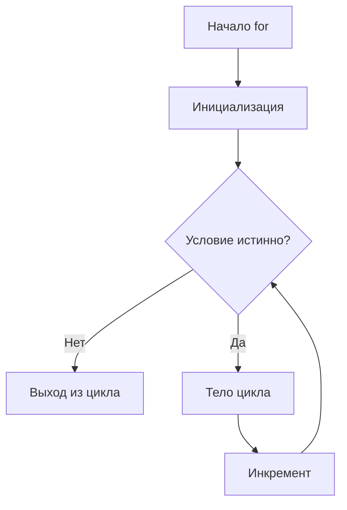
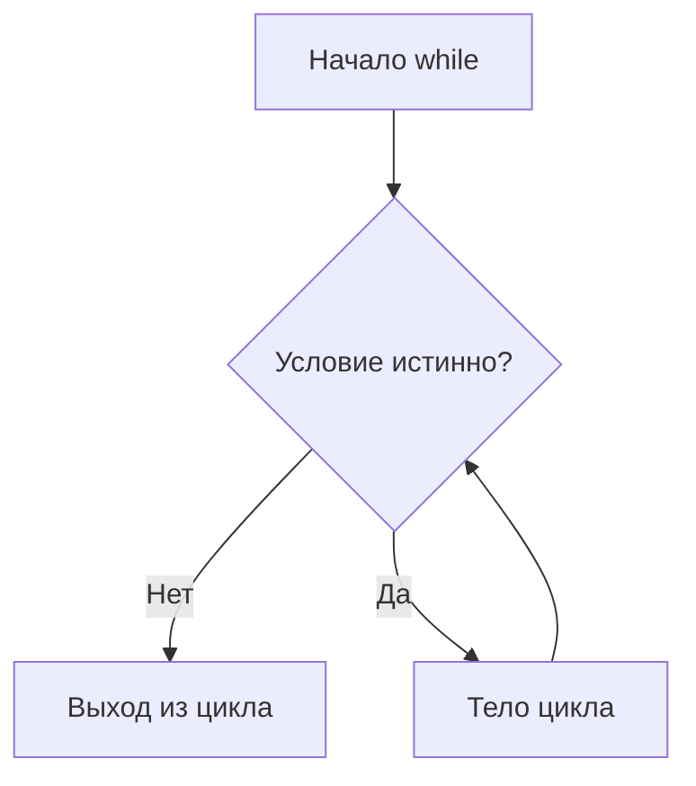
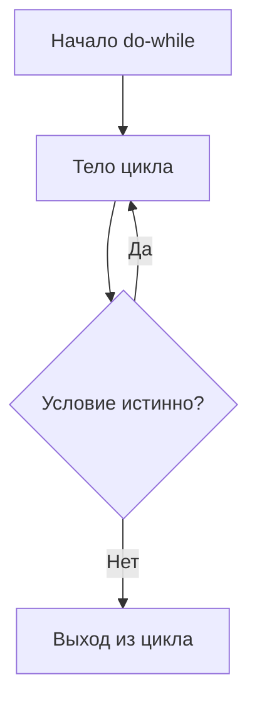

# 📚 Теория: Циклы в C++

## 🎯 Что такое циклы?

**Цикл** - это конструкция языка программирования, которая позволяет выполнять один и тот же блок кода **много раз** без его повторного написания.

---

## 1. Цикл `for` - Цикл со счетчиком

### Когда использовать?
Когда **точно знаем**, сколько раз нужно выполнить код.

### Синтаксис:
```cpp
for(инициализация; условие; шаг) {
    // тело цикла - выполняется многократно
}
```

### Пример:
```cpp
// Вывести числа от 1 до 5
for(int i = 1; i <= 5; i++) {
    cout << i << " ";  // Выполнится 5 раз
}
// Вывод: 1 2 3 4 5
```

### Разбор работы:
```cpp
for(int i = 0; i < 3; i++) {
    cout << "Шаг " << i << endl;
}
```

**Шаги выполнения:**
1. `int i = 0` - **Инициализация** (выполняется один раз в начале)
2. `i < 3` - **Проверка условия**
   - Если `true` → выполняем тело цикла
   - Если `false` → выходим из цикла
3. `cout << "Шаг " << i << endl;` - **Тело цикла**
4. `i++` - **Шг** (выполняется после каждой итерации)
5. Возвращаемся к пункту 2

**Визуализация:**
```
Инициализация (i=0)
    ↓
Проверка (i<3?) → false → Выход
    ↓ true
Тело цикла (выводим i)
    ↓
Шаг (i++) → i становится 1
    ↓
Проверка (i<3?) → и т.д.
```

### Варианты использования `for`:

**Обратный отсчет:**
```cpp
for(int i = 10; i > 0; i--) {
    cout << i << " ";
}
// Вывод: 10 9 8 7 6 5 4 3 2 1
```

**С шагом 2:**
```cpp
for(int i = 0; i < 10; i += 2) {
    cout << i << " ";
}
// Вывод: 0 2 4 6 8
```

**Бесконечный цикл:**
```cpp
for(;;) {  // Опасность! Нет условия выхода
    cout << "Бесконечный цикл!" << endl;
    // Нужен break для выхода
}
```

---

## 2. Цикл `while` - Цикл с предусловием

### Когда использовать?
Когда **не знаем заранее**, сколько раз нужно выполнить код, но знаем **условие продолжения**.

### Синтаксис:
```cpp
while(условие) {
    // тело цикла
}
```

### Пример:
```cpp
int i = 1;  // Инициализация счетчика
while(i <= 5) {  // Проверка условия
    cout << i << " ";
    i++;  // Изменение счетчика (важно!)
}
// Вывод: 1 2 3 4 5
```

### Ключевой момент:
**Условие проверяется ДО выполнения тела цикла.** Если условие ложно с самого начала, цикл не выполнится ни разу.

### Пример с вводом данных:
```cpp
int number;
cout << "Введите число (0 для выхода): ";
cin >> number;

while(number != 0) {  // Пока не ввели 0
    cout << "Вы ввели: " << number << endl;
    cout << "Введите следующее число: ";
    cin >> number;  // Изменяем условие
}
```

### Опасность бесконечного цикла:
```cpp
int i = 1;
while(i <= 5) {  // Ошибка! i не изменяется
    cout << "Зацикливание!" << endl;
    // Нет i++ → условие всегда true
}
```

---

## 3. Цикл `do-while` - Цикл с постусловием

### Когда использовать?
Когда нужно **гарантированно выполнить код хотя бы один раз**.

### Синтаксис:
```cpp
do {
    // тело цикла
} while(условие);  // Обратите внимание на точку с запятой!
```

### Пример:
```cpp
int number;
do {
    cout << "Введите положительное число: ";
    cin >> number;
} while(number <= 0);  // Повторять, пока число не положительное

cout << "Спасибо! Вы ввели: " << number << endl;
```

### Главное отличие от `while`:
- `while` - **сначала проверяет, потом выполняет**
- `do-while` - **сначала выполняет, потом проверяет**

### Наглядное сравнение:
```cpp
// while - может не выполниться ни разу
int x = 10;
while(x < 5) {  // Условие ложно
    cout << "Этот код не выполнится!";
}

// do-while - выполнится хотя бы раз
int y = 10;
do {
    cout << "Этот код выполнится 1 раз!";
} while(y < 5);  // Проверка после выполнения
```

---

## 4. Операторы управления циклами

### `break` - Немедленный выход из цикла

**Что делает:** Полностью прерывает выполнение цикла и передает управление следующей после цикла инструкции.

```cpp
for(int i = 1; i <= 10; i++) {
    if(i == 5) {
        break;  // Выходим из цикла при i=5
    }
    cout << i << " ";
}
// Вывод: 1 2 3 4 (цикл прерван на 5)
```

**Работает во всех типах циклов:**
```cpp
// В while
int i = 1;
while(true) {  // Бесконечный цикл
    if(i > 5) {
        break;  // Выходим при i>5
    }
    cout << i << " ";
    i++;
}
// Вывод: 1 2 3 4 5

// В do-while
int number;
do {
    cout << "Введите число (0 для выхода): ";
    cin >> number;
    if(number == 0) break;
    cout << "Квадрат: " << number * number << endl;
} while(true);
```

### `continue` - Переход к следующей итерации

**Что делает:** Пропускает оставшуюся часть текущей итерации и переходит к проверке условия следующей итерации.

```cpp
for(int i = 1; i <= 5; i++) {
    if(i == 3) {
        continue;  // Пропускаем итерацию с i=3
    }
    cout << i << " ";
}
// Вывод: 1 2 4 5 (3 пропущена)
```

**Важно:** `continue` не прерывает цикл, а только переходит к следующей итерации.

### Разница между `break` и `continue`:

```cpp
for(int i = 1; i <= 5; i++) {
    if(i == 3) {
        break;  // Выход из цикла
    }
    cout << i << " ";
}
// Вывод: 1 2 (цикл завершен)

for(int i = 1; i <= 5; i++) {
    if(i == 3) {
        continue;  // Пропуск итерации
    }
    cout << i << " ";
}
// Вывод: 1 2 4 5 (только 3 пропущена)
```

---

## 🔄 Сравнение всех типов циклов

| Особенность | `for` | `while` | `do-while` |
|------------|--------|---------|------------|
| **Когда использовать** | Известно количество повторений | Условие продолжения известно | Нужно выполнить хотя бы 1 раз |
| **Проверка условия** | Перед каждой итерацией | Перед каждой итерацией | После каждой итерации |
| **Счетчик** | Встроен в синтаксис | Нужен отдельно | Нужен отдельно |
| **Минимальное число выполнений** | 0 | 0 | 1 |
| **Пример** | Таблицы умножения | Чтение до маркера | Ввод с проверкой |

### Таблица эквивалентности:

**`for` → `while`:**
```cpp
// for
for(инициализация; условие; шаг) {
    тело;
}

// Эквивалентный while
инициализация;
while(условие) {
    тело;
    шаг;
}
```

**Пример преобразования:**
```cpp
// Исходный for
for(int i = 0; i < 5; i++) {
    cout << i << endl;
}

// Эквивалентный while
int i = 0;        // инициализация
while(i < 5) {    // условие
    cout << i << endl;
    i++;          // шаг
}
```

---

## 🎮 Практические паттерны использования

### 1. Обработка последовательностей
```cpp
// Чтение чисел до маркера
int sum = 0, number;
cout << "Вводите числа (0 для завершения): ";
cin >> number;

while(number != 0) {
    sum += number;
    cin >> number;
}
cout << "Сумма: " << sum;
```

### 2. Поиск в массивах
```cpp
int numbers[] = {5, 3, 8, 1, 9};
int search = 8;
bool found = false;

for(int i = 0; i < 5; i++) {
    if(numbers[i] == search) {
        found = true;
        break;  // Нашли - выходим
    }
}
```

### 3. Вложенные циклы (матрицы, таблицы)
```cpp
// Таблица умножения
for(int i = 1; i <= 10; i++) {        // Строки
    for(int j = 1; j <= 10; j++) {    // Столбцы
        cout << i * j << "\t";
    }
    cout << endl;
}
```

### 4. Меню программы
```cpp
char choice;
do {
    cout << "\nМеню:\n1. Опция 1\n2. Опция 2\n0. Выход\nВыберите: ";
    cin >> choice;
    
    switch(choice) {
        case '1': /* код */ break;
        case '2': /* код */ break;
        case '0': cout << "Выход\n"; break;
        default: cout << "Неверный выбор\n";
    }
} while(choice != '0');
```

---

## ⚠️ Типичные ошибки начинающих

### 1. Бесконечные циклы
```cpp
// Ошибка: отсутствует изменение условия
int i = 0;
while(i < 10) {
    cout << i << endl;
    // Нет i++ → бесконечный цикл!
}

// Решение: всегда проверяйте изменение переменных
```

### 2. Неправильные границы
```cpp
// Хотели от 1 до 10, получили от 0 до 9
for(int i = 0; i < 10; i++) {
    cout << i << " ";
}
// Вывод: 0 1 2 3 4 5 6 7 8 9

// Правильно:
for(int i = 1; i <= 10; i++) {
    cout << i << " ";
}
// Вывод: 1 2 3 4 5 6 7 8 9 10
```

### 3. Точка с запятой после условия
```cpp
// Ошибка: точка с запятой после условия
for(int i = 0; i < 5; i++); {  // ← ОШИБКА!
    cout << "Hello";  // Выполнится только 1 раз!
}

// while с той же ошибкой
int i = 0;
while(i < 5); {  // ← ОШИБКА!
    cout << i;
    i++;
}
```

### 4. Использование `=` вместо `==`
```cpp
// Ошибка: присваивание вместо сравнения
int x = 5;
while(x = 10) {  // ← Присваивает 10, а не сравнивает!
    cout << "Бесконечный цикл!";
    // x всегда = 10, условие всегда true
}

// Правильно:
while(x == 10) {  // ← Сравнение
    // ...
}
```

---

## 🏆 Правила выбора типа цикла

### Выберите `for`, если:
- ✓ Знаете точное количество повторений
- ✓ Нужен счетчик с автоматическим изменением
- ✓ Работаете с массивами по индексам
- ✓ Нужен обратный отсчет или нестандартный шаг

### Выберите `while`, если:
- ✓ Не знаете количество повторений заранее
- ✓ Условие продолжения сложное
- ✓ Читаете данные до маркера конца
- ✓ Может потребоваться 0 повторений

### Выберите `do-while`, если:
- ✓ Нужно выполнить код хотя бы 1 раз
- ✓ Запрашиваете ввод с проверкой
- ✓ Создаете интерактивное меню
- ✓ Повтор действия до успеха

---

## 🔧 Лучшие практики

### 1. Именование счетчиков
```cpp
// Плохо:
for(int a = 0; a < n; a++)  // Что такое 'a'?

// Хорошо:
for(int studentIndex = 0; studentIndex < studentCount; studentIndex++)
for(int row = 0; row < rows; row++)
for(int attempt = 1; attempt <= maxAttempts; attempt++)
```

### 2. Избегание магических чисел
```cpp
// Плохо:
for(int i = 0; i < 100; i++)  // Почему 100?

// Хорошо:
const int MAX_ATTEMPTS = 100;
const int STUDENT_COUNT = 30;

for(int i = 0; i < MAX_ATTEMPTS; i++)
```

### 3. Проверка граничных условий
```cpp
// Всегда проверяйте:
// - Начальное значение
// - Условие выхода
// - Изменение счетчика

for(int i = start; i <= end; i += step) {
    // Убедитесь, что:
    // 1. start имеет смысл
    // 2. условие i <= end или i < end
    // 3. step не равен 0
}
```

### 4. Комментарии для сложных циклов
```cpp
// Поиск простых чисел методом решета Эратосфена
for(int i = 2; i * i <= n; i++) {
    if(isPrime[i]) {
        // Вычеркиваем кратные i, начиная с i*i
        for(int j = i * i; j <= n; j += i) {
            isPrime[j] = false;
        }
    }
}
```

---

## 📊 Сводная таблица операторов

| Оператор | Действие | Пример | Результат |
|----------|----------|---------|-----------|
| `i++` | Пост-инкремент | `a = i++` | `a = i`, потом `i = i + 1` |
| `++i` | Пре-инкремент | `a = ++i` | `i = i + 1`, потом `a = i` |
| `i--` | Пост-декремент | `a = i--` | `a = i`, потом `i = i - 1` |
| `--i` | Пре-декремент | `a = --i` | `i = i - 1`, потом `a = i` |
| `i += 2` | Увеличить на 2 | `i += 2` | `i = i + 2` |
| `i -= 3` | Уменьшить на 3 | `i -= 3` | `i = i - 3` |
| `i *= 2` | Умножить на 2 | `i *= 2` | `i = i * 2` |
| `i /= 2` | Разделить на 2 | `i /= 2` | `i = i / 2` |

---

## 🎓 Итоговая памятка

### Для запоминания:
1. **`for`** - "от и до" с шагом
2. **`while`** - "пока верно условие"
3. **`do-while`** - "сделай, затем проверь"
4. **`break`** - "стоп, выходим"
5. **`continue`** - "пропусти эту итерацию"

### Золотые правила:
1. Всегда проверяйте изменение условия в цикле
2. Избегайте бесконечных циклов
3. Используйте подходящий тип цикла для задачи
4. Тестируйте граничные случаи
5. Комментируйте сложные циклы


# **Глубокий разбор циклов в C++: for, while, do-while, break, continue**

## **🎯 Фундаментальные концепции: Зачем нужны циклы?**

Циклы — это механизм **повторного выполнения** блока кода. В реальном программировании:
- 90% задач требуют обработки коллекций данных
- 80% времени выполнения программы приходится на циклы
- Циклы — основа алгоритмического мышления

**Базовое представление процессора:**
```assembly
; Ассемблерный эквивалент цикла
mov ecx, 10       ; счетчик = 10
loop_start:
    ; тело цикла
    dec ecx        ; счетчик--
    jnz loop_start ; если не ноль, вернуться к началу
```

---

## **1. ЦИКЛ FOR: Детальный анализ**

### **Каноническая форма:**
```cpp
for (инициализация; условие; инкремент) {
    тело_цикла;
}
```

### **Диаграмма выполнения:**


### **Полный разбор семантики:**
```cpp
// ==============================================
// Файл: 01_for_loop_detailed.cpp
// Детальный анализ цикла for
// ==============================================

#include <iostream>
#include <vector>
using namespace std;

int main() {
    cout << "=== ГЛУБОКИЙ АНАЛИЗ ЦИКЛА FOR ===\n" << endl;
    
    // Пример 1: Классический for
    cout << "1. Классический for (C-style):" << endl;
    for (int i = 0; i < 5; i++) {  // i существует только в цикле
        cout << "i = " << i << endl;
    }
    // i здесь уже не существует
    
    // Что происходит на каждом шаге:
    // 1. int i = 0;     // Инициализация (1 раз)
    // 2. i < 5          // Проверка условия (перед каждой итерацией)
    // 3. cout << ...    // Тело цикла
    // 4. i++            // Инкремент (после каждой итерации)
    // 5. Вернуться к шагу 2
    
    // Пример 2: Несколько переменных в инициализации
    cout << "\n2. Несколько переменных:" << endl;
    for (int i = 0, j = 10; i < 5 && j > 5; i++, j--) {
        cout << "i = " << i << ", j = " << j << endl;
    }
    
    // Пример 3: Отсутствие частей
    cout << "\n3. Вариации синтаксиса:" << endl;
    
    // Без инициализации (переменная объявлена ранее)
    int k = 0;
    for (; k < 3; k++) {
        cout << "k = " << k << endl;
    }
    
    // Без инкремента в заголовке
    for (int m = 0; m < 3; ) {
        cout << "m = " << m << endl;
        m++;  // Инкремент в теле
    }
    
    // Бесконечный цикл (все части опущены)
    // for (;;) { /* бесконечный цикл */ }
    
    // Пример 4: Нестандартный инкремент
    cout << "\n4. Различные виды инкремента:" << endl;
    
    // Обратный счет
    for (int i = 5; i > 0; i--) {
        cout << i << " ";
    }
    cout << endl;
    
    // Шаг 2
    for (int i = 0; i < 10; i += 2) {
        cout << i << " ";
    }
    cout << endl;
    
    // Умножение
    for (int i = 1; i <= 16; i *= 2) {
        cout << i << " ";
    }
    cout << endl;
    
    // Пример 5: For с пользовательскими типами
    cout << "\n5. Пользовательские типы:" << endl;
    
    class Counter {
        int value;
    public:
        Counter(int v) : value(v) {}
        bool operator<(int limit) const { return value < limit; }
        Counter& operator++() { value++; return *this; }
        int get() const { return value; }
    };
    
    for (Counter c(0); c < 5; ++c) {
        cout << "Counter = " << c.get() << endl;
    }
    
    // Пример 6: Область видимости
    cout << "\n6. Область видимости переменных цикла:" << endl;
    
    // C++98: переменная видна после цикла
    int old_i;
    for (old_i = 0; old_i < 3; old_i++) {}
    cout << "old_i после цикла: " << old_i << endl;
    
    // C++11: переменная НЕ видна после цикла
    for (int new_i = 0; new_i < 3; new_i++) {}
    // cout << new_i;  // Ошибка: new_i не существует
    
    // Пример 7: Вложенные циклы
    cout << "\n7. Вложенные циклы (таблица умножения):" << endl;
    for (int i = 1; i <= 3; i++) {
        for (int j = 1; j <= 3; j++) {
            cout << i << " × " << j << " = " << i * j << "\t";
        }
        cout << endl;
    }
    
    return 0;
}
```

### **Оптимизация цикла for компилятором:**
```cpp
// Исходный код:
for (int i = 0; i < 1000; i++) {
    array[i] = i * 2;
}

// Оптимизированный ассемблерный код (пример):
mov ecx, 0           ; i = 0
lea rdx, [array]     ; адрес массива
loop_start:
mov [rdx + rcx*4], ecx  ; array[i] = i
add ecx, 2            ; i += 1 (с учётом *2)
cmp ecx, 2000         ; сравнение с 1000*2
jl loop_start
```

---

## **2. RANGE-BASED FOR (C++11): Современный подход**

### **Синтаксис и семантика:**
```cpp
for (тип элемент : контейнер) {
    // работа с элементом
}
```

### **Детальный разбор:**
```cpp
// ==============================================
// Файл: 02_range_based_for.cpp
// Range-based for (C++11 и выше)
// ==============================================

#include <iostream>
#include <vector>
#include <array>
#include <list>
#include <map>
#include <string>
using namespace std;

int main() {
    cout << "=== RANGE-BASED FOR (C++11+) ===\n" << endl;
    
    // Пример 1: Массив
    cout << "1. Массивы:" << endl;
    int arr[] = {1, 2, 3, 4, 5};
    
    // Копирование элементов (по значению)
    for (int x : arr) {  // x - копия элемента
        cout << x << " ";
        x = 0;  // Не влияет на исходный массив!
    }
    cout << "\nИсходный массив: ";
    for (int x : arr) cout << x << " ";
    cout << endl;
    
    // Ссылка (изменяет оригинал)
    for (int& x : arr) {
        x *= 2;  // Удваиваем каждый элемент
    }
    cout << "После удвоения: ";
    for (int x : arr) cout << x << " ";
    cout << endl;
    
    // Константная ссылка (только чтение)
    for (const int& x : arr) {
        cout << x << " ";  // Можно только читать
        // x = 0;  // Ошибка компиляции
    }
    cout << endl;
    
    // Пример 2: STL контейнеры
    cout << "\n2. STL контейнеры:" << endl;
    vector<string> words = {"apple", "banana", "cherry"};
    
    for (const string& word : words) {
        cout << word << " ";
    }
    cout << endl;
    
    // Пример 3: Автоматическое определение типа
    cout << "\n3. Auto type deduction:" << endl;
    
    for (auto& word : words) {  // auto = string
        word += "!";  // Добавляем восклицательный знак
    }
    
    for (const auto& word : words) {
        cout << word << " ";
    }
    cout << endl;
    
    // Пример 4: Пользовательские контейнеры
    cout << "\n4. Пользовательские типы:" << endl;
    
    class SimpleContainer {
        int data[5] = {10, 20, 30, 40, 50};
    public:
        // Для range-based for нужны begin() и end()
        int* begin() { return data; }
        int* end() { return data + 5; }
        const int* begin() const { return data; }
        const int* end() const { return data + 5; }
    };
    
    SimpleContainer container;
    for (int val : container) {
        cout << val << " ";
    }
    cout << endl;
    
    // Пример 5: Initializer list
    cout << "\n5. Initializer lists:" << endl;
    for (int x : {1, 1, 2, 3, 5, 8}) {  // Фибоначчи
        cout << x << " ";
    }
    cout << endl;
    
    // Пример 6: Range-based for с map
    cout << "\n6. Ассоциативные контейнеры:" << endl;
    map<int, string> id_to_name = {
        {1, "Alice"},
        {2, "Bob"},
        {3, "Charlie"}
    };
    
    // Элементы map - пары (key, value)
    for (const auto& pair : id_to_name) {
        cout << "ID: " << pair.first 
             << ", Name: " << pair.second << endl;
    }
    
    // C++17: Structured bindings
    cout << "\n7. Structured bindings (C++17):" << endl;
    for (const auto& [id, name] : id_to_name) {
        cout << "ID: " << id << ", Name: " << name << endl;
    }
    
    // Пример 7: Вложенные range-based for
    cout << "\n8. Вложенные циклы:" << endl;
    vector<vector<int>> matrix = {
        {1, 2, 3},
        {4, 5, 6},
        {7, 8, 9}
    };
    
    for (const auto& row : matrix) {
        for (int val : row) {
            cout << val << " ";
        }
        cout << endl;
    }
    
    return 0;
}
```

### **Как компилятор преобразует range-based for:**
```cpp
// Исходный код:
for (auto& x : container) {
    x.process();
}

// Преобразуется компилятором в:
{
    auto&& __range = container;
    auto __begin = begin(__range);
    auto __end = end(__range);
    for (; __begin != __end; ++__begin) {
        auto& x = *__begin;
        x.process();
    }
}
```

---

## **3. ЦИКЛ WHILE: Детальный анализ**

### **Форма и семантика:**
```cpp
while (условие) {
    тело_цикла;
}
```

### **Диаграмма выполнения:**


### **Полный разбор:**
```cpp
// ==============================================
// Файл: 03_while_loop_detailed.cpp
// Детальный анализ цикла while
// ==============================================

#include <iostream>
#include <random>
#include <ctime>
#include <cmath>
using namespace std;

int main() {
    cout << "=== ГЛУБОКИЙ АНАЛИЗ ЦИКЛА WHILE ===\n" << endl;
    
    // Пример 1: Базовый while
    cout << "1. Базовый while:" << endl;
    int counter = 0;
    while (counter < 5) {  // Условие проверяется ПЕРЕД итерацией
        cout << "counter = " << counter << endl;
        counter++;  // Инкремент в теле
    }
    
    // Ключевое отличие от for:
    // for: инициализация, условие, инкремент в заголовке
    // while: только условие в заголовке
    
    // Пример 2: While для обработки ввода
    cout << "\n2. Обработка пользовательского ввода:" << endl;
    /*
    int sum = 0;
    int value;
    cout << "Вводите числа (0 для завершения): ";
    
    while (cin >> value && value != 0) {
        sum += value;
    }
    cout << "Сумма: " << sum << endl;
    */
    
    // Пример 3: While с сложным условием
    cout << "\n3. Сложные условия:" << endl;
    int x = 10;
    int y = 20;
    
    while (x < 15 && y > 15) {
        cout << "x = " << x << ", y = " << y << endl;
        x++;
        y--;
    }
    
    // Пример 4: Бесконечный while
    cout << "\n4. Бесконечные циклы:" << endl;
    /*
    // Вариант 1: явное true
    while (true) {
        // Бесконечный цикл
        // Нужен break для выхода
    }
    
    // Вариант 2: условие всегда истинно
    int flag = 1;
    while (flag) {  // flag никогда не становится 0
        // ...
    }
    */
    
    // Пример 5: While с инвариантами
    cout << "\n5. Инварианты цикла:" << endl;
    // Инвариант - условие, которое истинно перед каждой итерацией
    
    int n = 10;
    int factorial = 1;
    int i = 1;
    
    // Инвариант: factorial = (i-1)!
    while (i <= n) {
        factorial *= i;  // Теперь factorial = i!
        i++;             // Теперь factorial = (i-1)!
        // Инвариант восстановлен
    }
    cout << n << "! = " << factorial << endl;
    
    // Пример 6: While для обработки строк
    cout << "\n6. Обработка строк:" << endl;
    string text = "Hello, World!";
    size_t pos = 0;
    
    // Найти все пробелы
    while ((pos = text.find(' ', pos)) != string::npos) {
        cout << "Пробел в позиции: " << pos << endl;
        pos++;  // Ищем с следующей позиции
    }
    
    // Пример 7: Сравнение for и while
    cout << "\n7. Эквивалентность for и while:" << endl;
    
    // Этот for:
    for (int i = 0; i < 3; i++) {
        cout << "for: " << i << endl;
    }
    
    // Эквивалентен этому while:
    {
        int i = 0;          // Инициализация
        while (i < 3) {     // Условие
            cout << "while: " << i << endl;
            i++;            // Инкремент
        }
    }
    
    // Правило: любой for можно переписать как while
    // Обратное не всегда верно
    
    // Пример 8: While для симуляции
    cout << "\n8. Симуляция процессов:" << endl;
    
    // Симуляция падения мяча с отскоком
    double height = 10.0;  // начальная высота
    const double gravity = 9.81;
    const double restitution = 0.8;  // упругость
    const double threshold = 0.01;   // порог остановки
    
    int bounces = 0;
    while (height > threshold) {
        // Время падения: t = sqrt(2h/g)
        double time_to_fall = sqrt(2 * height / gravity);
        
        cout << "Отскок " << ++bounces 
             << ": высота = " << height 
             << " м, время падения = " << time_to_fall << " с" << endl;
        
        // Новая высота после отскока
        height *= restitution * restitution;  // энергия теряется дважды
    }
    
    cout << "Мяч остановился после " << bounces << " отскоков" << endl;
    
    return 0;
}
```

---

## **4. ЦИКЛ DO-WHILE: Уникальные особенности**

### **Форма и семантика:**
```cpp
do {
    тело_цикла;
} while (условие);
```

### **Диаграмма выполнения:**


### **Полный разбор:**
```cpp
// ==============================================
// Файл: 04_do_while_detailed.cpp
// Детальный анализ цикла do-while
// ==============================================

#include <iostream>
#include <string>
#include <random>
using namespace std;

int main() {
    cout << "=== ГЛУБОКИЙ АНАЛИЗ ЦИКЛА DO-WHILE ===\n" << endl;
    
    // Ключевая особенность: тело выполняется ХОТЯ БЫ ОДИН РАЗ
    // Условие проверяется ПОСЛЕ итерации
    
    // Пример 1: Базовый do-while
    cout << "1. Базовый do-while:" << endl;
    int count = 0;
    
    do {
        cout << "Это сообщение выведется хотя бы 1 раз" << endl;
        count++;
    } while (count < 3);
    
    // Пример 2: Сравнение while и do-while
    cout << "\n2. Сравнение while и do-while:" << endl;
    
    // While: проверка ПЕРЕД выполнением
    int w = 5;
    while (w < 5) {
        cout << "while: это не выполнится" << endl;
        w++;
    }
    
    // Do-while: проверка ПОСЛЕ выполнения
    int d = 5;
    do {
        cout << "do-while: это выполнится 1 раз" << endl;
        d++;
    } while (d < 5);
    
    // Пример 3: Меню пользователя
    cout << "\n3. Меню пользователя (классический пример):" << endl;
    /*
    int choice;
    do {
        cout << "\n=== МЕНЮ ===" << endl;
        cout << "1. Опция 1" << endl;
        cout << "2. Опция 2" << endl;
        cout << "3. Выход" << endl;
        cout << "Выберите: ";
        cin >> choice;
        
        switch (choice) {
            case 1: cout << "Выбрана опция 1"; break;
            case 2: cout << "Выбрана опция 2"; break;
            case 3: cout << "Выход..."; break;
            default: cout << "Неверный выбор"; break;
        }
    } while (choice != 3);
    */
    
    // Пример 4: Валидация ввода
    cout << "\n4. Валидация пользовательского ввода:" << endl;
    
    int age;
    bool valid_input = false;
    
    do {
        cout << "Введите возраст (1-120): ";
        // if (cin >> age) {
        //     if (age >= 1 && age <= 120) {
        //         valid_input = true;
        //     } else {
        //         cout << "Возраст должен быть от 1 до 120!" << endl;
        //     }
        // } else {
        //     cout << "Неверный формат!" << endl;
        //     cin.clear();
        //     cin.ignore(numeric_limits<streamsize>::max(), '\n');
        // }
    } while (!valid_input);
    
    cout << "Возраст принят: " << age << endl;
    
    // Пример 5: Игры и симуляции
    cout << "\n5. Игровые циклы:" << endl;
    
    random_device rd;
    mt19937 gen(rd());
    uniform_int_distribution<> dis(1, 100);
    
    int secret_number = dis(gen);
    int attempts = 0;
    int guess;
    bool guessed = false;
    
    cout << "Угадайте число от 1 до 100" << endl;
    
    do {
        // cout << "Ваша попытка: ";
        // cin >> guess;
        guess = 50;  // для примера
        
        attempts++;
        
        if (guess < secret_number) {
            cout << "Слишком маленькое!" << endl;
        } else if (guess > secret_number) {
            cout << "Слишком большое!" << endl;
        } else {
            guessed = true;
            cout << "Поздравляю! Вы угадали за " << attempts << " попыток" << endl;
        }
    } while (!guessed);
    
    // Пример 6: Обработка до первого успеха
    cout << "\n6. Повтор до успеха:" << endl;
    
    int max_attempts = 5;
    int current_attempt = 0;
    bool success = false;
    
    do {
        current_attempt++;
        cout << "Попытка " << current_attempt << " из " << max_attempts << endl;
        
        // Имитация операции с 30% шансом успеха
        // success = (dis(gen) <= 30);
        success = (current_attempt == 3);  // Успех на 3-й попытке
        
        if (success) {
            cout << "Успех!" << endl;
        } else if (current_attempt < max_attempts) {
            cout << "Неудача, пробуем снова..." << endl;
        } else {
            cout << "Достигнут лимит попыток" << endl;
        }
    } while (!success && current_attempt < max_attempts);
    
    // Пример 7: Обработка последовательностей
    cout << "\n7. Обработка до определенного условия:" << endl;
    
    // Чтение чисел до отрицательного
    vector<int> numbers;
    int num;
    
    cout << "Введите положительные числа (отрицательное для завершения):" << endl;
    /*
    do {
        cin >> num;
        if (num >= 0) {
            numbers.push_back(num);
        }
    } while (num >= 0);
    */
    
    cout << "Введено " << numbers.size() << " чисел" << endl;
    
    return 0;
}
```

---

## **5. ОПЕРАТОРЫ BREAK И CONTINUE: Контроль потока**

### **Break - немедленный выход из цикла**
```cpp
// ==============================================
// Файл: 05_break_continue.cpp
// Детальный анализ break и continue
// ==============================================

#include <iostream>
#include <vector>
#include <algorithm>
#include <cmath>
using namespace std;

int main() {
    cout << "=== BREAK И CONTINUE: КОНТРОЛЬ ПОТОКА ===\n" << endl;
    
    // BREAK: немедленный выход из текущего цикла
    // CONTINUE: переход к следующей итерации
    
    // Пример 1: Break для досрочного выхода
    cout << "1. Оператор break:" << endl;
    
    // Поиск первого отрицательного числа
    vector<int> numbers = {5, 3, -2, 8, -1, 4};
    
    for (int num : numbers) {
        if (num < 0) {
            cout << "Найдено первое отрицательное число: " << num << endl;
            break;  // Выход из цикла
        }
        cout << "Проверяем " << num << " (положительное)" << endl;
    }
    
    // Пример 2: Continue для пропуска итерации
    cout << "\n2. Оператор continue:" << endl;
    
    // Сумма только положительных чисел
    int sum = 0;
    for (int num : numbers) {
        if (num < 0) {
            cout << "Пропускаем отрицательное: " << num << endl;
            continue;  // Пропустить остаток итерации
        }
        sum += num;
        cout << "Добавляем " << num << ", сумма = " << sum << endl;
    }
    cout << "Итоговая сумма положительных: " << sum << endl;
    
    // Пример 3: Break во вложенных циклах
    cout << "\n3. Break во вложенных циклах:" << endl;
    
    // Поиск в матрице
    vector<vector<int>> matrix = {
        {1, 2, 3},
        {4, 5, 6},
        {7, 8, 9}
    };
    
    int target = 5;
    bool found = false;
    
    for (size_t i = 0; i < matrix.size(); i++) {
        for (size_t j = 0; j < matrix[i].size(); j++) {
            if (matrix[i][j] == target) {
                cout << "Найдено " << target << " на позиции [" 
                     << i << "][" << j << "]" << endl;
                found = true;
                break;  // Выход только из внутреннего цикла!
            }
        }
        if (found) break;  // Выход из внешнего цикла
    }
    
    // Пример 4: Метка для выхода из вложенных циклов
    cout << "\n4. Метки (не в C++, но в других языках):" << endl;
    
    // В C++ нет меток для break/continue
    // Альтернатива: флаги или goto (не рекомендуется)
    
    found = false;
    for (size_t i = 0; i < matrix.size() && !found; i++) {
        for (size_t j = 0; j < matrix[i].size(); j++) {
            if (matrix[i][j] == target) {
                cout << "Найдено с флагом" << endl;
                found = true;
                break;
            }
        }
    }
    
    // Пример 5: Continue с меткой в других языках
    cout << "\n5. Эмуляция сложных сценариев:" << endl;
    
    // Обработка только диагональных элементов
    for (size_t i = 0; i < matrix.size(); i++) {
        for (size_t j = 0; j < matrix[i].size(); j++) {
            if (i != j) continue;  // Пропустить недиагональные
            
            cout << "Диагональный элемент [" << i << "][" << j 
                 << "] = " << matrix[i][j] << endl;
        }
    }
    
    // Пример 6: Бесконечные циклы с break
    cout << "\n6. Бесконечные циклы с условием выхода:" << endl;
    
    int attempts = 0;
    const int max_attempts = 10;
    
    while (true) {  // Бесконечный цикл
        attempts++;
        cout << "Попытка " << attempts << endl;
        
        // Условие выхода
        if (attempts >= max_attempts) {
            cout << "Достигнут лимит попыток" << endl;
            break;
        }
        
        // Успешное завершение
        if (attempts == 5) {
            cout << "Успех на 5-й попытке!" << endl;
            break;
        }
    }
    
    // Пример 7: Continue в do-while
    cout << "\n7. Continue в do-while (особенности):" << endl;
    
    int n = 0;
    do {
        n++;
        
        if (n % 2 == 0) {
            continue;  // Пропустить четные числа
        }
        
        cout << n << " ";
        
        // В do-while continue переходит к проверке условия!
        // Это важно: условие проверяется ПОСЛЕ continue
        
    } while (n < 10);
    cout << endl;
    
    // Пример 8: Оптимизация с break/continue
    cout << "\n8. Оптимизация производительности:" << endl;
    
    // Поиск простых чисел с оптимизацией
    vector<int> primes;
    const int limit = 30;
    
    for (int num = 2; num <= limit; num++) {
        bool is_prime = true;
        
        // Проверка деления на числа до sqrt(num)
        for (int divisor = 2; divisor * divisor <= num; divisor++) {
            if (num % divisor == 0) {
                is_prime = false;
                break;  // Не простое, дальше проверять не нужно
            }
        }
        
        if (is_prime) {
            primes.push_back(num);
        }
    }
    
    cout << "Простые числа до " << limit << ": ";
    for (int p : primes) cout << p << " ";
    cout << endl;
    
    return 0;
}
```

---

## **6. ОПТИМИЗАЦИЯ ЦИКЛОВ: Производительность**

### **Критические аспекты производительности:**
```cpp
// ==============================================
// Файл: 06_loop_optimization.cpp
// Оптимизация циклов для производительности
// ==============================================

#include <iostream>
#include <vector>
#include <chrono>
#include <random>
#include <numeric>
using namespace std;
using namespace chrono;

// Вспомогательные функции для измерений
template<typename Func>
double measure_time(Func f, int iterations = 100) {
    auto start = high_resolution_clock::now();
    f();
    auto end = high_resolution_clock::now();
    return duration_cast<duration<double>>(end - start).count();
}

int main() {
    cout << "=== ОПТИМИЗАЦИЯ ЦИКЛОВ ===\n" << endl;
    
    const int SIZE = 1000000;
    vector<double> data(SIZE);
    
    // Заполняем случайными данными
    random_device rd;
    mt19937 gen(rd());
    uniform_real_distribution<> dis(0.0, 100.0);
    
    for (auto& val : data) {
        val = dis(gen);
    }
    
    // Пример 1: Loop unrolling (развертывание цикла)
    cout << "1. Loop unrolling:" << endl;
    
    double sum1 = 0.0, sum2 = 0.0;
    
    // Обычный цикл
    auto time1 = measure_time([&]() {
        for (int i = 0; i < SIZE; i++) {
            sum1 += data[i];
        }
    });
    
    // Развернутый цикл (4 итерации за раз)
    auto time2 = measure_time([&]() {
        int i = 0;
        int limit = SIZE - 4;
        
        // Основная часть
        for (; i < limit; i += 4) {
            sum2 += data[i] + data[i+1] + data[i+2] + data[i+3];
        }
        
        // Остаток
        for (; i < SIZE; i++) {
            sum2 += data[i];
        }
    });
    
    cout << "Обычный цикл: " << time1 << " сек, сумма = " << sum1 << endl;
    cout << "Развернутый цикл: " << time2 << " сек, сумма = " << sum2 << endl;
    cout << "Ускорение: " << (time1 / time2) << "x" << endl;
    
    // Пример 2: Hoisting инвариантов
    cout << "\n2. Hoisting инвариантов:" << endl;
    
    const double factor = 3.14159;
    vector<double> result1(SIZE), result2(SIZE);
    
    // Плохо: вычисление инварианта в цикле
    auto time3 = measure_time([&]() {
        for (int i = 0; i < SIZE; i++) {
            result1[i] = data[i] * sin(factor * 2.0);  // sin вычисляется SIZE раз
        }
    });
    
    // Хорошо: вычисление инварианта вне цикла
    auto time4 = measure_time([&]() {
        double invariant = sin(factor * 2.0);  // Один раз!
        for (int i = 0; i < SIZE; i++) {
            result2[i] = data[i] * invariant;
        }
    });
    
    cout << "Без hoisting: " << time3 << " сек" << endl;
    cout << "С hoisting: " << time4 << " сек" << endl;
    cout << "Ускорение: " << (time3 / time4) << "x" << endl;
    
    // Пример 3: Минимизация обращений к памяти
    cout << "\n3. Локализация данных:" << endl;
    
    // Плохо: много обращений к памяти
    vector<vector<double>> matrix(1000, vector<double>(1000));
    
    auto time5 = measure_time([&]() {
        for (size_t i = 0; i < matrix.size(); i++) {
            for (size_t j = 0; j < matrix[i].size(); j++) {
                matrix[i][j] = i + j;  // Неоптимальный доступ
            }
        }
    });
    
    auto time6 = measure_time([&]() {
        for (size_t i = 0; i < matrix.size(); i++) {
            // Локальная ссылка на строку
            auto& row = matrix[i];
            for (size_t j = 0; j < row.size(); j++) {
                row[j] = i + j;  // Более эффективный доступ
            }
        }
    });
    
    cout << "Прямой доступ: " << time5 << " сек" << endl;
    cout << "С локальной ссылкой: " << time6 << " сек" << endl;
    cout << "Ускорение: " << (time5 / time6) << "x" << endl;
    
    // Пример 4: Strength reduction
    cout << "\n4. Strength reduction:" << endl;
    
    // Замена дорогих операций дешевыми
    vector<double> output1(SIZE), output2(SIZE);
    
    auto time7 = measure_time([&]() {
        for (int i = 0; i < SIZE; i++) {
            output1[i] = data[i] / 2.0;  // Деление
        }
    });
    
    auto time8 = measure_time([&]() {
        double half = 0.5;
        for (int i = 0; i < SIZE; i++) {
            output2[i] = data[i] * half;  // Умножение (быстрее)
        }
    });
    
    cout << "Деление: " << time7 << " сек" << endl;
    cout << "Умножение: " << time8 << " сек" << endl;
    cout << "Ускорение: " << (time7 / time8) << "x" << endl;
    
    // Пример 5: Предвычисление условий
    cout << "\n5. Предвычисление условий:" << endl;
    
    int threshold = 50;
    int count1 = 0, count2 = 0;
    
    auto time9 = measure_time([&]() {
        for (double val : data) {
            if (val > threshold && val < 100) {  // Два сравнения
                count1++;
            }
        }
    });
    
    auto time10 = measure_time([&]() {
        // Предвычисляем верхнюю границу
        bool check_upper = (threshold < 100);
        for (double val : data) {
            if (val > threshold && check_upper) {  // Одно сравнение
                count2++;
            }
        }
    });
    
    cout << "Без предвычисления: " << time9 << " сек" << endl;
    cout << "С предвычислением: " << time10 << " сек" << endl;
    cout << "Ускорение: " << (time9 / time10) << "x" << endl;
    
    // Пример 6: Векторизация (компиляторная оптимизация)
    cout << "\n6. Автоматическая векторизация:" << endl;
    
    vector<double> vec1(SIZE), vec2(SIZE), vec3(SIZE);
    
    // Простой цикл - компилятор может векторизовать
    auto time11 = measure_time([&]() {
        for (int i = 0; i < SIZE; i++) {
            vec3[i] = vec1[i] + vec2[i];  // SIMD-оптимизация возможна
        }
    });
    
    // Сложный цикл - может мешать векторизации
    auto time12 = measure_time([&]() {
        for (int i = 0; i < SIZE; i++) {
            if (vec1[i] > 0) {  // Ветвление мешает векторизации
                vec3[i] = vec1[i] + vec2[i];
            }
        }
    });
    
    cout << "Простой цикл (векторизуемый): " << time11 << " сек" << endl;
    cout << "Сложный цикл: " << time12 << " сек" << endl;
    
    return 0;
}
```

---


# 📝 Задание: Освоение циклов в C++ 

## 🎯 Цель урока
Освоить все виды циклов в C++, научиться решать практические задачи с использованием циклов, операторов break и continue.


---

## 📚 Часть 1: Теория 

### 1. Цикл `for` - когда знаем количество повторений
```cpp
// Синтаксис: for(начало; условие; шаг) { тело }
for(int i = 0; i < 5; i++) {
    cout << "Итерация: " << i << endl;
}
// Выведет: 0, 1, 2, 3, 4
```

### 2. Цикл `while` - пока условие истинно
```cpp
int i = 0;
while(i < 5) {
    cout << "i = " << i << endl;
    i++; // Важно менять условие!
}
```

### 3. Цикл `do-while` - выполнить хотя бы один раз
```cpp
int i = 10;
do {
    cout << "Это выполнится хотя бы один раз" << endl;
    i++;
} while(i < 5); // Условие проверяется ПОСЛЕ выполнения
```

### 4. Операторы управления:
- `break` - немедленный выход из цикла
- `continue` - переход к следующей итерации

---

## 🔥 Часть 2: Практические задачи 

### 🟢 Уровень 1: Начальный 

**Задача 1.1: Таблица умножения (for)**
```cpp
// Вывести таблицу умножения на 7
// Ожидаемый вывод:
// 7 x 1 = 7
// 7 x 2 = 14
// ...
// 7 x 10 = 70
```

**Задача 1.2: Сумма чисел (while)**
```cpp
// Программа просит вводить числа, пока не будет введен 0
// Затем выводит сумму всех введенных чисел
// Пример:
// Введите число: 5
// Введите число: 3
// Введите число: 0
// Сумма: 8
```

**Задача 1.3: Обратный отсчет (do-while)**
```cpp
// Запросить число N, вывести обратный отсчет от N до 1
// Использовать do-while
// Пример для N=3:
// 3
// 2
// 1
// Поехали!
```

---

### 🟡 Уровень 2: Средний 

**Задача 2.1: Поиск простых чисел**
```cpp
// Вывести все простые числа от 2 до N
// Простое число - делится только на 1 и на себя
// Алгоритм:
// Для каждого числа i от 2 до N
//   Предположим, что i - простое
//   Для каждого j от 2 до i-1
//     Если i делится на j - число не простое
//   Если простое - вывести
```

**Задача 2.2: Факториал с проверкой**
```cpp
// Вычислить факториал N! = 1*2*3*...*N
// Добавить проверку:
// - Если N < 0 - сообщение об ошибке
// - Если N > 10 - предупреждение (большие числа)
// Использовать for
```

**Задача 2.3: break и continue**
```cpp
// Программа читает числа до тех пор, пока:
// - Не будет введено отрицательное число (выход через break)
// - Пропускать числа, кратные 3 (использовать continue)
// Вывести сумму оставшихся чисел
// Пример: 4, 3, 5, 6, 2, -1
// 3 и 6 пропускаются, сумма 4+5+2 = 11
```

---

### 🟠 Уровень 3: Продвинутый 

**Задача 3.1: Числа Фибоначчи**
```cpp
// Вывести N первых чисел Фибоначчи
// F(0) = 0, F(1) = 1, F(n) = F(n-1) + F(n-2)
// Формат: 0, 1, 1, 2, 3, 5, 8, 13, ...
// Использовать while
```

**Задача 3.2: График функции**
```cpp
// Построить график y = x^2 для x от -5 до 5
// Вывести в консоли примерно так:
// x=-5 y=25 *************************
// x=-4 y=16 ****************
// ... (где количество * = y/2)
```

**Задача 3.3: Анализ последовательности**
```cpp
// Вводится последовательность чисел (окончание - 0)
// Найти:
// 1. Максимальное число
// 2. Минимальное число  
// 3. Среднее арифметическое
// 4. Количество четных чисел
```

---

### 🔴 Уровень 4: Сложный 

**Задача 4.1: Игра "Угадай число"**
```cpp
// Компьютер загадывает число от 1 до 100
// Пользователь пытается угадать
// После каждой попытки: "Больше", "Меньше" или "Угадал!"
// Ограничить 10 попытками
// Использовать while с break
```

**Задача 4.2: Шахматная доска**
```cpp
// Нарисовать шахматную доску 8x8 в консоли
// Использовать вложенные циклы
// Пример:
// ■ □ ■ □ ■ □ ■ □
// □ ■ □ ■ □ ■ □ ■
// ...
// где ■ - черная клетка (или 'B'), □ - белая (или 'W')
```

---

## 🏆 Часть 3: Зачетная задача

### 🎖️ Итоговая задача: "Интеллектуальный калькулятор"

**Требования:**
1. **Меню операций** (цикл do-while для основного меню):
   ```
   1. Сложение ряда чисел
   2. Таблица умножения
   3. Поиск делителей числа
   4. Выход
   ```

2. **Опция 1: Сложение ряда чисел**
   ```cpp
   // Запрашивает числа до ввода 0
   // Использует while
   // Пропускает отрицательные числа (continue)
   // Прерывается при вводе 999 (break)
   ```

3. **Опция 2: Таблица умножения**
   ```cpp
   // Запрашивает число
   // Выводит таблицу умножения от 1 до 10
   // Использует for
   // Подсвечивает результаты > 50
   ```

4. **Опция 3: Поиск делителей**
   ```cpp
   // Находит все делители числа
   // Использует for с проверкой деления
   // Выделяет простые делители
   ```

**Пример работы:**
```
=== Интеллектуальный калькулятор ===
1. Сложение ряда чисел
2. Таблица умножения  
3. Поиск делителей числа
4. Выход
Выберите операцию: 2

Введите число: 7
Таблица умножения на 7:
7 x 1 = 7
7 x 2 = 14
...
7 x 7 = 49
7 x 8 = 56 *
...
(* - результат > 50)

Вернуться в меню? (1-да/0-нет): 1
```

---


---

## 💡 Подсказки для успеха:

### Для for:
```cpp
// Всегда проверяйте границы!
for(int i = 0; i <= N; i++) // Внимание: <= или < ?
```

### Для while:
```cpp
// Избегайте бесконечных циклов!
int i = 0;
while(i < 10) {
    // Не забудьте i++ !
}
```

### Для do-while:
```cpp
// Идеально для меню!
char choice;
do {
    // показ меню
    cin >> choice;
} while(choice != '0'); // Выход при '0'
```

### Операторы:
```cpp
// break - как аварийный выход
if(условие) break;

// continue - пропустить текущую итерацию
if(условие) continue;
```

---

## 🎮 Дополнительные мини-игры для практики:

### Игра 1: "Сумма цифр"
```cpp
// Ввести число, найти сумму его цифр
// 123 -> 1+2+3 = 6
// Использовать while: пока число > 0
```

### Игра 2: "Пирамида"
```cpp
// Нарисовать пирамиду из звездочек
// Высота = N
//    *
//   ***
//  *****
// *******
```

### Игра 3: "Делители"
```cpp
// Найти все общие делители двух чисел
// 12 и 18: 1, 2, 3, 6
```

---

## 📝 Чек-лист самопроверки:

Перед сдачей проверьте:
- [ ] Все циклы имеют условие выхода
- [ ] Нет деления на ноль
- [ ] Корректные типы данных (int/double)
- [ ] Проверка граничных значений
- [ ] Читаемый вывод с пояснениями
- [ ] Обработка некорректного ввода

---

## 🚀 Стартовый код для начала:

```cpp
#include <iostream>
#include <cstdlib>  // для rand()
#include <ctime>    // для time()
using namespace std;

int main() {
    // Инициализация генератора случайных чисел
    srand(time(0));
    
    // Ваш код здесь
    
    return 0;
}
```

