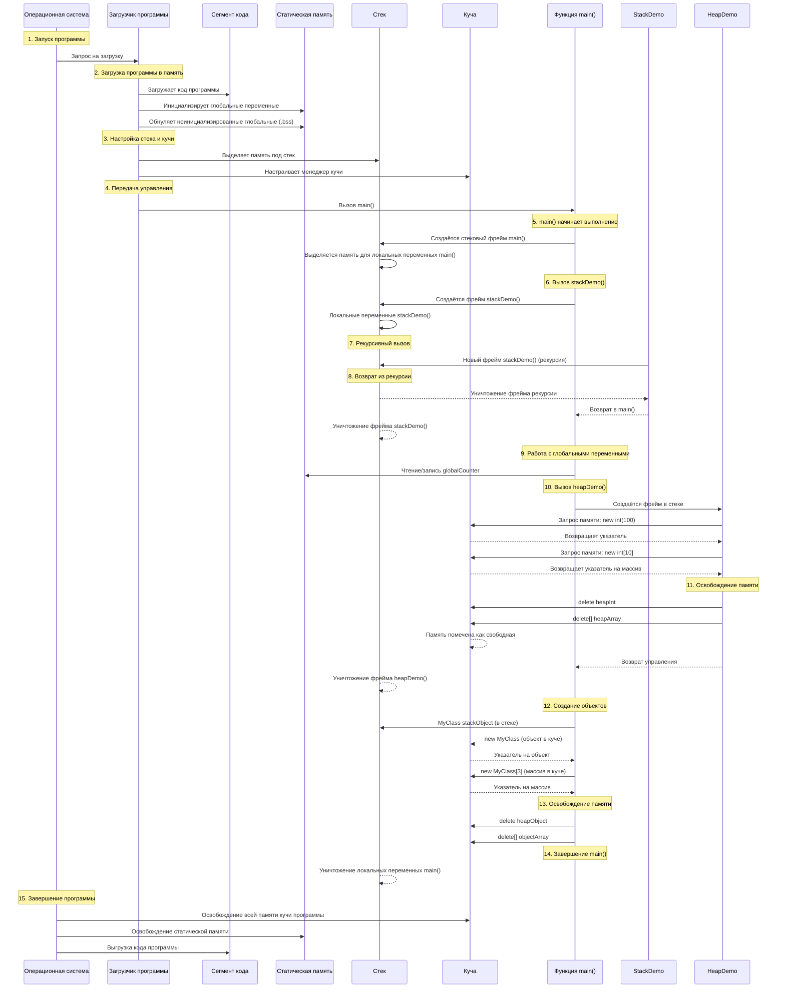
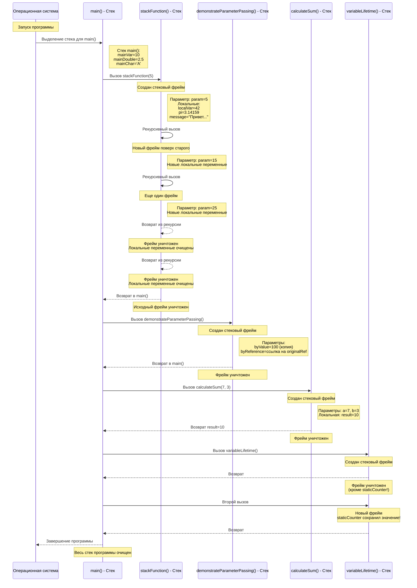
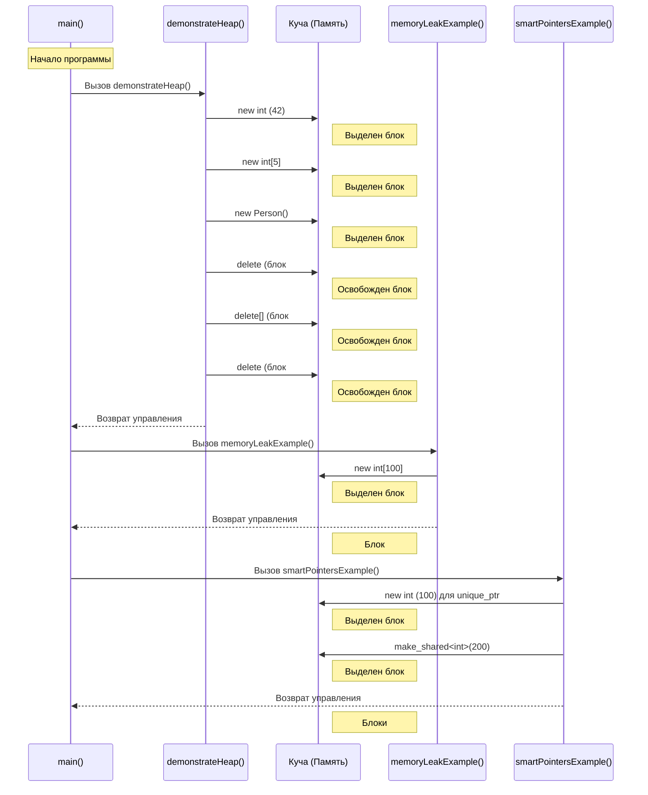
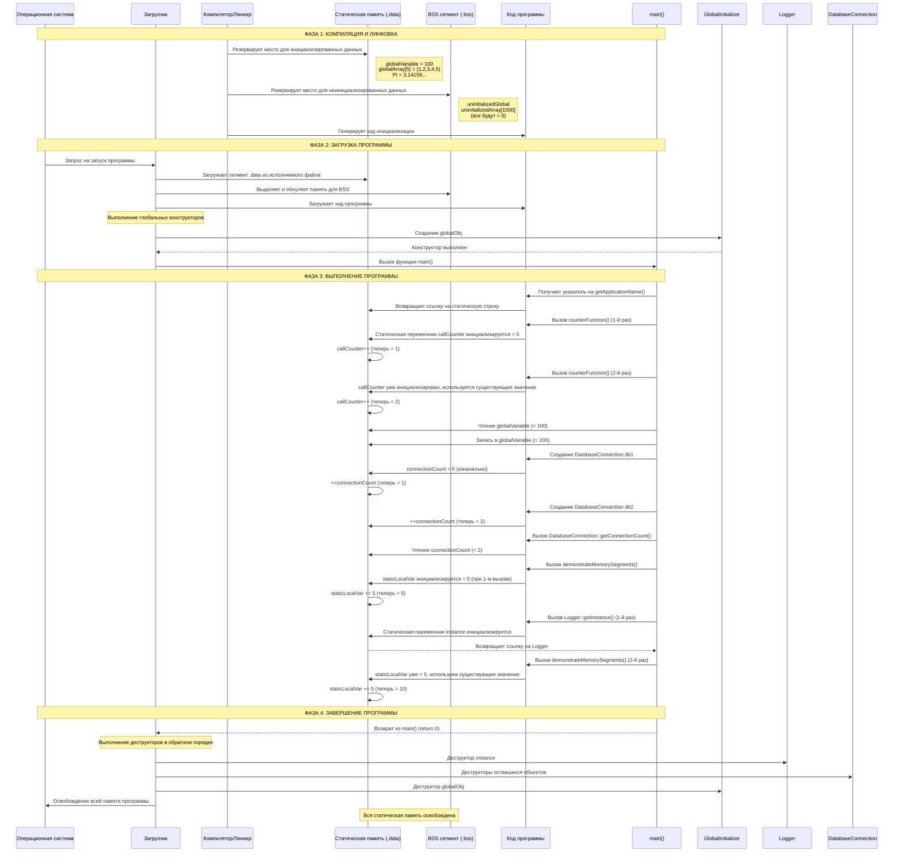

# **Объяснение массивов в C++ 🎯**

## **🎒 Что такое массив? Простая аналогия**

Представьте, что у вас есть **полка для обуви**:

```
┌─────┬─────┬─────┬─────┬─────┐
│  👟 │  👠 │  👞 │  🥾 │  👡 │
├─────┼─────┼─────┼─────┼─────┤
│  0  │  1  │  2  │  3  │  4  │  ← Номера ячеек
└─────┴─────┴─────┴─────┴─────┘
```

**Массив** — это такая же "полка" для данных в компьютере:
- У каждой "ячейки" есть **номер** (начинается с 0!)
- Все ячейки хранят данные **одного типа** (только числа, только строки и т.д.)
- Размер полки задаётся заранее и не меняется

---

## **📦 1. ОДНОМЕРНЫЕ МАССИВЫ (как один ряд полок)**

### **Как создать массив?**
```cpp
// Создаём "полку" на 5 чисел
int grades[5];  // 5 ячеек для оценок (пока пустые)

// Создаём и сразу заполняем
int numbers[5] = {10, 20, 30, 40, 50};
// Теперь: numbers[0]=10, numbers[1]=20, ... numbers[4]=50
```

### **Визуализация:**
```
numbers массив:
┌────┬────┬────┬────┬────┐
│ 10 │ 20 │ 30 │ 40 │ 50 │ ← Значения
├────┼────┼────┼────┼────┤
│ [0]│ [1]│ [2]│ [3]│ [4]│ ← Индексы (номера)
└────┴────┴────┴────┴────┘
```

### **Как работать с массивом?**
```cpp
#include <iostream>
using namespace std;

int main() {
    // 1. Создаём массив дней недели
    string days[7] = {"Понедельник", "Вторник", "Среда", 
                      "Четверг", "Пятница", "Суббота", "Воскресенье"};
    
    // 2. Выводим все дни
    cout << "Дни недели:" << endl;
    for(int i = 0; i < 7; i++) {
        cout << "День " << i << ": " << days[i] << endl;
    }
    
    // 3. Меняем один день
    days[0] = "ПОНЕДЕЛЬНИК!!!";
    cout << "\nТеперь первый день: " << days[0] << endl;
    
    // 4. Считаем сумму чисел
    int prices[5] = {100, 200, 150, 300, 250};
    int total = 0;
    
    for(int i = 0; i < 5; i++) {
        total += prices[i];  // total = total + prices[i]
    }
    
    cout << "\nОбщая стоимость: " << total << " рублей" << endl;
    
    return 0;
}
```

---

## **🏢 2. МНОГОМЕРНЫЕ МАССИВЫ (как шкаф с полками)**

### **Двумерный массив = Таблица (строка × столбец)**
```cpp
// Шахматная доска 8x8
char chessboard[8][8];

// Таблица умножения 10x10
int multiplication[10][10];
```

### **Визуализация двумерного массива:**
```cpp
int classroom[3][4] = {
    {1, 2, 3, 4},      // Первый ряд парт
    {5, 6, 7, 8},      // Второй ряд
    {9, 10, 11, 12}    // Третий ряд
};
```

```
classroom[3][4]:
          Столбцы
         0  1  2  3
       ┌───────────
Строки │[0] 1  2  3  4
    0  │
       │[1] 5  6  7  8
    1  │
       │[2] 9 10 11 12
    2  │
```

### **Пример: Школьный журнал**
```cpp
#include <iostream>
using namespace std;

int main() {
    // Журнал: 3 ученика × 5 предметов
    int journal[3][5] = {
        {5, 4, 5, 3, 4},  // Оценки первого ученика
        {4, 3, 4, 5, 5},  // Оценки второго
        {3, 5, 4, 4, 3}   // Оценки третьего
    };
    
    cout << "=== ШКОЛЬНЫЙ ЖУРНАЛ ===\n" << endl;
    
    // Выводим все оценки
    for(int student = 0; student < 3; student++) {
        cout << "Ученик " << (student + 1) << ": ";
        
        for(int subject = 0; subject < 5; subject++) {
            cout << journal[student][subject] << " ";
        }
        
        cout << endl;
    }
    
    // Средний балл первого ученика
    float average = 0;
    for(int subject = 0; subject < 5; subject++) {
        average += journal[0][subject];
    }
    average /= 5;
    
    cout << "\nСредний балл первого ученика: " << average << endl;
    
    return 0;
}
```

---

## **🎮 3. ИГРА "МОРСКОЙ БОЙ" (практический пример)**

```cpp
#include <iostream>
using namespace std;

int main() {
    // Создаём поле для морского боя 5x5
    char battlefield[5][5];
    
    // Заполняем поле водой (~)
    for(int row = 0; row < 5; row++) {
        for(int col = 0; col < 5; col++) {
            battlefield[row][col] = '~';  // вода
        }
    }
    
    // Расставляем корабли
    battlefield[1][2] = 'S';  // корабль в строке 1, столбце 2
    battlefield[3][4] = 'S';  // ещё один корабль
    battlefield[4][0] = 'S';
    
    cout << "=== МОРСКОЙ БОЙ ===\n" << endl;
    cout << "Ваше поле:" << endl;
    
    // Рисуем поле
    for(int row = 0; row < 5; row++) {
        for(int col = 0; col < 5; col++) {
            cout << battlefield[row][col] << " ";
        }
        cout << endl;
    }
    
    // Атакуем!
    int hitRow, hitCol;
    cout << "\nВведите координаты для атаки (строка столбец от 0 до 4): ";
    cin >> hitRow >> hitCol;
    
    if(battlefield[hitRow][hitCol] == 'S') {
        cout << "ПОПАДАНИЕ! Корабль потоплен!" << endl;
        battlefield[hitRow][hitCol] = 'X';  // помечаем попадание
    } else {
        cout << "Промах! Здесь только вода." << endl;
        battlefield[hitRow][hitCol] = 'O';  // помечаем промах
    }
    
    // Показываем обновлённое поле
    cout << "\nОбновлённое поле:" << endl;
    for(int row = 0; row < 5; row++) {
        for(int col = 0; col < 5; col++) {
            cout << battlefield[row][col] << " ";
        }
        cout << endl;
    }
    
    return 0;
}
```

---

## **🍕 4. ПРАКТИЧЕСКИЙ ПРИМЕР: МЕНЮ РЕСТОРАНА**

```cpp
#include <iostream>
using namespace std;

int main() {
    // Меню ресторана
    string menu[3][2] = {
        {"Пицца", "450"},
        {"Бургер", "280"},
        {"Салат", "190"}
    };
    
    // Корзина покупок (сколько каждого блюда)
    int cart[3] = {0, 0, 0};
    
    cout << "=== ДОБРО ПОЖАЛОВАТЬ В НАШ РЕСТОРАН! ===\n" << endl;
    
    // Показываем меню
    cout << "НАШЕ МЕНЮ:" << endl;
    for(int i = 0; i < 3; i++) {
        cout << (i+1) << ". " << menu[i][0] 
             << " - " << menu[i][1] << " руб." << endl;
    }
    
    // Делаем заказ
    int choice, quantity;
    cout << "\nЧто будете заказывать? (1-3, 0 - закончить): ";
    cin >> choice;
    
    while(choice != 0) {
        if(choice >= 1 && choice <= 3) {
            cout << "Сколько порций? ";
            cin >> quantity;
            cart[choice-1] += quantity;
            cout << "Добавлено в корзину!" << endl;
        } else {
            cout << "Такого блюда нет!" << endl;
        }
        
        cout << "\nЧто ещё? (1-3, 0 - закончить): ";
        cin >> choice;
    }
    
    // Считаем итог
    cout << "\n=== ВАШ ЗАКАЗ ===" << endl;
    int total = 0;
    
    for(int i = 0; i < 3; i++) {
        if(cart[i] > 0) {
            int price = stoi(menu[i][1]);  // строка → число
            int cost = price * cart[i];
            total += cost;
            
            cout << menu[i][0] << " × " << cart[i] 
                 << " = " << cost << " руб." << endl;
        }
    }
    
    cout << "\nИТОГО: " << total << " руб." << endl;
    cout << "Приятного аппетита! 🍕" << endl;
    
    return 0;
}
```

---

## **⚠️ 5. ЧАСТЫЕ ОШИБКИ (что нельзя делать)**

### **Ошибка 1: Выход за границы массива**
```cpp
int arr[5] = {1, 2, 3, 4, 5};
cout << arr[5];  // ОШИБКА! arr[5] не существует
// Правильно: arr[0]..arr[4]
```

### **Ошибка 2: Изменение размера**
```cpp
int size = 10;
int arr[size];  // Нельзя! Размер должен быть константой
// Правильно:
const int SIZE = 10;
int arr[SIZE];
```

### **Ошибка 3: Сравнение массивов**
```cpp
int a[3] = {1, 2, 3};
int b[3] = {1, 2, 3};

if(a == b) {  // НЕ РАБОТАЕТ! Сравниваются адреса
    cout << "Массивы равны";
}
// Нужно сравнивать поэлементно
```

---

## **🎯 6. ПРАВИЛА "НА ПАЛЬЦАХ"**

### **Правило 1: Индексы начинаются с 0**
```
Если массив на N элементов:
Доступны: array[0], array[1], ..., array[N-1]
НЕ существует: array[N] ← ОШИБКА!
```

### **Правило 2: Объявление массива**
```cpp
// Способ 1: С указанием размера
int numbers[5];  // 5 чисел

// Способ 2: С инициализацией (компилятор сам посчитает размер)
int scores[] = {5, 4, 3, 2};  // Размер = 4

// Способ 3: Частичная инициализация
int data[10] = {1, 2, 3};  // Первые 3 = 1,2,3, остальные = 0
```

### **Правило 3: Двумерный массив = [строки][столбцы]**
```cpp
int table[3][4];  // 3 строки, 4 столбца
// table[строка][столбец]
```

---

## **💡 7. СОВЕТЫ ДЛЯ НАЧИНАЮЩИХ**

1. **Рисуйте на бумаге** схему массива перед написанием кода
2. **Используйте понятные имена**: `students[10]`, а не `a[10]`
3. **Начинайте всегда с нуля** в циклах:
   ```cpp
   for(int i = 0; i < size; i++)  // Правильно
   for(int i = 1; i <= size; i++) // Опаснее (легче ошибиться)
   ```
4. **Проверяйте границы** перед доступом к элементам
5. **Инициализируйте массивы**, особенно если работаете с числами

---

## **📝 8. МИНИ-ТЕСТ ДЛЯ СЕБЯ**

**Задача 1:** Создайте массив на 7 дней недели и заполните его
```cpp
// Ваш код здесь
string week[__] = {____, ____, ____, ____, ____, ____, ____};
```

**Задача 2:** Найдите сумму всех элементов массива
```cpp
int numbers[5] = {10, 20, 30, 40, 50};
int sum = 0;
// Ваш цикл здесь
```

**Задача 3:** Создайте поле для крестиков-ноликов 3x3
```cpp
char board[__][__] = {
    {' ', ' ', ' '},
    {____, ____, ____},
    {____, ____, ____}
};
```

---

## **🎪 ПАМЯТКА ДЛЯ НАЧИНАЮЩЕГО**

```
📌 МАССИВ = ПОЛКА ДЛЯ ДАННЫХ
├─ Одномерный = один ряд ячеек
├─ Двумерный = таблица (строка × столбец)
├─ Индексы начинаются с 0!
└─ Размер фиксирован при создании

📌 ОСНОВНЫЕ ОПЕРАЦИИ:
1. Создать: тип имя[размер];
2. Заполнить: имя[индекс] = значение;
3. Прочитать: переменная = имя[индекс];
4. Пройти по всем: for(i=0; i<размер; i++)

📌 ЧАСТЫЕ ИСПОЛЬЗОВАНИЯ:
✓ Хранение списков (имена, оценки)
✓ Таблицы (расписание, поле игры)
✓ Обработка данных (статистика, сортировка)
```


# **Глубокий разбор массивов в C++: от памяти до оптимизации**

## **🎯 Фундаментальное понимание: Что такое массив на самом деле?**

### **1. Память компьютера: линейное пространство**

Представьте оперативную память как **огромный ряд почтовых ящиков**:
```
Адрес: 0x1000 0x1004 0x1008 0x100C 0x1010 ...
Ячейка: [    ] [    ] [    ] [    ] [    ] ...
```

Каждый "ящик" (байт) имеет уникальный адрес. Массив — это **последовательный блок этих ящиков**.

### **2. Математическая модель массива**
Массив — это **отображение** (mapping) индекса на значение:
```
f: I → V, где I = {0, 1, 2, ..., n-1}
```
Для одномерного массива: `A[i] = base_address + i × sizeof(element)`

---

## **🧠 Уровень 1: Абстракция компилятора**

### **Как компилятор видит объявление массива:**
```cpp
int arr[5];  // Для компилятора это:
```
```
1. Выделить непрерывный блок памяти:
   Размер = 5 × sizeof(int) = 5 × 4 = 20 байт (на 32-битной системе)
   
2. Создать символьную таблицу:
   arr → (указатель на начало блока, размер=5, тип=int)
   
3. Преобразовать arr[i] в:
   *(arr + i)  // арифметика указателей
```

### **Диаграмма памяти:**
```cpp
int arr[5] = {10, 20, 30, 40, 50};
```
```
Адрес (пример)   Содержимое   Индекс   arr + i
0x1000: 10       (arr[0])     arr + 0
0x1004: 20       (arr[1])     arr + 1
0x1008: 30       (arr[2])     arr + 2
0x100C: 40       (arr[3])     arr + 3
0x1010: 50       (arr[4])     arr + 4
```

**Важно:** `arr` — это **константный указатель** на первый элемент:
```cpp
int* ptr = arr;      // OK: ptr указывает на arr[0]
arr = ptr;           // ОШИБКА: arr - константа!
arr++;               // ОШИБКА: нельзя изменить
```

---

## **🔬 Уровень 2: Физическая реализация в памяти**

### **Структура массива в разных областях памяти:**

#### **1. Массивы на стеке (stack arrays):**
```cpp
void function() {
    int local_array[1000];  // Выделяется в стековом кадре
}
```
```
Стек при вызове function():
┌─────────────────┐
│ Другие данные   │
├─────────────────┤ ← base pointer
│ local_array[999]│
│ ...             │
│ local_array[1]  │
│ local_array[0]  │ ← stack pointer
└─────────────────┘
```

**Ограничения:**
- Размер должен быть известен на этапе компиляции
- Обычно ограничен ~1-8 МБ (зависит от ОС и настройки стека)

#### **2. Массивы в куче (heap arrays):**
```cpp
int* heap_array = new int[1000000];  // Выделяется в куче
delete[] heap_array;
```

**Преимущества:**
- Большие размеры (ограничены только RAM)
- Динамический размер

**Недостатки:**
- Медленнее (аллокация/деаллокация)
- Необходимость ручного управления памятью

#### **3. Статические/глобальные массивы:**
```cpp
static int static_array[1000];  // В сегменте данных
int global_array[1000];         // В сегменте данных
```

Располагаются в **сегменте данных** исполняемого файла, существуют всю жизнь программы.

---


## **⚙️ Уровень 3: Адресная арифметика и указатели**

### **Эквивалентность массивов и указателей:**
```cpp
int arr[5] = {1, 2, 3, 4, 5};

// Следующие выражения эквивалентны:
arr[2]          // Доступ по индексу
*(arr + 2)      // Адресная арифметика
2[arr]          // Необычно, но работает! (arr[2] == *(arr + 2) == *(2 + arr) == 2[arr])
```

### **Смещения в байтах:**
```cpp
struct Complex {
    double real;
    double imag;
};

Complex numbers[3];
// &numbers[1] = &numbers[0] + sizeof(Complex) × 1
//             = &numbers[0] + 16 байт (если double = 8 байт)
```

### **Многомерные массивы: как они реально хранятся**

#### **Декларация vs Реальность:**
```cpp
int matrix[3][4];  // Мы видим таблицу 3x4
```
```
В памяти (row-major порядок, C/C++ стиль):
[0,0][0,1][0,2][0,3][1,0][1,1][1,2][1,3][2,0][2,1][2,2][2,3]
└──────── строка 0 ───────┘└──────── строка 1 ───────┘└──────── строка 2 ───────┘
```

**Доступ к matrix[i][j] вычисляется как:**
```
адрес = base_address + (i × cols + j) × sizeof(int)
```

### **Пример с ассемблером:**
```cpp
// Исходный код C++:
int arr[5];
arr[2] = 42;

// x86 Ассемблер (упрощённо):
lea rax, [arr]       ; rax = адрес arr
mov dword [rax+8], 42 ; arr[2] = 42 (8 байт = 2 × sizeof(int))
```

---

## **🔍 Уровень 4: Многомерные массивы - глубокая магия**

### **Тип многомерного массива - это не указатель на указатель!**
```cpp
int matrix[3][4];    // Тип: int[3][4] (12 элементов подряд)
int** wrong;         // Тип: указатель на указатель (совсем другое!)
```

### **Как компилятор преобразует доступ:**
```cpp
int value = matrix[1][2];
```
**Компилятор вычисляет:**
```
смещение = (1 × 4 + 2) × sizeof(int) = 6 × 4 = 24 байта
адрес = &matrix[0][0] + 24
```

### **Разные способы хранения матриц:**

#### **1. Истинный 2D массив (contiguous block):**
```cpp
int arr[3][4];  // 12 int'ов подряд
```
**Память:** `[0,0][0,1][0,2][0,3][1,0][1,1][1,2][1,3][2,0][2,1][2,2][2,3]`

#### **2. Массив указателей (jagged array):**
```cpp
int* jagged[3];
for(int i = 0; i < 3; i++)
    jagged[i] = new int[4];
```
**Память:**
```
jagged[0] → [0,0][0,1][0,2][0,3]  (один блок)
jagged[1] → [1,0][1,1][1,2][1,3]  (другой блок)
jagged[2] → [2,0][2,1][2,2][2,3]  (третий блок)
```

#### **3. Одномерный массив с эмуляцией 2D:**
```cpp
int* flat = new int[rows * cols];
// Доступ: flat[i * cols + j] вместо arr[i][j]
```

---

## **⚡ Уровень 5: Оптимизация доступа к массивам**

### **1. Локализация данных (Data Locality)**

#### **Плохо (cache misses):**
```cpp
// Случайный доступ
for(int i = 0; i < N; i++) {
    int index = random() % N;
    sum += arr[index];  // Промахи кэша!
}
```

#### **Хорошо (sequential access):**
```cpp
// Последовательный доступ
for(int i = 0; i < N; i++) {
    sum += arr[i];  // Префетчер предугадывает!
}
```

### **2. Выравнивание (Alignment)**
```cpp
struct Bad {
    char c;      // 1 байт
    int i;       // 4 байта
};  // Размер: 8 байт (3 байта padding!)

struct Good {
    int i;       // 4 байта
    char c;      // 1 байт
};  // Размер: 8 байт (3 байта padding)
```

Для массивов структур это критично:
```cpp
Bad bad_array[1000];   // Много холостых циклов чтения
Good good_array[1000]; // Более эффективно
```

### **3. Loop Unrolling (развертывание циклов)**
```cpp
// Оригинал
for(int i = 0; i < N; i++) {
    arr[i] *= 2;
}

// Развернуто (компилятор делает это автоматически)
for(int i = 0; i < N; i += 4) {
    arr[i] *= 2;
    arr[i+1] *= 2;
    arr[i+2] *= 2;
    arr[i+3] *= 2;
}
```

### **4. SIMD оптимизации**
```cpp
// Скалярный код
for(int i = 0; i < N; i++) {
    a[i] = b[i] + c[i];
}

// Векторизованный (используя SSE/AVX)
__m128i* va = (__m128i*)a;
__m128i* vb = (__m128i*)b;
__m128i* vc = (__m128i*)c;

for(int i = 0; i < N/4; i++) {
    va[i] = _mm_add_epi32(vb[i], vc[i]);  // 4 операции за 1 такт!
}
```

---

## **🔧 Уровень 6: Внутреннее устройство компилятора**

### **Как компилятор оптимизирует массивы:**

#### **1. Constant Propagation (распространение констант):**
```cpp
int arr[5] = {1, 2, 3, 4, 5};
int x = arr[2];  // Компилятор превращает в: int x = 3;
```

#### **2. Bounds Checking Elimination (устранение проверки границ):**
```cpp
for(int i = 0; i < 5; i++) {
    arr[i] = 0;  // Компилятор знает, что i всегда в границах
    // Не генерирует проверку if(i >= 5)
}
```

#### **3. Strength Reduction (снижение стоимости операций):**
```cpp
// Вместо умножения каждый раз
for(int i = 0; i < N; i++) {
    int index = i * 4;  // Умножение дорого
    arr[index] = 0;
}

// Используется сложение
int index = 0;
for(int i = 0; i < N; i++) {
    arr[index] = 0;
    index += 4;  // Сложение дешевле
}
```

### **IR (Intermediate Representation) пример:**
```cpp
// Исходный код C++:
int sum_array(int* arr, int n) {
    int sum = 0;
    for(int i = 0; i < n; i++) {
        sum += arr[i];
    }
    return sum;
}

// LLVM IR (упрощённо):
define i32 @sum_array(i32* %arr, i32 %n) {
entry:
  %cmp = icmp slt i32 0, %n
  br i1 %cmp, label %loop, label %exit
  
loop:
  %i = phi i32 [0, %entry], [%i.next, %loop]
  %sum = phi i32 [0, %entry], [%sum.next, %loop]
  
  ; Загрузка arr[i]
  %ptr = getelementptr i32, i32* %arr, i32 %i
  %val = load i32, i32* %ptr
  
  %sum.next = add i32 %sum, %val
  %i.next = add i32 %i, 1
  
  %cond = icmp slt i32 %i.next, %n
  br i1 %cond, label %loop, label %exit
  
exit:
  %result = phi i32 [%sum.next, %loop]
  ret i32 %result
}
```

---

## **💾 Уровень 7: Массивы и кэш-память**

### **Иерархия памяти:**
```
CPU Регистры (1ns, несколько КБ)
│
▼
L1 Кэш (1ns, 32-64KB)
│
▼
L2 Кэш (4ns, 256KB-2MB)
│
▼
L3 Кэш (10ns, 8-32MB)
│
▼
RAM (100ns, ГБ)
│
▼
SSD (100μs, ТБ)
```

### **Пример влияния на производительность:**
```cpp
// Плохо: Column-major доступ в row-major массиве
for(int col = 0; col < COLS; col++) {
    for(int row = 0; row < ROWS; row++) {
        sum += matrix[row][col];  // Промахи кэша!
    }
}

// Хорошо: Row-major доступ
for(int row = 0; row < ROWS; row++) {
    for(int col = 0; col < COLS; col++) {
        sum += matrix[row][col];  // Последовательно!
    }
}
```

### **Размер строки кэша (Cache Line):**
Обычно 64 байта. Если элементы массива попадают в одну строку кэша — доступ быстрый.

```cpp
struct Data {
    int a;     // 4 байта
    int b;     // 4 байта
    // Всего 8 байт
};  // В одну строку кэша поместится 64/8 = 8 структур

Data array[100];
// Доступ к array[0]..array[7] будет быстрым (в кэше)
```

---

## **🔬 Уровень 8: Анализ ассемблерного кода**

### **Простой массив:**
```cpp
// C++ код
int arr[5] = {1, 2, 3, 4, 5};
arr[2] = 42;

// x86-64 ассемблер (gcc -O2 -S)
movq    $arr, %rax          # rax = адрес arr
movl    $1, (%rax)          # arr[0] = 1
movl    $2, 4(%rax)         # arr[1] = 2 (rax+4)
movl    $3, 8(%rax)         # arr[2] = 3
movl    $4, 12(%rax)        # arr[3] = 4
movl    $5, 16(%rax)        # arr[4] = 5
movl    $42, 8(%rax)        # arr[2] = 42
```

### **Доступ через цикл:**
```cpp
// C++ код
int sum = 0;
for(int i = 0; i < 5; i++) {
    sum += arr[i];
}

// Оптимизированный ассемблер
movl    $0, %eax           # sum = 0
movl    (%rdi), %edx       # edx = arr[0]
addl    4(%rdi), %edx      # edx += arr[1]
addl    8(%rdi), %edx      # edx += arr[2]
addl    12(%rdi), %edx     # edx += arr[3]
addl    16(%rdi), %edx     # edx += arr[4]
movl    %edx, %eax         # sum = edx
```

**Компилятор развернул цикл полностью!**

---

## **🎯 Уровень 9: Многомерные массивы и производительность**

### **Эксперимент: влияние порядка циклов**

```cpp
#include <iostream>
#include <chrono>
using namespace std;
using namespace chrono;

const int N = 1024;

int main() {
    // Выделяем и инициализируем матрицу
    int** matrix = new int*[N];
    for(int i = 0; i < N; i++) {
        matrix[i] = new int[N];
        for(int j = 0; j < N; j++) {
            matrix[i][j] = i + j;
        }
    }
    
    // Тест 1: Row-major доступ
    auto start = high_resolution_clock::now();
    long long sum1 = 0;
    for(int i = 0; i < N; i++) {
        for(int j = 0; j < N; j++) {
            sum1 += matrix[i][j];
        }
    }
    auto time1 = duration_cast<milliseconds>(
        high_resolution_clock::now() - start).count();
    
    // Тест 2: Column-major доступ
    start = high_resolution_clock::now();
    long long sum2 = 0;
    for(int j = 0; j < N; j++) {
        for(int i = 0; i < N; i++) {
            sum2 += matrix[i][j];
        }
    }
    auto time2 = duration_cast<milliseconds>(
        high_resolution_clock::now() - start).count();
    
    cout << "Row-major: " << time1 << "ms, sum = " << sum1 << endl;
    cout << "Column-major: " << time2 << "ms, sum = " << sum2 << endl;
    cout << "Разница: " << (double)time2 / time1 << "x медленнее" << endl;
    
    // Очистка
    for(int i = 0; i < N; i++) delete[] matrix[i];
    delete[] matrix;
    
    return 0;
}
```

**Результаты (типичные):**
- Row-major: ~50ms
- Column-major: ~500ms
- **В 10 раз медленнее!**

---

## **🔍 Уровень 10: Продвинутые техники работы с массивами**

### **1. Кольцевой буфер (circular buffer):**
```cpp
template<typename T, size_t N>
class CircularBuffer {
private:
    T buffer[N];
    size_t head = 0;
    size_t tail = 0;
    size_t count = 0;
    
public:
    void push(T value) {
        buffer[tail] = value;
        tail = (tail + 1) % N;
        if(count < N) count++;
        else head = (head + 1) % N;  // Перезаписываем старые
    }
    
    T pop() {
        if(count == 0) throw runtime_error("Buffer empty");
        T value = buffer[head];
        head = (head + 1) % N;
        count--;
        return value;
    }
};
```

### **2. Массив с заполнением от конца:**
```cpp
// Для алгоритмов типа "обратный обход"
template<typename T, size_t N>
class BackwardArray {
    T data[N];
    size_t pos = N;  // Начинаем с конца
    
public:
    void push_front(T value) {
        data[--pos] = value;  // Заполняем с конца
    }
    
    T& operator[](size_t index) {
        return data[pos + index];
    }
};
```

### **3. SIMD выравнивание:**
```cpp
// Для использования AVX/SSE инструкций
alignas(32) float aligned_array[1024];  // Выравнивание по 32 байта

// Теперь можно использовать:
__m256* vec_array = (__m256*)aligned_array;
for(int i = 0; i < 1024/8; i++) {  // 8 floats в __m256
    vec_array[i] = _mm256_add_ps(vec_array[i], vec_array[i]);
}
```

### **4. Разреженные массивы (sparse arrays):**
```cpp
// Для массивов с большим количеством нулей
template<typename T>
class SparseArray {
private:
    unordered_map<size_t, T> data;  // Храним только ненулевые
    T defaultValue = T();
    
public:
    T& operator[](size_t index) {
        auto it = data.find(index);
        if(it != data.end()) return it->second;
        
        // Возвращаем ссылку на временное значение
        // Для записи сохраняем, для чтения - defaultValue
        return defaultValue;  // Упрощённо
    }
};
```

---

## **🎯 Итоговые принципы проектирования:**

### **1. Правило размера кэш-линии:**
```cpp
// Группируйте часто используемые данные вместе
struct Player {
    Vec3 position;     // 12 байт
    Vec3 velocity;     // 12 байт
    float health;      // 4 байта
    // Всего 28 байт → в кэш-линию поместится 2 игрока
};

Player players[1000];  // Эффективно для обновления всех игроков
```

### **2. Правило предсказуемости доступа:**
```cpp
// Избегайте случайных доступов
// Плохо:
for(auto& obj : objects) {
    process(obj.data[random_index]);  // Непредсказуемо
}

// Хорошо:
std::sort(objects.begin(), objects.end(), [](auto& a, auto& b) {
    return a.key < b.key;  // Сортируем для последовательного доступа
});
for(auto& obj : objects) {
    process(obj.data);  // Последовательно
}
```

### **3. Правило "структура массивов" vs "массив структур":**
```cpp
// AOS (Array of Structures) - удобно для ООП
struct Particle {
    float x, y, z;
    float vx, vy, vz;
};
Particle particles[1000];

// SOA (Structure of Arrays) - эффективно для SIMD
struct Particles {
    float x[1000], y[1000], z[1000];
    float vx[1000], vy[1000], vz[1000];
};
```

**Выбор зависит от паттернов доступа:**
- AOS: если обращаетесь ко всем полям одного объекта
- SOA: если обрабатываете одно поле всех объектов (SIMD)

### **4. Золотое правило оптимизации:**
> **Measure, don't guess!** Всегда измеряйте производительность. Кэш, префетчер и оптимизатор компилятора часто работают неочевидным образом.

Массивы в C++ — это не просто абстракция, а прямой доступ к памяти компьютера. Понимание их внутреннего устройства позволяет писать код, который работает в 10-100 раз быстрее!

# **Глубокое объяснение расположения массивов в памяти**

## **🎯 Как память организована в процессе**

Когда программа запускается, ОС выделяет ей **виртуальное адресное пространство**, которое делится на сегменты:

```
Виртуальная память процесса (на примере Linux x86-64):
┌─────────────────────────────────────────────┐ 0xFFFFFFFFFFFFFFFF
│                   Ядро                      │
├─────────────────────────────────────────────┤ 0xFFFF800000000000
│               Стек (stack)                  │ ← растёт ВНИЗ
│                    ↓                        │
├─────────────────────────────────────────────┤
│                     ↑                       │
│                 Куча (heap)                 │ ← растёт ВВЕРХ
├─────────────────────────────────────────────┤
│    Сегмент данных (data/bss)                │ ← статические переменные
├─────────────────────────────────────────────┤
│     Сегмент кода (text/code)                │ ← исполняемый код
└─────────────────────────────────────────────┘ 0x0000000000000000
```

---

## **🏗️ 1. СТЕКОВЫЕ МАССИВЫ (Stack Arrays)**

### **Как работает стек вызовов?**

Стек — это область памяти, которая работает по принципу **LIFO** (Last In, First Out). Каждый вызов функции создает **стековый кадр** (stack frame).

```cpp
void foo() {
    int x = 10;           // Локальная переменная в стеке
    int arr[100];         // Массив в стеке
}

int main() {
    foo();
    return 0;
}
```

### **Детальный процесс вызова функции:**

```assembly
; Ассемблерный код вызова foo():
main:
    push    rbp           ; Сохраняем предыдущий base pointer
    mov     rbp, rsp      ; Устанавливаем новый base pointer
    
    sub     rsp, 416      ; Выделяем место в стеке: 100×4 = 400 + выравнивание
    ; rsp (stack pointer) теперь указывает на arr[99]
    
    ; ... выполнение функции ...
    
    add     rsp, 416      ; Освобождаем стек
    pop     rbp           ; Восстанавливаем предыдущий base pointer
    ret
```

### **Визуализация стека при вызове:**

```
ДО вызова foo():
┌─────────────────┐ 0x7FFFFFFFE000
│   main() vars   │
├─────────────────┤ ← RSP (Stack Pointer)
│                 │
└─────────────────┘

ВО ВРЕМЯ выполнения foo():
┌─────────────────┐ 0x7FFFFFFFE000
│   main() vars   │
├─────────────────┤ ← RBP (Base Pointer) main
│  Возврат в main │
├─────────────────┤ ← RBP foo (старый RSP main)
│     x = 10      │
├─────────────────┤
│   arr[99]       │
│      ...        │
│   arr[1]        │
│   arr[0]        │ ← RSP (Stack Pointer)
└─────────────────┘ 0x7FFFFFFFDF00
```

### **Критические особенности стековых массивов:**

#### **1. Автоматическое управление памятью:**
```cpp
void function() {
    int arr[100];  // Память выделяется при входе в функцию
    // Используем массив
} // Память автоматически освобождается при выходе
```

#### **2. Быстрый доступ:**
```cpp
int arr[100];
arr[50] = 42;  // Быстро! Просто смещение от RBP

// Преобразуется в:
; mov dword [rbp - 200], 42  ; rbp - (50 × 4)
```

#### **3. Ограничение по размеру:**
```cpp
void risky() {
    int huge[1000000];  // 4 МБ! Может вызвать stack overflow
    // Windows: стек обычно 1-8 МБ
    // Linux:   стек обычно 8-10 МБ
}
```

#### **4. Проблема возврата указателя на стековый массив:**
```cpp
int* bad_function() {
    int local_arr[10] = {1, 2, 3};
    return local_arr;  // ОПАСНО! Массив уничтожится при выходе
}
// Указатель будет указывать на освобождённую память
```

---

## **🌳 2. МАССИВЫ В КУЧЕ (Heap Arrays)**

### **Что такое куча (heap)?**

Куча — это область динамической памяти, управляемая программистом. В отличие от стека:
- Не автоматическое управление
- Большой размер (ограничен только RAM)
- Медленнее стека

### **Как работает `new[]` и `delete[]`:**

```cpp
int* arr = new int[1000000];  // Выделяем 4 МБ в куче
// ... используем ...
delete[] arr;  // Освобождаем
```

### **Детальный процесс выделения памяти:**

```cpp
// За кулисами new[] делает примерно следующее:
int* allocate_array(size_t n) {
    // 1. Выделяет память для массива + служебной информации
    size_t total_size = sizeof(size_t) + n * sizeof(int);
    void* raw = malloc(total_size);
    
    // 2. Сохраняет размер массива перед данными
    size_t* size_ptr = static_cast<size_t*>(raw);
    *size_ptr = n;  // Сохраняем размер
    
    // 3. Возвращаем указатель на первый элемент
    int* data_ptr = reinterpret_cast<int*>(size_ptr + 1);
    return data_ptr;
}

// А delete[]:
void deallocate_array(int* ptr) {
    // 1. Получаем указатель на служебную информацию
    size_t* size_ptr = reinterpret_cast<size_t*>(ptr) - 1;
    
    // 2. Вызываем деструкторы для каждого элемента (если есть)
    // 3. Освобождаем память
    free(size_ptr);
}
```

### **Память в куче после выделения:**

```
Куча процесса:
┌─────────────────────────────────────────┐
│ Другие выделения (alloc 3)              │
├─────────────────────────────────────────┤
│ Размер: 1,000,000  │  arr[999999]       │ ← возвращаемый указатель
│ (служебная инфо)   │      ...           │
│                    │  arr[1]            │
│                    │  arr[0]            │
├─────────────────────────────────────────┤
│ Другие выделения (alloc 2)              │
├─────────────────────────────────────────┤
│ Другие выделения (alloc 1)              │
└─────────────────────────────────────────┘
```

### **Фрагментация кучи:**

```cpp
// Проблема фрагментации:
int* a = new int[100];  // Выделяем блок A
int* b = new int[50];   // Выделяем блок B
delete[] a;             // Освобождаем A (дырка)
int* c = new int[120];  // Не поместится в дырку от A!

// Память становится похожей на швейцарский сыр:
┌───┐┌───┐┌───────┐┌───┐┌───┐
│ C ││ B ││ ДЫРКА ││ ? ││ ? │
└───┘└───┘└───────┘└───┘└───┘
```

### **Сравнение производительности:**

```cpp
#include <iostream>
#include <chrono>

void test_stack() {
    int arr[1000];  // 4 КБ в стеке
    for(int& x : arr) x = 1;
}

void test_heap() {
    int* arr = new int[1000];  // 4 КБ в куче
    for(int i = 0; i < 1000; i++) arr[i] = 1;
    delete[] arr;
}

// Результаты (примерные):
// test_stack(): ~0.5 микросекунды
// test_heap():  ~5-10 микросекунд (в 10-20 раз медленнее!)
```

---

## **📁 3. СТАТИЧЕСКИЕ/ГЛОБАЛЬНЫЕ МАССИВЫ**

### **Сегменты памяти исполняемого файла:**

Когда вы компилируете программу, исполняемый файл содержит несколько сегментов:

```
Исполняемый файл (ELF/PE):
┌─────────────────────────┐
│ Заголовок               │
├─────────────────────────┤
│ .text (код)             │ ← machine code
├─────────────────────────┤
│ .rodata (только чтение) │ ← const данные
├─────────────────────────┤
│ .data (инициализированные данные) │ ← global_array
├─────────────────────────┤
│ .bss (неинициализированные)      │ ← static_array (если не инициализирован)
└─────────────────────────┘
```

### **Статические массивы в .data сегменте:**

```cpp
// Инициализированный статический массив
int global_array[5] = {1, 2, 3, 4, 5};
// Попадает в секцию .data исполняемого файла
```

**В памяти при запуске:**
```
.data сегмент в памяти:
┌─────────────────┐
│ global_array[4] │ = 5
│ global_array[3] │ = 4
│ global_array[2] │ = 3
│ global_array[1] │ = 2
│ global_array[0] │ = 1
└─────────────────┘
```

### **Статические массивы в .bss сегменте:**

```cpp
// Неинициализированный или zero-initialized
static int static_array[1000];  // Все элементы = 0
// Попадает в секцию .bss (Block Started by Symbol)
```

**.bss особенность:** Занимает место только в памяти, но не в файле!

```
Исполняемый файл:          В памяти при запуске:
┌─────────────┐           ┌─────────────────┐
│ .bss:       │           │ .bss в памяти:  │
│ static_array│──────────►│ [1000 × 0]      │
│ size: 4000  │           │ (заполнено 0)   │
└─────────────┘           └─────────────────┘
// В файле хранится только информация о размере
// Фактическая память выделяется при загрузке
```

### **Статические массивы внутри функций:**

```cpp
void counter() {
    static int calls[10] = {0};  // В .data, сохраняется между вызовами!
    
    calls[0]++;  // Считает, сколько раз вызвана функция
    std::cout << "Вызвана " << calls[0] << " раз\n";
}
```

### **Адреса статических массивов:**

```cpp
int global_arr[10];
static int static_arr[10];

int main() {
    cout << "global_arr:  " << (void*)global_arr << endl;
    cout << "static_arr:  " << (void*)static_arr << endl;
    
    int stack_arr[10];
    cout << "stack_arr:   " << (void*)stack_arr << endl;
    
    int* heap_arr = new int[10];
    cout << "heap_arr:    " << (void*)heap_arr << endl;
    
    delete[] heap_arr;
}
```

**Пример вывода:**
```
global_arr:  0x555555557040  // Низкие адреса (.data сегмент)
static_arr:  0x5555555570a0  // Тоже низкие
stack_arr:   0x7fffffffd9a0  // Высокие адреса (стек)
heap_arr:    0x5555555a6eb0  // Средние адреса (куча)
```

---

## **🔬 Эксперимент: просмотр памяти массива**

### **Программа для изучения расположения массивов:**

```cpp
#include <iostream>
#include <cstdint>
#include <iomanip>

// Глобальный массив (в .data)
int global_arr[3] = {0x11111111, 0x22222222, 0x33333333};

void examine_memory() {
    // Статический массив в функции (тоже в .data)
    static int static_arr[3] = {0x44444444, 0x55555555, 0x66666666};
    
    // Стековый массив
    int stack_arr[3] = {0x77777777, 0x88888888, 0x99999999};
    
    // Кучный массив
    int* heap_arr = new int[3]{0xAAAAAAAA, 0xBBBBBBBB, 0xCCCCCCCC};
    
    std::cout << std::hex << std::showbase;
    
    // Печатаем адреса
    std::cout << "Адреса:\n";
    std::cout << "global_arr: " << global_arr << "\n";
    std::cout << "static_arr: " << static_arr << "\n";
    std::cout << "stack_arr:  " << stack_arr << "\n";
    std::cout << "heap_arr:   " << heap_arr << "\n\n";
    
    // Печатаем расстояния между адресами
    std::cout << "Расстояния от global_arr:\n";
    std::cout << "static_arr - global_arr: " 
              << (static_arr - global_arr) * sizeof(int) << " байт\n";
    std::cout << "stack_arr - global_arr:  " 
              << reinterpret_cast<uintptr_t>(stack_arr) - 
                 reinterpret_cast<uintptr_t>(global_arr) << " байт\n";
    std::cout << "heap_arr - global_arr:   " 
              << reinterpret_cast<uintptr_t>(heap_arr) - 
                 reinterpret_cast<uintptr_t>(global_arr) << " байт\n";
    
    delete[] heap_arr;
}

int main() {
    examine_memory();
    return 0;
}
```

### **Типичный вывод (Linux x86-64):**
```
Адреса:
global_arr: 0x5578a4a04040    # Низкий адрес (.data)
static_arr: 0x5578a4a0404c    # Рядом с global_arr (+12 байт)
stack_arr:  0x7ffc3a8b9a20    # Высокий адрес (стек, 0x7fff...)
heap_arr:   0x5578a4e6eeb0    # Средний адрес (куча)

Расстояния от global_arr:
static_arr - global_arr: 12 байт        # В том же сегменте
stack_arr - global_arr:  1407208451592 байт  # Очень далеко!
heap_arr - global_arr:   4718480 байт   # Далеко, но ближе чем стек
```

---

## **⚡ Практические последствия**

### **1. Производительность доступа:**

```cpp
#include <benchmark/benchmark.h>

static void BM_StackArray(benchmark::State& state) {
    for (auto _ : state) {
        int arr[1000];
        for (int i = 0; i < 1000; i++) {
            arr[i] = i;  // Быстро: кэш L1, предсказуемый доступ
        }
    }
}

static void BM_HeapArray(benchmark::State& state) {
    for (auto _ : state) {
        int* arr = new int[1000];
        for (int i = 0; i < 1000; i++) {
            arr[i] = i;  // Медленнее: возможны кэш-промахи
        }
        delete[] arr;
    }
}

BENCHMARK(BM_StackArray);
BENCHMARK(BM_HeapArray);
// Результат: Stack в 2-3 раза быстрее
```

### **2. Проблема false sharing (для многопоточности):**

```cpp
// ПЛОХО: разные потоки работают с одним кэш-лайн
struct Data {
    int x;  // Поток 1 часто пишет
    int y;  // Поток 2 часто пишет
};

Data shared_array[100];

// ХОРОШО: разделяем по кэш-линиям
struct alignas(64) PaddedData {  // 64 байта = размер кэш-линии
    int x;
    char padding[60];  // Заполнитель
};

PaddedData better_array[100];
```

### **3. Переполнение стека (Stack Overflow):**

```cpp
void recursive(int depth) {
    char buffer[1024];  // 1 КБ в стеке при каждом вызове
    std::cout << "Глубина: " << depth << "\n";
    
    if(depth < 10000) {
        recursive(depth + 1);  // Рекурсивный вызов
    }
    // Каждый вызов съедает 1 КБ стека
    // При глубине 8000 будет ~8 МБ → переполнение стека!
}

int main() {
    recursive(0);  // Может вызвать Stack Overflow
    return 0;
}
```

---

## **🎯 Итоговая таблица сравнения:**

| Характеристика | Стек (Stack) | Куча (Heap) | Статические (Static/Global) |
|----------------|--------------|-------------|----------------------------|
| **Скорость выделения** | ⚡ Быстро (просто сдвиг RSP) | 🐢 Медленно (поиск свободного блока) | ✅ При загрузке программы |
| **Скорость доступа** | ⚡ Быстро (кэш L1) | 🐢 Медленнее | ⚡ Быстро |
| **Размер** | ⚠️ Ограничен (1-10 МБ) | ✅ Большой (до RAM) | ✅ Большой (но в файле) |
| **Время жизни** | 📍 До конца scope | ⏳ До delete[] | 🕰️ Вся жизнь программы |
| **Управление** | 🤖 Автоматическое | 👨‍💻 Ручное | 🤖 Автоматическое |
| **Потокобезопасность** | ✅ Каждый поток свой стек | ⚠️ Общая куча | ⚠️ Общая память |
| **Расположение** | 🔝 Высокие адреса (0x7FFF...) | 🔽 Средние адреса | 🔻 Низкие адреса (0x55...) |
| **Фрагментация** | ❌ Нет | ✅ Возможна | ❌ Нет |

### **Правила выбора:**

1. **Используйте стек**, когда:
   - Массив маленький (< 1 МБ)
   - Нужна максимальная производительность
   - Время жизни = текущая функция

2. **Используйте кучу**, когда:
   - Массив большой (> 1 МБ)
   - Нужен динамический размер
   - Время жизни выходит за рамки функции

3. **Используйте статические**, когда:
   - Данные нужны всей программе
   - Размер известен на этапе компиляции
   - Нужно сохранять состояние между вызовами

### **Критическое понимание:**
Стек, куча и статическая память — это просто **разные области одного виртуального адресного пространства**. Выбор между ними влияет на:
- Производительность
- Безопасность
- Удобство использования
- Возможности отладки

**Ключевой момент:** Современные процессоры и компиляторы сильно оптимизируют доступ к памяти. Но понимание этих основ позволяет писать код, который работает на порядки быстрее!


# **Глубокий разбор адресной арифметики и указателей в C++**

## **🎯 Фундаментальная концепция: Память как массив байтов**

### **Память компьютера - линейное пространство адресов:**
```
Адрес:   0x0000 0x0001 0x0002 0x0003 0x0004 ...
Содержимое: [??]   [??]   [??]   [??]   [??] ...
```

**Каждому байту** в оперативной памяти присвоен уникальный адрес. Указатель — это **переменная, хранящая адрес** в памяти.

---

## **🧠 Уровень 1: Анатомия указателя**

### **Что такое указатель на самом деле?**
```cpp
int x = 42;      // Переменная типа int
int* ptr = &x;   // Указатель, хранящий адрес x
```

**В памяти:**
```
Переменная x (значение 42):
Адрес: 0x7FFF...1234
┌─────────────────┐
│ 00 00 00 2A     │ ← 42 в шестнадцатеричном (4 байта)
└─────────────────┘

Переменная ptr:
Адрес: 0x7FFF...5678
┌─────────────────┐
│ 00 7F FF ...    │ ← хранит адрес x (0x7FFF...1234)
│ 12 34           │
└─────────────────┘
```

### **Размер указателя зависит от архитектуры:**
```cpp
std::cout << "Размер указателя: " << sizeof(void*) << " байт\n";
// 32-битная система: 4 байта (адресует 2³² = 4 ГБ памяти)
// 64-битная система: 8 байт (адресует 2⁶⁴ = 16 ЭБ памяти)
```

---

## **🔬 Уровень 2: Типизированные указатели и арифметика**

### **Тип указателя определяет "шаг" арифметики:**
```cpp
char* char_ptr;
int* int_ptr;
double* double_ptr;

// При инкременте:
char_ptr++   // сдвиг на 1 байт
int_ptr++    // сдвиг на sizeof(int) байт (обычно 4)
double_ptr++ // сдвиг на sizeof(double) байт (обычно 8)
```

### **Математика адресной арифметики:**
```cpp
T* p;
// p + n ≡ (адрес p) + n × sizeof(T)
// p - n ≡ (адрес p) - n × sizeof(T)
// p[n] ≡ *(p + n)
```

### **Пример с разными типами:**
```cpp
#include <iostream>
#include <cstdint>

int main() {
    int arr[5] = {10, 20, 30, 40, 50};
    int* ptr = arr;  // ptr указывает на arr[0]
    
    std::cout << "Базовый адрес: " << ptr << "\n";
    std::cout << "sizeof(int): " << sizeof(int) << "\n\n";
    
    for(int i = 0; i < 5; i++) {
        std::cout << "arr[" << i << "] = " << arr[i] << "\n";
        std::cout << "&arr[" << i << "] = " << &arr[i] 
                  << " (смещение: " << (uintptr_t)(&arr[i]) - (uintptr_t)arr 
                  << " байт)\n";
        std::cout << "ptr + " << i << " = " << ptr + i << "\n";
        std::cout << "*(ptr + " << i << ") = " << *(ptr + i) << "\n\n";
    }
    
    return 0;
}
```

**Вывод:**
```
Базовый адрес: 0x7fff5a4b3a00
sizeof(int): 4

arr[0] = 10
&arr[0] = 0x7fff5a4b3a00 (смещение: 0 байт)
ptr + 0 = 0x7fff5a4b3a00
*(ptr + 0) = 10

arr[1] = 20
&arr[1] = 0x7fff5a4b3a04 (смещение: 4 байта)
ptr + 1 = 0x7fff5a4b3a04
*(ptr + 1) = 20

arr[2] = 30
&arr[2] = 0x7fff5a4b3a08 (смещение: 8 байт)
ptr + 2 = 0x7fff5a4b3a08
*(ptr + 2) = 30
```

---

## **⚙️ Уровень 3: Ассемблерный взгляд на адресную арифметику**

### **Декомпиляция простых операций:**
```cpp
// Исходный C++ код:
int arr[5] = {1, 2, 3, 4, 5};
int* ptr = arr;
int value = ptr[2];
```

### **x86-64 Ассемблер (GCC -O0):**
```assembly
; Инициализация массива в стеке
lea     rax, [rbp-32]          ; rax = адрес arr
mov     DWORD PTR [rax], 1     ; arr[0] = 1
mov     DWORD PTR [rax+4], 2   ; arr[1] = 2
mov     DWORD PTR [rax+8], 3   ; arr[2] = 3
mov     DWORD PTR [rax+12], 4  ; arr[3] = 4
mov     DWORD PTR [rax+16], 5  ; arr[4] = 5

; ptr = arr (просто копирование адреса)
mov     QWORD PTR [rbp-8], rax ; сохраняем адрес в ptr

; value = ptr[2]
mov     rax, QWORD PTR [rbp-8] ; rax = ptr
mov     eax, DWORD PTR [rax+8] ; eax = *(ptr + 8) = arr[2]
mov     DWORD PTR [rbp-12], eax ; сохраняем в value
```

### **Оптимизированная версия (GCC -O3):**
```assembly
; Компилятор может полностью убрать указатели!
mov     DWORD PTR [rsp+12], 3  ; value = 3 напрямую
; И даже не создавать массив, если значения известны
```

---

## **🔍 Уровень 4: Strict Aliasing и type punning**

### **Правило strict aliasing:**
> Через указатель одного типа нельзя обращаться к объекту другого типа.

**Нарушение strict aliasing (Undefined Behavior):**
```cpp
int x = 0x12345678;
float* fptr = (float*)&x;  // Небезопасный каст
float value = *fptr;       // Неопределённое поведение!
```

**Безопасные альтернативы:**

```cpp
// 1. memcpy (всегда безопасно)
int x = 42;
float f;
std::memcpy(&f, &x, sizeof(float));

// 2. union (разрешено в C, спорно в C++)
union IntFloat {
    int i;
    float f;
};
IntFloat u;
u.i = 42;
float value = u.f;  // Допустимо в C, UB в C++ (но многие компиляторы разрешают)

// 3. reinterpret_cast (только если вы знаете, что делаете)
int x = 42;
float* fptr = reinterpret_cast<float*>(&x);  // Опасно!

// 4. C++20: std::bit_cast (идеально)
int x = 42;
float f = std::bit_cast<float>(x);  // Безопасно, требует #include <bit>
```

### **Почему strict aliasing важно:**
```cpp
int foo(int* i, float* f) {
    *i = 42;
    *f = 3.14f;
    return *i;  // Компилятор может вернуть 42, не перечитывая *i!
}

// Если i и f указывают на одну память - проблема!
```

---

## **🎯 Уровень 5: Указатели на функции**

### **Адреса функций в памяти:**
```cpp
#include <iostream>

void hello() { std::cout << "Hello!\n"; }
void world() { std::cout << "World!\n"; }

int main() {
    std::cout << "Адрес hello: " << (void*)hello << "\n";
    std::cout << "Адрес world: " << (void*)world << "\n";
    
    void (*func_ptr)() = hello;  // Указатель на функцию
    func_ptr();  // Вызываем hello через указатель
    
    func_ptr = world;
    func_ptr();  // Вызываем world через указатель
    
    return 0;
}
```

### **Ассемблерный уровень вызова через указатель:**
```cpp
void (*func)() = hello;
func();
```

```assembly
; Загрузка адреса функции
lea     rax, [hello]        ; rax = адрес hello
mov     QWORD PTR [rbp-8], rax ; сохраняем в func

; Косвенный вызов
mov     rax, QWORD PTR [rbp-8] ; rax = func
call    rax                  ; вызов функции по адресу в rax
```

---

## **🏗️ Уровень 6: Многоуровневые указатели**

### **Указатель на указатель (двойная косвенность):**
```cpp
int x = 42;
int* ptr = &x;
int** pptr = &ptr;  // Указатель на указатель на int
```

**В памяти:**
```
Адрес: 0x1000      Адрес: 0x2000      Адрес: 0x3000
┌─────────────┐    ┌─────────────┐    ┌─────────────┐
│ x = 42      │    │ ptr = 0x1000│    │ pptr=0x2000 │
└─────────────┘    └─────────────┘    └─────────────┘
```

### **Использование в многомерных массивах:**
```cpp
int rows = 3, cols = 4;
int** matrix = new int*[rows];  // Массив указателей
for(int i = 0; i < rows; i++) {
    matrix[i] = new int[cols];   // Каждая строка - отдельный массив
}

// Доступ: matrix[i][j]
// Эквивалентно: *(*(matrix + i) + j)
```

### **Разыменование многоуровневых указателей:**
```cpp
int x = 42;
int* p = &x;
int** pp = &p;
int*** ppp = &pp;

std::cout << "x = " << x << "\n";           // 42
std::cout << "*p = " << *p << "\n";         // 42
std::cout << "**pp = " << **pp << "\n";     // 42
std::cout << "***ppp = " << ***ppp << "\n"; // 42

// Адреса:
std::cout << "&x = " << &x << "\n";     // 0x1000
std::cout << "p = " << p << "\n";       // 0x1000
std::cout << "*pp = " << *pp << "\n";   // 0x1000
std::cout << "**ppp = " << **ppp << "\n"; // 0x1000
```

---

## **⚡ Уровень 7: Адресная арифметика со структурами**

### **Смещения полей структур:**
```cpp
#include <iostream>
#include <cstddef>  // для offsetof

struct Employee {
    int id;          // смещение 0
    char name[32];   // смещение 4 (после id)
    double salary;   // смещение 40 (после name с выравниванием)
    // sizeof(Employee) = 48 (с padding)
};

int main() {
    Employee emp;
    
    // offsetof вычисляет смещение поля в структуре
    std::cout << "offsetof(id): " << offsetof(Employee, id) << "\n";
    std::cout << "offsetof(name): " << offsetof(Employee, name) << "\n";
    std::cout << "offsetof(salary): " << offsetof(Employee, salary) << "\n";
    
    // Доступ через указатель и смещение
    Employee* ptr = &emp;
    ptr->id = 100;                     // Обычный доступ
    *(int*)((char*)ptr + 0) = 100;     // Через адресную арифметику
    
    return 0;
}
```

### **Ассемблерный доступ к полям структуры:**
```cpp
emp.salary = 50000.0;
```

```assembly
; Без оптимизаций
lea     rax, [rbp-48]        ; rax = адрес emp
mov     QWORD PTR [rax+40], 0x40e88ac000000000 ; salary = 50000.0

; С оптимизацией
movabs  rax, 0x40e88ac000000000
mov     QWORD PTR [rbp-8], rax  ; непосредственно в стековый кадр
```

---

## **🔬 Уровень 8: Внутреннее устройство итераторов**

### **Итераторы как обобщённые указатели:**
```cpp
std::vector<int> vec = {1, 2, 3, 4, 5};

// Итераторы реализуют адресную арифметику
auto it = vec.begin();
it++;      // Аналогично ptr++
*it = 42;  // Аналогично *ptr = 42
it[2];     // Аналогично ptr[2]
```

### **Реализация простого итератора:**
```cpp
template<typename T>
class VectorIterator {
    T* ptr;
public:
    VectorIterator(T* p) : ptr(p) {}
    
    // Операции как у указателя
    T& operator*() { return *ptr; }
    T* operator->() { return ptr; }
    
    // Адресная арифметика
    VectorIterator& operator++() { 
        ptr++; 
        return *this; 
    }
    
    VectorIterator operator+(int n) const { 
        return VectorIterator(ptr + n); 
    }
    
    T& operator[](int n) { 
        return ptr[n]; 
    }
    
    bool operator!=(const VectorIterator& other) const {
        return ptr != other.ptr;
    }
};
```

---

## **💾 Уровень 9: Указатели и виртуальные функции**

### **Таблица виртуальных функций (vtable):**
```cpp
class Base {
public:
    virtual void foo() { std::cout << "Base::foo\n"; }
    virtual void bar() { std::cout << "Base::bar\n"; }
    int x;
};

class Derived : public Base {
public:
    void foo() override { std::cout << "Derived::foo\n"; }
    int y;
};

Base* obj = new Derived();
obj->foo();  // Вызов через vtable
```

**Расположение в памяти:**
```
Объект Derived:
┌─────────────────┐
│ vptr → vtable   │ ← указатель на таблицу виртуальных функций
├─────────────────┤
│ Base::x         │
├─────────────────┤
│ Derived::y      │
└─────────────────┘

Vtable для Derived:
┌─────────────────┐
│ Derived::foo()  │
├─────────────────┤
│ Base::bar()     │
└─────────────────┘
```

### **Ассемблерный вызов виртуальной функции:**
```cpp
obj->foo();
```

```assembly
; 1. Загрузка vptr
mov     rax, QWORD PTR [rbp-8]  ; rax = obj
mov     rax, QWORD PTR [rax]     ; rax = vptr (первое поле объекта)

; 2. Загрузка адреса функции из vtable
mov     rax, QWORD PTR [rax]     ; rax = vtable[0] (адрес foo())

; 3. Косвенный вызов
mov     rdx, QWORD PTR [rbp-8]   ; rdx = obj (this указатель)
call    rax                      ; вызов функции
```

---

## **🎮 Уровень 10: Практические паттерны и оптимизации**

### **1. Pointer Swizzling:**
```cpp
// Хранение относительных указателей для сериализации
class SwizzlingPointer {
    uint32_t offset;  // Смещение от базы, а не абсолютный адрес
    
public:
    template<typename T>
    T* resolve(void* base) const {
        return reinterpret_cast<T*>(
            static_cast<char*>(base) + offset
        );
    }
};
```

### **2. Tagged Pointers:**
```cpp
// Использование неиспользуемых битов указателя для хранения данных
constexpr uintptr_t TAG_MASK = 0x7;  // Младшие 3 бита
constexpr uintptr_t PTR_MASK = ~TAG_MASK;

class TaggedPointer {
    uintptr_t data;
    
public:
    void set(void* ptr, int tag) {
        data = reinterpret_cast<uintptr_t>(ptr);
        data &= PTR_MASK;  // Очищаем теги
        data |= (tag & TAG_MASK);  // Устанавливаем тег
    }
    
    void* get_ptr() const {
        return reinterpret_cast<void*>(data & PTR_MASK);
    }
    
    int get_tag() const {
        return data & TAG_MASK;
    }
};
```

### **3. Custom Allocator с битовыми масками:**
```cpp
class PoolAllocator {
    void* memory_pool;
    uint64_t free_mask;  // Битовая маска свободных блоков
    
public:
    void* allocate() {
        // Находим первый свободный бит
        int index = __builtin_ffsll(free_mask) - 1;
        free_mask &= ~(1ULL << index);  // Помечаем как занятый
        
        // Вычисляем адрес блока
        return static_cast<char*>(memory_pool) + index * BLOCK_SIZE;
    }
};
```

### **4. Вычисление align_up/align_down:**
```cpp
// Выравнивание указателя на границу
template<typename T>
T* align_up(T* ptr, size_t alignment) {
    uintptr_t addr = reinterpret_cast<uintptr_t>(ptr);
    uintptr_t aligned = (addr + alignment - 1) & ~(alignment - 1);
    return reinterpret_cast<T*>(aligned);
}

template<typename T>
T* align_down(T* ptr, size_t alignment) {
    uintptr_t addr = reinterpret_cast<uintptr_t>(ptr);
    uintptr_t aligned = addr & ~(alignment - 1);
    return reinterpret_cast<T*>(aligned);
}
```

---

## **🔍 Уровень 11: Отладка и диагностика**

### **Вычисление расстояния между указателями:**
```cpp
template<typename T>
ptrdiff_t distance(T* a, T* b) {
    // Правильно только для указателей в одном массиве!
    return b - a;  // В элементах, не в байтах!
}

// В байтах:
ptrdiff_t bytes_distance(void* a, void* b) {
    return static_cast<char*>(b) - static_cast<char*>(a);
}
```

### **Проверка выравнивания:**
```cpp
bool is_aligned(void* ptr, size_t alignment) {
    return (reinterpret_cast<uintptr_t>(ptr) & (alignment - 1)) == 0;
}

// Проверка, что указатель выровнен для типа T
template<typename T>
bool is_properly_aligned(T* ptr) {
    return is_aligned(ptr, alignof(T));
}
```

### **Ловушка переполнения указателя:**
```cpp
void dangerous_increment(char* ptr) {
    // Опасность переполнения!
    ptr += SIZE_MAX - 100;
    ptr += 200;  // Может переполниться и указать на начало памяти!
}
```

---

## **⚡ Уровень 12: Адресная арифметика в многопоточности**

### **Atomic указатели:**
```cpp
#include <atomic>

std::atomic<int*> atomic_ptr;
int data[100];

// Атомарные операции с указателями
int* old = atomic_ptr.load(std::memory_order_acquire);
int* desired = &data[42];

// CAS (Compare-And-Swap) - фундаментальная операция lock-free структур
bool success = atomic_ptr.compare_exchange_weak(
    old, desired, std::memory_order_acq_rel
);
```

### **Memory Ordering и указатели:**
```cpp
struct Data {
    int value;
    Data* next;
};

std::atomic<Data*> head;

void push(Data* new_node) {
    new_node->next = head.load(std::memory_order_relaxed);
    
    // Важен memory_order: release гарантирует, что new_node инициализирован
    while(!head.compare_exchange_weak(
        new_node->next, 
        new_node,
        std::memory_order_release,
        std::memory_order_relaxed
    )) {}
}
```

---

## **🎯 Итоговые правила и паттерны:**

### **Золотые правила адресной арифметики:**

1. **Указатель + целое = новый указатель на n-й элемент**
   ```cpp
   T* p; p + n ≡ (char*)p + n * sizeof(T)
   ```

2. **Разность указателей = количество элементов между ними**
   ```cpp
   T* a, *b; b - a ≡ ((char*)b - (char*)a) / sizeof(T)
   ```

3. **Индексация ≡ разыменование смещения**
   ```cpp
   p[n] ≡ *(p + n)
   ```

4. **Арифметика работает только в пределах одного массива/объекта**

### **Оптимизационные паттерны:**

```cpp
// 1. Prefetching
for(int i = 0; i < N; i++) {
    __builtin_prefetch(&arr[i + 16]);  // Предзагрузка в кэш
    process(arr[i]);
}

// 2. Pointer chasing минимизация
// Плохо:
while(node) {
    process(node);
    node = node->next;  // Непредсказуемые переходы
}

// Лучше (если возможно):
Node* nodes[100];
// Собираем указатели в массив, затем обрабатываем линейно

// 3. Использование restrict (C) / __restrict (C++)
void add_arrays(int* __restrict dst, 
                const int* __restrict src1, 
                const int* __restrict src2, int n) {
    // Компилятор знает, что массивы не пересекаются
    // Может векторизовать агрессивнее
    for(int i = 0; i < n; i++) {
        dst[i] = src1[i] + src2[i];
    }
}
```

### **Диагностические инструменты:**

```cpp
// Sanitizers для обнаружения ошибок указателей
// Компиляция: g++ -fsanitize=address,undefined -g

// AddressSanitizer ловит:
// - Выход за границы массива
// - Использование после освобождения (use-after-free)
// - Двойное освобождение (double-free)

// UndefinedBehaviorSanitizer ловит:
// - Выход за границы при адресной арифметике
// - Неправильное выравнивание
// - Переполнение указателя
```

### **Критическое понимание:**
Адресная арифметика в C++ — это не абстракция, а **прямое отражение аппаратной реализации**. Понимание её внутреннего устройства позволяет:

1. **Писать более эффективный код** (знание кэша, выравнивания)
2. **Создавать сложные структуры данных** (аллокаторы, пулы)
3. **Отлаживать низкоуровневые проблемы** (memory corruption, alignment)
4. **Реализовывать lock-free алгоритмы** (atomic указатели)

**Помните:** Сила указателей в C++ — это и их слабость. Они дают полный контроль над памятью, но требуют абсолютной точности. Одна ошибка в адресной арифметике может привести к неопределённому поведению, которое сложно отловить!

# Модель памяти и хранение данных в C/C++

# Модель памяти в C++: полное объяснение 

## Что такое модель памяти?

**Модель памяти** в C++ — это организация памяти компьютера для хранения данных во время выполнения программы. Память разделена на несколько сегментов, каждый со своей целью и особенностями.

## Основные сегменты памяти в C++:

1. **Куча (Heap)** — динамическая память
2. **Стек (Stack)** — автоматическая память
3. **Статическая память/сегмент данных** — глобальные и статические переменные
4. **Сегмент кода/текста** — исполняемый код программы

---

## Подробный пример кода с комментариями

```cpp
// === СЕГМЕНТ КОДА (TEXT SEGMENT) ===
// Здесь хранится исполняемый код программы

// Директива препроцессора - подключаем библиотеку
#include <iostream>

// === СТАТИЧЕСКАЯ ПАМЯТЬ (DATA SEGMENT) ===

// Глобальная переменная - хранится в статической памяти
// Существует всю жизнь программы
int globalCounter = 0;          // Инициализированная переменная (в .data)

const int MAX_SIZE = 100;       // Константа в статической памяти (часто в .rodata)

// Статическая глобальная переменная - видна только в этом файле
static int fileLocalVar = 42;   // Также в статической памяти

// Неинициализированная глобальная переменная (попадает в .bss)
int uninitializedGlobal;        // Автоматически инициализируется нулём

// === СЕГМЕНТ КОДА ===
// Объявление функций

// Функция, демонстрирующая работу стека
void stackDemo() {
    // === СТЕК (STACK MEMORY) ===
    // Локальные переменные функции создаются в стеке
    
    int localVar = 10;          // Создаётся в стеке при входе в функцию
    const int localConst = 20;  // Константа тоже в стеке
    
    // Массив в стеке - быстрый, но ограниченный размер
    int stackArray[5] = {1, 2, 3, 4, 5};
    
    // Блок кода создаёт свою область видимости в стеке
    {
        int blockVar = 30;      // Существует только внутри этого блока
        localVar += blockVar;   // Можно использовать внешние переменные
    } // blockVar автоматически уничтожается здесь
    
    // blockVar больше не существует - память освобождена
    
    // Рекурсивный вызов - каждый вызов создаёт новый стековый фрейм
    if (localVar < 100) {
        localVar++;
        stackDemo();            // Рекурсия - новый фрейм в стеке
    }
    
} // Все локальные переменные уничтожаются при выходе из функции

// Функция, демонстрирующая работу с кучей
void heapDemo() {
    // === КУЧА (HEAP MEMORY) ===
    // Динамическая память, управляемая вручную
    
    // Выделение памяти в куче с помощью new
    int* heapInt = new int(100);  // new выделяет память в куче
    
    // Выделение массива в куче
    int* heapArray = new int[10]; // Массив из 10 int в куче
    
    // Работа с динамической памятью
    for (int i = 0; i < 10; i++) {
        heapArray[i] = i * 10;    // Заполняем массив
    }
    
    // Важно: память из кучи нужно освобождать ВРУЧНУЮ
    delete heapInt;               // Освобождаем одиночную переменную
    delete[] heapArray;           // Освобождаем массив (важно использовать delete[])
    
    // Если не освободить память - будет утечка памяти (memory leak)
    
    // Умные указатели автоматически управляют памятью
    #include <memory>
    std::unique_ptr<int> smartPtr(new int(200));
    // Память автоматически освободится при выходе из области видимости
}

// Класс для демонстрации размещения объектов
class MyClass {
private:
    int value;                    // Поле класса
    std::string name;             // Ещё одно поле
    
public:
    // Конструктор
    MyClass(int v, const std::string& n) : value(v), name(n) {
        std::cout << "Создан объект: " << name << std::endl;
    }
    
    // Деструктор
    ~MyClass() {
        std::cout << "Уничтожен объект: " << name << std::endl;
    }
    
    void print() const {
        std::cout << name << " = " << value << std::endl;
    }
};

// Статическая переменная внутри функции
void functionWithStatic() {
    static int callCount = 0;     // Статическая локальная переменная
    callCount++;                  // Сохраняет значение между вызовами
    std::cout << "Функция вызвана " << callCount << " раз" << std::endl;
}

// Главная функция программы
int main() {
    // === СТЕК: фрейм функции main() ===
    
    std::cout << "=== ДЕМОНСТРАЦИЯ МОДЕЛИ ПАМЯТИ C++ ===" << std::endl;
    
    // 1. Демонстрация стека
    std::cout << "\n1. Демонстрация стека:" << std::endl;
    stackDemo();
    
    // 2. Демонстрация статической памяти
    std::cout << "\n2. Демонстрация статической памяти:" << std::endl;
    
    globalCounter++;               // Изменяем глобальную переменную
    std::cout << "globalCounter = " << globalCounter << std::endl;
    
    functionWithStatic();          // Статическая переменная внутри функции
    functionWithStatic();          // callCount сохранит значение
    
    // 3. Демонстрация кучи
    std::cout << "\n3. Демонстрация кучи:" << std::endl;
    heapDemo();
    
    // 4. Разные способы создания объектов
    std::cout << "\n4. Создание объектов:" << std::endl;
    
    // Объект в стеке
    MyClass stackObject(1, "Stack Object");
    stackObject.print();
    
    // Объект в куче
    MyClass* heapObject = new MyClass(2, "Heap Object");
    heapObject->print();
    
    // Массив объектов в куче
    MyClass* objectArray = new MyClass[3] {
        MyClass(3, "Array[0]"),
        MyClass(4, "Array[1]"),
        MyClass(5, "Array[2]")
    };
    
    // Освобождение памяти
    delete heapObject;            // Важно: освобождаем одиночный объект
    delete[] objectArray;         // Важно: освобождаем массив объектов
    
    // 5. Демонстрация времени жизни
    std::cout << "\n5. Время жизни переменных:" << std::endl;
    
    int* danglingPtr;             // Указатель без инициализации
    
    {
        int temp = 42;
        danglingPtr = &temp;      // Сохраняем адрес локальной переменной
        std::cout << "В блоке: temp = " << *danglingPtr << std::endl;
    } // temp уничтожается здесь!
    
    // ОПАСНО: danglingPtr теперь указывает на несуществующую переменную
    // std::cout << *danglingPtr; // Неопределённое поведение!
    
    std::cout << "\n=== ПРОГРАММА ЗАВЕРШЕНА ===" << std::endl;
    
    return 0;
    
} // Все локальные переменные main() уничтожаются

// Глобальные и статические переменные уничтожаются при завершении программы
```

---

## Диаграмма последовательностей работы с памятью



---

## Визуальная схема организации памяти

```mermaid
graph TB
    subgraph "Адресное пространство процесса"
        direction TB
        
        subgraph "СЕГМЕНТ КОДА (Code/Text Segment)"
            C1[Исполняемый код функций]
            C2[Константные строки]
            C3[Код библиотек]
        end
        
        subgraph "СТАТИЧЕСКАЯ ПАМЯТЬ (Data Segment)"
            D1[Инициализированные глобальные переменные]
            D2[Статические переменные]
            D3[Глобальные константы]
        end
        
        subgraph "BSS Segment"
            B1[Неинициализированные глобальные<br/>(автоматически обнуляются)]
        end
        
        subgraph "КУЧА (Heap)"
            H1[Динамически выделяемая память]
            H2[Растёт вверх ↓]
            H3[Управляется вручную new/delete]
        end
        
        subgraph "СТЕК (Stack)"
            S1[Локальные переменные]
            S2[Аргументы функций]
            S3[Адреса возврата]
            S4[Растёт вниз ↑]
            S5[Автоматическое управление]
        end
    end
    
    %% Связи
    C1 --> D1
    D1 --> B1
    B1 --> H1
    H1 --> S1
    
    %% Направление роста
    S4 -- "Направление роста стека" --> S1
    H2 -- "Направление роста кучи" --> H1
```

---

## Сравнение сегментов памяти

| Характеристика | Стек (Stack) | Куча (Heap) | Статическая память |
|----------------|--------------|-------------|-------------------|
| **Скорость** | Очень быстрая | Медленная | Быстрая |
| **Управление** | Автоматическое | Вручную (new/delete) | Автоматическое |
| **Время жизни** | Область видимости | До явного освобождения | Вся программа |
| **Размер** | Ограничен (1-8 МБ) | Большой (до ОЗУ) | Фиксированный |
| **Фрагментация** | Нет | Возможна | Нет |
| **Примеры** | Локальные переменные | Динамические массивы | Глобальные переменные |

---

## Практические примеры и частые ошибки

### Пример 1: Правильная работа с памятью
```cpp
#include <iostream>
#include <vector>

void processData() {
    // Небольшие данные - в стек
    int count = 100;
    double temp = 36.6;
    
    // Большие данные - в кучу (через vector)
    std::vector<int> largeData(1000000); // Внутренний буфер в куче
    
    // или явно через new
    int* dynamicArray = new int[1000];
    // ... работа с массивом ...
    delete[] dynamicArray; // Не забываем!
}

// Или используем умные указатели
#include <memory>
void safeMemoryUsage() {
    auto ptr = std::make_unique<int[]>(1000); // Автоматическое управление
    // Память освободится сама
}
```

### Пример 2: Типичные ошибки новичков
```cpp
void commonMistakes() {
    // 1. Возврат указателя на локальную переменную
    int* mistake1() {
        int local = 42;
        return &local; // ОШИБКА: local уничтожится!
    }
    
    // 2. Двойное освобождение
    int* ptr = new int;
    delete ptr;
    // delete ptr; // ОШИБКА: повторное освобождение!
    
    // 3. Утечка памяти
    void leak() {
        int* ptr = new int[100];
        // Забыли delete[] ptr - УТЕЧКА!
    }
    
    // 4. Выход за границы массива
    int stackArr[5];
    // stackArr[10] = 42; // Неопределённое поведение!
}
```

## Ключевые выводы :

1. **Используйте стек** для небольших, короткоживущих данных
2. **Используйте кучу** для больших данных или данных с динамическим размером
3. **Всегда освобождайте память**, выделенную через `new` (или используйте умные указатели)
4. **Глобальные переменные** живут всю программу, но используйте их осторожно
5. **Указатели** — это просто адреса в памяти, не магия!

Эта модель памяти является фундаментальной для понимания C++ и помогает писать эффективные и безопасные программы.

# Стек (stack) в C++: Модель памяти и хранение данных

## Что такое стек?

**Стек (stack)** - это область памяти, которая работает по принципу LIFO (Last In, First Out - последним пришел, первым ушел). Стек используется для хранения локальных переменных, аргументов функций и управления потоком выполнения программы.

## Ключевые особенности:
- **Автоматическое управление**: память выделяется и освобождается автоматически
- **Быстрый доступ**: операции со стеком очень быстрые
- **Ограниченный размер**: стек обычно небольшой (1-8 МБ в зависимости от системы)
- **Локальная область**: переменные в стеке видны только в своей области видимости
- **Последовательное хранение**: данные хранятся непрерывно

## Пример кода с подробными комментариями

```cpp
// Подключаем необходимые библиотеки
#include <iostream>  // для ввода/вывода (cout, endl)
#include <string>    // для работы со строками

using namespace std; // используем пространство имен std

// Глобальная переменная - хранится в другой области памяти (не в стеке!)
int globalVariable = 100;

// Функция для демонстрации работы стека
// При вызове функции в стеке создается "стековый фрейм"
void stackFunction(int param) {  // param помещается в стек при вызове
    cout << "=== Внутри stackFunction ===" << endl;
    
    // Локальные переменные функции хранятся в стеке
    // Они создаются при входе в функцию и уничтожаются при выходе
    
    int localVar = 42;  // Выделяется место в стеке для int
    double pi = 3.14159; // Выделяется место в стеке для double
    string message = "Привет из стека!"; // string использует и стек, и кучу
    
    cout << "1. Параметр функции: " << param << endl;
    cout << "2. Локальная переменная: " << localVar << endl;
    cout << "3. Вещественное число: " << pi << endl;
    cout << "4. Строка: " << message << endl;
    cout << "5. Глобальная переменная: " << globalVariable << endl;
    
    // Вложенные блоки создают вложенные области видимости
    {
        // Переменная только внутри этого блока
        int blockVar = 777;  // Выделяется в стеке
        cout << "6. Переменная внутри блока: " << blockVar << endl;
        
        // blockVar автоматически уничтожится при выходе из блока
    } // Здесь blockVar перестает существовать
    
    // ОШИБКА: нельзя обратиться к blockVar здесь
    // cout << blockVar << endl; // Ошибка компиляции!
    
    // Рекурсивный вызов - каждый вызов создает новый стековый фрейм
    static int callCount = 0;  // Статическая переменная (не в стеке!)
    callCount++;
    
    if(callCount < 3) {
        cout << "\nРекурсивный вызов #" << callCount << ":" << endl;
        stackFunction(param + 10);  // Рекурсия!
    }
    
    // Все локальные переменные будут автоматически уничтожены
    // при возврате из функции
    cout << "\nЗавершение stackFunction..." << endl;
} // Здесь уничтожаются: message, pi, localVar, param

// Функция, демонстрирующая передачу параметров по значению
// Параметры копируются в стек вызываемой функции
void demonstrateParameterPassing(int byValue, int& byReference) {
    cout << "\n=== demonstrateParameterPassing ===" << endl;
    
    // byValue - копия оригинальной переменной в стеке
    byValue = 999;  // Изменяем только локальную копию
    
    // byReference - ссылка на оригинальную переменную
    byReference = 888;  // Изменяем оригинальную переменную
    
    cout << "Внутри функции:" << endl;
    cout << "  byValue (копия) = " << byValue << endl;
    cout << "  byReference (ссылка) = " << byReference << endl;
    
    // Локальная переменная - уничтожится при выходе
    int temp = byValue + byReference;
    cout << "  Сумма = " << temp << endl;
}

// Функция, возвращающая значение через стек
int calculateSum(int a, int b) {
    int result = a + b;  // result создается в стеке
    
    // Значение result копируется в стек вызывающей функции
    return result;  // Возврат значения через стек
}

// Пример с большими данными - может вызвать переполнение стека
void dangerousStackUsage() {
    cout << "\n=== Опасное использование стека ===" << endl;
    
    // Большой массив в стеке - ОПАСНО!
    // int bigArray[1000000]; // 4 МБ - может вызвать переполнение стека!
    
    // Вместо этого лучше использовать:
    // 1. Динамическую память (кучу)
    // 2. Статические массивы меньшего размера
    // 3. Контейнеры STL
    
    int safeArray[1000];  // 4 КБ - безопасно для стека
    cout << "Используем безопасный массив: " << sizeof(safeArray) 
         << " байт" << endl;
}

// Демонстрация времени жизни переменных
void variableLifetime() {
    cout << "\n=== Время жизни переменных ===" << endl;
    
    // Статическая локальная переменная
    // Инициализируется один раз, существует до конца программы
    static int staticCounter = 0;
    staticCounter++;
    
    // Обычная локальная переменная
    // Создается при каждом вызове, уничтожается при выходе
    int localCounter = 0;
    localCounter++;
    
    cout << "staticCounter: " << staticCounter 
         << " (сохраняет значение между вызовами)" << endl;
    cout << "localCounter: " << localCounter 
         << " (обнуляется при каждом вызове)" << endl;
}

int main() {
    // main() - тоже функция, ее переменные хранятся в стеке
    cout << "=== Программа начинается в main() ===" << endl;
    
    // Локальные переменные main() хранятся в стеке
    int mainVar = 10;      // 4 байта в стеке
    double mainDouble = 2.5; // 8 байт в стеке
    char mainChar = 'A';   // 1 байт в стеке (но выравнивание!)
    
    cout << "\nПеременные в main():" << endl;
    cout << "mainVar = " << mainVar << endl;
    cout << "mainDouble = " << mainDouble << endl;
    cout << "mainChar = " << mainChar << endl;
    
    // Вызов функции - создается новый стековый фрейм
    stackFunction(5);
    
    // Демонстрация передачи параметров
    int originalValue = 100;
    int originalRef = 200;
    
    cout << "\nДо вызова demonstrateParameterPassing:" << endl;
    cout << "originalValue = " << originalValue << endl;
    cout << "originalRef = " << originalRef << endl;
    
    demonstrateParameterPassing(originalValue, originalRef);
    
    cout << "\nПосле вызова demonstrateParameterPassing:" << endl;
    cout << "originalValue = " << originalValue << " (не изменился)" << endl;
    cout << "originalRef = " << originalRef << " (изменился!)" << endl;
    
    // Возврат значения через стек
    int sum = calculateSum(7, 3);
    cout << "\nСумма 7 + 3 = " << sum << endl;
    
    // Демонстрация времени жизни
    variableLifetime();
    variableLifetime();  // staticCounter сохранит значение!
    variableLifetime();
    
    // Опасное использование стека
    dangerousStackUsage();
    
    cout << "\n=== Завершение main() ===" << endl;
    
    // Все локальные переменные main() уничтожаются
    // Программа завершается
    
    return 0;  // Возвращаем управление операционной системе
}
```

## Диаграмма последовательностей выполнения кода



## Визуальное представление стека во время выполнения

```mermaid
graph TD
    subgraph "Стек программы (растет вниз)"
        OS["Операционная система<br/>(дно стека)"]
        
        subgraph "Фрейм main()"
            M_Return["Адрес возврата в ОС"]
            M_mainVar["mainVar = 10"]
            M_mainDouble["mainDouble = 2.5"]
            M_mainChar["mainChar = 'A'"]
            M_sum["sum = 10"]
            M_originalValue["originalValue = 100"]
            M_originalRef["originalRef = 888"]
        end
        
        subgraph "Фрейм stackFunction() при рекурсии"
            SF3_Return["Адрес возврата в stackFunction()"]
            SF3_param["param = 25"]
            SF3_localVar["localVar = 42"]
            SF3_pi["pi = 3.14159"]
            SF3_message["message = 'Привет...'"]
        end
        
        subgraph "Предыдущий фрейм stackFunction()"
            SF2_Return["Адрес возврата в stackFunction()"]
            SF2_param["param = 15"]
            SF2_localVar["localVar = 42"]
            SF2_pi["pi = 3.14159"]
            SF2_message["message = 'Привет...'"]
        end
        
        subgraph "Первый фрейм stackFunction()"
            SF1_Return["Адрес возврата в main()"]
            SF1_param["param = 5"]
            SF1_localVar["localVar = 42"]
            SF1_pi["pi = 3.14159"]
            SF1_message["message = 'Привет...'"]
        end
        
        Top["Верх стека (ESP - указатель)"]
        
        OS --> M_Return
        M_Return --> M_mainVar
        M_mainVar --> M_mainDouble
        M_mainDouble --> M_mainChar
        M_mainChar --> M_sum
        M_sum --> M_originalValue
        M_originalValue --> M_originalRef
        M_originalRef --> SF1_Return
        SF1_Return --> SF1_param
        SF1_param --> SF1_localVar
        SF1_localVar --> SF1_pi
        SF1_pi --> SF1_message
        SF1_message --> SF2_Return
        SF2_Return --> SF2_param
        SF2_param --> SF2_localVar
        SF2_localVar --> SF2_pi
        SF2_pi --> SF2_message
        SF2_message --> SF3_Return
        SF3_Return --> SF3_param
        SF3_param --> SF3_localVar
        SF3_localVar --> SF3_pi
        SF3_pi --> SF3_message
        SF3_message --> Top
    end
    
    subgraph "Глобальные/статические переменные (не в стеке!)"
        G_globalVariable["globalVariable = 100"]
        S_staticCounter["staticCounter = 3"]
    end
```



## Как работает стек: пошаговое объяснение

### 1. Вызов функции:
```cpp
int main() {
    int x = 5;
    myFunction(x);  // Вот что происходит:
}
```

**В стеке:**
```
До вызова:           После вызова:
+------------+       +------------+
| main: x=5  |       | myFunction |
+------------+       +------------+
| ...        |       | main: x=5  |
+------------+       +------------+
                     | ...        |
                     +------------+
```

### 2. Стековый фрейм содержит:
- Аргументы функции
- Адрес возврата (куда вернуться после функции)
- Локальные переменные
- Временные значения

### 3. Возврат из функции:
```cpp
int myFunction(int a) {
    int b = a * 2;
    return b;  // b копируется, фрейм уничтожается
}
```

## Важные правила работы со стеком:

1. **Автоматическое управление**: не нужно явно освобождать память
2. **Ограниченный размер**: обычно 1-8 МБ
3. **Локальная видимость**: переменные видны только в своем блоке
4. **Быстрое выделение**: просто перемещение указателя стека
5. **Порядок LIFO**: последняя вызванная функция завершается первой

## Распространенные ошибки со стеком:

```cpp
// 1. Возврат указателя на локальную переменную
int* badFunction() {
    int local = 42;  // В стеке
    return &local;   // ОШИБКА: local уничтожится при выходе!
}

// 2. Переполнение стека
void stackOverflow() {
    int hugeArray[1000000];  // Слишком большой для стека
    stackOverflow();         // Бесконечная рекурсия
}

// 3. Использование после выхода из области видимости
void scopeProblem() {
    int* ptr;
    {
        int value = 10;  // В стеке внутреннего блока
        ptr = &value;    // Сохраняем указатель
    } // value уничтожается здесь!
    cout << *ptr;        // ОШИБКА: обращение к уничтоженной переменной
}
```

## Преимущества и недостатки стека:

**Преимущества:**
- ⚡ Очень быстрое выделение/освобождение памяти
- 🔒 Автоматическое управление памятью
- 🎯 Предсказуемое время жизни переменных
- 📊 Эффективное использование кэша процессора

**Недостатки:**
- 📏 Ограниченный размер
- 🔄 Негибкое время жизни
- ⚠️ Опасность переполнения стека
- 🔗 Нельзя изменять размер во время выполнения

## Практические рекомендации:

1. **Используйте стек для:**
   - Небольших локальных переменных
   - Временных вычислений
   - Аргументов функций
   - Управления потоком выполнения

2. **Избегайте в стеке:**
   - Больших массивов (> 1 КБ)
   - Рекурсии с большой глубиной
   - Долгоживущих данных

3. **Помните:**
   - Стек очищается автоматически
   - Каждый вызов функции создает новый фрейм
   - Переменные уничтожаются в обратном порядке создания
   - Размер стека фиксирован при запуске программы

Стек - фундаментальная концепция в C++, которая обеспечивает эффективное управление памятью для локальных данных и вызовов функций. Понимание работы стека критически важно для написания корректных и эффективных программ.

# Куча (heap) в C++: Модель памяти и хранение данных

## Что такое куча?

**Куча (heap)** - это область динамической памяти, которая управляется вручную программистом. В отличие от стека, где память выделяется и освобождается автоматически, в куче вы сами контролируете время жизни объектов.

## Ключевые особенности:
- **Ручное управление**: вы сами выделяете и освобождаете память
- **Большой размер**: куча обычно значительно больше стека
- **Глобальная область**: память в куче доступна из любой части программы
- **Медленнее**: выделение/освобождение памяти в куче медленнее, чем в стеке

## Пример кода с подробными комментариями

```cpp
// Подключаем необходимые библиотеки
#include <iostream>  // для ввода/вывода (cout, endl)
#include <cstdlib>   // для функций динамического выделения памяти

using namespace std; // используем пространство имен std

// Функция для демонстрации работы с кучей
void demonstrateHeap() {
    cout << "=== Демонстрация работы с кучей ===" << endl;
    
    // 1. Выделение памяти для одного целого числа в куче
    // Ключевое слово 'new' выделяет память в куче
    // Возвращает УКАЗАТЕЛЬ на выделенную память
    // int* - это тип "указатель на целое число"
    int* singleNumber = new int;  // Выделили память для одного int в куче
    
    // Разыменовываем указатель и записываем значение
    *singleNumber = 42;  // * - оператор разыменования, получаем доступ к памяти
    
    cout << "1. Одно число в куче: " << *singleNumber << endl;
    cout << "   Адрес в памяти: " << singleNumber << endl;
    
    // 2. Выделение памяти для массива в куче
    // new int[5] выделяет память для 5 целых чисел подряд
    // Возвращает указатель на первый элемент массива
    int* numberArray = new int[5];  // Массив из 5 int в куче
    
    // Заполняем массив значениями
    for(int i = 0; i < 5; i++) {
        numberArray[i] = i * 10;  // Обращаемся к элементам как к обычному массиву
    }
    
    cout << "2. Массив в куче: ";
    for(int i = 0; i < 5; i++) {
        cout << numberArray[i] << " ";
    }
    cout << endl;
    
    // 3. Выделение памяти для структуры в куче
    // Создаем простую структуру для примера
    struct Person {
        string name;
        int age;
    };
    
    // Выделяем память для структуры Person в куче
    // new Person() не только выделяет память, но и вызывает конструктор
    Person* personPtr = new Person();
    
    // Заполняем поля структуры через указатель
    // Оператор -> используется для доступа к членам через указатель
    personPtr->name = "Анна";
    personPtr->age = 25;
    
    cout << "3. Структура в куче: " << personPtr->name 
         << ", " << personPtr->age << " лет" << endl;
    
    // 4. ВАЖНО: Освобождение памяти
    // Каждому new должен соответствовать delete!
    
    // Для одиночных объектов используем delete
    delete singleNumber;  // Освобождаем память для одного числа
    singleNumber = nullptr;  // Хорошая практика: обнулять указатель после удаления
    
    // Для массивов используем delete[]
    delete[] numberArray;  // Освобождаем память массива
    numberArray = nullptr;
    
    // Для структур также используем delete
    delete personPtr;  // Освобождаем память структуры
    personPtr = nullptr;
    
    cout << "4. Память освобождена!" << endl << endl;
}

// Пример с утечкой памяти (ЧТО НЕЛЬЗЯ ДЕЛАТЬ!)
void memoryLeakExample() {
    cout << "=== Пример утечки памяти ===" << endl;
    
    // Выделяем память, но не освобождаем - это УТЕЧКА ПАМЯТИ!
    int* leakedMemory = new int[100];  // 100 int в куче
    
    // Используем память...
    for(int i = 0; i < 10; i++) {
        leakedMemory[i] = i;
    }
    
    // ЗАБЫЛИ вызвать delete[] leakedMemory;
    // Память останется выделенной до завершения программы
    // В больших программах это приводит к исчерпанию памяти
    
    cout << "Память выделена, но не освобождена - УТЕЧКА!" << endl;
    // Чтобы исправить, нужно добавить: delete[] leakedMemory;
}

// Умные указатели (современный C++ - рекомендуемый подход)
#include <memory>  // для умных указателей

void smartPointersExample() {
    cout << "=== Умные указатели (рекомендуется!) ===" << endl;
    
    // unique_ptr - умный указатель, который автоматически удаляет память
    // когда выходит из области видимости
    unique_ptr<int> smartPtr(new int(100));
    
    // Используем как обычный указатель
    cout << "Значение через unique_ptr: " << *smartPtr << endl;
    
    // НЕ нужно вызывать delete - память освободится автоматически
    // при выходе из функции
    
    // shared_ptr - умный указатель с подсчетом ссылок
    shared_ptr<int> shared1 = make_shared<int>(200);
    {
        shared_ptr<int> shared2 = shared1;  // Оба указывают на один объект
        cout << "shared1: " << *shared1 << ", shared2: " << *shared2 << endl;
        // При выходе из блока shared2 уничтожается, но память не освобождается
        // потому что shared1 все еще ссылается на объект
    }
    // Здесь shared1 уничтожается, счетчик ссылок становится 0
    // и память автоматически освобождается
    
    cout << "Память освобождена автоматически!" << endl << endl;
}

int main() {
    // Демонстрируем различные аспекты работы с кучей
    demonstrateHeap();
    memoryLeakExample();
    smartPointersExample();
    
    return 0;  // Завершаем программу
}
```

## Диаграмма последовательностей выполнения кода



## Визуальное представление памяти

```
Стек (Stack)                    Куча (Heap)
+------------------+          +------------------+
| main()           |          |                  |
| - переменные     |          | Блок #1: 42      | <- singleNumber
+------------------+          +------------------+
| demonstrateHeap()|          | Блок #2: [0,10,  | <- numberArray
| - singleNumber   |---------→|       20,30,40]  |
| - numberArray    |---→      +------------------+
| - personPtr      |------→   | Блок #3: Person  |
+------------------+      |   | name="Анна"      |
| memoryLeakExample|      |   | age=25           |
| - leakedMemory   |---→  |   +------------------+
+------------------+  |   |   | Блок #4: [0..99] | <- leakedMemory (УТЕЧКА!)
                      |   |   +------------------+
                      |   |   | Блок #5: 100     | <- unique_ptr
                      |   |   +------------------+
                      |   |   | Блок #6: 200     | <- shared_ptr
                      |   |   +------------------+
                      |   |
                      |   После demonstrateHeap():
                      |   +------------------+
                      |   | Блок #1: ОСВОБ.  | 
                      |   +------------------+
                      |   | Блок #2: ОСВОБ.  |
                      |   +------------------+
                      |   | Блок #3: ОСВОБ.  |
                      |   +------------------+
                      |   | Блок #4: [0..99] | <- ВСЕ ЕЩЕ ВЫДЕЛЕН!
                      |   +------------------+
                      |
                      После smartPointersExample():
                      +------------------+
                      | Блок #5: ОСВОБ.  |
                      +------------------+
                      | Блок #6: ОСВОБ.  |
                      +------------------+
```

## Важные правила работы с кучей:

1. **Каждому `new` должен соответствовать `delete`**
2. **Для массивов используйте `delete[]`**, для одиночных объектов - `delete`
3. **После `delete` установите указатель в `nullptr`**
4. **Используйте умные указатели (`unique_ptr`, `shared_ptr`)**, когда возможно
5. **Не разыменовывайте нулевые (`nullptr`) или "висячие" указатели**
6. **Проверяйте успешность выделения памяти** (в современном C++ `new` бросает исключение при неудаче)

## Преимущества и недостатки:

**Преимущества кучи:**
- Большой объем доступной памяти
- Гибкое время жизни объектов
- Возможность создания массивов переменного размера

**Недостатки кучи:**
- Медленнее стека
- Ручное управление памятью
- Возможность утечек памяти
- Фрагментация памяти

## Современные рекомендации:

1. **Используйте стек** для небольших объектов с небольшим временем жизни
2. **Используйте умные указатели** вместо сырых указателей
3. **Используйте контейнеры STL** (`vector`, `string`, `map`), которые сами управляют памятью
4. **Избегайте явного `new`/`delete`** в современном C++

# Статическая память в C++: полное объяснение для новичков

## Что такое статическая память?

**Статическая память** (или сегмент данных) — это область памяти, где хранятся глобальные и статические переменные, которые существуют на протяжении всей жизни программы. Эта память выделяется при запуске программы и освобождается при её завершении.

## Ключевые характеристики статической памяти:

1. **Время жизни** — от запуска до завершения программы
2. **Инициализация** — до начала выполнения `main()`
3. **Область видимости** — зависит от места объявления
4. **Потокобезопасность** — требует синхронизации в многопоточных программах

---

## Подробный пример кода

```cpp
// === ПРЕПРОЦЕССОР И ВНЕШНИЕ ЗАВИСИМОСТИ ===

// Директива для препроцессора - включает заголовочный файл
// iostream предоставляет функции ввода/вывода
#include <iostream>

// Подключаем библиотеку для строк
#include <string>

// === СЕГМЕНТ ДАННЫХ (DATA SEGMENT) - ИНИЦИАЛИЗИРОВАННЫЕ ДАННЫЕ ===

// Глобальная переменная - видна во всех файлах программы
// Хранится в секции .data исполняемого файла
int globalVariable = 100;                 // Инициализирована явно

// Глобальная константа - может быть оптимизирована компилятором
// Часто размещается в секции .rodata (read-only data)
const double PI = 3.141592653589793;      // Константа времени компиляции

// Глобальный массив - все элементы инициализированы
int globalArray[5] = {1, 2, 3, 4, 5};     // Статический массив

// Глобальная строка - хранится в статической памяти
const char* welcomeMessage = "Добро пожаловать в программу!";

// === СЕКЦИЯ BSS (Block Started by Symbol) - НЕИНИЦИАЛИЗИРОВАННЫЕ ДАННЫЕ ===

// Неинициализированные глобальные переменные
// Автоматически инициализируются нулями до начала main()
int uninitializedGlobal;                  // Будет равно 0
double uninitializedDouble;               // Будет равно 0.0
bool uninitializedBool;                   // Будет равно false

// Неинициализированный массив
int uninitializedArray[1000];             // Все 1000 элементов = 0

// === СТАТИЧЕСКИЕ ПЕРЕМЕННЫЕ С ОГРАНИЧЕННОЙ ВИДИМОСТЬЮ ===

// Статическая глобальная переменная - видна только в этом файле
static int fileLocalStatic = 42;          // internal linkage

// Статическая константа
static const int MAX_USERS = 1000;        // Видна только в этом файле

// === КЛАСС СО СТАТИЧЕСКИМИ ЧЛЕНАМИ ===

class DatabaseConnection {
private:
    // Статическая переменная-член класса
    // Существует в единственном экземпляре для всех объектов класса
    static int connectionCount;           // Объявление (не определение!)
    
    // Константная статическая переменная может быть инициализирована здесь
    static const int MAX_CONNECTIONS = 100;
    
    std::string name;
    int id;
    
public:
    DatabaseConnection(const std::string& connName) : name(connName) {
        id = ++connectionCount;           // Используем статическую переменную
        std::cout << "Создано соединение " << id << ": " << name << std::endl;
    }
    
    ~DatabaseConnection() {
        --connectionCount;                // Уменьшаем счётчик
        std::cout << "Закрыто соединение " << id << std::endl;
    }
    
    // Статический метод - работает без создания объекта
    static int getConnectionCount() {
        return connectionCount;
    }
    
    void display() const {
        std::cout << "Соединение " << id << " из " << connectionCount 
                  << " (макс: " << MAX_CONNECTIONS << ")" << std::endl;
    }
};

// === ОПРЕДЕЛЕНИЕ СТАТИЧЕСКОЙ ПЕРЕМЕННОЙ-ЧЛЕНА КЛАССА ===
// Должно быть в глобальной области видимости (обычно в .cpp файле)
int DatabaseConnection::connectionCount = 0;  // Инициализация

// === ФУНКЦИИ СО СТАТИЧЕСКИМИ ЛОКАЛЬНЫМИ ПЕРЕМЕННЫМИ ===

// Функция со статической локальной переменной
void counterFunction() {
    // Статическая локальная переменная
    // Инициализируется один раз при первом вызове функции
    // Сохраняет значение между вызовами
    static int callCounter = 0;           // Инициализация при первом вызове
    
    callCounter++;                        // Инкрементируем
    
    // Ещё одна статическая переменная
    static std::string lastCaller = "никто";
    
    std::cout << "Функция вызвана " << callCounter 
              << " раз. Последний вызов от: " << lastCaller << std::endl;
    
    lastCaller = "counterFunction";       // Обновляем значение
}

// Функция, возвращающая ссылку на статическую локальную переменную
const std::string& getApplicationName() {
    // Статическая локальная переменная инициализируется один раз
    static const std::string appName = "MyC++ Application v1.0";
    
    return appName;  // Возвращаем ссылку - безопасно, т.к. переменная статическая
}

// Синглтон-класс (шаблон проектирования)
class Logger {
private:
    // Приватный конструктор
    Logger() {
        std::cout << "Logger инициализирован" << std::endl;
    }
    
    // Запрещаем копирование
    Logger(const Logger&) = delete;
    Logger& operator=(const Logger&) = delete;
    
    std::string logBuffer;
    
public:
    // Статический метод для получения единственного экземпляра
    static Logger& getInstance() {
        // Статическая локальная переменная гарантирует:
        // 1. Создание при первом вызове
        // 2. Потокобезопасность в C++11 и новее
        // 3. Уничтожение при завершении программы
        static Logger instance;           // Единственный экземпляр
        
        return instance;
    }
    
    void log(const std::string& message) {
        logBuffer += message + "\n";
        std::cout << "LOG: " << message << std::endl;
    }
    
    ~Logger() {
        std::cout << "Logger завершает работу. Сообщений: " 
                  << std::count(logBuffer.begin(), logBuffer.end(), '\n') 
                  << std::endl;
    }
};

// === ФУНКЦИЯ ДЛЯ ДЕМОНСТРАЦИИ РАЗНЫХ ТИПОВ ПЕРЕМЕННЫХ ===
void demonstrateMemorySegments() {
    std::cout << "\n=== ДЕМОНСТРАЦИЯ РАЗНЫХ ТИПОВ ПЕРЕМЕННЫХ ===" << std::endl;
    
    // 1. Локальная переменная (в стеке)
    int localVar = 10;                    // Создаётся в стеке
    std::cout << "Локальная переменная (стек): " << localVar << std::endl;
    
    // 2. Статическая локальная переменная
    static int staticLocalVar = 0;        // В статической памяти
    staticLocalVar += 5;
    std::cout << "Статическая локальная переменная: " << staticLocalVar << std::endl;
    
    // 3. Доступ к глобальной переменной
    std::cout << "Глобальная переменная: " << globalVariable << std::endl;
    
    // 4. Доступ к неинициализированной глобальной (будет 0)
    std::cout << "Неинициализированная глобальная: " << uninitializedGlobal 
              << " (автоматически обнулена)" << std::endl;
}

// === ГЛАВНАЯ ФУНКЦИЯ ПРОГРАММЫ ===
int main() {
    // Выводим информацию о программе
    std::cout << getApplicationName() << std::endl;
    std::cout << welcomeMessage << std::endl;
    std::cout << "Значение PI: " << PI << std::endl;
    
    // Демонстрация статических локальных переменных в функциях
    std::cout << "\n=== СТАТИЧЕСКИЕ ЛОКАЛЬНЫЕ ПЕРЕМЕННЫЕ ===" << std::endl;
    counterFunction();  // Первый вызов
    counterFunction();  // Второй вызов - callCounter сохранил значение
    counterFunction();  // Третий вызов
    
    // Демонстрация статических членов класса
    std::cout << "\n=== СТАТИЧЕСКИЕ ЧЛЕНЫ КЛАССА ===" << std::endl;
    
    std::cout << "Текущее количество соединений: " 
              << DatabaseConnection::getConnectionCount() << std::endl;
    
    // Создаём объекты
    DatabaseConnection db1("Основная база");
    DatabaseConnection db2("Резервная база");
    
    db1.display();
    db2.display();
    
    std::cout << "Всего соединений: " 
              << DatabaseConnection::getConnectionCount() << std::endl;
    
    // Блок для демонстрации времени жизни
    {
        DatabaseConnection db3("Временная база");
        db3.display();
    } // db3 уничтожается здесь, connectionCount уменьшается
    
    std::cout << "После блока соединений: " 
              << DatabaseConnection::getConnectionCount() << std::endl;
    
    // Демонстрация синглтона
    std::cout << "\n=== СИНГЛТОН (ШАБЛОН ПРОЕКТИРОВАНИЯ) ===" << std::endl;
    
    Logger::getInstance().log("Программа запущена");
    Logger::getInstance().log("Выполняется главная функция");
    
    // Демонстрация разных сегментов памяти
    demonstrateMemorySegments();
    
    // Работа с глобальным массивом
    std::cout << "\n=== ГЛОБАЛЬНЫЙ МАССИВ ===" << std::endl;
    std::cout << "globalArray[2] = " << globalArray[2] << std::endl;
    
    // Модифицируем глобальную переменную
    globalVariable = 200;
    std::cout << "Изменённая globalVariable = " << globalVariable << std::endl;
    
    // Демонстрация неинициализированных массивов
    std::cout << "\n=== НЕИНИЦИАЛИЗИРОВАННЫЕ ДАННЫЕ ===" << std::endl;
    std::cout << "uninitializedArray[0] = " << uninitializedArray[0] 
              << " (автоматический ноль)" << std::endl;
    
    // Проверяем, что статическая локальная переменная сохранила значение
    demonstrateMemorySegments();
    
    Logger::getInstance().log("Программа завершается");
    
    std::cout << "\n=== ПРОГРАММА ЗАВЕРШЕНА ===" << std::endl;
    
    return 0;
}

// === ГЛОБАЛЬНЫЙ ОБЪЕКТ - конструктор выполняется ДО main() ===
class GlobalInitializer {
public:
    GlobalInitializer() {
        std::cout << "GlobalInitializer создан ДО main()" << std::endl;
    }
    
    ~GlobalInitializer() {
        std::cout << "GlobalInitializer уничтожен ПОСЛЕ main()" << std::endl;
    }
};

// Создаём глобальный объект
GlobalInitializer globalObj;
```

---

## Диаграмма последовательностей работы статической памяти



---

## Визуальная схема организации статической памяти

```mermaid
graph TB
    subgraph "Исполняемый файл (.exe/.elf)"
        direction LR
        
        subgraph "СЕГМЕНТ КОДА (.text)"
            T1[Код функций]
            T2[Код конструкторов<br/>глобальных объектов]
            T3[Код деструкторов]
        end
        
        subgraph "СЕГМЕНТ ДАННЫХ (.data)"
            D1[globalVariable = 100]
            D2[globalArray = {1,2,3,4,5}]
            D3[PI = 3.14159]
            D4[fileLocalStatic = 42]
            D5[welcomeMessage = указатель<br/>на строку]
        end
        
        subgraph "СЕГМЕНТ BSS (.bss)"
            B1[uninitializedGlobal = 0]
            B2[uninitializedArray[1000]<br/>все элементы = 0]
            B3[DatabaseConnection::<br/>connectionCount = 0]
        end
        
        subgraph "СЕГМЕНТ RODATA (.rodata)"
            R1[Строковые константы]
            R2[Константы времени компиляции]
        end
    end
    
    subgraph "Память во время выполнения"
        direction LR
        
        subgraph "СТАТИЧЕСКАЯ ПАМЯТЬ ПРОЦЕССА"
            P1[Инициализированные<br/>глобальные переменные]
            P2[Неинициализированные<br/>(обнулённые) переменные]
            P3[Статические локальные<br/>переменные функций]
            P4[Статические члены<br/>классов]
            P5[Глобальные объекты]
        end
    end
    
    %% Связи между файлом и памятью
    T2 --> P5
    D1 --> P1
    D2 --> P1
    D4 --> P1
    B1 --> P2
    B3 --> P4
    
    %% Пример статических локальных переменных
    subgraph "Пример: counterFunction()"
        F1[callCounter = ?]
        F2[lastCaller = ?]
    end
    
    P3 --> F1
    P3 --> F2
```

---

## Таблица типов статических переменных

| Тип переменной | Место объявления | Время жизни | Инициализация | Область видимости |
|----------------|------------------|-------------|---------------|-------------------|
| **Глобальная** | Вне всех функций | Вся программа | При запуске | Все файлы (с extern) |
| **static глобальная** | Вне всех функций | Вся программа | При запуске | Только текущий файл |
| **static локальная** | Внутри функции | Вся программа | При первом вызове | Только внутри функции |
| **static член класса** | В классе | Вся программа | При запуске | Класс и его методы |
| **const static член** | В классе | Вся программа | При компиляции | Класс и его методы |

---

## Практические примеры использования

### Пример 1: Кэширование вычислений
```cpp
double computeExpensiveValue(int x) {
    // Статический кэш для хранения результатов
    static std::map<int, double> cache;
    
    // Проверяем, есть ли значение в кэше
    auto it = cache.find(x);
    if (it != cache.end()) {
        std::cout << "Значение из кэша: ";
        return it->second;
    }
    
    // Вычисляем (дорогая операция)
    double result = 0;
    for (int i = 0; i < 1000000; i++) {
        result += std::sin(x * i * 0.000001);
    }
    
    // Сохраняем в кэш
    cache[x] = result;
    std::cout << "Вычислено новое значение: ";
    return result;
}
```

### Пример 2: Подсчёт экземпляров класса
```cpp
class InstanceTracker {
private:
    static int totalInstances;    // Всего созданных экземпляров
    static int aliveInstances;    // Сейчас "живых" экземпляров
    int id;
    
public:
    InstanceTracker() {
        id = ++totalInstances;
        ++aliveInstances;
        std::cout << "Создан объект #" << id 
                  << " (всего: " << aliveInstances << ")" << std::endl;
    }
    
    ~InstanceTracker() {
        --aliveInstances;
        std::cout << "Уничтожен объект #" << id 
                  << " (осталось: " << aliveInstances << ")" << std::endl;
    }
    
    static void printStats() {
        std::cout << "Статистика: всего создано " << totalInstances 
                  << ", сейчас активно " << aliveInstances << std::endl;
    }
};

// Инициализация статических членов
int InstanceTracker::totalInstances = 0;
int InstanceTracker::aliveInstances = 0;
```

### Пример 3: Реестр фабрики
```cpp
class BasePlugin {
public:
    virtual void execute() = 0;
    virtual ~BasePlugin() = default;
};

class PluginRegistry {
private:
    // Статический реестр плагинов
    static std::map<std::string, std::function<BasePlugin*()>> registry;
    
public:
    static void registerPlugin(const std::string& name, 
                               std::function<BasePlugin*()> creator) {
        registry[name] = creator;
    }
    
    static BasePlugin* createPlugin(const std::string& name) {
        auto it = registry.find(name);
        if (it != registry.end()) {
            return it->second();
        }
        return nullptr;
    }
    
    static std::vector<std::string> getPluginNames() {
        std::vector<std::string> names;
        for (const auto& pair : registry) {
            names.push_back(pair.first);
        }
        return names;
    }
};

// Инициализация статического реестра
std::map<std::string, std::function<BasePlugin*()>> PluginRegistry::registry;
```

## Важные особенности статической памяти:

1. **Порядок инициализации** глобальных переменных в разных файлах не определён
2. **Проблема статической инициализации** (Static Initialization Order Fiasco) - когда одна глобальная переменная зависит от другой
3. **Потокобезопасность** в C++11: статические локальные переменные инициализируются потокобезопасно
4. **Zero-initialization**: все неинициализированные статические переменные обнуляются

## Рекомендации для новичков:

1. **Используйте статические локальные переменные** вместо глобальных, когда возможно
2. **Избегайте неконстантных глобальных переменных** - они усложняют понимание кода
3. **Для синглтонов используйте статические локальные переменные** внутри функции
4. **Помните о порядке инициализации** при работе с глобальными объектами

Статическая память - мощный инструмент, но требующий аккуратного использования. Понимание её работы поможет писать более эффективные и безопасные программы на C++.

## 1. Стек, куча, статическая память, жизненный цикл переменных

### **Стек (Stack)**
```c
void stackExample() {
    int a = 10;          // Локальная переменная в стеке
    double b = 20.5;     // Ещё одна в стеке
    // Автоматическое освобождение при выходе из функции
}
```
**Характеристики:**
- Автоматическое управление памятью (LIFO)
- Быстрый доступ
- Ограниченный размер (~1-8 МБ)
- Хранит локальные переменные и параметры функций

### **Статическая память**
```c
static int globalVar = 100;    // Статическая глобальная переменная

void function() {
    static int counter = 0;    // Статическая локальная переменная
    counter++;
    // Сохраняет значение между вызовами функции
}
```
**Характеристики:**
- Существует всю программу
- Инициализируется при запуске программы
- Нулевыми значениями по умолчанию

### **Куча (Heap/Динамическая память)**
```c
int* createArray(int size) {
    int* arr = (int*)malloc(size * sizeof(int));  // Выделение в куче
    // Память существует пока не освобождена явно
    return arr;
}
```
**Характеристики:**
- Ручное управление (malloc/free, new/delete)
- Большой размер (ограничен ОЗУ)
- Медленнее стека
- Гибкое распределение

## 2. Указатели

```c
int main() {
    int value = 42;
    int* ptr = &value;     // Указатель на value
    
    *ptr = 100;            // Изменение через указатель
    int** ptr2 = &ptr;     // Указатель на указатель
    
    // Арифметика указателей
    int arr[5] = {1, 2, 3, 4, 5};
    int* arrPtr = arr;
    *(arrPtr + 2) = 10;    // arr[2] = 10
}
```

## 3. Динамическая память

### **C стиль**
```c
#include <stdlib.h>

void dynamicMemoryC() {
    // Выделение памяти
    int* numbers = (int*)malloc(10 * sizeof(int));
    int* initialized = (int*)calloc(10, sizeof(int)); // Инициализация нулями
    
    // Изменение размера
    numbers = (int*)realloc(numbers, 20 * sizeof(int));
    
    // Освобождение памяти
    free(numbers);
    free(initialized);
}
```

### **C++ стиль**
```cpp
#include <memory>

void dynamicMemoryCPP() {
    // Одиночные объекты
    int* single = new int(42);
    delete single;
    
    // Массивы
    int* array = new int[10];
    delete[] array;
    
    // Умные указатели (рекомендуется)
    std::unique_ptr<int> smartPtr = std::make_unique<int>(100);
    std::shared_ptr<int> shared = std::make_shared<int>(200);
}
```

## 4. Строки

### **C строки**
```c
#include <string.h>

void cStrings() {
    char str1[20] = "Hello";
    char* str2 = (char*)malloc(20);
    
    strcpy(str2, "World");      // Копирование
    strcat(str1, " World");     // Конкатенация
    size_t len = strlen(str1);  // Длина строки
    
    free(str2);
}
```

### **C++ строки**
```cpp
#include <string>

void cppStrings() {
    std::string str = "Hello";
    str += " World";           // Конкатенация
    
    // Методы
    str.size();               // Длина
    str.find("World");        // Поиск
    str.substr(6, 5);         // Подстрока
    
    // C совместимость
    const char* cstr = str.c_str();
}
```

## 5. Работа с файлами

### **C стиль**
```c
#include <stdio.h>

void fileOperationsC() {
    FILE* file = fopen("data.txt", "w");
    if (file) {
        fprintf(file, "Hello File!\n");
        fclose(file);
    }
    
    // Чтение
    file = fopen("data.txt", "r");
    if (file) {
        char buffer[100];
        while (fgets(buffer, 100, file)) {
            printf("%s", buffer);
        }
        fclose(file);
    }
}
```

### **C++ стиль**
```cpp
#include <fstream>
#include <iostream>

void fileOperationsCPP() {
    // Запись
    std::ofstream outFile("data.txt");
    if (outFile.is_open()) {
        outFile << "Hello File!" << std::endl;
        outFile.close();
    }
    
    // Чтение
    std::ifstream inFile("data.txt");
    std::string line;
    while (std::getline(inFile, line)) {
        std::cout << line << std::endl;
    }
}
```

## 6. Анализ использования памяти и Valgrind

### **Установка Valgrind**
```bash
# Ubuntu/Debian
sudo apt-get install valgrind

# Fedora/RHEL
sudo dnf install valgrind

# macOS
brew install valgrind
```

### **Основные команды Valgrind**

```bash
# Проверка утечек памяти
valgrind --leak-check=full ./your_program

# Проверка на ошибки памяти
valgrind --tool=memcheck ./your_program

# Детальный анализ
valgrind --tool=memcheck --leak-check=full --show-leak-kinds=all --track-origins=yes ./your_program

# Проверка использования неинициализированной памяти
valgrind --tool=memcheck --track-origins=yes ./your_program
```

### **Пример программы с утечками для тестирования**
```c
#include <stdlib.h>
#include <string.h>

void memoryLeaksExample() {
    // Утечка памяти
    int* leak = (int*)malloc(100 * sizeof(int));
    // Не освобождаем!
    
    // Использование после освобождения
    int* useAfterFree = (int*)malloc(sizeof(int));
    free(useAfterFree);
    *useAfterFree = 42;  // Ошибка!
    
    // Выход за границы массива
    int* buffer = (int*)malloc(10 * sizeof(int));
    buffer[10] = 5;      // Выход за границы
    free(buffer);
    
    // Двойное освобождение
    int* doubleFree = (int*)malloc(sizeof(int));
    free(doubleFree);
    free(doubleFree);    // Двойное освобождение
}

int main() {
    memoryLeaksExample();
    return 0;
}
```

### **Анализ с Valgrind**
```bash
# Компилируем с отладочной информацией
gcc -g -o test_program test.c

# Запускаем Valgrind
valgrind --leak-check=full --show-leak-kinds=all ./test_program
```

### **Интерпретация результатов Valgrind**

Типичный вывод:
```
==12345== ERROR SUMMARY: 3 errors from 3 contexts
==12345== 
==12345== 100 bytes in 1 blocks are definitely lost
==12345==    at 0x483B7F3: malloc (vg_replace_malloc.c:307)
==12345==    by 0x109123: memoryLeaksExample (test.c:6)
```

**Ключевые сообщения:**
- **"definitely lost"** - гарантированная утечка
- **"indirectly lost"** - косвенная утечка
- **"possibly lost"** - возможная утечка
- **"Invalid read/write"** - обращение к невалидной памяти
- **"Use after free"** - использование после освобождения

### **Лучшие практики работы с памятью**

1. **Для C++:**
```cpp
// Используйте умные указатели
auto ptr = std::make_unique<MyClass>();
auto shared = std::make_shared<MyClass>();

// Используйте контейнеры STL
std::vector<int> vec;
std::string str;
```

2. **Для C:**
```c
// Всегда проверяйте результат malloc
int* ptr = malloc(size);
if (ptr == NULL) {
    // Обработка ошибки
}

// Освобождайте в обратном порядке выделению
void cleanup() {
    free(ptr3);
    free(ptr2);
    free(ptr1);
}

// Используйте инструменты статического анализа
// cppcheck, clang-tidy, PVS-Studio
```

3. **Общие рекомендации:**
```cpp
// 1. RAII (Resource Acquisition Is Initialization)
class FileHandler {
    FILE* file;
public:
    FileHandler(const char* name) : file(fopen(name, "r")) {}
    ~FileHandler() { if(file) fclose(file); }
};

// 2. Правило нуля/трех/пяти
class RuleOfFive {
    int* data;
public:
    // Конструктор, деструктор, копирование, перемещение
    RuleOfFive() : data(new int[100]) {}
    ~RuleOfFive() { delete[] data; }
    RuleOfFive(const RuleOfFive& other); // Копирующий
    RuleOfFive& operator=(const RuleOfFive& other);
    RuleOfFive(RuleOfFive&& other) noexcept; // Перемещающий
    RuleOfFive& operator=(RuleOfFive&& other) noexcept;
};

// 3. Используйте автоматический анализ
// Включайте sanitizers при компиляции
// gcc/clang: -fsanitize=address,undefined
```

### **Практическое задание для закрепления**

1. Напишите программу с утечками памяти разных типов
2. Проанализируйте её с Valgrind
3. Исправьте все найденные ошибки
4. Напишите аналогичную программу на C++ с умными указателями
5. Сравните производительность и безопасность подходов

### **Дополнительные инструменты**

```bash
# Massif для анализа использования памяти во времени
valgrind --tool=massif ./your_program
ms_print massif.out.12345

# Cachegrind для анализа кэша
valgrind --tool=cachegrind ./your_program
cg_annotate cachegrind.out.12345

# Helgrind для анализа многопоточности
valgrind --tool=helgrind ./your_program
```

Эта структура охватывает все указанные темы и предоставляет практические примеры для понимания модели памяти и инструментов отладки.

# 📚 Урок 1.5: Функции и их параметры. Рекурсия

## 🎯 Цель урока
Научиться создавать, использовать и понимать функции в C++, включая параметры, возвращаемые значения и рекурсивные функции.

---

## 📖 Теоретическая часть

### 1. Что такое функция?
**Функция** - это именованный блок кода, который выполняет определенную задачу и может быть вызван из других частей программы.

**Преимущества функций:**
- Переиспользование кода
- Структурирование программы
- Упрощение отладки
- Разделение ответственности

---

## 🔧 Синтаксис функции

### 1.1 Объявление функции (прототип)
```cpp
// Объявление (прототип) - говорит компилятору о существовании функции
// Тип_возврата Имя_функции(Параметры);
int add(int a, int b);
void printMessage();
double calculateArea(double radius);
```

### 1.2 Определение функции (реализация)
```cpp
// Определение - содержит фактический код функции
int add(int a, int b) {
    int result = a + b;
    return result;
}
```

### 1.3 Вызов функции
```cpp
int main() {
    int sum = add(5, 3);  // Вызов функции
    cout << "Сумма: " << sum << endl;
    return 0;
}
```

---

## 🧩 Структура полной программы с функциями

```cpp
#include <iostream>
using namespace std;

// 1. ОБЪЯВЛЕНИЯ ФУНКЦИЙ (прототипы)
int add(int a, int b);            // Функция сложения
void printHello();                // Функция без параметров
double calculateCircleArea(double radius);  // Функция с возвратом double
void printNumber(int number);     // Функция без возвращаемого значения

// 2. ГЛАВНАЯ ФУНКЦИЯ
int main() {
    printHello();  // Вызов функции без параметров
    
    int x = 10, y = 20;
    int result = add(x, y);  // Вызов функции с параметрами
    printNumber(result);
    
    double radius = 5.5;
    double area = calculateCircleArea(radius);
    cout << "Площадь круга: " << area << endl;
    
    return 0;
}

// 3. ОПРЕДЕЛЕНИЯ ФУНКЦИЙ
void printHello() {
    cout << "Привет из функции!" << endl;
}

int add(int a, int b) {
    return a + b;  // Возврат значения
}

void printNumber(int number) {
    cout << "Число: " << number << endl;
    // Функции с void не возвращают значения
    // return не обязателен
}

double calculateCircleArea(double radius) {
    const double PI = 3.14159;
    return PI * radius * radius;
}
```

---

## 📊 Типы параметров функций

### 2.1 Параметры по значению (копия)
```cpp
// Параметр 'value' - копия переданного значения
void modifyValue(int value) {
    value = 100;  // Меняем копию, оригинал не изменится
    cout << "Внутри функции: " << value << endl;
}

int main() {
    int x = 10;
    modifyValue(x);  // x передается как копия
    cout << "После функции: " << x << endl;  // x = 10 (не изменился)
    return 0;
}
```

### 2.2 Параметры по ссылке (&)
```cpp
// Параметр 'value' - ссылка на оригинальную переменную
void modifyReference(int &value) {
    value = 100;  // Меняем оригинальную переменную
    cout << "Внутри функции: " << value << endl;
}

int main() {
    int x = 10;
    modifyReference(x);  // Передаем ссылку на x
    cout << "После функции: " << x << endl;  // x = 100 (изменился!)
    return 0;
}
```

### 2.3 Константные параметры
```cpp
// const гарантирует, что функция не изменит параметр
void printVector(const vector<int> &vec) {
    // vec.push_back(10);  // ОШИБКА: vec - константная ссылка
    for(int num : vec) {
        cout << num << " ";
    }
}

int main() {
    vector<int> numbers = {1, 2, 3};
    printVector(numbers);  // Безопасная передача по константной ссылке
    return 0;
}
```

### 2.4 Параметры по умолчанию
```cpp
// Параметры со значениями по умолчанию
void printInfo(string name, int age = 18, string city = "Москва") {
    cout << name << ", " << age << " лет, город " << city << endl;
}

int main() {
    printInfo("Анна", 25, "Санкт-Петербург");  // Все параметры указаны
    printInfo("Иван", 30);                      // city = "Москва" по умолчанию
    printInfo("Мария");                         // age=18, city="Москва" по умолчанию
    return 0;
}
```

### 2.5 Перегрузка функций
```cpp
// Несколько функций с одним именем, но разными параметрами
int add(int a, int b) {
    return a + b;
}

double add(double a, double b) {
    return a + b;
}

int add(int a, int b, int c) {
    return a + b + c;
}

int main() {
    cout << add(5, 3) << endl;      // Вызов первой функции
    cout << add(2.5, 3.7) << endl;  // Вызов второй функции
    cout << add(1, 2, 3) << endl;   // Вызов третьей функции
    return 0;
}
```

---

## 🎯 Возвращаемые значения

### 3.1 Функции с возвращаемым значением
```cpp
// Возврат простого значения
int getMax(int a, int b) {
    if(a > b) return a;
    else return b;
}

// Возврат вычисляемого значения
double calculateTax(double income) {
    if(income < 10000) return income * 0.13;
    else return income * 0.20;
}

// Возврат нескольких значений через структуру/вектор
struct Point {
    int x, y;
};

Point createPoint(int x, int y) {
    Point p;
    p.x = x;
    p.y = y;
    return p;
}
```

### 3.2 Функции без возвращаемого значения (void)
```cpp
void printMenu() {
    cout << "=== МЕНЮ ===" << endl;
    cout << "1. Сложение" << endl;
    cout << "2. Вычитание" << endl;
    cout << "3. Выход" << endl;
}

void clearScreen() {
    // Эмуляция очистки экрана
    for(int i = 0; i < 50; i++) {
        cout << endl;
    }
}
```

### 3.3 Возврат ссылки (осторожно!)
```cpp
// Опасный пример - возврат ссылки на локальную переменную
int& badFunction() {
    int x = 10;  // Локальная переменная
    return x;    // ОШИБКА: x уничтожится после выхода из функции
}

// Корректный пример - возврат ссылки на существующий объект
int& getElement(int arr[], int index) {
    return arr[index];  // Возвращаем ссылку на элемент массива
}

int main() {
    int array[5] = {1, 2, 3, 4, 5};
    getElement(array, 2) = 100;  // Меняем третий элемент на 100
    cout << array[2];  // 100
    return 0;
}
```

---

## 🔄 Рекурсия

### 4.1 Что такое рекурсия?
**Рекурсия** - когда функция вызывает саму себя.

### 4.2 Базовый пример: факториал
```cpp
// Факториал: n! = n * (n-1) * ... * 1
// Рекурсивное определение: n! = n * (n-1)!

int factorial(int n) {
    // Базовый случай (остановка рекурсии)
    if(n <= 1) {
        return 1;
    }
    // Рекурсивный случай
    else {
        return n * factorial(n - 1);
    }
}

int main() {
    cout << "5! = " << factorial(5) << endl;  // 120
    return 0;
}
```

**Визуализация factorial(5):**
```
factorial(5)
= 5 * factorial(4)
= 5 * (4 * factorial(3))
= 5 * (4 * (3 * factorial(2)))
= 5 * (4 * (3 * (2 * factorial(1))))
= 5 * (4 * (3 * (2 * 1)))  // factorial(1) = 1 (базовый случай)
= 5 * (4 * (3 * 2))
= 5 * (4 * 6)
= 5 * 24
= 120
```

### 4.3 Числа Фибоначчи
```cpp
// F(0) = 0, F(1) = 1, F(n) = F(n-1) + F(n-2)
int fibonacci(int n) {
    if(n == 0) return 0;           // Базовый случай 1
    if(n == 1) return 1;           // Базовый случай 2
    return fibonacci(n-1) + fibonacci(n-2);  // Рекурсивный случай
}

int main() {
    for(int i = 0; i < 10; i++) {
        cout << "F(" << i << ") = " << fibonacci(i) << endl;
    }
    return 0;
}
```

### 4.4 Сумма цифр числа
```cpp
// Сумма цифр числа рекурсивно
int sumOfDigits(int n) {
    if(n < 10) {
        return n;  // Базовый случай: одна цифра
    }
    // Последняя цифра + сумма остальных цифр
    return (n % 10) + sumOfDigits(n / 10);
}

int main() {
    cout << sumOfDigits(12345) << endl;  // 1+2+3+4+5 = 15
    return 0;
}
```

### 4.5 Возведение в степень
```cpp
// a^n = a * a^(n-1)
double power(double a, int n) {
    if(n == 0) return 1;              // Базовый случай: a^0 = 1
    if(n == 1) return a;              // Базовый случай: a^1 = a
    if(n > 0) return a * power(a, n-1);  // Рекурсия для положительных
    else return 1 / power(a, -n);     // Рекурсия для отрицательных
}
```

### 4.6 Быстрое возведение в степень (оптимизированная рекурсия)
```cpp
// Оптимизированный алгоритм: a^n = (a^(n/2))^2
double fastPower(double a, int n) {
    if(n == 0) return 1;
    
    double half = fastPower(a, n / 2);
    
    if(n % 2 == 0) {
        return half * half;  // Четная степень
    } else {
        return a * half * half;  // Нечетная степень
    }
}
```

### 4.7 Хвостовая рекурсия
```cpp
// Хвостовая рекурсия - рекурсивный вызов в конце функции
// (компилятор может оптимизировать в цикл)

// Обычная рекурсия факториала
int factorial(int n) {
    if(n <= 1) return 1;
    return n * factorial(n-1);  // НЕ хвостовая (умножение после вызова)
}

// Хвостовая рекурсия факториала
int factorialTail(int n, int accumulator = 1) {
    if(n <= 1) return accumulator;
    return factorialTail(n-1, n * accumulator);  // Хвостовая
}
```

### 4.8 Преобразование числа в двоичное
```cpp
void decimalToBinary(int n) {
    if(n == 0) return;  // Базовый случай
    
    decimalToBinary(n / 2);  // Рекурсивный вызов
    cout << n % 2;           // Вывод остатка (после рекурсии!)
}

int main() {
    decimalToBinary(10);  // Вывод: 1010
    return 0;
}
```

---

## ⚠️ Важные правила рекурсии

### 1. **Всегда должен быть базовый случай**
```cpp
// ПРАВИЛЬНО:
void countdown(int n) {
    if(n <= 0) {  // Базовый случай
        cout << "Пуск!" << endl;
        return;
    }
    cout << n << "... ";
    countdown(n-1);
}

// НЕПРАВИЛЬНО (бесконечная рекурсия):
void infiniteRecursion(int n) {
    cout << n << endl;
    infiniteRecursion(n+1);  // Нет условия остановки!
}
```

### 2. **Рекурсивный вызов должен приближать к базовому случаю**
```cpp
// ПРАВИЛЬНО - аргумент уменьшается
int factorial(int n) {
    if(n <= 1) return 1;
    return n * factorial(n-1);  // n-1 < n
}

// ОПАСНО - может не сойтись к базовому случаю
int mystery(int n) {
    if(n == 1) return 1;
    if(n % 2 == 0) return mystery(n/2);
    else return mystery(3*n + 1);  // Может расти!
}
```

### 3. **Стек вызовов ограничен**
```cpp
// Слишком глубокая рекурсия вызовет переполнение стека
void deepRecursion(int n) {
    if(n == 0) return;
    deepRecursion(n-1);
}

int main() {
    deepRecursion(1000000);  // Скорее всего переполнение стека
    return 0;
}
```

---

## 🏆 Практические задачи

### Задача 1: Калькулятор с функциями
```cpp
// Создайте программу-калькулятор с функциями для каждой операции
double add(double a, double b) { return a + b; }
double subtract(double a, double b) { return a - b; }
double multiply(double a, double b) { return a * b; }
double divide(double a, double b) {
    if(b == 0) {
        cout << "Ошибка: деление на ноль!" << endl;
        return 0;
    }
    return a / b;
}

// Добавьте меню для выбора операции
```

### Задача 2: Проверка палиндрома
```cpp
// Напишите функцию, которая проверяет, является ли строка палиндромом
// (читается одинаково слева направо и справа налево)

bool isPalindrome(string str, int start = 0, int end = -1) {
    if(end == -1) end = str.length() - 1;
    
    // Базовый случай
    if(start >= end) return true;
    
    // Если символы не совпадают
    if(str[start] != str[end]) return false;
    
    // Рекурсивный вызов для следующей пары
    return isPalindrome(str, start + 1, end - 1);
}
```

### Задача 3: Поиск НОД (наибольшего общего делителя)
```cpp
// Алгоритм Евклида (рекурсивная версия)
int gcd(int a, int b) {
    if(b == 0) return a;            // Базовый случай
    return gcd(b, a % b);           // Рекурсивный случай
}

// НОК через НОД
int lcm(int a, int b) {
    return a * b / gcd(a, b);
}
```

### Задача 4: Ханойские башни
```cpp
// Классическая задача рекурсии
void hanoi(int n, char from, char to, char aux) {
    if(n == 1) {
        cout << "Переместить диск 1 с " << from << " на " << to << endl;
        return;
    }
    
    hanoi(n-1, from, aux, to);
    cout << "Переместить диск " << n << " с " << from << " на " << to << endl;
    hanoi(n-1, aux, to, from);
}

int main() {
    hanoi(3, 'A', 'C', 'B');  // 3 диска
    return 0;
}
```

### Задача 5: Генератор простых чисел
```cpp
// Проверка простоты числа (рекурсивная)
bool isPrime(int n, int divisor = 2) {
    if(n <= 1) return false;
    if(n == 2) return true;
    if(divisor * divisor > n) return true;  // Базовый случай
    
    if(n % divisor == 0) return false;      // Число составное
    
    return isPrime(n, divisor + 1);         // Проверяем следующий делитель
}
```

---

## 📝 Пример полной программы: Игра "Угадай число" с функциями

```cpp
#include <iostream>
#include <cstdlib>
#include <ctime>
using namespace std;

// Прототипы функций
int generateRandomNumber(int min, int max);
int getUserGuess();
void giveHint(int guess, int secret);
bool playAgain();

int main() {
    srand(time(0));  // Инициализация генератора случайных чисел
    bool playing = true;
    
    while(playing) {
        cout << "=== ИГРА 'УГАДАЙ ЧИСЛО' ===" << endl;
        int secret = generateRandomNumber(1, 100);
        int attempts = 0;
        bool guessed = false;
        
        while(!guessed && attempts < 10) {
            int guess = getUserGuess();
            attempts++;
            
            if(guess == secret) {
                cout << "Поздравляю! Вы угадали число " << secret;
                cout << " за " << attempts << " попыток!" << endl;
                guessed = true;
            } else {
                giveHint(guess, secret);
            }
        }
        
        if(!guessed) {
            cout << "К сожалению, вы не угадали. Число было: " << secret << endl;
        }
        
        playing = playAgain();
    }
    
    cout << "Спасибо за игру!" << endl;
    return 0;
}

// Определения функций
int generateRandomNumber(int min, int max) {
    return min + rand() % (max - min + 1);
}

int getUserGuess() {
    int guess;
    do {
        cout << "Введите число от 1 до 100: ";
        cin >> guess;
        
        if(guess < 1 || guess > 100) {
            cout << "Ошибка! Число должно быть от 1 до 100." << endl;
        }
    } while(guess < 1 || guess > 100);
    
    return guess;
}

void giveHint(int guess, int secret) {
    if(guess < secret) {
        cout << "Загаданное число БОЛЬШЕ." << endl;
    } else {
        cout << "Загаданное число МЕНЬШЕ." << endl;
    }
}

bool playAgain() {
    char choice;
    cout << "\nХотите сыграть еще? (y/n): ";
    cin >> choice;
    return (choice == 'y' || choice == 'Y');
}
```

---

## 💡 Советы по работе с функциями

### 1. **Принцип единственной ответственности**
```cpp
// ПЛОХО: функция делает слишком много
void processUser() {
    // Ввод данных, проверка, вычисления, вывод...
}

// ХОРОШО: каждая функция делает одну вещь
string getUserInput();
bool validateInput(string input);
int calculateResult(string input);
void displayResult(int result);
```

### 2. **Именование функций**
```cpp
// Плохие имена:
void f1();           // Что делает?
void doStuff();      // Что именно делает?

// Хорошие имена:
void calculateAverage();   // Вычисляет среднее
bool isValidEmail();       // Проверяет email
int findMaxValue();        // Находит максимальное значение
void printReport();        // Печатает отчет
```

### 3. **Длина функций**
- Идеально: 5-15 строк
- Максимум: 20-30 строк
- Если больше - разбивайте на подфункции

### 4. **Комментарии к функциям**
```cpp
/**
 * Вычисляет факториал числа n
 * @param n - неотрицательное целое число
 * @return n! или 1 если n <= 0
 * @throws нет исключений
 */
int factorial(int n) {
    // реализация
}
```

---

## 🚀 Шаблон для домашней работы

```cpp
#include <iostream>
using namespace std;

// Объявления функций
int task1(int a, int b);
void task2(string text, int count);
int task3(int n);
// ... добавить прототипы для всех задач

int main() {
    // Тестирование всех функций
    cout << "Задача 1: " << task1(5, 3) << endl;
    task2("Hello", 3);
    cout << "Задача 3: " << task3(5) << endl;
    
    return 0;
}

// Определения функций
int task1(int a, int b) {
    // Реализация задачи 1
    return a + b;  // Пример
}

void task2(string text, int count) {
    for(int i = 0; i < count; i++) {
        cout << text << endl;
    }
}

int task3(int n) {
    if(n <= 1) return 1;
    return n * task3(n-1);  // Рекурсивный факториал
}
```

---

## 📊 Итоговая таблица

| Концепция | Синтаксис | Пример | Когда использовать |
|-----------|-----------|--------|-------------------|
| **Функция с возвратом** | `тип имя(параметры)` | `int add(int a, int b)` | Нужно получить результат |
| **void функция** | `void имя(параметры)` | `void print()` | Только выполнить действие |
| **Параметр по значению** | `тип имя` | `void f(int x)` | Простые типы, копия безопасна |
| **Параметр по ссылке** | `тип& имя` | `void f(int& x)` | Изменить исходную переменную |
| **const параметр** | `const тип& имя` | `void f(const vector& v)` | Передача больших объектов |
| **Рекурсия** | Функция вызывает себя | `int f(n) { return n * f(n