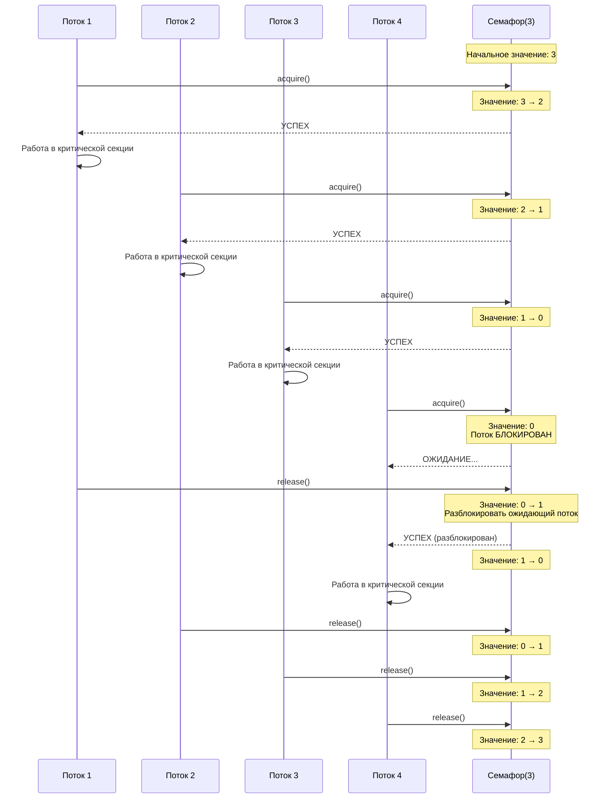
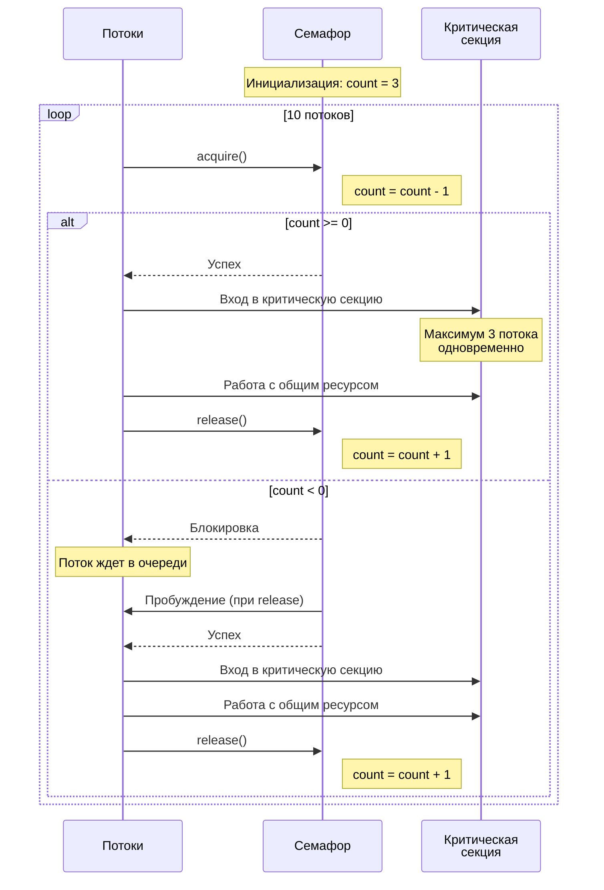
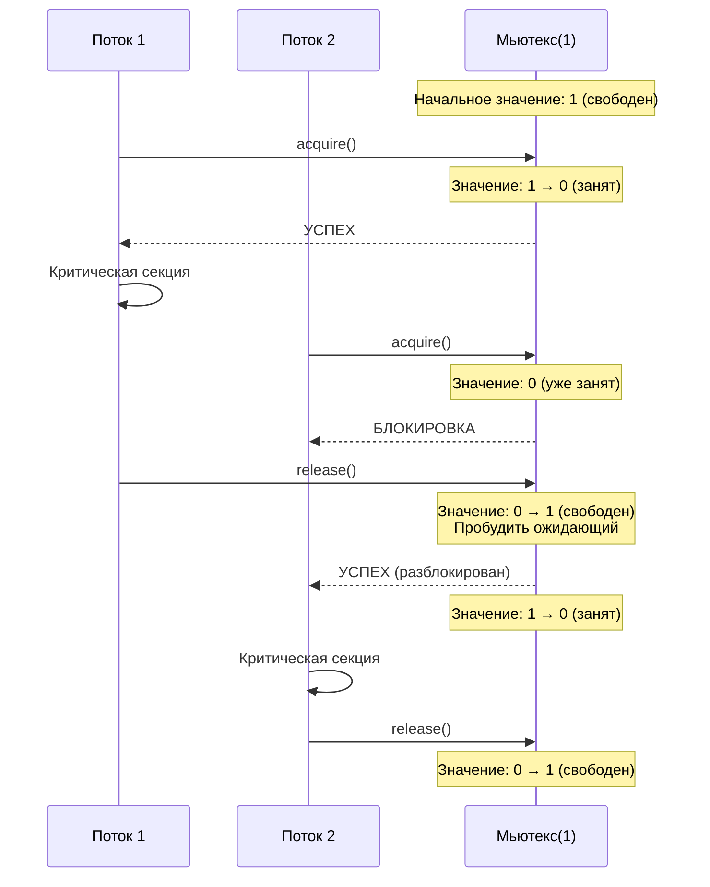
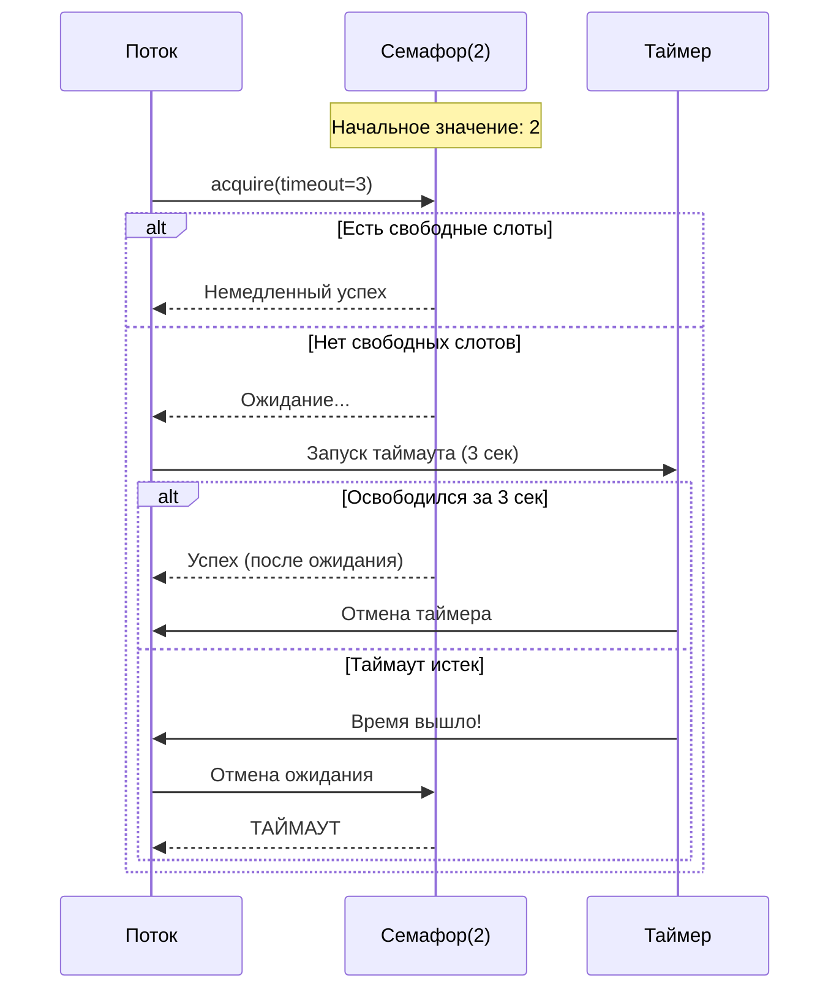

# Подробное руководство по процессам и потокам в C++ для Ubuntu

## 1. Процессы и диаграмма процессов

```cpp
#include <iostream>
#include <unistd.h>   // для системных вызовов POSIX
#include <sys/wait.h> // для функций ожидания процессов

using namespace std;

void process_info_example() {
    // Каждый процесс в Linux имеет:
    // - PID (Process ID) - идентификатор процесса
    // - PPID (Parent Process ID) - идентификатор родительского процесса
    // - UID (User ID) - идентификатор пользователя
    
    cout << "=== ИНФОРМАЦИЯ О ПРОЦЕССЕ ===" << endl;
    
    // getpid() - возвращает PID текущего процесса
    pid_t current_pid = getpid();
    cout << "Текущий PID: " << current_pid << endl;
    
    // getppid() - возвращает PPID родительского процесса
    pid_t parent_pid = getppid();
    cout << "Родительский PID: " << parent_pid << endl;
    
    // getuid() - возвращает UID пользователя
    uid_t user_id = getuid();
    cout << "User ID: " << user_id << endl;
}

int main() {
    process_info_example();
    return 0;
}
```

## 2. Создание и управление процессами

```cpp
#include <iostream>
#include <unistd.h>
#include <sys/wait.h>
#include <cstdlib>    // для exit()
#include <vector>

using namespace std;

void process_creation_example() {
    cout << "\n=== СОЗДАНИЕ ПРОЦЕССОВ ===" << endl;
    
    // fork() - создает копию текущего процесса
    // Возвращает:
    // - 0 в дочернем процессе
    // - PID дочернего процесса в родительском
    // - -1 в случае ошибки
    
    pid_t child_pid = fork();
    
    if (child_pid == -1) {
        // Ошибка создания процесса
        perror("fork failed");
        exit(EXIT_FAILURE);
    }
    else if (child_pid == 0) {
        // Этот код выполняется в ДОЧЕРНЕМ процессе
        cout << "Дочерний процесс: PID = " << getpid() 
             << ", PPID = " << getppid() << endl;
        
        // exec() семейство функций заменяет текущий процесс новым
        // execlp() ищет программу в PATH
        execlp("ls", "ls", "-l", "-a", nullptr);
        
        // Если execlp вернул управление - произошла ошибка
        perror("execlp failed");
        exit(EXIT_FAILURE);
    }
    else {
        // Этот код выполняется в РОДИТЕЛЬСКОМ процессе
        cout << "Родительский процесс: PID = " << getpid() 
             << ", создал дочерний с PID = " << child_pid << endl;
        
        // waitpid() - ожидает завершения дочернего процесса
        int status;
        waitpid(child_pid, &status, 0);
        
        if (WIFEXITED(status)) {
            cout << "Дочерний процесс завершился с кодом: " 
                 << WEXITSTATUS(status) << endl;
        }
    }
}

void multiple_processes_example() {
    cout << "\n=== МНОГОПРОЦЕССНОСТЬ ===" << endl;
    
    vector<pid_t> children;
    const int NUM_PROCESSES = 3;
    
    for (int i = 0; i < NUM_PROCESSES; i++) {
        pid_t pid = fork();
        
        if (pid == 0) {
            // Дочерний процесс
            cout << "Дочерний процесс " << i << " (PID: " << getpid() << ") запущен" << endl;
            sleep(2); // Имитация работы
            cout << "Дочерний процесс " << i << " завершен" << endl;
            exit(i); // Завершаем дочерний процесс
        }
        else if (pid > 0) {
            // Родительский процесс - сохраняем PID
            children.push_back(pid);
        }
        else {
            perror("fork failed");
        }
    }
    
    // Родительский процесс ожидает всех детей
    for (pid_t child_pid : children) {
        int status;
        waitpid(child_pid, &status, 0);
        cout << "Процесс " << child_pid << " завершен" << endl;
    }
}

int main() {
    process_creation_example();
    multiple_processes_example();
    return 0;
}
```

## 3. Потоки и процессы, атрибуты потоков

```cpp
#include <iostream>
#include <pthread.h>  // POSIX threads
#include <unistd.h>
#include <cstring>

using namespace std;

// Функция, которая будет выполняться в потоке
void* thread_function(void* arg) {
    // Преобразуем аргумент обратно в int
    int thread_num = *(int*)arg;
    
    cout << "Поток " << thread_num << " запущен (ID: " 
         << pthread_self() << ")" << endl;
    
    // Имитация работы
    for (int i = 0; i < 3; i++) {
        cout << "Поток " << thread_num << " - шаг " << i << endl;
        sleep(1);
    }
    
    cout << "Поток " << thread_num << " завершен" << endl;
    return nullptr;
}

void basic_thread_example() {
    cout << "\n=== ОСНОВЫ ПОТОКОВ ===" << endl;
    
    // pthread_t - тип для идентификатора потока
    pthread_t thread1, thread2;
    int arg1 = 1, arg2 = 2;
    
    // pthread_create() - создает новый поток
    // Параметры:
    // &thread1 - указатель на переменную для хранения ID потока
    // nullptr - атрибуты потока (по умолчанию)
    // thread_function - функция для выполнения
    // &arg1 - аргумент для функции
    
    int result1 = pthread_create(&thread1, nullptr, thread_function, &arg1);
    int result2 = pthread_create(&thread2, nullptr, thread_function, &arg2);
    
    if (result1 != 0 || result2 != 0) {
        cerr << "Ошибка создания потока: " << strerror(result1) << endl;
        return;
    }
    
    // pthread_join() - ожидает завершения потока
    pthread_join(thread1, nullptr);
    pthread_join(thread2, nullptr);
    
    cout << "Все потоки завершены" << endl;
}

void thread_attributes_example() {
    cout << "\n=== АТРИБУТЫ ПОТОКОВ ===" << endl;
    
    pthread_attr_t attr;  // Структура атрибутов потока
    pthread_t thread;
    
    // Инициализация атрибутов
    pthread_attr_init(&attr);
    
    // Установка размера стека
    size_t stack_size = 1024 * 1024; // 1 MB
    pthread_attr_setstacksize(&attr, stack_size);
    
    // Установка политики планирования
    pthread_attr_setschedpolicy(&attr, SCHED_FIFO);
    
    // Создание потока с атрибутами
    int thread_arg = 42;
    pthread_create(&thread, &attr, thread_function, &thread_arg);
    
    // Ожидание завершения
    pthread_join(thread, nullptr);
    
    // Освобождение ресурсов атрибутов
    pthread_attr_destroy(&attr);
}

int main() {
    basic_thread_example();
    thread_attributes_example();
    return 0;
}
```

## 4. Построение многопоточных приложений

```cpp
#include <iostream>
#include <pthread.h>
#include <vector>
#include <queue>
#include <unistd.h>

using namespace std;

// Общие данные для потоков
struct SharedData {
    queue<int> task_queue;
    int counter = 0;
    bool done = false;
};

// Функция производителя
void* producer_function(void* arg) {
    SharedData* data = (SharedData*)arg;
    
    for (int i = 0; i < 10; i++) {
        data->task_queue.push(i);
        data->counter++;
        cout << "Производитель: создана задача " << i << endl;
        sleep(1); // Имитация работы
    }
    
    data->done = true;
    cout << "Производитель завершил работу" << endl;
    return nullptr;
}

// Функция потребителя
void* consumer_function(void* arg) {
    SharedData* data = (SharedData*)arg;
    
    while (!data->done || !data->task_queue.empty()) {
        if (!data->task_queue.empty()) {
            int task = data->task_queue.front();
            data->task_queue.pop();
            cout << "Потребитель: обработана задача " << task << endl;
        }
        usleep(500000); // 0.5 секунды
    }
    
    cout << "Потребитель завершил работу" << endl;
    return nullptr;
}

void producer_consumer_example() {
    cout << "\n=== ПРОИЗВОДИТЕЛЬ-ПОТРЕБИТЕЛЬ ===" << endl;
    
    SharedData shared_data;
    pthread_t producer, consumer;
    
    // Создаем потоки
    pthread_create(&producer, nullptr, producer_function, &shared_data);
    pthread_create(&consumer, nullptr, consumer_function, &shared_data);
    
    // Ожидаем завершения
    pthread_join(producer, nullptr);
    pthread_join(consumer, nullptr);
    
    cout << "Итоговое значение счетчика: " << shared_data.counter << endl;
}

// Параллельные вычисления
void* calculation_function(void* arg) {
    int thread_num = *(int*)arg;
    long long sum = 0;
    
    // Каждый поток вычисляет свою часть суммы
    int start = thread_num * 1000000 + 1;
    int end = (thread_num + 1) * 1000000;
    
    for (int i = start; i <= end; i++) {
        sum += i;
    }
    
    cout << "Поток " << thread_num << ": сумма от " << start 
         << " до " << end << " = " << sum << endl;
    
    // Возвращаем результат через указатель
    long long* result = new long long(sum);
    return result;
}

void parallel_computation_example() {
    cout << "\n=== ПАРАЛЛЕЛЬНЫЕ ВЫЧИСЛЕНИЯ ===" << endl;
    
    const int NUM_THREADS = 4;
    pthread_t threads[NUM_THREADS];
    int thread_args[NUM_THREADS];
    long long total_sum = 0;
    
    // Создаем потоки для вычислений
    for (int i = 0; i < NUM_THREADS; i++) {
        thread_args[i] = i;
        pthread_create(&threads[i], nullptr, calculation_function, &thread_args[i]);
    }
    
    // Собираем результаты
    for (int i = 0; i < NUM_THREADS; i++) {
        void* result_ptr;
        pthread_join(threads[i], &result_ptr);
        
        long long* partial_sum = (long long*)result_ptr;
        total_sum += *partial_sum;
        delete partial_sum;
    }
    
    cout << "Общая сумма: " << total_sum << endl;
}

int main() {
    producer_consumer_example();
    parallel_computation_example();
    return 0;
}
```

## 5. Примитивы синхронизации

```cpp
#include <iostream>
#include <pthread.h>
#include <vector>
#include <semaphore.h> // для семафоров

using namespace std;

// Мьютексы (взаимные исключения)
struct SharedResource {
    int counter = 0;
    pthread_mutex_t mutex = PTHREAD_MUTEX_INITIALIZER;
};

void* mutex_example_function(void* arg) {
    SharedResource* resource = (SharedResource*)arg;
    
    for (int i = 0; i < 1000; i++) {
        // pthread_mutex_lock() - блокирует мьютекс
        pthread_mutex_lock(&resource->mutex);
        
        // Критическая секция - только один поток может выполнять этот код
        resource->counter++;
        
        // pthread_mutex_unlock() - разблокирует мьютекс
        pthread_mutex_unlock(&resource->mutex);
    }
    
    return nullptr;
}

void mutex_example() {
    cout << "\n=== СИНХРОНИЗАЦИЯ МЬЮТЕКСАМИ ===" << endl;
    
    SharedResource resource;
    const int NUM_THREADS = 10;
    vector<pthread_t> threads(NUM_THREADS);
    
    // Создаем потоки
    for (int i = 0; i < NUM_THREADS; i++) {
        pthread_create(&threads[i], nullptr, mutex_example_function, &resource);
    }
    
    // Ожидаем завершения
    for (int i = 0; i < NUM_THREADS; i++) {
        pthread_join(threads[i], nullptr);
    }
    
    cout << "Итоговое значение счетчика: " << resource.counter 
         << " (ожидалось: " << 1000 * NUM_THREADS << ")" << endl;
    
    // Уничтожаем мьютекс
    pthread_mutex_destroy(&resource.mutex);
}

// Условные переменные
struct ConditionExample {
    pthread_mutex_t mutex = PTHREAD_MUTEX_INITIALIZER;
    pthread_cond_t condition = PTHREAD_COND_INITIALIZER;
    bool data_ready = false;
    int shared_data = 0;
};

void* producer_cond(void* arg) {
    ConditionExample* cond_example = (ConditionExample*)arg;
    
    pthread_mutex_lock(&cond_example->mutex);
    
    // Производим данные
    cond_example->shared_data = 42;
    cond_example->data_ready = true;
    
    cout << "Производитель: данные готовы, отправляю сигнал" << endl;
    
    // pthread_cond_signal() - пробуждает один ожидающий поток
    pthread_cond_signal(&cond_example->condition);
    
    pthread_mutex_unlock(&cond_example->mutex);
    return nullptr;
}

void* consumer_cond(void* arg) {
    ConditionExample* cond_example = (ConditionExample*)arg;
    
    pthread_mutex_lock(&cond_example->mutex);
    
    // Ожидаем данные
    while (!cond_example->data_ready) {
        cout << "Потребитель: жду данные..." << endl;
        // pthread_cond_wait() - освобождает мьютекс и ждет сигнал
        pthread_cond_wait(&cond_example->condition, &cond_example->mutex);
    }
    
    cout << "Потребитель: получил данные: " << cond_example->shared_data << endl;
    
    pthread_mutex_unlock(&cond_example->mutex);
    return nullptr;
}

void condition_variable_example() {
    cout << "\n=== УСЛОВНЫЕ ПЕРЕМЕННЫЕ ===" << endl;
    
    ConditionExample cond_example;
    pthread_t producer, consumer;
    
    // Создаем потребителя первым (чтобы он ждал)
    pthread_create(&consumer, nullptr, consumer_cond, &cond_example);
    sleep(1); // Даем потребителю начать ждать
    pthread_create(&producer, nullptr, producer_cond, &cond_example);
    
    pthread_join(producer, nullptr);
    pthread_join(consumer, nullptr);
    
    pthread_mutex_destroy(&cond_example.mutex);
    pthread_cond_destroy(&cond_example.condition);
}

// Семафоры
struct SemaphoreExample {
    sem_t semaphore;
    int shared_value = 0;
};

void* semaphore_producer(void* arg) {
    SemaphoreExample* sem_example = (SemaphoreExample*)arg;
    
    for (int i = 0; i < 5; i++) {
        // Работа производителя
        sem_example->shared_value = i;
        cout << "Производитель: установил значение " << i << endl;
        
        // sem_post() - увеличивает счетчик семафора
        sem_post(&sem_example->semaphore);
        sleep(1);
    }
    
    return nullptr;
}

void* semaphore_consumer(void* arg) {
    SemaphoreExample* sem_example = (SemaphoreExample*)arg;
    
    for (int i = 0; i < 5; i++) {
        // sem_wait() - ждет, пока счетчик семафора > 0, затем уменьшает его
        sem_wait(&sem_example->semaphore);
        
        cout << "Потребитель: получил значение " << sem_example->shared_value << endl;
    }
    
    return nullptr;
}

void semaphore_example() {
    cout << "\n=== СЕМАФОРЫ ===" << endl;
    
    SemaphoreExample sem_example;
    
    // Инициализация семафора
    // 0 - начальное значение семафора
    sem_init(&sem_example.semaphore, 0, 0);
    
    pthread_t producer, consumer;
    pthread_create(&producer, nullptr, semaphore_producer, &sem_example);
    pthread_create(&consumer, nullptr, semaphore_consumer, &sem_example);
    
    pthread_join(producer, nullptr);
    pthread_join(consumer, nullptr);
    
    sem_destroy(&sem_example.semaphore);
}

int main() {
    mutex_example();
    condition_variable_example();
    semaphore_example();
    return 0;
}
```

## Компиляция и запуск

```bash
# Компиляция с поддержкой pthread
g++ -o processes processes_example.cpp -lpthread
g++ -o threads threads_example.cpp -lpthread
g++ -o sync synchronization_example.cpp -lpthread

# Запуск
./processes
./threads
./sync
```

## Ключевые концепции:

### Процессы vs Потоки:
- **Процессы**: изолированные, имеют отдельную память, создаются через `fork()`
- **Потоки**: разделяют память, легковесные, создаются через `pthread_create()`

### Примитивы синхронизации:
1. **Мьютексы** - взаимное исключение для критических секций
2. **Условные переменные** - ожидание условий
3. **Семафоры** - счетчики для управления доступом к ресурсам

### Лучшие практики:
- Всегда проверяйте возвращаемые значения системных вызовов
- Освобождайте ресурсы (мьютексы, семафоры)
- Избегайте состояния гонки (race conditions)
- Используйте правильные примитивы синхронизации для каждой задачи

# Семафоры: подробное объяснение
# Диаграмма последовательности работы семафора



## Альтернативная диаграмма - более детальная:



## Диаграмма для бинарного семафора (мьютекс):



## Диаграмма с таймаутом:



## Объяснение ключевых моментов:

### 1. **Состояния семафора**:
- **Положительное значение**: Количество доступных слотов
- **Ноль**: Все слоты заняты, но нет ожидающих
- **Отрицательное значение**: Абсолютное значение показывает количество ожидающих потоков

### 2. **Операции**:
- **acquire()**: Уменьшает счетчик. Если < 0 - блокируется.
- **release()**: Увеличивает счетчик. Если есть ожидающие - будит одного.

### 3. **Поведение**:
- **Справедливость**: Обычно FIFO (первый пришел - первый обслужен)
- **Атомарность**: Операции неделимы (не могут быть прерваны)
- **Блокировка**: Потоки спят, а не busy-wait (экономят CPU)


**Семафор** - это механизм синхронизации, используемый в многопоточном и многопроцессном программировании для управления доступом к общим ресурсам.

### Простая аналогия
Представьте себе **столовую с ограниченным количеством мест**:
- **Столовая** - общий ресурс
- **Количество мест** - значение семафора
- **Посетители** - потоки/процессы
- **Занять место** - захватить семафор (`acquire`)
- **Освободить место** - освободить семафор (`release`)

## Основные концепции

### Счетчик семафора
Семафор содержит внутренний счетчик, который:
- Уменьшается при захвате (`acquire`)
- Увеличивается при освобождении (`release`)
- Не может быть отрицательным (для обычных семафоров)

### Типы семафоров

#### 1. Бинарный семафор (Mutex)
- Значение: 0 или 1
- Используется для взаимоисключений (mutual exclusion)
- Только один поток может захватить ресурс

#### 2. Счетный семафор
- Значение: любое неотрицательное целое число
- Ограничивает количество потоков, которые могут одновременно получить доступ к ресурсу

