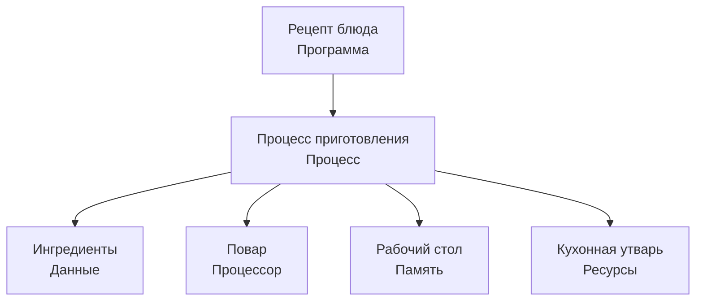
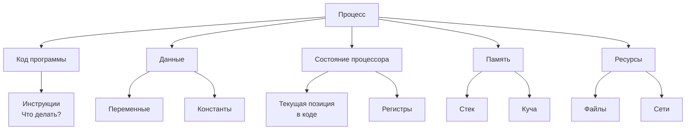
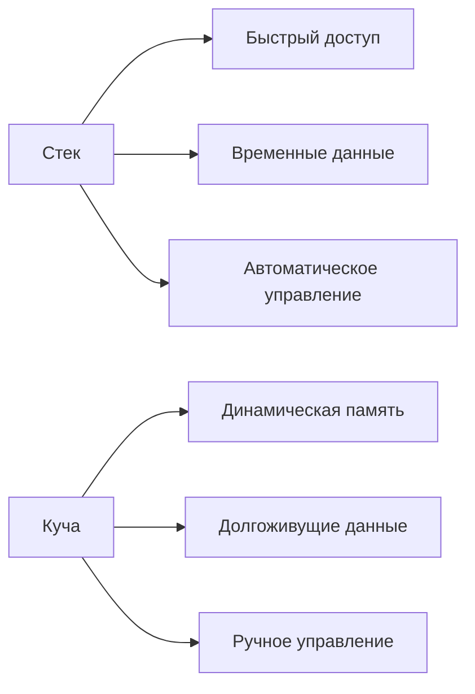
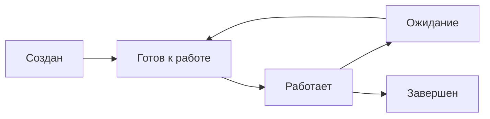
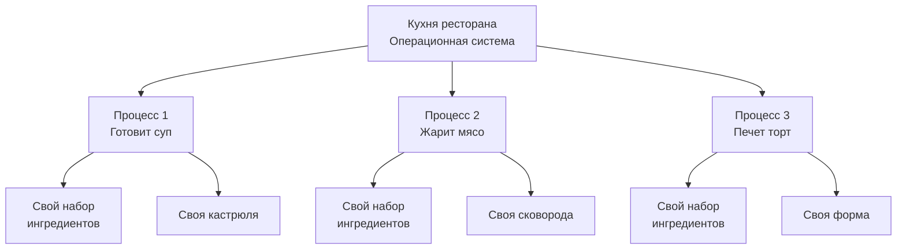

# Что такое процесс? 

## Аналогия: Кухня ресторана 🍳

Представьте, что **программа** - это **рецепт блюда**, а **процесс** - это **полный процесс приготовления** этого блюда на кухне.



## Из чего состоит процесс?



### 1. Код программы 📝
**Что это:** Инструкции, которые нужно выполнить
**Простыми словами:** Сам рецепт - шаги приготовления

```
"Рецепт яичницы":
1. Взять 2 яйца
2. Разогреть сковороду
3. Разбить яйца
4. Жарить 5 минут
```

### 2. Данные 🥚
**Что это:** Информация, с которой работает программа
**Простыми словами:** Ингредиенты для блюда

```cpp
// Данные программы
int eggs = 2;           // 2 яйца
string pan = "hot";     // сковорода разогрета
bool cooked = false;    // еще не готово
```

### 3. Состояние регистров процессора 🧠
**Что это:** "Мысли" процессора в текущий момент
**Простыми словами:** Что повар делает прямо сейчас и что помнит

```
"Повар думает:
- Я на шаге 3 рецепта
- В правой руке - яйцо
- В левой - сковорода
- Следующий шаг - разбить яйцо"
```

### 4. Стек и куча 🗂️
**Стек:** Временные данные (как стопка тарелок)
**Куча:** Данные, которые живут долго (как кладовая)

```cpp
void cook_eggs() {
    int temp = 100;     // в стеке - временная переменная
    char* recipe = new char[100]; // в куче - долгоживущие данные
}
```



### 5. Открытые файлы и сетевые соединения 🔗
**Что это:** Внешние ресурсы, которые использует программа
**Простыми словами:** Кухонное оборудование и поставщики

```
Открытые файлы:       Холодильник, духовка
Сетевые соединения:   Доставка продуктов, заказы клиентов
```

## Жизненный цикл процесса



## Пример: Несколько процессов

Представьте, что в ресторане готовят несколько блюд одновременно:



**Каждый процесс имеет:**
- ✅ Свой рецепт (код)
- ✅ Свои ингредиенты (данные)
- ✅ Свою рабочую зону (память)
- ✅ Свою посуду (ресурсы)

## Ключевые моменты для запоминания:

1. **Программа ≠ Процесс**
   - Программа - это файл на диске 📁
   - Процесс - это программа в работе ⚡

2. **Изоляция**
   - Каждый процесс работает в своем "песочнице"
   - Один упавший процесс не ломает другие

3. **Параллелизм**
   - Можно запустить много процессов одновременно
   - Как несколько поваров на одной кухне

4. **Ресурсы**
   - Каждый процесс получает свою порцию памяти и ресурсов
   - ОС распределяет ресурсы между процессами


# Практическое руководство: Процессы в C++ под Ubuntu 24.02

## 1. Основные концепции процессов

### Что такое процесс?
Процесс - это экземпляр выполняемой программы, который включает:
- Код программы
- Данные
- Состояние регистров процессора
- Стек и кучу
- Открытые файлы и сетевые соединения

## 2. Создание и управление процессами

### Базовый пример с fork()

```cpp
#include <iostream>
#include <unistd.h>    // Для fork(), getpid(), getppid()
#include <sys/wait.h>  // Для wait()
#include <cstdlib>     // Для exit()

int main() {
    // Создаем новый процесс
    // fork() возвращает:
    // - >0 в родительском процессе (PID дочернего)
    // - 0 в дочернем процессе
    // - -1 в случае ошибки
    pid_t pid = fork();

    // Проверяем успешность создания процесса
    if (pid == -1) {
        // Выводим сообщение об ошибке в stderr
        std::cerr << "Ошибка при создании процесса!" << std::endl;
        return 1;  // Завершаем программу с кодом ошибки
    }
    else if (pid == 0) {
        // Этот блок выполняется только в дочернем процессе
        // getpid() возвращает PID текущего процесса
        std::cout << "Дочерний процесс: PID = " << getpid() 
                  << ", PPID (родитель) = " << getppid() << std::endl;
        
        // Завершаем дочерний процесс с кодом 0 (успех)
        exit(0);
    }
    else {
        // Этот блок выполняется только в родительском процессе
        std::cout << "Родительский процесс: PID = " << getpid() 
                  << ", Дочерний PID = " << pid << std::endl;
        
        // Ожидаем завершения дочернего процесса
        // wait() приостанавливает выполнение родителя до завершения дочернего процесса
        int status;
        wait(&status);  // &status - указатель на переменную для кода завершения
        
        std::cout << "Дочерний процесс завершился с кодом: " 
                  << WEXITSTATUS(status) << std::endl;
    }

    return 0;
}
```

### Расширенный пример с exec()

```cpp
#include <iostream>
#include <unistd.h>
#include <sys/wait.h>
#include <cstring>     // Для strerror()
#include <cerrno>      // Для errno

int main() {
    pid_t pid = fork();

    if (pid == -1) {
        std::cerr << "Ошибка fork: " << strerror(errno) << std::endl;
        return 1;
    }
    else if (pid == 0) {
        // Дочерний процесс
        
        // Заменяем образ процесса новой программой
        // execlp ищет программу 'ls' в директориях PATH
        // "ls" - имя программы для выполнения
        // "ls" - первый аргумент (обычно имя программы)
        // "-l" - второй аргумент (подробный вывод)
        // "-a" - третий аргумент (показать скрытые файлы)
        // NULL - маркер конца аргументов
        execlp("ls", "ls", "-l", "-a", NULL);
        
        // Если execlp вернул управление, значит произошла ошибка
        // exec-функции возвращают управление только при ошибке
        std::cerr << "Ошибка exec: " << strerror(errno) << std::endl;
        exit(1);
    }
    else {
        // Родительский процесс
        std::cout << "Родитель ждет завершения дочернего процесса..." << std::endl;
        
        int status;
        pid_t finished_pid = wait(&status);
        
        if (finished_pid == -1) {
            std::cerr << "Ошибка wait: " << strerror(errno) << std::endl;
        }
        else {
            if (WIFEXITED(status)) {
                // WIFEXITED проверяет нормальное завершение
                std::cout << "Процесс " << finished_pid 
                          << " завершился с кодом: " << WEXITSTATUS(status) << std::endl;
            }
            else if (WIFSIGNALED(status)) {
                // WIFSIGNALED проверяет завершение по сигналу
                std::cout << "Процесс " << finished_pid 
                          << " убит сигналом: " << WTERMSIG(status) << std::endl;
            }
        }
    }

    return 0;
}
```

## 3. Множественные процессы

### Создание нескольких дочерних процессов

```cpp
#include <iostream>
#include <unistd.h>
#include <sys/wait.h>
#include <vector>

int main() {
    const int NUM_PROCESSES = 3;
    std::vector<pid_t> child_pids;

    // Создаем несколько дочерних процессов
    for (int i = 0; i < NUM_PROCESSES; ++i) {
        pid_t pid = fork();
        
        if (pid == -1) {
            std::cerr << "Ошибка при создании процесса " << i << std::endl;
            continue;  // Продолжаем создавать остальные процессы
        }
        else if (pid == 0) {
            // Дочерний процесс
            std::cout << "Дочерний процесс " << i 
                      << " с PID " << getpid() << " запущен" << std::endl;
            
            // Имитируем работу процесса
            sleep(2 + i);  // Каждый процесс спит разное время
            
            std::cout << "Дочерний процесс " << i << " завершается" << std::endl;
            exit(i);  // Возвращаем номер процесса как код завершения
        }
        else {
            // Родительский процесс сохраняет PID дочернего
            child_pids.push_back(pid);
        }
    }

    // Родительский процесс ожидает завершения всех дочерних
    std::cout << "Родительский процесс (PID " << getpid() 
              << ") ожидает завершения " << child_pids.size() 
              << " дочерних процессов" << std::endl;

    for (size_t i = 0; i < child_pids.size(); ++i) {
        int status;
        // waitpid ожидает конкретный дочерний процесс
        // child_pids[i] - PID процесса, который нужно ждать
        // &status - указатель на переменную для статуса
        // 0 - опции (0 означает без специальных опций)
        pid_t finished_pid = waitpid(child_pids[i], &status, 0);
        
        if (finished_pid == -1) {
            std::cerr << "Ошибка при ожидании процесса " << child_pids[i] << std::endl;
        }
        else {
            std::cout << "Процесс " << finished_pid 
                      << " завершился с кодом: " << WEXITSTATUS(status) << std::endl;
        }
    }

    std::cout << "Все дочерние процессы завершены" << std::endl;
    return 0;
}
```

## 4. Обмен данными между процессами

### Использование pipe() для межпроцессного взаимодействия

```cpp
#include <iostream>
#include <unistd.h>
#include <sys/wait.h>
#include <string>
#include <cstring>

int main() {
    // Создаем pipe (канал для межпроцессного взаимодействия)
    // pipefd[0] - дескриптор для чтения
    // pipefd[1] - дескриптор для записи
    int pipefd[2];
    
    // Создаем pipe и проверяем на ошибки
    if (pipe(pipefd) == -1) {
        std::cerr << "Ошибка создания pipe" << std::endl;
        return 1;
    }

    pid_t pid = fork();

    if (pid == -1) {
        std::cerr << "Ошибка fork" << std::endl;
        return 1;
    }
    else if (pid == 0) {
        // Дочерний процесс - будет писать в pipe
        
        // Закрываем ненужный дескриптор для чтения
        close(pipefd[0]);
        
        std::string message = "Привет от дочернего процесса!";
        
        // Пишем сообщение в pipe
        // pipefd[1] - дескриптор для записи
        // message.c_str() - указатель на данные
        // message.length() + 1 - размер данных (включая нулевой байт)
        write(pipefd[1], message.c_str(), message.length() + 1);
        
        // Закрываем дескриптор записи
        close(pipefd[1]);
        
        exit(0);
    }
    else {
        // Родительский процесс - будет читать из pipe
        
        // Закрываем ненужный дескриптор для записи
        close(pipefd[1]);
        
        char buffer[256];
        
        // Читаем данные из pipe
        // pipefd[0] - дескриптор для чтения
        // buffer - буфер для данных
        // sizeof(buffer) - размер буфера
        ssize_t bytes_read = read(pipefd[0], buffer, sizeof(buffer));
        
        if (bytes_read > 0) {
            std::cout << "Родитель получил сообщение: " << buffer << std::endl;
        }
        
        // Закрываем дескриптор чтения
        close(pipefd[0]);
        
        // Ожидаем завершения дочернего процесса
        wait(NULL);
    }

    return 0;
}
```

## 5. Диаграмма процессов

```
Родительский процесс (PID: X)
    |
    |--- fork() --->
    |
    +--- Дочерний процесс 1 (PID: Y, PPID: X)
    |
    +--- Дочерний процесс 2 (PID: Z, PPID: X)
    |
    +--- ... (может быть больше дочерних процессов)
```

## 6. Управление процессами

### Функции для работы с процессами:

- **fork()** - создание нового процесса
- **exec() семейство** - замена образа процесса
- **wait()/waitpid()** - ожидание завершения дочернего процесса
- **exit()** - завершение процесса
- **getpid()** - получение PID текущего процесса
- **getppid()** - получение PID родительского процесса

## 7. Компиляция и запуск

```bash
# Компиляция программ
g++ -o process_example process_example.cpp
g++ -o multiple_processes multiple_processes.cpp
g++ -o pipe_example pipe_example.cpp

# Запуск
./process_example
./multiple_processes
./pipe_example
```

## 8. Практические рекомендации

1. **Всегда проверяйте возвращаемые значения** системных вызовов
2. **Закрывайте ненужные файловые дескрипторы** в дочерних процессах
3. **Используйте wait() или waitpid()** для избежания "зомби-процессов"
4. **Обрабатывайте сигналы** для корректного завершения процессов
5. **Используйте pipe() или другие механизмы IPC** для обмена данными

