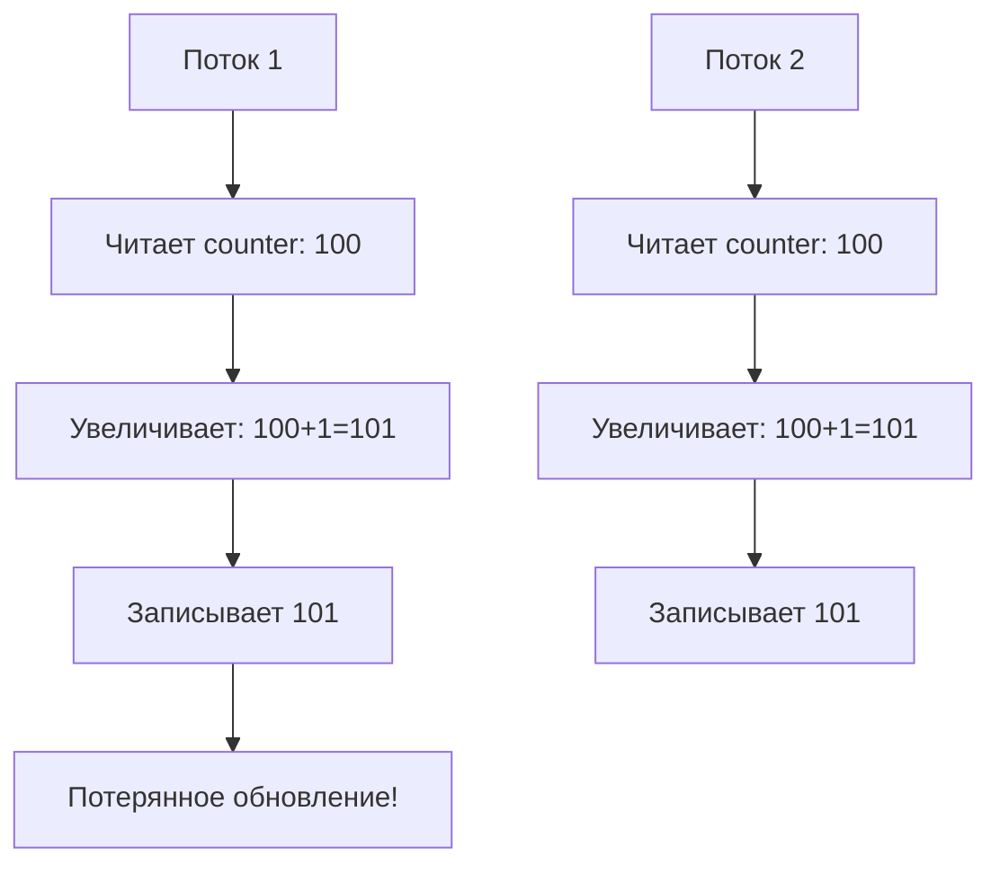
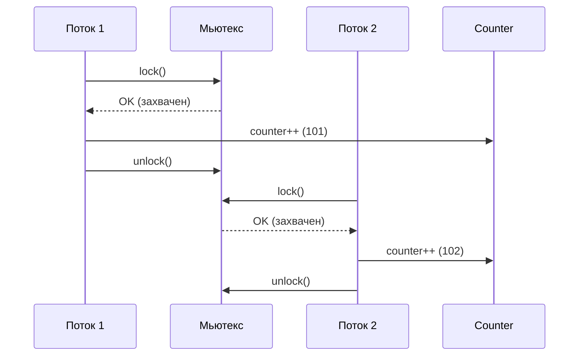
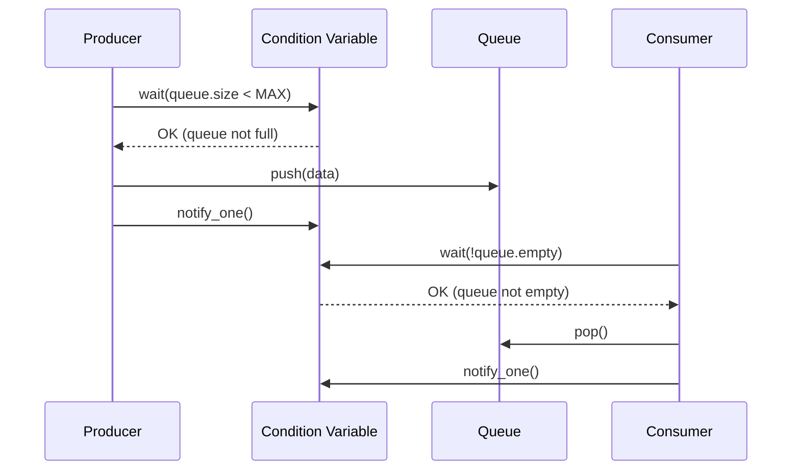
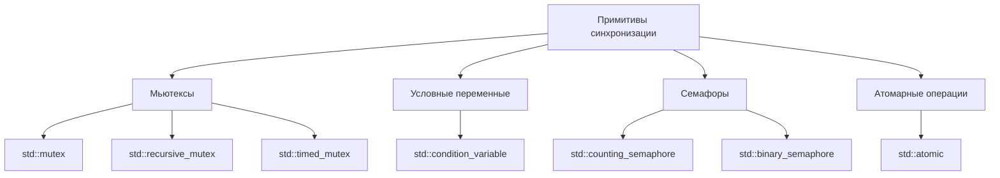

# Практическое руководство: Примитивы синхронизации потоков в C++

## 1. Введение в проблемы многопоточности

### Гонка данных (Data Race)
```cpp
#include <iostream>
#include <thread>
#include <vector>

int counter = 0; // Общая переменная-счетчик

void increment() {
    for (int i = 0; i < 100000; ++i) {
        counter++; // ПРОБЛЕМА: несколько потоков пытаются изменить одну переменную
    }
}

int main() {
    std::thread t1(increment);
    std::thread t2(increment);
    
    t1.join();
    t2.join();
    
    // Результат будет непредсказуем! Может быть меньше 200000
    std::cout << "Counter value: " << counter << std::endl;
    return 0;
}
```



## 2. Мьютексы (Mutex)

### Базовое использование std::mutex

```cpp
#include <iostream>
#include <thread>
#include <mutex>       // Для std::mutex
#include <vector>

// Создаем глобальный мьютекс
// Мьютекс - это примитив синхронизации, который обеспечивает 
// взаимное исключение (mutual exclusion)
std::mutex mtx;        
int counter = 0;

void safe_increment() {
    for (int i = 0; i < 100000; ++i) {
        // Захватываем мьютекс перед доступом к общей переменной
        // lock() блокирует мьютекс. Если он уже заблокирован другим потоком,
        // текущий поток будет ждать его освобождения
        mtx.lock();
        
        // Критическая секция - код, который выполняется только одним потоком
        counter++;
        
        // Освобождаем мьютекс, чтобы другие потоки могли его захватить
        mtx.unlock();
    }
}

int main() {
    std::thread t1(safe_increment);
    std::thread t2(safe_increment);
    
    t1.join();
    t2.join();
    
    // Теперь результат всегда будет 200000
    std::cout << "Safe counter value: " << counter << std::endl;
    return 0;
}
```



### Автоматическое управление мьютексом с std::lock_guard

```cpp
#include <iostream>
#include <thread>
#include <mutex>
#include <vector>

std::mutex mtx;
int counter = 0;

void safe_increment_auto() {
    for (int i = 0; i < 100000; ++i) {
        // Создаем lock_guard - он автоматически захватывает мьютекс при создании
        // и освобождает его при разрушении (при выходе из области видимости)
        // Это защищает от забывания вызвать unlock()
        std::lock_guard<std::mutex> lock(mtx);
        counter++;
        
        // Мьютекс автоматически освободится когда lock выйдет из области видимости
    }
    // Здесь destructor lock_guard вызовет mtx.unlock()
}

int main() {
    std::thread t1(safe_increment_auto);
    std::thread t2(safe_increment_auto);
    
    t1.join();
    t2.join();
    
    std::cout << "Auto-safe counter: " << counter << std::endl;
    return 0;
}
```

## 3. Более гибкое управление с std::unique_lock

```cpp
#include <iostream>
#include <thread>
#include <mutex>
#include <vector>

std::mutex mtx;
int counter = 0;

void flexible_increment() {
    for (int i = 0; i < 100000; ++i) {
        // unique_lock более гибкий чем lock_guard
        // Может освобождать и снова захватывать мьютекс
        std::unique_lock<std::mutex> lock(mtx);
        counter++;
        
        // Можно временно освободить мьютекс для выполнения 
        // не-критических операций
        lock.unlock();
        
        // Выполняем какую-то работу, не требующую синхронизации
        // std::this_thread::sleep_for(std::chrono::microseconds(1));
        
        // И снова захватываем мьютекс если нужно
        lock.lock();
        // Дальнейшая работа с защищенными данными...
    }
}

int main() {
    std::thread t1(flexible_increment);
    std::thread t2(flexible_increment);
    
    t1.join();
    t2.join();
    
    std::cout << "Flexible counter: " << counter << std::endl;
    return 0;
}
```

## 4. Условные переменные (Condition Variables)

### Производитель-Потребитель

```cpp
#include <iostream>
#include <thread>
#include <mutex>
#include <condition_variable>
#include <queue>
#include <chrono>

std::mutex mtx;
std::condition_variable cv;  // Условная переменная для синхронизации
std::queue<int> data_queue;  // Очередь данных
const int MAX_SIZE = 5;      // Максимальный размер очереди

// Поток-производитель
void producer(int id) {
    for (int i = 0; i < 10; ++i) {
        // Создаем unique_lock для condition variable
        std::unique_lock<std::mutex> lock(mtx);
        
        // Ждем пока очередь не освободится
        // wait() временно освобождает мьютекс и блокирует поток
        // Когда очередь станет меньше MAX_SIZE, поток разблокируется
        cv.wait(lock, [] { 
            return data_queue.size() < MAX_SIZE; 
        });
        
        // Производим данные
        int data = i + id * 100;
        data_queue.push(data);
        std::cout << "Producer " << id << " produced: " << data << std::endl;
        
        // Освобождаем мьютекс перед уведомлением (хорошая практика)
        lock.unlock();
        
        // Уведомляем одного ожидающего потребителя
        cv.notify_one();
        
        // Имитируем работу
        std::this_thread::sleep_for(std::chrono::milliseconds(100));
    }
}

// Поток-потребитель
void consumer(int id) {
    for (int i = 0; i < 10; ++i) {
        std::unique_lock<std::mutex> lock(mtx);
        
        // Ждем пока в очереди появятся данные
        cv.wait(lock, [] { 
            return !data_queue.empty(); 
        });
        
        // Потребляем данные
        int data = data_queue.front();
        data_queue.pop();
        std::cout << "Consumer " << id << " consumed: " << data << std::endl;
        
        lock.unlock();
        // Уведомляем одного ожидающего производителя
        cv.notify_one();
        
        std::this_thread::sleep_for(std::chrono::milliseconds(150));
    }
}

int main() {
    std::thread prod1(producer, 1);
    std::thread prod2(producer, 2);
    std::thread cons1(consumer, 1);
    std::thread cons2(consumer, 2);
    
    prod1.join();
    prod2.join();
    cons1.join();
    cons2.join();
    
    return 0;
}
```



## 5. Семафоры (C++20)

```cpp
#include <iostream>
#include <thread>
#include <semaphore>   // Для std::counting_semaphore
#include <vector>
#include <chrono>

// Создаем counting_semaphore с максимальным значением 3
// Семафор управляет доступом к ограниченному ресурсу
std::counting_semaphore<3> semaphore(3);  // Максимум 3 потока одновременно

void worker(int id) {
    std::cout << "Worker " << id << " waiting..." << std::endl;
    
    // acquire() уменьшает счетчик семафора
    // Если счетчик > 0, поток продолжает выполнение
    // Если счетчик = 0, поток блокируется до освобождения
    semaphore.acquire();
    
    std::cout << "Worker " << id << " started working..." << std::endl;
    
    // Имитируем работу
    std::this_thread::sleep_for(std::chrono::seconds(2));
    
    std::cout << "Worker " << id << " finished." << std::endl;
    
    // release() увеличивает счетчик семафора
    // и разблокирует ожидающие потоки
    semaphore.release();
}

int main() {
    std::vector<std::thread> workers;
    
    // Создаем 10 рабочих потоков
    for (int i = 0; i < 10; ++i) {
        workers.emplace_back(worker, i);
    }
    
    // Ждем завершения всех потоков
    for (auto& t : workers) {
        t.join();
    }
    
    return 0;
}
```

## 6. Атомарные операции

```cpp
#include <iostream>
#include <thread>
#include <atomic>      // Для std::atomic
#include <vector>

// Атомарная переменная - операции с ней неделимы
// Не требует использования мьютексов
std::atomic<int> atomic_counter(0);

void atomic_increment() {
    for (int i = 0; i < 100000; ++i) {
        // Атомарная операция - не требует синхронизации
        atomic_counter.fetch_add(1, std::memory_order_relaxed);
    }
}

int main() {
    std::thread t1(atomic_increment);
    std::thread t2(atomic_increment);
    
    t1.join();
    t2.join();
    
    // Результат всегда будет 200000, но работает быстрее чем с мьютексом
    std::cout << "Atomic counter: " << atomic_counter << std::endl;
    return 0;
}
```

## 7. Recursive Mutex

```cpp
#include <iostream>
#include <thread>
#include <mutex>

std::recursive_mutex rec_mtx;  // Рекурсивный мьютекс

void recursive_function(int depth) {
    if (depth <= 0) return;
    
    // Может быть захвачен несколько раз одним потоком
    rec_mtx.lock();
    std::cout << "Depth " << depth << " locked by thread " 
              << std::this_thread::get_id() << std::endl;
    
    // Рекурсивный вызов - обычный мьютекс здесь заблокировал бы поток
    recursive_function(depth - 1);
    
    std::cout << "Depth " << depth << " unlocked" << std::endl;
    rec_mtx.unlock();  // Нужно столько же unlock, сколько было lock
}

int main() {
    std::thread t1(recursive_function, 3);
    std::thread t2(recursive_function, 3);
    
    t1.join();
    t2.join();
    
    return 0;
}
```

## Сравнение примитивов синхронизации



## Практические рекомендации

1. **Всегда используйте RAII** (lock_guard, unique_lock) для мьютексов
2. **Минимизируйте время удержания блокировок**
3. **Избегайте вложенных блокировок** (может привести к deadlock)
4. **Используйте условные переменные** для сложной синхронизации
5. **Предпочитайте атомарные операции** когда возможно
6. **Всегда проверяйте предикаты в циклах** с condition variables

## Компиляция

```bash
# Компиляция с поддержкой C++20 (для семафоров)
g++ -std=c++20 -pthread -o sync_examples sync_examples.cpp

# Или для C++17 (без семафоров)
g++ -std=c++17 -pthread -o sync_examples sync_examples.cpp
```

